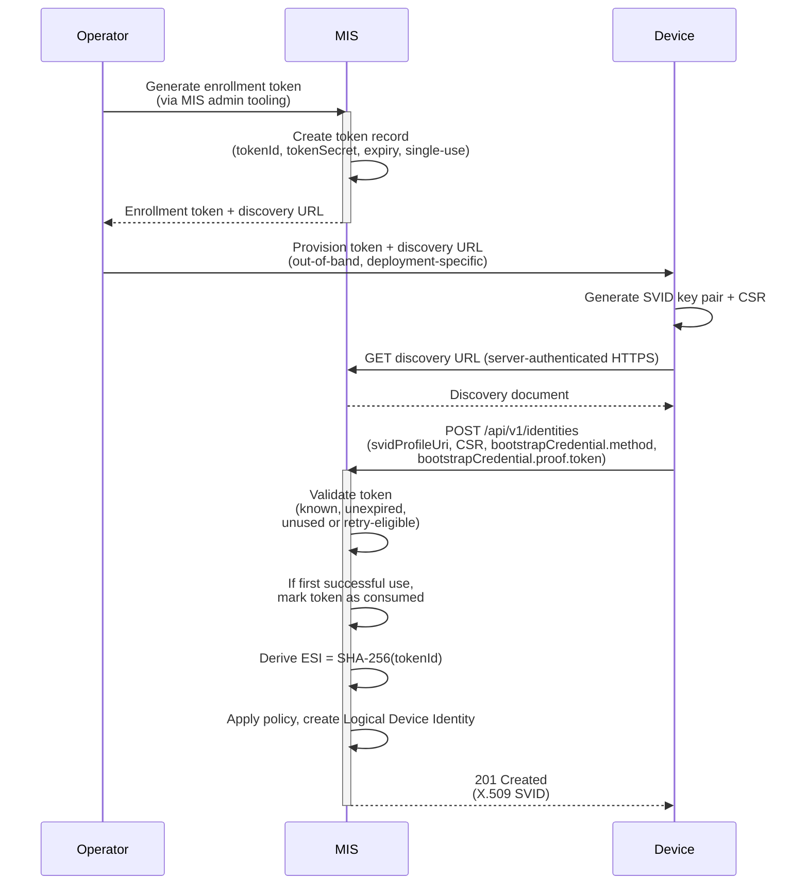

# Specification Update Proposal

## Owner

[@matlec](https://github.com/matlec) (currently deferred — owner to be confirmed at promotion)

## Summary

Defines the Enrollment Token bootstrap method for MIAF — a principal-agnostic method usable by any Margo principal that lacks a pre-provisioned X.509 client certificate suitable for bootstrap. Operator-issued, single-use, time-bounded, high-entropy tokens are delivered out-of-band to the candidate principal, which presents them on the standard MIAF enrollment endpoint. Originally drafted as part of the active MIAF SUP; deferred for PR 2 since baseline interoperability uses Factory Certificate mTLS for devices, and the active Margo WFM Identity Profile assumes the WFM identity is operator-pre-provisioned at deployment time. Purely additive — registering this method later requires no breaking changes to the v0 enrollment surface, since `bootstrapCredential.method` already accepts new URN values.

This content was originally drafted as part of the active [MIAF SUP](../margo-identity-and-authorization-framework.md) and was deferred when the SUP was split for PR 2. It is preserved here as a single consolidated draft so that it can be promoted to an active SUP independently when operator-issued enrollment tokens become a delivery priority.

## Reason for proposal

Some classes of devices — notably **constrained** or **low-cost** devices, and **brownfield** devices in deployments where the operator does not run an issuing PKI — lack a pre-provisioned X.509 client certificate suitable for bootstrap and therefore cannot use the Factory Certificate methods defined for MIAF. Without a complementary bootstrap method, these devices have no standardized path into a Margo Trust Domain.

Operator-issued enrollment tokens fill this gap with a simple, deployment-tooling-friendly mechanism: the operator generates a single-use, time-bounded, high-entropy token via MIS administration tooling, hands it to the candidate principal out-of-band (USB, QR code, configuration management, or manual entry), and the principal presents the token on `POST /api/v1/identities` over server-authenticated HTTPS. No mTLS, no issuing PKI, and no pre-provisioned X.509 credential are required on the candidate side.

Although originally drafted as a device bootstrap method, the wire mechanics are principal-agnostic: any candidate principal that can perform a server-authenticated TLS connection and present an opaque token can use this method. Server-side Margo components — for example, fleet managers operating without an existing Trust-Domain-scoped operational PKI presence — are a natural future use case once a profile permits it.

## Requirements alignment acknowledgement

This SUP extends the active MIAF SUP and aligns with Margo's flexibility and supply-chain interoperability goals. Detailed feature linkage and Owner are TBD at promotion.

## Technical proposal

### Enrollment Token Method

This is a **principal-agnostic** bootstrap method that enables **operator-authorized onboarding** for any Margo principal that does not possess a pre-provisioned X.509 client certificate suitable for bootstrap. Typical use cases include **constrained** or **low-cost** devices that cannot hold a bootstrap certificate, **brownfield** devices in deployments where the operator does not run an issuing PKI, and server-side Margo components (for example, fleet managers operating without an existing Trust-Domain-scoped operational PKI presence) that need to obtain an SVID under a MIAF profile that permits this method.

An operator generates a single-use, time-bounded, high-entropy enrollment token using MIS administration tooling and provisions it on the candidate principal through a deployment-specific out-of-band channel. The candidate uses the token to authenticate its enrollment request and obtain an SVID.

#### Enrollment Token actor model

This is a **direct** bootstrap method.
The candidate principal authenticates directly to the MIS by presenting the enrollment token in the enrollment request body. The request is made over **server-authenticated HTTPS**; mutual TLS is **not** required for this method.

**Bootstrap Method Identifier (URN):**
`urn:margo:bootstrap:enrollment-token:v1`

**Enrollment Subject Identifier (ESI):**
Implementations **MUST** derive the ESI as the **SHA-256 digest of the MIS-assigned token identifier** (`tokenId`), encoded as lowercase hexadecimal. The ESI **MUST NOT** be derived from the token secret itself.

> **Informative:**
> Because each enrollment token has a unique `tokenId`, the ESI is unique per token. Re-enrollment or recovery therefore uses a **new** token and an operator-authorized rebinding of the new token-derived ESI to an existing LDI, rather than matching the original token-derived ESI. Retried submissions after a previously successful enrollment follow the method-specific retry handling defined below.

#### Token requirements (normative)

Enrollment tokens **MUST** satisfy the following requirements:

1. **Entropy:** Tokens **MUST** have at least **128 bits** of cryptographic randomness.
2. **Single use:** Each token **MUST** be usable for exactly **one** successful enrollment. The MIS **MUST** mark a token as consumed upon successful enrollment. After a successful enrollment, the MIS **MUST** reject any subsequent use of the same token unless it is handling an idempotent retry as defined below.
3. **Time-bounded:** Each token **MUST** have an expiration time set at generation. The MIS **MUST** reject expired tokens.
4. **Unique identifier:** Each token **MUST** have a unique `tokenId` assigned by the MIS at generation time. The `tokenId` **MUST** be unique within the Trust Domain.
5. **Non-reversibility:** The `tokenId` **MUST NOT** be derivable from the token secret, and the token secret **MUST NOT** be derivable from the `tokenId`.

The format and structure of the enrollment token are defined by the MIS implementation. This specification does **not** mandate a specific token encoding, but the token **MUST** be opaque to the candidate principal - the principal treats it as an opaque string and presents it unchanged to the MIS.

**`bootstrapCredential` object schema (`application/json`):**

| Field | Type | Required | Description |
| :---- | :--- | :------- | :---------- |
| `method` | string | Y | **MUST** be `urn:margo:bootstrap:enrollment-token:v1`. |
| `proof` | object | Y | **MUST** contain `token`. |
| `proof.token` | string | Y | The enrollment token, as provisioned on the candidate principal. The principal **MUST** present the token value unchanged. |

#### Enrollment Token validation requirements (normative)

- The enrollment token authenticates the `POST /api/v1/identities` request only; the MIS HTTPS server **MUST** be authenticated separately per [Initial Trust Bootstrap](../margo-identity-and-authorization-framework.md#initial-trust-bootstrap).
- The MIS **MUST** validate the enrollment token by verifying that it is **known** and **unexpired** before accepting the enrollment request.
- If the token is unknown or expired, the MIS **MUST** reject the request with `401 Unauthorized` using the `https://margo.org/docs/errors/invalid-enrollment-token` error type (see [Appendix B](miaf-margo-json-enrollment-protocol.md#6-error-responses)).
- If the token is already consumed, the MIS **MUST** reject the request with `401 Unauthorized` using the `https://margo.org/docs/errors/invalid-enrollment-token` error type unless it can unambiguously determine that the request is an idempotent retry of a previously successful enrollment operation under this method, as described below.
- Upon successful validation of an unused token, the MIS **MUST** atomically mark the token as consumed, record the resulting LDI binding, and prevent concurrent reuse.
- If a consumed token is replayed after a previously successful enrollment operation and the MIS can unambiguously determine that the request is a retried submission of that same successful enrollment operation - using the same bootstrap method, token, requested SVID profile, and CSR public key, with no material change to the request payload - within the retry window defined below, the MIS **SHOULD** treat the request as an idempotent retry by returning the same successful enrollment outcome as the original operation (for example, `201 Created` when the original operation created a new identity record, or `200 OK` when it completed a policy-authorized rebinding to an existing identity) instead of `invalid-enrollment-token`.
- When handling such an idempotent retry, the MIS **MUST NOT** create a new identity, issue a different SVID, or alter the established ESI-to-LDI binding.
- The MIS **MUST** bound this idempotent-retry recognition window to a finite, deployment-configurable duration that begins when the original successful enrollment outcome is committed. The effective duration **SHOULD** default to **5 minutes** and **MUST NOT** exceed **15 minutes**.
- To support idempotent retry handling, the MIS **MUST** retain, for at least the duration of that retry window, sufficient state to unambiguously recognize and replay the original successful outcome without reissuing an SVID, creating a new identity, or altering the established ESI-to-LDI binding.
- After the retry window expires, any further reuse of the consumed token **MUST** be rejected with `401 Unauthorized` using the `https://margo.org/docs/errors/invalid-enrollment-token` error type.
- This idempotent retry handling is intended only for transport retries or other ambiguity about delivery of the original successful enrollment response. It **MUST NOT** be used as a general recovery path after revocation, expiry, or loss of the MIS state needed to safely recognize and replay the original successful enrollment outcome.
- The MIS **MUST** validate that the submitted CSR is well-formed and that its signature verifies (proof of possession of the corresponding private key).
- The MIS **MUST** derive the ESI from the token's `tokenId` as specified above when first binding the token to an LDI, and **MUST** use that recorded binding when handling an idempotent retry.

> **Security note (informative):**
> Replay of a consumed enrollment token together with the same CSR during the bounded idempotent-retry window does not grant the attacker usable key possession. Even if the MIS replays the original successful enrollment outcome, the returned X.509 SVID remains bound to the private key corresponding to that CSR, which the attacker does not obtain from the replay alone.

#### Registered error types (normative)

This SUP extends the Problem Details error registry defined by the [Margo JSON enrollment protocol's error model](miaf-margo-json-enrollment-protocol.md#6-error-responses) with the following error type:

| Title | Status | Type URI |
| :---- | :----- | :------- |
| Invalid Enrollment Token | 401 | `https://margo.org/docs/errors/invalid-enrollment-token` |

Per-API error mapping:

| API | Trigger | Status | Type | Notes |
| :-- | :------ | :----- | :--- | :---- |
| `POST /api/v1/identities` | Enrollment token unknown, expired, or already consumed (and not eligible for idempotent retry handling) | 401 | `invalid-enrollment-token` | Client **MUST NOT** retry without a fresh, operator-issued token. |

#### Deployment and provisioning notes (informative)

- Token generation is performed through MIS administration tooling. The mechanism for token generation is deployment-specific and outside the scope of this specification.
- The operator **SHOULD** provision the enrollment token, the **discovery URL**, and any trust anchors or pins required for the chosen initial trust mechanism, unless those inputs are already preconfigured on the candidate principal. By default the discovery URL is `/.well-known/margo` on the expected MIS origin, but deployments **MAY** use another absolute discovery URL. Without the discovery URL, the principal cannot locate the MIS.
- The mechanism for provisioning the token and discovery URL is deployment-specific and profile-dependent (for example, USB provisioning, QR code, secure configuration management, or manual entry for devices; deployment tooling, configuration management, or operator workflows for server-side principals).
- Operators **SHOULD** minimize the time window between token generation and provisioning to reduce the risk of token leakage.
- After successful enrollment, the principal holds a standard X.509 SVID and uses the same renewal and peer-authentication flows as principals enrolled via other bootstrap methods. The bootstrap method remains relevant for MIS-side audit, enrollment policy, and rebinding policy even though the enrollment token is no longer presented after enrollment.
- The enrollment token **MUST NOT** be retained by the principal after successful enrollment. Principals **SHOULD** securely erase the token from local storage once the SVID has been received and verified.

#### Re-enrollment considerations (informative)

If a principal enrolled via an enrollment token needs to re-enroll (for example, after key loss or factory reset), a **new** enrollment token must be generated and provisioned. For Edge Compute Devices, the MIS can associate the new token's ESI with the existing LDI through the replacement binding mechanism defined in [Device replacement: binding rules](./miaf-device-replacement.md#1-logical-device-identity-replacement-binding-rules), subject to the operator-authorized replacement policy defined for that Trust Domain. Profiles for non-device principals define their own replacement / rebinding semantics, if any.

**Process Summary (informative):**

1. Operator generates an enrollment token via MIS admin tooling (receives `tokenId` + token secret).
2. Operator provisions the token and discovery URL on the candidate principal through the profile-appropriate channel.
3. The principal generates an SVID key pair and CSR.
4. The principal retrieves the discovery document from the provisioned URL over server-authenticated HTTPS.
5. The principal calls `POST /api/v1/identities` with CSR, `bootstrapCredential.method`, and `bootstrapCredential.proof.token`.
6. MIS validates the token (known, unexpired, and either unused or eligible for idempotent retry handling). On first successful use, it marks the token as consumed.
7. MIS derives **ESI = SHA-256(tokenId)**, applies policy, and issues an SVID for the principal's profile-specific identity (an LDI under the Edge Compute Device Identity Profile).

### Informative Workflow

The following sequence diagram illustrates an end-to-end enrollment using the Enrollment Token Method for an Edge Compute Device. It is **informative only** and does not introduce additional normative requirements.



> **Alignment with Appendix A of the active MIAF SUP:**
>
> - `bootstrapCredential.method` = `urn:margo:bootstrap:enrollment-token:v1`.
> - `bootstrapCredential.proof.token` carries the enrollment token.
> - The **Enrollment Subject Identifier (ESI)** is the **SHA-256 digest** of the MIS-assigned `tokenId` (not the token secret), encoded as lowercase hexadecimal.
> - The device authenticates over **server-authenticated HTTPS** (no mTLS required); the enrollment token provides application-layer authentication.
> - After enrollment, the device holds a standard X.509 SVID and uses the same renewal and peer-authentication flows as devices enrolled via other methods.

#### Example: Enrollment via Enrollment Token

**Example request (candidate principal with enrollment token):**

```http
POST /api/v1/identities
Content-Type: application/json
```

```jsonc
{
  "svidProfileUri": "https://margo.org/profiles/spiffe/x509-svid/v1",
  "svidRequest": {
    "csr": "MIICVzCCAT8CAQAwEjEQMA4GA1UEAwwHbWFyZ28tZGUwWTATBgcqhkjOPQIBBggqhkjOPQMBBwNCAATKxRZ8YtMUVcgG9l7oY7OqDyy0kchPr0ET6lm3MKbkT2vSzr6X0Spbz4cPmgqK4pYpFV4lLhl9pKUx3Cdd5L0YoycwJQYJKoZIhvcNAQkOMRYwFDASBgNVHRETCzAJggdtYXJnby1kZTAKBggqhkjOPQQDAgNHADBEAiB5VsvzqBhw+L4i6V60oU5gN1jKMmGfdyR2PqQ8q5RdjQIgQdBBQLehRzCwH8ApVfP1PZAfV1qTLp1vR7m1LcwTnXs="
  },
  "bootstrapCredential": {
    "method": "urn:margo:bootstrap:enrollment-token:v1",
    "proof": {
      "token": "margo-et-v1.dGhpcyBpcyBhIGhpZ2gtZW50cm9weSB0b2tlbg..."
    }
  }
}
```

> **Note:** This method uses server-authenticated HTTPS only (no mTLS). The enrollment token in `bootstrapCredential.proof.token` authenticates the request at the application layer.

**Example response (`201 Created`):**

```jsonc
{
  "svidProfileUri": "https://margo.org/profiles/spiffe/x509-svid/v1",
  "svid": {
    "certificateChainPem": [
      "-----BEGIN CERTIFICATE-----\nMIIC4TCCAcigAwIBAgIUFsO2...\n-----END CERTIFICATE-----",
      "-----BEGIN CERTIFICATE-----\nMIIDdTCCAl2gAwIBAgIURv7O...\n-----END CERTIFICATE-----"
    ]
  }
}
```

#### Example: Invalid Enrollment Token Response

```http
HTTP/1.1 401 Unauthorized
Content-Type: application/problem+json

{
  "type": "https://margo.org/docs/errors/invalid-enrollment-token",
  "title": "Invalid Enrollment Token",
  "status": 401,
  "detail": "The provided enrollment token is expired or has already been consumed."
}
```

## Alternatives considered (optional)

TBD

## Rejection reason

Not applicable.
