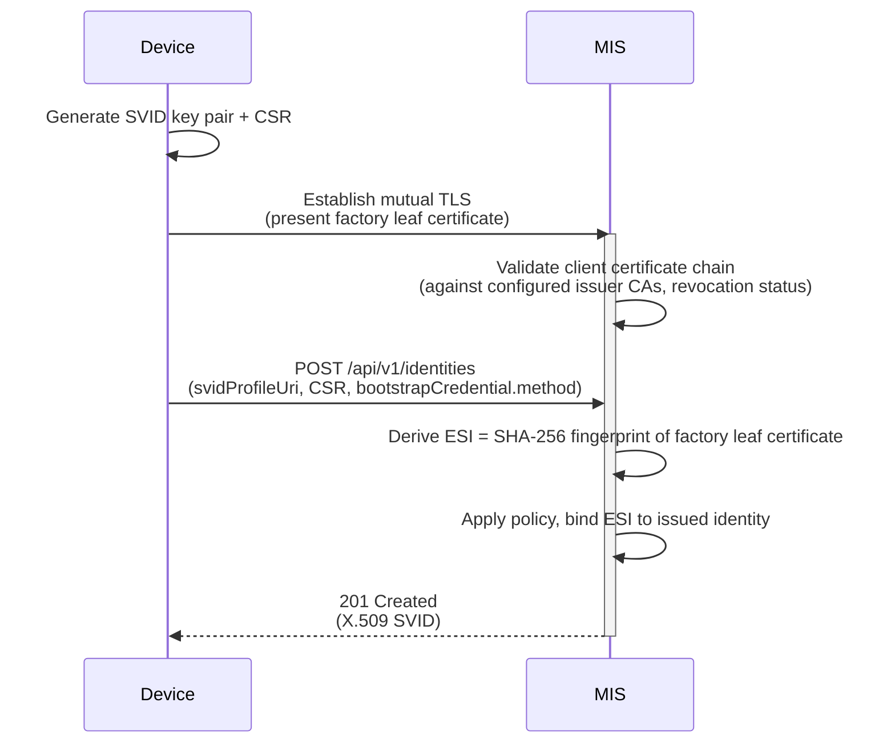

# Factory Certificate (mTLS) bootstrap method (PR3 input)

> **Status.** This document captures the **Factory Certificate (mTLS) bootstrap method** specified by the MIAF v0 draft, before PR2 deferred the bootstrap-mechanism set decision to PR3. It is preserved as one candidate input to PR3 deliberations on bootstrap mechanisms.
>
> The method is plugged into the [Margo-specific JSON enrollment protocol](miaf-margo-json-enrollment-protocol.md) via the `bootstrapCredential.method` URN registry. If PR3 selects a different enrollment protocol (e.g., Lightweight CMP), the design of "factory cert authenticates the principal at enrollment time" still applies but its wire-format integration would change.
>
> See [`../margo-identity-and-authorization-framework.md`](../margo-identity-and-authorization-framework.md) for the active PR2 spec and [`README.md`](README.md) for context.

## Overview

This method enables **certificate-based onboarding** using a **pre-provisioned X.509 client certificate** presented via **mutual TLS**.

The typical case is a manufacturer-issued certificate (e.g., an [IEEE 802.1AR](https://1.ieee802.org/security/802-1ar/) IDevID), but the method accepts any X.509 client certificate chained to a CA the Trust Domain trusts. This includes operator-issued certificates provisioned at deployment time, which supports brownfield deployments where the operator runs the issuing PKI rather than relying on manufacturer certificates.

Related PR3-input documents:

- [`miaf-margo-json-enrollment-protocol.md`](miaf-margo-json-enrollment-protocol.md) — the enrollment endpoint that consumes this bootstrap method, including the `bootstrapCredential` envelope and ESI concept.
- [`miaf-edge-compute-device-identity-profile.md`](miaf-edge-compute-device-identity-profile.md) — the v0 device profile that required this method for device enrollment.

## 1. Common bootstrap contract

The v0 draft defined a generic contract that any bootstrap method must satisfy. Methods plug into the enrollment endpoint via the `bootstrapCredential.method` URN.

Every bootstrap exchange happens over an authenticated HTTPS connection to the MIS, so the MIAF [Initial Trust Bootstrap](../margo-identity-and-authorization-framework.md#initial-trust-bootstrap) requirements apply to every method.

Unless a method states stricter requirements, every method **MUST** satisfy the following contract:

1. **ESI derivation.** The MIS **MUST** derive the Enrollment Subject Identifier exactly as specified by the selected method and use it to locate or create the identity binding, as described in the MIS validation logic of [`miaf-margo-json-enrollment-protocol.md`](miaf-margo-json-enrollment-protocol.md#mis-validation-and-processing-logic).

2. **Bootstrap proof validation.** The MIS **MUST** validate the bootstrap proof according to the selected method before issuing an identity.

3. **Certificate-chain validation.** Any certificate chain that a method requires the MIS to validate **MUST** chain to a trust anchor authorized by Trust Domain policy. Where revocation information is available and relevant, the MIS **SHOULD** evaluate it according to Trust Domain policy and the method profile.

4. **Bootstrap trust-anchor provisioning.** For methods using certificate-based credentials, the MIS **MUST** be configured with the trust anchors (e.g., manufacturer or OEM root and intermediate CA certificates) needed to validate Bootstrap Credentials. For methods using operator-issued credentials (e.g., enrollment tokens), the MIS **MUST** be configured with the necessary verification material (e.g., the token database or validation service). The provisioning mechanism is deployment-specific.

5. **Auditability.** The MIS **SHOULD** record the selected bootstrap method, relevant trust anchor or bootstrap authority, and the resulting ESI for auditability.

The MIAF [Cryptographic Requirements](../margo-identity-and-authorization-framework.md#cryptographic-requirements) apply to MIAF-generated identity artifacts, principal-generated SVID keys and CSRs, and any MIAF-defined signed assertions used by a method. External bootstrap ecosystems referenced by a method (e.g., a manufacturer certificate PKI) **MAY** use the algorithms permitted by their governing standard, subject to Trust Domain policy and any narrower constraints imposed by the method profile.

## 2. Factory Certificate method definition

The device authenticates directly to the MIS using mutual TLS, and the TLS session itself carries the bootstrap credential.

**Bootstrap Method Identifier (URN):** `urn:margo:bootstrap:factory-cert-mtls:v1`

**Enrollment Subject Identifier (ESI):** Implementations **MUST** derive the ESI as the **SHA-256 fingerprint of the DER-encoded leaf certificate** presented during the TLS handshake.

> **Operational note (informative).** Manufacturer-driven rotation of the factory leaf certificate changes the derived ESI. The v0 draft did not define replacement/rebinding semantics, so the new ESI is treated as a fresh enrollment that yields a new identity. [`miaf-device-replacement.md`](miaf-device-replacement.md) sketches policy-controlled rebinding that would let a deployment keep the existing identity across such a rotation.

**`bootstrapCredential` object schema (`application/json`):**

| Field | Type | Required | Description |
| :---- | :--- | :------- | :---------- |
| `method` | string | Y | **MUST** be `urn:margo:bootstrap:factory-cert-mtls:v1`. |
| `proof` | object or null | N | **MUST** be omitted (`null` or absent); the credential is conveyed by the mTLS client certificate. |

## 3. Validation requirements

- The device **MUST** authenticate directly to the MIS using mutual TLS (per the MIAF [TLS Requirements](../margo-identity-and-authorization-framework.md#5-transport-layer-security-tls-requirements)) with the pre-provisioned client certificate. The pre-provisioned client certificate authenticates the device to the MIS only; the MIS HTTPS server **MUST** be authenticated separately per [Initial Trust Bootstrap](../margo-identity-and-authorization-framework.md#initial-trust-bootstrap).
- The MIS **MUST** validate the presented certificate chain against Trust Domain policy before deriving or accepting the ESI.
- Where revocation information is available, the MIS **SHOULD** evaluate revocation status according to Trust Domain policy.

## 4. Workflow (informative)

## 5. Using IEEE 802.1AR DevIDs (informative)

Devices that carry an [IEEE 802.1AR](https://1.ieee802.org/security/802-1ar/) **Initial Device Identity (IDevID)** in their DevID module can use it as the manufacturer-issued X.509 certificate in any bootstrap method that accepts one.

IEEE 802.1AR defines the credential format, hardware-binding requirements, and DevID module service interface for the IDevID, but it does not define an enrollment or onboarding protocol; that is provided by methods like this one.

Under the Factory Certificate method, the device presents its IDevID as the factory certificate via the TLS client certificate in the mTLS handshake. The MIS validates the IDevID certificate chain against its configured trust anchors like any other manufacturer certificate. Operators that wish to enforce 802.1AR-specific properties (e.g., the `HardwareModuleName` in the `subjectAltName` extension or IDevID subject field conventions) can do so through Trust Domain policy applied during certificate-chain validation.

> **Cryptographic algorithm compatibility (informative).** IEEE 802.1AR-2018 defines signature suites including RSA-2048/SHA-256 (RSASSA-PKCS1-v1.5), ECDSA-P-256/SHA-256, and ECDSA-P-384/SHA-384. Of these, only the ECDSA suites are directly compatible with MIAF's [Cryptographic Requirements](../margo-identity-and-authorization-framework.md#cryptographic-requirements), which require ECDSA P-256 or RSA-PSS ≥ 3072 bits and prohibit PKCS#1 v1.5 for MIAF-generated artifacts. However, IDevID certificates are part of the manufacturer PKI (an external bootstrap ecosystem), which **MAY** use the algorithms permitted by its governing standard subject to Trust Domain policy. The device-generated SVID key and CSR submitted during enrollment **MUST** independently conform to MIAF's cryptographic requirements regardless of the IDevID's signature suite.
