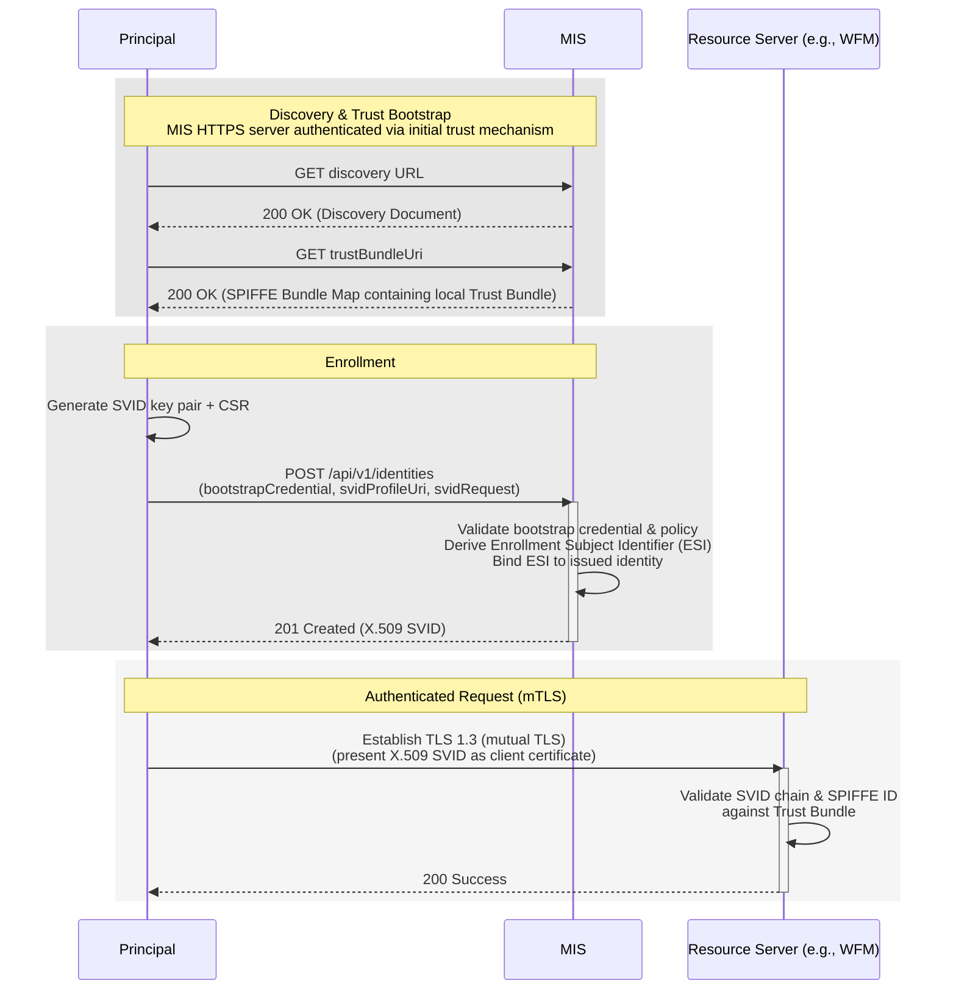
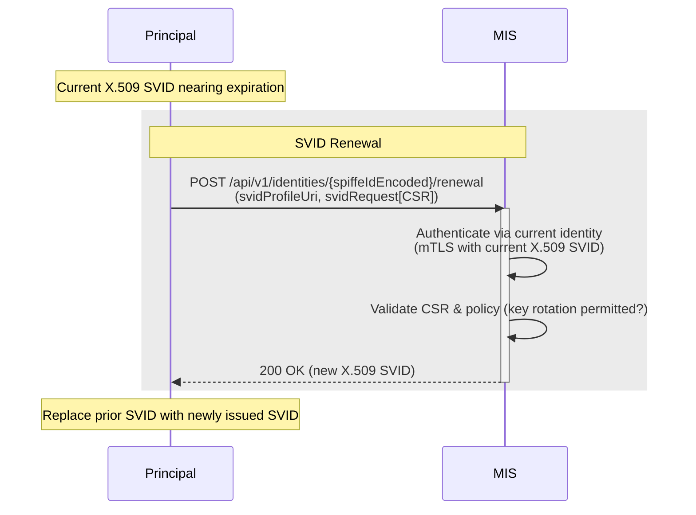

# Margo-specific JSON enrollment protocol (PR3 input)

> **Status.** This document captures the enrollment surface specified by the MIAF v0 draft, before PR2 narrowed MIAF's scope. It is preserved as one candidate input to the PR3 enrollment-protocol decision (alongside Lightweight CMP [RFC 9483], EST [RFC 7030], ACME with Device Attestation, and others). It is **not** part of the active MIAF specification; references such as "this SUP" reflect the original draft.
>
> See [`../margo-identity-and-authorization-framework.md`](../margo-identity-and-authorization-framework.md) for the active PR2 spec and [`README.md`](README.md) for context on this directory.

## Overview

This document specifies a Margo-specific JSON over HTTPS API for SVID enrollment and renewal:

- A discovery document with fields that advertise MIS endpoints, supported bootstrap methods, and supported SVID profiles (extending the minimal two-field document specified by PR2 MIAF).
- A common encoding rule for SPIFFE IDs in URL paths.
- The `POST /api/v1/identities` enrollment endpoint, including the `bootstrapCredential` envelope, MIS validation logic, and the Enrollment Subject Identifier (ESI) concept.
- The `POST /api/v1/identities/{spiffeIdEncoded}/renewal` renewal endpoint.
- Rate-limiting policies.
- The RFC 9457 Problem Details error model.
- A summary of alternatives that were considered (EST, SCEP, ACME) and rejected during the v0 design.

This document is self-contained but assumes the MIAF framework primitives from the [active PR2 spec](../margo-identity-and-authorization-framework.md): Trust Domain, SPIFFE ID, X.509-SVID profile, Trust Bundle distribution, cryptographic requirements, and Initial Trust Bootstrap.

Related PR3-input documents:

- [`miaf-factory-certificate-bootstrap-method.md`](miaf-factory-certificate-bootstrap-method.md) — the one bootstrap method profiled by the v0 draft. Used as the example throughout this document.
- [`miaf-edge-compute-device-identity-profile.md`](miaf-edge-compute-device-identity-profile.md) — the one identity profile profiled by the v0 draft.

## 1. Common API rules

Request and response bodies **MUST** use JSON unless otherwise specified, and errors **MUST** be returned in [RFC 9457](https://datatracker.ietf.org/doc/html/rfc9457) Problem Details format (see [§6 Error responses](#6-error-responses)). All HTTPS connections to MIS endpoints **MUST** be authenticated per the active MIAF [Initial Trust Bootstrap](../margo-identity-and-authorization-framework.md#initial-trust-bootstrap) rules.

MIS implementations **MUST** reject request bodies that contain fields not defined by this protocol (or by a profile or extension recognized by the MIS) with `400 Bad Request`. Clients **MUST** ignore fields they do not recognize in MIS responses. Together, these rules let extensions add fields without breaking existing implementations: servers reject unknown inputs and clients tolerate unknown outputs.

### Common URI and encoding rules

Some endpoints (e.g., [SVID renewal](#3-svid-renewal-endpoint)) include a `{spiffeIdEncoded}` placeholder. This value **MUST** be computed as follows:

- Take the SPIFFE ID as a UTF-8 string.
- Encode it using **Base64URL** as defined in [RFC 4648 §5](https://datatracker.ietf.org/doc/html/rfc4648#section-5), omitting padding (`=`).
- Use this encoded value wherever `{spiffeIdEncoded}` appears in an endpoint path.

> **Example**
>
> ```text
> spiffe://northstar-ida.com/margo/device/123e4567-e89b-12d3-a456-426614174000
> becomes
> c3BpZmZlOi8vbm9ydGhzdGFyLWlkYS5jb20vbWFyZ28vZGV2aWNlLzEyM2U0NTY3LWU4OWItMTJkMy1hNDU2LTQyNjYxNDE3NDAwMA
> ```

## 2. Discovery document extensions

The PR2 MIAF spec defines a minimal discovery document with two fields (`trustDomain`, `trustBundleUri`). This protocol extends it with three additional fields:

| Field | Type | Required | Description |
| :---- | :--- | :------- | :---------- |
| `margoIdentityServiceBaseUri` | string | Y | Absolute HTTPS base URL of the MIS. All MIS endpoints defined here are derived from this base URI. |
| `supportedBootstrapMethods` | array of string | Y | URNs of supported bootstrap methods. Each URN **MUST** reference a method defined in a published profile (e.g., [`miaf-factory-certificate-bootstrap-method.md`](miaf-factory-certificate-bootstrap-method.md)) or a registered vendor extension (`urn:margo:bootstrap:<method>:<version>`). Custom methods **SHOULD** use an organization-scoped namespace (e.g., `urn:margo:bootstrap:acme-factory:v1`). Servers **MUST NOT** advertise a method without a corresponding verification configuration in MIS. |
| `svidProfilesSupported` | array of string | Y | Absolute URIs of supported SVID profile versions. Clients **MUST** select one URI from this list when enrolling and submit it as `svidProfileUri`. |

### Example

```jsonc
{
  "trustDomain": "northstar-ida.com",
  "trustBundleUri": "https://mis.northstar-ida.com/.well-known/spiffe/bundle.json",
  "margoIdentityServiceBaseUri": "https://mis.northstar-ida.com",
  "supportedBootstrapMethods": [
    "urn:margo:bootstrap:factory-cert-mtls:v1"
  ],
  "svidProfilesSupported": [
    "https://margo.org/profiles/spiffe/x509-svid/v1"
  ]
}
```

## 3. Enrollment and identity issuance endpoint

A principal calls this endpoint to **enroll** with the MIS by presenting its **Bootstrap Credential**. On success, the MIS issues a new SVID for the principal.

| Item | Value |
| :--- | :---- |
| **Endpoint** | `POST /api/v1/identities` |
| **Authentication** | Defined by the selected bootstrap method (for example, device-held mTLS — see [`miaf-factory-certificate-bootstrap-method.md`](miaf-factory-certificate-bootstrap-method.md)) |
| **Headers** | `Content-Type: application/json` |
| **Body schema (request)** | See below |
| **Body schema (response)** | See below |
| **Responses** | `201 Created` (initial enrollment)<br>`200 OK` (re-enrollment)<br>`400`, `401`, `403`, `409`, `422`, `429` per RFC 9457 |
| **Errors** | RFC 9457 Problem Details as per [§6 Error responses](#6-error-responses) |

### Request body

| Field | Type | Required | Description |
| :---- | :--- | :------- | :---------- |
| `svidProfileUri` | string | Y | Absolute URI identifying the SVID profile requested. **MUST** match one of the URIs listed in `svidProfilesSupported`. |
| `svidRequest` | object | Y | Profile-specific payload containing parameters required to issue an SVID. |
| `bootstrapCredential` | object | Y | Credential and proof used to authenticate the enrollment. |
| `bootstrapCredential.method` | string | Y | URN uniquely identifying the bootstrap method (e.g., `urn:margo:bootstrap:factory-cert-mtls:v1`). |
| `bootstrapCredential.proof` | object | N | Method-specific proof of possession (for example, a signed JWT assertion or an enrollment token). Present only if the bootstrap method requires explicit proof material. |

### Response body

| Field | Type | Required | Description |
| :---- | :--- | :------- | :---------- |
| `svidProfileUri` | string | Y | URI of the SVID profile used for issuance. Identifies the structure of the `svid` object. |
| `svid` | object | Y | Profile-specific payload containing the issued SVID. |

### X.509-SVID profile payloads

When `svidProfileUri = "https://margo.org/profiles/spiffe/x509-svid/v1"`, the `svidRequest` and `svid` objects **MUST** conform to the structures below.

**`svidRequest` (request):**

```json
{
  "csr": "<base64 DER PKCS#10>"
}
```

| Field | Type | Required | Description |
| :---- | :--- | :------- | :---------- |
| `csr` | string | Y | Base64-encoded (standard alphabet, no newlines) DER-encoded PKCS#10 CSR. The CSR public key **MUST** comply with the MIAF [Cryptographic Requirements](../margo-identity-and-authorization-framework.md#cryptographic-requirements). |

Validation:

- The MIS **MUST** ignore any Subject DN and SANs in the CSR and set the authoritative SPIFFE ID in the URI SAN of the issued certificate according to the identity profile in effect. The MIS **MAY** enforce structural requirements (e.g., requiring a Common Name) if backed by a strict PKI.
- Inputs containing PEM armor or malformed Base64 **MUST** be rejected with `400 Bad Request` and the `invalid-svid-request` error type.
- CSRs using unsupported key types or signature algorithms **MUST** be rejected with `400 Bad Request` and the `invalid-svid-request` error type.

**`svid` (response):**

```json
{
  "certificateChainPem": ["<leaf>", "<intermediate-1>", "..."]
}
```

| Field | Type | Required | Description |
| :---- | :--- | :------- | :---------- |
| `certificateChainPem` | array of string | Y | PEM-encoded X.509 certificate chain. The first element **MUST** be the SVID (leaf certificate). The MIS **MUST** include all intermediate CA certificates required for path validation; the root **MAY** be omitted. The client **MUST** retain the chain in full and present it to verifiers as required by the MIAF [X.509 SVID Profile](../margo-identity-and-authorization-framework.md#x509-svid-profile). |

### Example

**Request:**

```http
POST /api/v1/identities
Content-Type: application/json
```

```jsonc
{
  "svidProfileUri": "https://margo.org/profiles/spiffe/x509-svid/v1",
  "svidRequest": {
    "csr": "MIICVzCCAT8CAQAwEjEQMA4GA1UEAwwHbWFyZ28tZGUw..."
  },
  "bootstrapCredential": {
    "method": "urn:margo:bootstrap:factory-cert-mtls:v1"
  }
}
```

**Response (`201 Created`):**

```jsonc
{
  "svidProfileUri": "https://margo.org/profiles/spiffe/x509-svid/v1",
  "svid": {
    "certificateChainPem": [
      "-----BEGIN CERTIFICATE-----\nMIIC4TCCAcigAwIBAgIUFsO2...\n-----END CERTIFICATE-----",
      "-----BEGIN CERTIFICATE-----\nMIIDdTCCAl2gAwIBAgIURv7O...\n-----END CERTIFICATE-----"
    ]
  }
}
```

### MIS validation and processing logic

Upon receiving an enrollment request, the MIS **MUST** perform the following steps:

1. **Validate bootstrap proof.** Verify the cryptographic proof in `bootstrapCredential` per the selected method's rules. On failure: `401 Unauthorized` with `invalid-bootstrap-proof`.

2. **Derive Enrollment Subject Identifier (ESI).** Compute a deterministic identifier from the validated bootstrap proof material per the rule defined by the selected `bootstrapCredential.method`. The ESI anchors the binding between bootstrap material and the resulting identity, letting the MIS recognize whether a presented bootstrap proof maps to an existing identity in the Trust Domain or a new one. The ESI **MUST** be stable for repeated enrollments using the same bootstrap credential, **MUST** be unique within the Trust Domain, and **MUST NOT** be reversible to the original credential material.

3. **Validate requested profile.** Confirm `svidProfileUri` is in the MIS's `svidProfilesSupported` list.
   - If unsupported: `422 Unprocessable Entity` with `unsupported-svid-profile`.
   - If `svidRequest` fails profile-specific validation: `400 Bad Request` with `invalid-svid-request`.

4. **Check for existing identity binding.** The MIS **MUST** maintain a single authoritative ESI-to-identity mapping within the Trust Domain.
   - **No binding exists (initial enrollment):** Apply operator-defined Trust Domain policy. If policy requires explicit operator admission, the MIS **MAY** return `409 Conflict` with `enrollment-pending` and a `Retry-After` header. Clients **MUST** treat `enrollment-pending` as a transient condition. Upon approval, the MIS creates a new identity, persists the ESI-to-identity mapping, issues an SVID, and returns `201 Created`.
   - **Binding exists (re-enrollment / recovery):** Retrieve the existing identity. If the CSR contains a new public key, apply operator policy to decide whether key rotation (same identity, new key) is permitted. If not permitted: `409 Conflict` with `key-rotation-not-permitted`. If permitted: issue a new SVID, invalidate the prior SVID, return `200 OK`.

5. **Finalize and audit.** The MIS **SHOULD** record enrollment metadata (bootstrap method, time, trust anchor) for auditability.

### Rate limiting

The MIS **MUST** apply rate-limiting controls to enrollment requests to prevent resource exhaustion and replay abuse.

1. **Dimension.** Deployment-specific (e.g., source IP, bootstrap credential, derived ESI), since enrollment requests are not yet associated with a SPIFFE ID.
2. **Error response.** When limits are exceeded: `429 Too Many Requests` with a `Retry-After` response header (delta-seconds).
3. **Client behavior.** Clients **MUST NOT** automatically retry before `Retry-After` elapses and **SHOULD** apply exponential backoff to avoid synchronized retry storms.

## 4. SVID renewal endpoint

This endpoint renews an expiring SVID while preserving the existing identity. The client presents its current X.509-SVID as a TLS client certificate (mTLS), and the MIS issues a new SVID for the same SPIFFE ID.

| Item | Value |
| :--- | :---- |
| **Endpoint** | `POST /api/v1/identities/{spiffeIdEncoded}/renewal` |
| **Authentication** | **Mutual TLS:** The client **MUST** present its current X.509-SVID as the TLS client certificate. The MIS **MUST** extract the SPIFFE ID from the URI SAN and verify it matches `{spiffeIdEncoded}`. `{spiffeIdEncoded}` is computed per [§1 Common URI and encoding rules](#common-uri-and-encoding-rules). |
| **Headers** | `Content-Type: application/json` |
| **Body schema (request)** | See below |
| **Body schema (response)** | Same as [Enrollment response](#response-body) |
| **Responses** | `200 OK` on success; `400`, `401`, `422`, `429` per RFC 9457 |

### Request body

| Field | Type | Required | Description |
| :---- | :--- | :------- | :---------- |
| `svidProfileUri` | string | Y | Absolute URI of the SVID profile used for renewal. **MUST** match a profile supported by MIS and **SHOULD** match the currently active profile unless explicitly allowed by policy. |
| `svidRequest` | object | Y | Profile-specific renewal payload. For X.509-SVID, this object contains a Base64-encoded CSR as defined above. |

> **Note.** Renewal **MAY** include a new key pair; acceptance is policy-controlled. As a **RECOMMENDED** default, MIS policy **SHOULD** permit renewal with a new key pair while preserving the existing identity. Deployments with hardware-bound or non-exportable key requirements **MAY** instead require re-enrollment.

### Example

```http
POST /api/v1/identities/c3BpZmZlOi8vbm9ydGhzdGFyLWlkYS5jb20vbWFyZ28vZGV2aWNlLzEyM2U0NTY3LWU4OWItMTJkMy1hNDU2LTQyNjYxNDE3NDAwMA/renewal
Content-Type: application/json
# TLS 1.3, client certificate = current X.509-SVID
```

```jsonc
{
  "svidProfileUri": "https://margo.org/profiles/spiffe/x509-svid/v1",
  "svidRequest": {
    "csr": "MIICVjCCAT8CAQAw..."
  }
}
```

On success, the response body matches the enrollment response, and the client **MUST** replace its previous SVID with the newly issued one.

### Rate limiting and backoff

1. **Renewal frequency.** The MIS **MUST** track renewal frequency per SPIFFE ID. **RECOMMENDED** baseline: no more than 5 successful renewals per 24-hour period per identity, configurable by deployment.
2. **Error response.** On exceed: `429 Too Many Requests` with `Retry-After` (delta-seconds).
3. **Client behavior.** Clients **MUST NOT** automatically retry before `Retry-After` and **SHOULD** apply exponential backoff.

## 5. Workflows (informative)

### End-to-end enrollment flow



### SVID renewal flow



## 6. Error responses

All Margo-compliant services **MUST** return error details for any `4xx` or `5xx` HTTP status code as a Problem Details JSON Object per [RFC 9457](https://datatracker.ietf.org/doc/html/rfc9457). Error responses **MUST** set `Content-Type: application/problem+json`, the response body **MUST** conform to the schema below, and the body's `status` field **MUST** match the HTTP status code. For `429 Too Many Requests`, services **MUST** also include a `Retry-After` response header (delta-seconds).

### Problem Details schema

| Member | Type | Required | Description |
| :----- | :--- | :------- | :---------- |
| `type` | string (URI) | Y | Identifies the problem type. |
| `title` | string  | Y | Short, human-readable summary of the error. |
| `status` | integer | Y | The HTTP status code of the response. |
| `detail` | string | N | Developer-readable explanation of this specific problem instance. |
| `instance` | string (URI) | N | Unique URI reference identifying the specific error occurrence (e.g., correlation or audit ID). |

**Example (generic unauthorized):**

```json
{
  "type": "about:blank",
  "title": "Unauthorized",
  "status": 401,
  "detail": "The provided credential is invalid or expired."
}
```

### Error type conventions

1. **General HTTP errors** — use `type: "about:blank"`; the `title` field **SHOULD** match the HTTP reason phrase.
2. **Margo-specific protocol errors** — use absolute URIs under the Margo namespace (`https://margo.org/docs/errors/<error-code>`); these identify standardized error classes across MIS implementations.

The Margo-specific error types defined by this protocol:

| Condition | HTTP Status | `type` URI | `title` |
| :-------- | :---------- | :--------- | :------ |
| Invalid SVID request | 400 | `https://margo.org/docs/errors/invalid-svid-request` | Invalid SVID Request |
| Invalid bootstrap proof | 401 | `https://margo.org/docs/errors/invalid-bootstrap-proof` | Invalid Bootstrap Proof |
| Invalid audience | 400 | `https://margo.org/docs/errors/invalid-audience` | Invalid Audience |
| Unsupported bootstrap method | 422 | `https://margo.org/docs/errors/unsupported-method` | Unsupported Bootstrap Method |
| Unsupported SVID profile | 422 | `https://margo.org/docs/errors/unsupported-svid-profile` | Unsupported SVID Profile |
| Key rotation not permitted | 409 | `https://margo.org/docs/errors/key-rotation-not-permitted` | Key Rotation Not Permitted |
| Enrollment or renewal rate limit exceeded | 429 | `https://margo.org/docs/errors/too-many-requests` | Too Many Requests |
| Enrollment pending operator admission | 409 | `https://margo.org/docs/errors/enrollment-pending` | Enrollment Pending |

### Error handling per endpoint

| Endpoint | Condition | Status | Error Type | Required Action |
| :------- | :-------- | :----- | :--------- | :-------------- |
| `POST /api/v1/identities` | Unknown `bootstrapCredential.method` | 422 | `unsupported-method` | Client **MUST** retry only with a supported method. |
| `POST /api/v1/identities` | Invalid or missing `svidRequest` for the requested SVID profile | 400 | `invalid-svid-request` | Client **MAY** resubmit with a corrected request. |
| `POST /api/v1/identities` | Bootstrap proof invalid, malformed, expired, replayed | 401 | `invalid-bootstrap-proof` | Client **MUST** correct or regenerate the bootstrap proof before retrying. |
| `POST /api/v1/identities` | Requested key rotation not permitted by policy | 409 | `key-rotation-not-permitted` | Client **MUST** retry with the existing key or obtain operator approval. |
| `POST /api/v1/identities` | New identity creation deferred pending operator admission | 409 | `enrollment-pending` | Client **MUST** retry after `Retry-After`. |
| `POST /api/v1/identities/{spiffeIdEncoded}/renewal` | Unsupported SVID profile | 422 | `unsupported-svid-profile` | Client **MUST** retry with a supported profile. |
| Any endpoint requiring mTLS with an existing SVID | Presented SVID is invalid or expired | 401 | `about:blank` | Client **MUST** re-authenticate. |
| Any endpoint | Rate limit exceeded | 429 | `too-many-requests` | Client **SHOULD** apply backoff and alert operator. |

### Client behavior

1. **Structured error mapping.** Clients **SHOULD** map known `type` URIs to internal enums; unknown `type` URIs **MUST** be treated as generic errors using `status` and `title`.
2. **Retry logic.** For recoverable errors (e.g., `429 too-many-requests`, `409 enrollment-pending`) clients **MAY** retry per `Retry-After`; for permanent errors (e.g., `422`, `400`, `409 key-rotation-not-permitted`) clients **MUST NOT** retry without correction or operator action.
3. **Logging.** Clients **SHOULD** log the full Problem Details object and, when present, include `instance` in operator and support logs for cross-correlation.

## 7. Security considerations

The following enrollment-protocol-specific threats are in scope for this design.

| Threat | Description | Mitigation |
| :----- | :---------- | :--------- |
| **Unauthorized enrollment** | An attacker attempts to enroll without valid bootstrap credentials. | MIS **MUST** validate all bootstrap proofs per the selected method; operators **SHOULD** apply differentiated enrollment, issuance, or rebinding policies based on the method used. |
| **Replay of bootstrap material** | Captured bootstrap material is re-submitted by an attacker. | MIS **MUST** enforce the freshness and replay-protection rules defined by each bootstrap method profile. |
| **Denial-of-Service (DoS)** | Attackers flood enrollment or renewal requests. | MIS rate-limiting and client backoff per [§3 Rate limiting](#rate-limiting) and [§4 Rate limiting and backoff](#rate-limiting-and-backoff). |

General threats (key compromise, SVID theft, service impersonation, cross-domain confusion) are covered by the active MIAF [Security Considerations](../margo-identity-and-authorization-framework.md#7-security-considerations).

## 8. Alternatives considered

This is the analysis from the v0 draft that compared a Margo-specific JSON API against existing standardized enrollment protocols.

### Certificate-based device enrollment protocols

| Protocol | Reference | v0 evaluation |
| :------- | :-------- | :------------ |
| **EST (Enrollment over Secure Transport)** | [RFC 7030](https://datatracker.ietf.org/doc/html/rfc7030) | Provides standardized certificate enrollment over HTTPS, but assumes TLS-based client authentication only. The v0 draft argued it lacked extensibility for pluggable bootstrap proofs (e.g., JWT or FDO) and could not carry structured JSON credentials natively. |
| **SCEP (Simple Certificate Enrollment Protocol)** | [IETF Draft](https://datatracker.ietf.org/doc/html/draft-nourse-scep-00) | Relies on PKCS#7 payloads and a shared-secret "challenge password." The v0 draft argued it was mechanically incompatible with SPIFFE identity semantics and unsuitable for modern cryptographic agility. |
| **ACME (Automated Certificate Management Environment)** | [RFC 8555](https://datatracker.ietf.org/doc/html/rfc8555) | Uses modern JSON/HTTPS exchanges but is designed for *proving control over existing identifiers* (e.g., DNS names), not for *assignment* of new device identities. The v0 draft argued it would require non-standard challenges and multi-step orchestration. |

PR3 deliberations should re-evaluate these arguments. In particular:

- **Lightweight CMP ([RFC 9483](https://datatracker.ietf.org/doc/html/rfc9483))** was not analyzed in the v0 draft but is a strong PR3 candidate. It has mature CA-side implementations (EJBCA, ADCS, openssl-based CAs, commercial PKI products) and a published profile for IoT enrollment, renewal, and key-update.
- **ACME with Device Attestation ([draft-acme-device-attest](https://datatracker.ietf.org/doc/draft-acme-device-attest/))** is also a candidate not analyzed in the v0 draft; it specifically addresses hardware-attested device enrollment.

### OAuth 2.0 / Authorization Server integration

Early v0 designs proposed using OAuth 2.0 Authorization Servers as part of the normative enrollment workflow. The v0 draft rejected this for the normative core, arguing it would:

- require every MIAF-compliant deployment to maintain a full OAuth 2.0 infrastructure;
- introduce additional moving parts (token lifecycles, introspection endpoints) unrelated to MIAF's cryptographic identity model; and
- duplicate functionality already achieved through verified SPIFFE IDs and SVIDs.

An informative OAuth 2.0 Token Exchange bridge is captured in [`miaf-oauth2-bridge.md`](miaf-oauth2-bridge.md).
