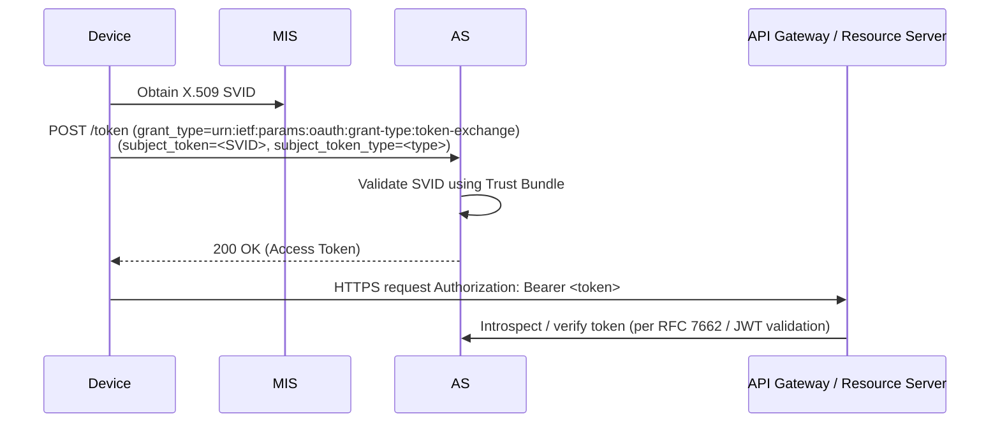

# Specification Update Proposal

## Owner

[@matlec](https://github.com/matlec) (currently deferred — owner to be confirmed at promotion)

## Summary

Defines an informative OAuth 2.0 Token Exchange bridge under MIAF, allowing deployments to map MIAF-issued SVIDs onto OAuth 2.0 access tokens for interoperability with existing API gateway and authorization-server infrastructure. Originally drafted as Appendix C of the active MIAF SUP; deferred for PR 2 since the bridge is informative-only and not required for baseline interoperability. Purely additive — the bridge sits beside MIAF rather than in its critical path.

## Reason for proposal

Some enterprise deployments cannot replace existing OAuth-based authorization stacks but want MIAF identity assurance underneath. A standardized Token Exchange (RFC 8693) mapping enables those deployments to consume MIAF SVIDs through their existing OAuth infrastructure without inventing per-vendor bridges.

## Requirements alignment acknowledgement

This SUP extends the active MIAF SUP and aligns with Margo's interoperability and flexibility goals. Detailed feature linkage and Owner are TBD at promotion.

## Technical proposal

This appendix provides **informative guidance** for deployments that wish to integrate the **Margo Identity and Authorization Framework (MIAF)** with existing **OAuth 2.0-based** or **API gateway** infrastructures.

### Purpose and Context

While MIAF relies natively on **cryptographically verifiable identities** (SVIDs) for authentication and authorization, many enterprise environments already operate OAuth 2.0 Authorization Servers (AS) and API gateways for coarse-grained access control.

Because SVIDs are standard X.509 certificates, they are inherently compatible with existing OAuth 2.0 client authentication mechanisms (e.g., [RFC 8705](https://datatracker.ietf.org/doc/html/rfc8705)) and with API gateways that validate client certificates against a trust store. Deployments that already have such infrastructure can consume SVIDs directly - no MIAF-specific integration is required on the gateway or AS side.

For deployments that need to **translate** SVID-based identities into OAuth 2.0 access tokens - for example, to interoperate with downstream services or gateways that only accept bearer tokens - this appendix defines a **Token Exchange Bridge** model based on [RFC 8693](https://datatracker.ietf.org/doc/html/rfc8693). This model preserves device-side interoperability: the device continues to interact only with the MIS, while the OAuth translation happens server-side.

### Token Exchange Bridge

In this model, the OAuth 2.0 AS exposes an [RFC 8693 **Token Exchange**](https://datatracker.ietf.org/doc/html/rfc8693) endpoint. An **Authorization Server (AS)** issues **OAuth 2.0 access tokens** based on a validated **SVID** presented by a client.
The **Margo Identity Service (MIS)** remains the trust root; the AS simply translates a verified SVID into a conventional OAuth 2.0 token for interoperability with existing gateways or services.

> **Note:**
> Deployments that bridge SVID-based identities into OAuth 2.0 tokens may define internal claim mappings as needed for their authorization infrastructure. Such mappings are **deployment-specific** and **out of scope** for this specification.

#### Token Exchange Request

| Parameter | Required | Description |
| :-------- | :------- | :-----------|
| `grant_type` | Y | **MUST** be `urn:ietf:params:oauth:grant-type:token-exchange`. |
| `subject_token` | Y | The encoded SVID representing the requester. |
| `subject_token_type` | Y | **MUST** identify the format: - `urn:margo:token-type:x509-svid`: base64-encoded PEM chain conforming to the chain-delivery requirement in the [X.509 SVID Profile](../margo-identity-and-authorization-framework.md#x509-svid-profile) (leaf SVID first, followed by all required intermediates) Additional values MAY be registered later (for example, by future SUPs that introduce new SVID profiles). |
| `audience` | N | Target resource audience for the requested token. |
| `scope` | N | Optional scopes; AS policy determines allowed values. |

The AS **MUST** reject requests with unknown or unsupported `subject_token_type`.

#### Token Exchange Response

| Field | Description |
| :---- | :---------- |
| `access_token` | OAuth 2.0 access token (JWT or opaque).  |
| `issued_token_type` | Usually `urn:ietf:params:oauth:token-type:access_token`. |
| `token_type` | `"Bearer"`. |
| `expires_in` | Token lifetime in seconds; **SHOULD NOT** exceed the underlying SVID's validity. |

#### Validation and Security Considerations

- The AS **MUST** validate the SVID chain against the [**Trust Bundle**](../margo-identity-and-authorization-framework.md#trust-bundles-and-distribution).
- The access token's `sub` claim **SHOULD** equal the SPIFFE ID of the validated SVID.
- Access-token lifetime **MUST NOT** exceed the remaining validity of the SVID.
- The AS **MUST** set `iss` to its own OAuth issuer identifier to avoid audience confusion.
- Token-exchange implementations **MUST NOT** bypass SVID validation or accept untrusted issuers.

## Alternatives considered

TBD

## Rejection reason

Not applicable.
