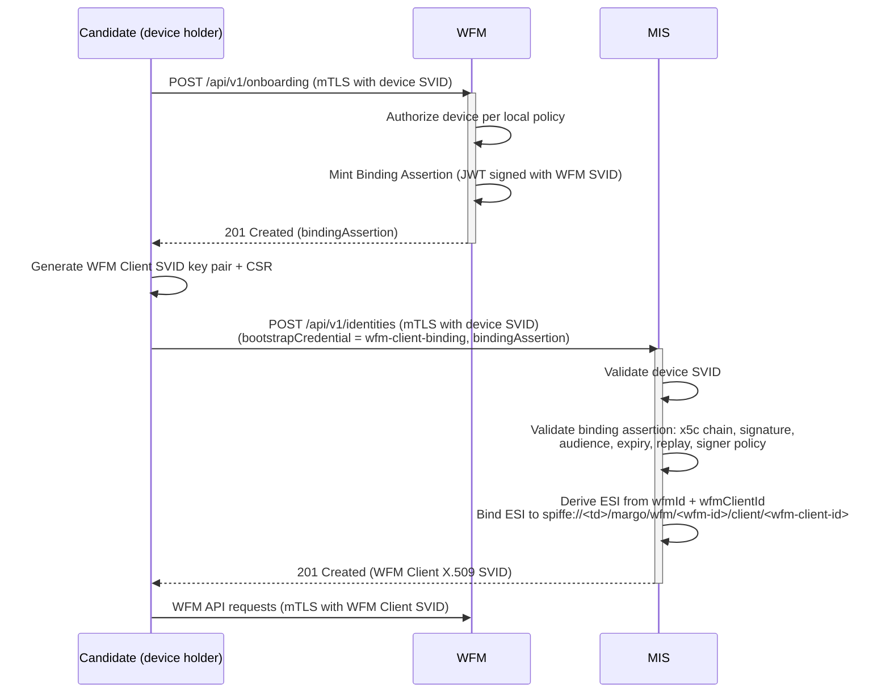

# WFM Client Binding Assertion onboarding (PR3 input)

> **Status.** This document captures the **WFM Client onboarding mechanism** specified by the WFM Client Identity Profile v0 draft, before PR2 narrowed the SUP to operator-pre-provisioning. It is preserved as one candidate input to PR3 deliberations on WFM Client enrollment.
>
> The mechanism plugs into the [Margo-specific JSON enrollment protocol](miaf-margo-json-enrollment-protocol.md) via the `bootstrapCredential.method` URN registry. If PR3 selects a different enrollment protocol (e.g., Lightweight CMP), the binding-assertion design pattern still applies but its wire-format integration would change (e.g., CMP RA pattern).
>
> **Terminology rename.** The v0 draft used `client-handle` (and `clientHandle` in JSON / JWT claims) for the per-WFM client identifier. PR2 renamed this to `wfm-client-id` (and `wfmClientId` in JSON / JWT claims). This document uses the PR2 names throughout; the underlying mechanism is unchanged.
>
> See [`../margo-identity-and-authorization-framework.md`](../margo-identity-and-authorization-framework.md) and [`../wfm-identity-profile.md`](../wfm-identity-profile.md) for the active PR2 specs and [`README.md`](README.md) for context.

## Overview

A candidate WFM Client gets its identity in two steps:

1. It asks the WFM for a short-lived signed assertion authorizing the issuance (the **WFM Client Binding Assertion**).
2. It presents that assertion to the MIS to obtain its WFM Client X.509-SVID.

Throughout, the candidate authenticates with its existing **device** SVID (issued under the [Edge Compute Device Identity Profile](miaf-edge-compute-device-identity-profile.md)); the WFM Client SVID it ends up holding is what authenticates it to the WFM thereafter.

This design depends on:

- The [Margo-specific JSON enrollment protocol](miaf-margo-json-enrollment-protocol.md) for the MIS enrollment endpoint, the `bootstrapCredential` envelope, and the ESI concept.
- A device identity foundation — i.e., the framing that PR3 must decide on (foundation vs. peer profile, see [`miaf-edge-compute-device-identity-profile.md`](miaf-edge-compute-device-identity-profile.md) status banner).

## 1. Bootstrap method identifier

```text
urn:margo:bootstrap:wfm-client-binding:v1
```

## 2. Actor model

The authenticated actor is a candidate WFM Client running on a platform that already holds a valid **device** identity under MIAF. The candidate WFM Client **MUST** authenticate to MIS using **mTLS** with a valid current device X.509-SVID. The WFM Client Binding Assertion is conveyed in the enrollment request body.

## 3. WFM binding-assertion request endpoint

A WFM **MUST** expose:

```text
POST /api/v1/onboarding
```

for candidate WFM Clients to obtain a WFM Client Binding Assertion. This endpoint is the runtime delivery channel for the assertion; it is the WFM-side counterpart to the MIS enrollment request.

### Authentication

The candidate **MUST** authenticate to the WFM using **mTLS** with a valid current device X.509-SVID. The WFM **MUST** validate the device SVID against the Trust Bundle for its Trust Domain.

### Request body

JSON. All fields are optional; an empty object `{}` is valid:

```json
{
  "wfmClientId": "<path-safe identifier>"
}
```

- `wfmClientId` — when present, the candidate's suggested identifier. The WFM **MAY** honor or override it according to local policy. When absent, the WFM **MUST** derive the identifier from a stable local subject (see [§7 Stateless WFM candidate issuance](#7-stateless-wfm-candidate-issuance)).

### Response

`201 Created`, JSON:

```json
{
  "bindingAssertion": "<compact-jws>"
}
```

The returned assertion **MUST** satisfy the claim rules in [§5 WFM Client Binding Assertion](#5-wfm-client-binding-assertion).

### Authorization

The WFM **MUST** authorize the request using local policy keyed by the authenticated **device** SPIFFE ID. The WFM **MAY** deny issuance of a binding assertion to a device whose SVID is valid but not authorized to enroll as a client of this WFM.

### Errors

WFMs **MUST** return error responses in RFC 9457 Problem Details format per the conventions in [`miaf-margo-json-enrollment-protocol.md#6-error-responses`](miaf-margo-json-enrollment-protocol.md#6-error-responses) — `Content-Type: application/problem+json`, `status` field matching the HTTP status code, and `Retry-After` response header on `429`. Error conditions for this endpoint:

| Condition | HTTP Status | `type` URI | `title` |
| :-------- | :---------- | :--------- | :------ |
| Malformed body or `wfmClientId` syntactically invalid | 400 | `about:blank` | Bad Request |
| Missing, expired, or untrusted device SVID | 401 | `about:blank` | Unauthorized |
| Device authenticated but not authorized by local policy | 403 | `https://margo.org/docs/errors/wfm-client-onboarding-forbidden` | Onboarding Forbidden |
| `wfmClientId` semantically rejected (e.g., conflicts with an existing binding) | 422 | `https://margo.org/docs/errors/wfm-client-id-conflict` | Client Identifier Conflict |
| Rate-limited (see [§8 Replay and DoS controls](#8-replay-and-dos-controls)) | 429 | `https://margo.org/docs/errors/too-many-requests` | Too Many Requests |

### Idempotency

Repeated requests from the same authenticated device **SHOULD** yield assertions referring to the same `wfmClientId` (with refreshed `iat`, `exp`, and `jti`), unless local policy decides the relationship has been retired or rebound to a different binding subject.

In re-issuance after device replacement, the candidate calling `POST /api/v1/onboarding` is on a different device than the original holder. Whether the WFM issues an assertion for the existing `wfmClientId` (preserving the logical client identity) or a new `wfmClientId` is determined by local WFM policy — the protocol does not constrain this decision.

## 4. Enrollment request

Initial issuance and re-issuance use the MIS enrollment endpoint `POST /api/v1/identities` from [`miaf-margo-json-enrollment-protocol.md`](miaf-margo-json-enrollment-protocol.md#3-enrollment-and-identity-issuance-endpoint), with `svidProfileUri` set to `https://margo.org/profiles/spiffe/x509-svid/v1` and `bootstrapCredential` set to:

```json
{
  "method": "urn:margo:bootstrap:wfm-client-binding:v1",
  "proof": {
    "bindingAssertion": "<compact-jws>"
  }
}
```

The `svidRequest` object uses the same CSR structure defined by MIAF for X.509-SVID issuance.

## 5. WFM Client Binding Assertion

The WFM Client Binding Assertion is a JSON Web Token ([RFC 7519](https://datatracker.ietf.org/doc/html/rfc7519)) in compact serialization. Its JOSE header **MUST** include `typ: "application/wfm-client-binding+jwt"` and `x5c` (per [RFC 7515 §4.1.6](https://datatracker.ietf.org/doc/html/rfc7515#section-4.1.6)) carrying the signer's current X.509-SVID chain, so the assertion is self-contained. The signing key is the private key whose public counterpart is in the leaf certificate of `x5c`; MIS retrieves the verification key directly from that leaf certificate after validating the chain against the Trust Bundle.

The following claims and semantics are normative:

| Claim | Requirement |
| :--- | :--- |
| `iss` | **MUST** be a SPIFFE ID. Either the WFM Identity `spiffe://<trust-domain>/margo/wfm/<wfm-id>` itself, or the SPIFFE ID of a delegated signer explicitly authorized by Trust Domain policy for that WFM Identity. |
| `sub` | **MUST** equal `iss`. |
| `aud` | **MUST** equal the MIS identity issuance endpoint URL — that is, `<margoIdentityServiceBaseUri>/api/v1/identities`, where `margoIdentityServiceBaseUri` is the value advertised in the MIAF Discovery Document for this Trust Domain. Operator-chosen alternative audience values are not permitted. |
| `iat` | **MUST** be present. |
| `exp` | **MUST** be present and **MUST NOT** exceed 5 minutes after `iat`. |
| `jti` | **MUST** be unique per assertion. |
| `wfmId` | **MUST** equal the `wfm-id` encoded in the resulting SPIFFE path. |
| `wfmClientId` | **MUST** equal the `wfm-client-id` encoded in the resulting SPIFFE path. |

The signer of the binding assertion:

- **MUST** be authorized by Trust Domain policy to issue WFM Client binding assertions for the referenced `wfm-id`;
- **MUST** be bound by that policy to the corresponding WFM Identity `spiffe://<trust-domain>/margo/wfm/<wfm-id>`;
- **MUST** be validated by MIS without requiring a runtime call to the WFM; and
- **MUST** sign using algorithms permitted by the MIAF [Cryptographic Requirements](../margo-identity-and-authorization-framework.md#cryptographic-requirements).

## 6. Enrollment Subject Identifier derivation

For this bootstrap method, MIS **MUST** derive the Enrollment Subject Identifier as:

```text
SHA-256("wfm-client-binding:v1" || 0x00 || wfmId || 0x00 || wfmClientId)
```

encoded as lowercase hexadecimal.

The ESI is intentionally independent of the current holder device, so the same logical WFM Client identity may persist across single-holder rebinding when policy permits. The multi-holder extension is sketched in [`miaf-multi-holder-identities-and-cluster-topology.md`](miaf-multi-holder-identities-and-cluster-topology.md).

## 7. MIS validation rules

**Precondition.** Before processing a `urn:margo:bootstrap:wfm-client-binding:v1` enrollment request, MIS **MUST** possess validated trust material for the WFM Identity (or its delegated signer) named by the assertion's `iss` claim. That trust material is established by the WFM's enrollment or operator pre-provisioning together with the Trust Domain signer policy that authorizes the corresponding `wfm-id` namespace (see [§9 Trust Domain signer policy](#9-trust-domain-signer-policy-informative)). MIS **MUST** reject a binding assertion whose `iss` is not covered by this trust material.

For `urn:margo:bootstrap:wfm-client-binding:v1`, MIS **MUST** then perform all of the following:

1. validate the caller's current device identity according to MIAF;
2. validate the WFM Client Binding Assertion by: (a) validating the `x5c` chain against the Trust Bundle; (b) verifying that the leaf certificate's SPIFFE ID matches the `iss` claim; (c) verifying the JWT signature with the leaf certificate's public key;
3. validate audience, expiry, and replay protection for the assertion;
4. verify that the signer is authorized by local policy to issue binding assertions for the asserted `wfm-id` and is bound to the corresponding WFM Identity namespace;
5. verify that the `wfm-id` and `wfm-client-id` satisfy the path rules of the active Margo WFM Identity Profile;
6. derive the ESI from `wfmId` and `wfmClientId`;
7. map that ESI to the SPIFFE ID `spiffe://<trust-domain>/margo/wfm/<wfm-id>/client/<wfm-client-id>`; and
8. issue a WFM Client X.509-SVID for that SPIFFE ID.

### Stateless WFM candidate issuance

A WFM **MAY** issue binding assertions for candidate clients without persisting candidate state, by deriving `wfmClientId` deterministically from a stable local subject and signing the assertion statelessly. Whether the WFM persists local authorization state before or after first authenticated use is deployment-specific and does not affect interoperability.

## 8. End-to-end flow (informative)



## 9. Trust Domain signer policy (informative)

MIS and WFM do not require synchronous runtime interaction. Trust is established through a shared Trust Domain, the WFM Identity (or a policy-bound delegated signer), Trust Domain policy authorizing the `wfm-id` namespace, and MIS validation of binding assertions using locally available trust material.

The "Trust Domain policy authorizing the WFM namespace" is, in practice, a Trust-Domain-level mapping from each `wfm-id` to one or more permitted signer identities authorized to issue WFM Client Binding Assertions for that namespace. A signer identity is a SPIFFE ID, expressed either as:

- the WFM's SPIFFE ID itself (the most common case); or
- a delegated signer's SPIFFE ID.

The wire format and storage of this policy are deployment-specific. Typical implementations provision the policy at MIS via configuration files, an authenticated administrative interface, or deployment tooling. On every binding-assertion validation, MIS resolves the assertion's `iss` claim against this policy and rejects assertions whose `iss` is not authorized for the asserted `wfm-id`.

> **Illustrative example (informative, not a wire format):**
>
> ```yaml
> wfm_signer_policy:
>   - wfm_id: factory-blue-line-1
>     authorized_signers:
>       - spiffe://factory.example/margo/wfm/factory-blue-line-1
>   - wfm_id: vendor-x-managed-fleet-7
>     authorized_signers:
>       - spiffe://factory.example/margo/wfm/vendor-x-managed-fleet-7
>       - spiffe://factory.example/svc/vendor-x-binding-signer
> ```
>
> Two `wfm-id` namespaces are shown. The first authorizes only the WFM itself as the binding-assertion signer. The second additionally authorizes a delegated signer SPIFFE ID, supporting deployments where the WFM offloads assertion signing to a dedicated component.

## 10. Replay and DoS controls

- MIS **MUST** reject replayed binding assertions using the `jti` claim. The replay cache **MUST** be effective across all MIS instances that share an issuance authority within the Trust Domain — single-instance MIS deployments **MAY** keep it process-local; HA deployments **MUST** make it cluster-wide. The cache **MUST** retain `jti` values at least until each assertion's `exp` has passed.
- MIS **MUST** rate-limit WFM Client enrollment and renewal requests.
- WFMs issuing assertions for candidate clients **SHOULD** keep assertion TTLs short to limit abuse and replay windows.

## 11. Alternative considered: MIS-to-WFM validation calls

Requiring MIS-to-WFM validation calls (where MIS would call the WFM at issuance time to confirm the binding) was rejected in the v0 draft because it would increase coupling and create a new availability dependency. Offline validation of a short-lived signed binding assertion is sufficient, provided the signer policy is provisioned at MIS ahead of time.
