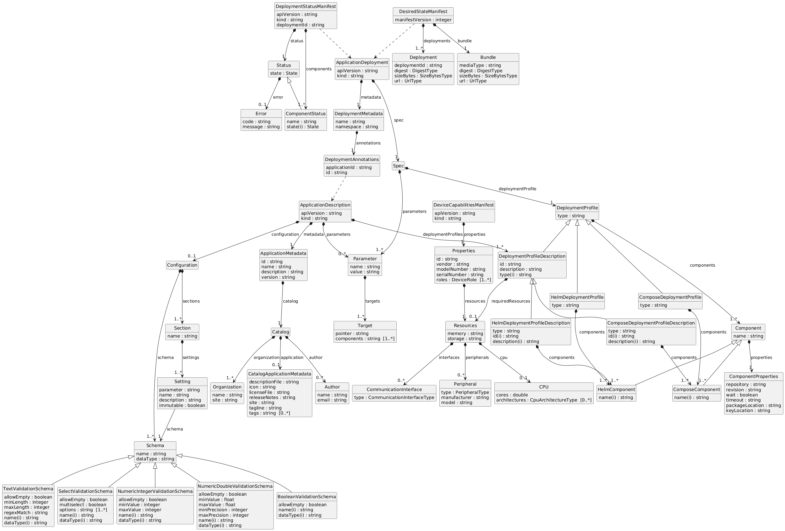

# Specification Update Proposal - Data Model as Single Source of Truth - LinkML

- [Owner](#owner)
- [Summary](#summary)
- [Reason for proposal](#reason-for-proposal)
- [Requirements alignment
  acknowledgement](#requirements-alignment-acknowledgement)
- [Technical proposal](#technical-proposal)
- [Alternatives considered (optional)](#alternatives-considered-optional)
- [Rejection reason](#rejection-reason)

## Owner

Silvano Cirujano Cuesta (silvano.cirujano-cuesta@siemens.com)

## Summary

The Margo specification needs a single source of truth from which
documentation, validation schemas, and tooling get automatically generated.
This SUP proposes using [LinkML][linkml] to create the data model and
leverage its tooling for all derived artifacts.

## Reason for proposal

The current approach of maintaining the Margo specification as manually
edited markdown documents presents several challenges:

- The specification has complex data structures and types with overlapping
  parts. Editing them while keeping consistency is very tough.
- Ensuring consistency in the structure of the documents is very difficult
  with the current markdown-based approach.
- Generating validation JSON Schemas manually is error prone.
- Keeping synchronicity between examples and the specification is error
  prone.
- Keeping consistency with OpenAPI configurations needed for the APIs is
  cumbersome and error prone.

These concerns are not merely theoretical.
The following issues have already been detected in the current
specification:

- Inconsistencies between different parts of the specification
  ([Plugfest#32][pf-32], [Plugfest#40][pf-40], [Plugfest#41][pf-41],
  [Specification#133][spec-133], [Specification#134][spec-134],
  [Specification#135][spec-135], [Specification#149][spec-149],
  [Specification#157][spec-157], [Specification#169][spec-169]).
- Inconsistencies between the specification and some provided examples
  ([Plugfest#30][pf-30], [Plugfest#32][pf-32],
  [Specification#53][spec-53], [Specification#149][spec-149],
  [Specification#167][spec-167]).
- Inconsistencies between the specification and provided OpenAPI
  configurations ([Plugfest#26][pf-26], [Plugfest#32][pf-32],
  [Specification#157][spec-157]).

The following diagram illustrates the complexity of the specification's
data structures, which is expected to increase as the project grows:

## Requirements alignment acknowledgement

This SUP does not change the content of the Margo specification itself.
It proposes an internal tooling upgrade, limited to improving how the
specification is authored and maintained, that helps increase its quality
and lower the maintenance effort.

Even though this SUP does not change the content of the Margo
Specification, it does touch its documentation and presentation.
Therefore the SUP process is applied to ensure that the proposed changes
are properly reviewed and accepted by the community, and to maintain
transparency in the evolution of the specification.

By establishing a single source of truth for the data model, this SUP
addresses many of the above mentioned issues.

## Technical proposal

Any single source of truth approach increases complexity, but is necessary
given the specification's inherent complexity.
The success of the approach depends on the available tooling.
Any approach will be perceived as wrong if the tooling is not good.
Some effort is needed on good tooling.

Appropriate tooling can enable separation of concerns, which helps with
maintenance.

There are different roles that can work in parallel:

- Tooling and template developers need to know Python, YAML, Markdown,
  and Jinja2, but do not need deep knowledge of the specification or
  possibly even LinkML directly.
- Specification authors need to know LinkML and Markdown, but do not need
  to be proficient in the tooling stack.

The proposal is to create a data model using [LinkML][linkml] as the
single source of truth for the Margo specification.
LinkML is chosen for its expressiveness and modeling capabilities, which
allow complex data structures to be defined in a clear and maintainable
way.

For tooling and template developers, the stack relies on widely known
technologies: YAML, Python, Markdown, and Jinja2.
Among these, Jinja2 is the least common, but its template syntax is
straightforward and well documented.
AI tools can further ease the modification and maintenance of the tooling
stack and templates.

For specification authors, only LinkML and Markdown knowledge is needed.
AI tools can further lower the barrier to learning LinkML (e.g. via
[DeepWiki](https://deepwiki.com/linkml/linkml)) and to maintaining the
data model.

LinkML's modularity allows data structures to be defined once and reused
across different parts of the specification, avoiding double declarations
and ensuring consistency through automated checks.

LinkML also provides comprehensive constraint capabilities to validate
data structures, including:

- **Cardinality constraints**: Specify minimum and maximum cardinality
  for slots/fields
- **Required/optional fields**: Mark fields as mandatory or optional
- **Data type constraints**: Define precise data types for fields
  (string, integer, boolean, etc.)
- **Pattern constraints**: Apply regex patterns to validate string formats
- **Value constraints**: Set fixed values or ranges for numeric fields
- **Enumeration constraints**: Define allowed value sets for fields
- **Range constraints**: Specify minimum/maximum values for numeric fields
- **Unique constraints**: Ensure field values are unique within
  collections

These constraints ensure data integrity and can be automatically
propagated to generated JSON Schemas and validation tools, providing
strong guarantees for the data model.

Thanks to LinkML's tooling ecosystem (validators, generators), the
following derived artifacts can be automatically produced from the data
model:

- **Validated examples**: examples can be checked against the data model
  to ensure they remain consistent with the specification.
- **Markdown documentation**: generated from the data model to produce
  the HTML documentation, ensuring the published specification always
  reflects the actual data structures.
- **JSON Schemas**: generated to support validation of implementations
  against the specification.
- **OpenAPI configurations**: generated for the APIs, keeping the API
  definitions in sync with the data model.

LinkML supports both upstream and downstream extensibility, so that
additional generators and validators can be added as needed without
modifying the core data model:

- **Upstream**: by contributing generally useful features to the LinkML
  project, such as the
  [PlantUML generator](https://github.com/linkml/linkml/blob/main/packages/linkml/src/linkml/generators/plantumlgen.py).
- **Downstream**: by building custom generators and validators that
  integrate LinkML packages, such as the
  [OpenAPI generator](https://github.com/Silvanoc/margo-specification/blob/data-model-generation-result/data-model/tools/openapigen.py)
  written for the reference implementation below.

A reference implementation showing how the data model and derived
artifacts can be generated is available in [PR #158][spec-158].
The data model diagram shown above in the
["Reason for proposal"](#reason-for-proposal) section is also based on
this implementation.

## Alternatives considered (optional)

### Home-brewed modeling format and tooling

Designing a custom modeling format tailored to Margo's needs and writing
bespoke tooling for validation and artifact generation.

This was discarded because it would require significant development and
maintenance effort, and would lack the community support and maturity of
established tools.

### JSON Schema with custom tooling

Using JSON Schema as the primary modeling language and writing custom
tooling for documentation generation and validation.

JSON Schema is well established for validation but is not designed as a
data modeling language.
It lacks expressiveness for inheritance, modularity, and reuse, leading
to verbose and repetitive definitions.
All generation tooling would need to be developed and maintained
in-house.

### OpenAPI / Swagger as primary model

Using OpenAPI specifications as the single source of truth.

While OpenAPI is well suited for API definitions, it is focused on HTTP
interfaces and is not a general-purpose data modeling language.
It would not naturally cover non-API data structures in the specification
and would require workarounds for modeling inheritance and cross-cutting
concerns.

### Protocol Buffers (Protobuf)

Using Protobuf schema definitions as the modeling language.

Protobuf is optimized for efficient binary serialization and RPC
services, not for defining human-readable specifications.
It lacks native support for generating documentation and JSON Schema, and
its type system is more constrained than what the Margo specification
requires.

### SHACL / OWL ontology-based modeling

Using Semantic Web technologies for formal ontology-based modeling.

While very expressive, these technologies have a steep learning curve and
are oriented towards knowledge graphs and RDF data.
They would introduce significant complexity without clear benefits for
the Margo use case, which centers on YAML/JSON data structures and REST
APIs.

### CUE language

Using CUE for data validation and configuration.

CUE is powerful for configuration validation and constraint enforcement,
but its ecosystem and tooling for generating documentation, JSON Schema,
and OpenAPI are less mature compared to LinkML.
It is also less well known in the standardization community.

### XML Schema (XSD)

Using XSD as the modeling language.

XSD is a mature standard but is centered on XML, whereas the Margo
specification uses YAML and JSON.
It would introduce an impedance mismatch and its tooling ecosystem is
not well suited for generating the artifacts needed by Margo.

### TypeSchema

Using TypeSchema as the modeling language.

TypeSchema is designed for type definitions across languages, but its
ecosystem is comparatively small and it lacks the rich generation tooling
(Markdown, JSON Schema, OpenAPI) that LinkML provides out of the box.

## Rejection reason

> If a SUP is rejected, indicate the reason why it was rejected.
>
> Complete if SUP is rejected at Phase 2: Proposal Creation or Phase 4:
> Final Decision

[spec-53]: https://github.com/margo/specification/issues/53
[spec-133]: https://github.com/margo/specification/issues/133
[spec-134]: https://github.com/margo/specification/issues/134
[spec-135]: https://github.com/margo/specification/issues/135
[spec-149]: https://github.com/margo/specification/issues/149
[spec-157]: https://github.com/margo/specification/issues/157
[spec-158]: https://github.com/margo/specification/pull/158
[spec-167]: https://github.com/margo/specification/issues/167
[spec-150]: https://github.com/margo/specification/issues/150
[spec-151]: https://github.com/margo/specification/issues/151
[spec-152]: https://github.com/margo/specification/issues/152
[spec-169]: https://github.com/margo/specification/issues/169
[linkml]: https://linkml.io/
[pf-26]: https://github.com/margo/plugfest/issues/26
[pf-30]: https://github.com/margo/plugfest/issues/30
[pf-32]: https://github.com/margo/plugfest/issues/32
[pf-40]: https://github.com/margo/plugfest/issues/40
[pf-41]: https://github.com/margo/plugfest/issues/41
