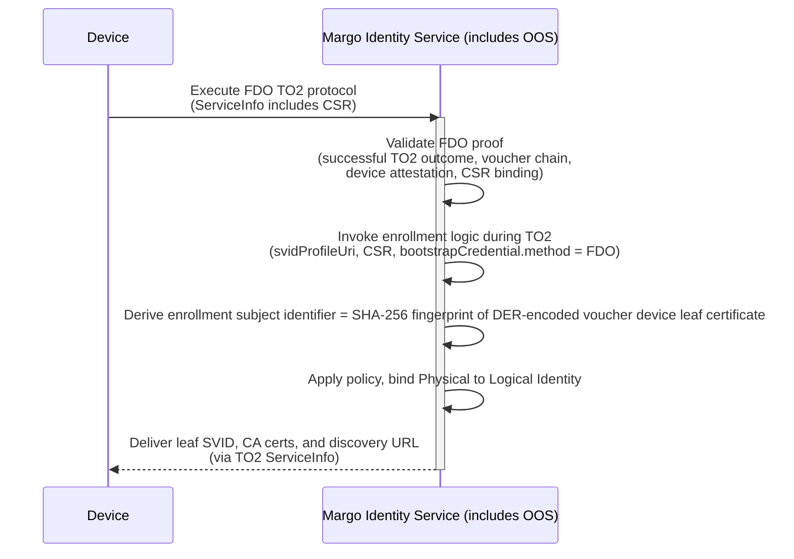

# Specification Update Proposal

## Owner

[@matlec](https://github.com/matlec) (currently deferred — owner to be confirmed at promotion)

## Summary

Defines the FIDO Device Onboard (FDO) bootstrap method for MIAF Edge Compute Device enrollment. FDO enables hardware-rooted, manufacturer-issued onboarding via FDO-issued ownership vouchers and TO0/TO1/TO2 protocols, with an MIS-integrated Owner Onboarding Service (OOS) running the Owner side of FDO on behalf of the MIS. Originally drafted as part of the active MIAF SUP; deferred for PR 2 since baseline interoperability uses Factory Certificate mTLS only. Purely additive on top of the active MIAF SUP — adding this method later does not require breaking changes to the v0 enrollment surface.

This content was originally drafted as part of the active [MIAF SUP](../margo-identity-and-authorization-framework.md) and was deferred when the SUP was split for PR 2. It is preserved here as a single consolidated draft so that it can be promoted to an active SUP independently when FDO-based onboarding becomes a delivery priority.

## Reason for proposal

Many Edge Compute Devices ship with FDO support and an Ownership Voucher in lieu of (or in addition to) a factory X.509 certificate. Standardizing FDO as a MIAF bootstrap method extends device coverage to FDO-equipped fleets without re-provisioning, and gives operators a hardware-rooted, automated transfer-of-ownership path from the manufacturing floor into a Margo Trust Domain.

The FDO Onboarding Service (OOS) integrates cleanly with the existing MIS enrollment endpoint via the `bootstrapCredential.method` URN convention defined by the active MIAF SUP. Successful TO2 with the device — not mere presentation of a voucher — is the bootstrap proof; the Ownership Voucher is consumed internally by the MIS implementation alongside validated TO2 session state.

Because this method is registered through the same `bootstrapCredential.method` URN mechanism used by the active MIAF SUP, adding FDO support later does not require breaking changes to the v0 enrollment surface.

## Requirements alignment acknowledgement

This SUP extends the active MIAF SUP and aligns with Margo's flexibility, supply-chain interoperability, and security goals. Detailed feature linkage and Owner are TBD at promotion.

## Technical proposal

### FIDO Device Onboard (FDO) Method

This method enables **secure, hardware-rooted onboarding** using [FIDO Device Onboard (FDO)](https://fidoalliance.org/specs/FDO/).
It supports automated, authenticated transfer of device ownership from factory to operator, allowing devices to join a Trust Domain without prior configuration or manual provisioning.

#### FDO actor model

The device authenticates to an FDO **Owner Onboarding Service (OOS)**, which acts on behalf of the MIS as the FDO "Owner".
For this profile, the OOS **MUST** be part of the MIS implementation. Implementations **MAY** decompose the MIS internally for scaling or deployment reasons, but this specification does **not** define an interoperable external OOS-to-MIS handoff format; any validated TO2 state is consumed internally within the MIS implementation. This constraint applies throughout this method profile; later subsections reference but do not restate it.

**Bootstrap Method Identifier (URN):**
`urn:margo:bootstrap:fdo:v1`

#### Scope and supported devices (normative)

- This method **MUST** be used only for certificate-backed FDO devices whose `OwnershipVoucher.OVDevCertChain` is non-null (that is, the voucher contains a device certificate chain).
- Devices using Intel EPID attestation without an X.509 device certificate chain are **not supported** by this bootstrap method.
- Conformant production implementations of this profile **MUST NOT** use the FDO Credential Reuse Protocol.

#### Enrollment Subject Identifier (ESI) (normative)

Implementations **MUST** derive the ESI as the **SHA-256 fingerprint of the DER-encoded device leaf certificate**, specifically the first certificate in `OwnershipVoucher.OVDevCertChain`.
The resulting SHA-256 digest **MUST** be encoded as lowercase hexadecimal.

#### `bootstrapCredential` logical representation (normative)

> This section defines the logical FDO inputs consumed within the MIS implementation for this profile (see [FDO actor model](#fdo-actor-model) for the rationale).

| Field | Type | Required | Description |
| :---- | :--- | :------- | :---------- |
| `method` | string | Y | **MUST** be `urn:margo:bootstrap:fdo:v1`. |
| `proof` | object | Y | **MUST** contain `ownershipVoucher`. Successful TO2 completion with the same device **MUST** be established by the OOS within the authenticated TO2 session; this profile does **not** define a separate interoperable field for that state. |
| `proof.ownershipVoucher` | string | Y | Base64url-encoded (no padding) CBOR bytes of the FDO **Ownership Voucher**. The Ownership Voucher is a required input to this method, but it is **not sufficient proof on its own**. |

#### Validation and enrollment binding requirements (normative)

- The MIS **MUST** provide an FDO **Owner Onboarding Service (OOS)** endpoint as part of the MIS implementation for this Trust Domain.
- Devices enrolling via this method **MUST** perform FDO TO2 directly with that OOS endpoint.
- The bootstrap proof for this method is **successful completion of FDO TO2 with the device**. Presentation of an Ownership Voucher without a validated TO2 outcome **MUST NOT** be accepted as sufficient proof.
- The transition from successful TO2 to MIS enrollment is internal to the MIS implementation for this profile (see [FDO actor model](#fdo-actor-model)).
- If TO2 does **not** complete successfully, the MIS **MUST NOT** treat the enrollment as successful and **MUST** discard or invalidate any provisional issuance artifacts created during that attempt.
- During TO2, after the authentication phase completes and before TO2 finishes, the OOS component of the MIS **MUST** invoke the MIS enrollment logic with the CSR and the validated FDO state.
- The OOS **MUST** obtain the CSR from the device over the authenticated TO2 channel and **MUST** ensure that the CSR corresponds to the same device that completed TO2.
- The MIS **MUST** validate that the submitted CSR is well-formed and that its signature verifies (proof of possession).
- The MIS **MUST** validate the Ownership Voucher chain per the FDO specification and Trust Domain policy, including verifying that the voucher is rooted in an authorized manufacturer/OEM trust anchor.
- The MIS **MUST** validate the device certificate chain in `OwnershipVoucher.OVDevCertChain` against Trust Domain policy before deriving or accepting the ESI.
- The MIS **MUST** treat the device leaf certificate contained in the voucher as non-secret and use it only for ESI derivation, authorization, and validation decisions.

#### TO2 ServiceInfo binding (normative)

- The OOS **MUST** use the `fdo.csr` ServiceInfo Module's `simpleenroll-*` exchange to convey the device CSR and return the issued leaf certificate representing the device's X.509 SVID.
- The OOS **MUST** use the `fdo.csr` ServiceInfo Module's `cacerts-*` exchange to return the CA certificates needed to validate the issued SVID chain. These certificates are defined in this profile only for SVID-chain validation; a deployment **MAY** also use them as initial HTTPS trust anchors if the same PKI is used, but this specification does **not** require or assume that.
- The OOS **MUST** use the `margo.discovery` ServiceInfo Module defined below to provide, over the authenticated TO2 channel, the absolute HTTPS URL of the MIAF discovery document for the applicable Trust Domain.

##### `margo.discovery` ServiceInfo Module (normative)

This specification defines the `margo.discovery` ServiceInfo Module for conveying the MIAF discovery URL over the authenticated TO2 channel.
The module uses the following key-value pairs:

- `margo.discovery:active` (`bool`): instructs the device to activate or deactivate the module.
- `margo.discovery:url` (`tstr`): absolute HTTPS URL of the MIAF discovery document.

- Devices and OOS implementations conformant to the `urn:margo:bootstrap:fdo:v1` method **MUST** implement the `margo.discovery` module.
- The `margo.discovery:url` value **MUST** be an absolute `https` URL for the discovery document defined by this specification. The default path convention is `/.well-known/margo`, but deployments **MAY** use another absolute discovery URL that identifies exactly one Trust Domain.
- The OOS **MUST** send exactly one `margo.discovery:url` value for a successful onboarding attempt.
- Future revisions of this module **MAY** define additional `margo.discovery:*` keys. Devices **MUST** ignore unknown keys in this module rather than failing onboarding.
- If the module is unavailable or the URL value is missing or malformed, the onboarding attempt **MUST NOT** be treated as conformant to this profile.

**References (informative):**

- The `fdo.csr` ServiceInfo Module (FSIM) is specified in the FIDO Alliance FDO SIM repository: <https://github.com/fido-alliance/fdo-sim/blob/FSIM_v1.0_20230209/fsim-repository/fdo.csr.md>
- The `margo.discovery` ServiceInfo Module is defined by this specification.

#### Deployment and lifecycle notes (informative)

- For this profile, the OOS is part of the MIS implementation (see [FDO actor model](#fdo-actor-model)).
- How the device discovers the OOS endpoint (for example, via TO0/TO1 rendezvous or RVBypass-style deployment choices allowed by FDO) is outside the scope of this specification.
- The OOS **MUST** send valid replacement credentials during `TO2.SetupDevice`. Whether the operator preserves the resulting Owner2 material and replacement HMAC for future resale or re-provisioning is a deployment decision outside the scope of this specification.
- Operators that do not intend to support FDO resale **SHOULD** securely discard the Owner2 private key and replacement HMAC after successful onboarding.

### Informative Workflow

The following flow expands on the [Enrollment and Identity Issuance Endpoint](../margo-identity-and-authorization-framework.md#enrollment-and-identity-issuance-endpoint) of the active MIAF SUP and illustrates this bootstrap method.
It is **informative only** and does not introduce additional normative requirements.

#### Example: FIDO Device Onboard (MIS-integrated OOS)

> **Alignment with this method profile:**
>
> - `bootstrapCredential.method` = `urn:margo:bootstrap:fdo:v1`.
> - The MIS uses the FDO Ownership Voucher together with validated TO2 session state for the same device; this profile does **not** define a separate interoperable external handoff object, and that state is consumed internally within the MIS implementation.
> - The **Enrollment Subject Identifier (ESI)** is derived from the first certificate in `OwnershipVoucher.OVDevCertChain`.
> - The **Owner Onboarding Service (OOS)** is part of the MIS implementation and acts on behalf of the MIS as the FDO Owner-side management service.

## Alternatives considered (optional)

TBD

## Rejection reason

Not applicable.
