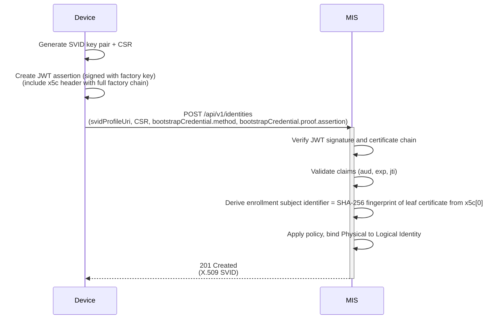
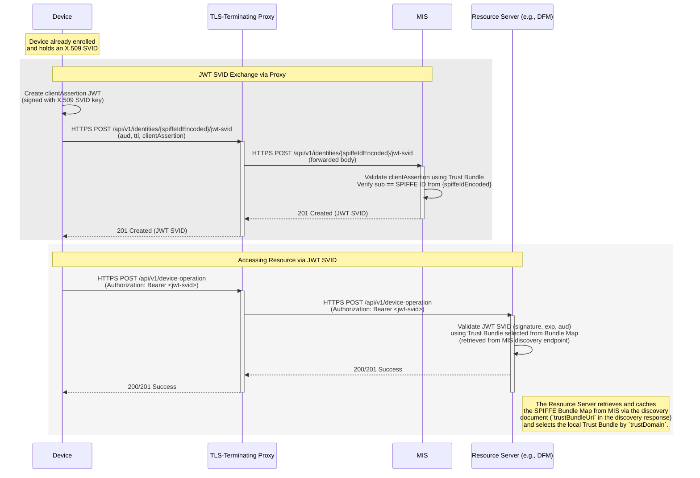

# Specification Update Proposal

## Owner

[@matlec](https://github.com/matlec) (currently deferred — owner to be confirmed at promotion)

## Summary

This SUP introduces support for **MIAF deployments where end-to-end mTLS is not feasible** between Margo components and the **Margo Identity Service (MIS)** or other Resource Servers — typically because TLS-terminating proxies (transparent or explicit) sit on the network path.

Two complementary mechanisms are introduced under a single SUP because deployments with TLS-terminating proxies in the path generally encounter them at both stages of the lifecycle:

1. **JWT-SVID Profile + JWT SVID Exchange Endpoint** — a derived bearer credential format. An already-enrolled holder of an X.509 SVID may exchange it for a short-lived JWT-SVID and present it as `Authorization: Bearer <jwt-svid>` to Resource Servers behind TLS-terminating proxies. Holders **MAY** also use a JWT-SVID to authenticate at the MIS SVID Renewal Endpoint when end-to-end mTLS is not feasible.
2. **Factory Certificate Method (JWT Assertion)** — a bootstrap method that uses a JWT assertion signed with the device's factory private key, suitable for initial enrollment when end-to-end mTLS to the MIS is not feasible.

This content was originally drafted as part of the active [MIAF SUP](../margo-identity-and-authorization-framework.md) and was deferred when the SUP was split for PR 2 (PR 2 deployments use end-to-end mTLS for both enrollment and operations). Both mechanisms are purely additive on top of v0: the JWT-SVID profile registers a new `svidProfileUri`, the Factory JWT Assertion method registers a new `bootstrapCredential.method` URN, and v0 implementations cleanly reject any request fields they do not recognize per the strict-validation rule in [§5 APIs](../margo-identity-and-authorization-framework.md#5-apis).

## Reason for proposal

Some Margo deployments place TLS-terminating infrastructure (e.g., content inspecting proxies) between devices, the MIS, and other Margo Resource Servers. In such environments, end-to-end mTLS is not feasible:

- **At enrollment time** — a factory mTLS handshake to the MIS would be intercepted by a TLS-terminating proxy. A signed Bootstrap Assertion JWT carrying the factory certificate in the JWS `x5c` header provides equivalent assurance under bearer transport: the MIS validates the certificate chain and the JWS signature, then proceeds with the same ESI derivation and binding logic as the mTLS variant of the Factory Certificate method.
- **At operation time** — an X.509-SVID alone is not sufficient for application-layer authentication beyond the TLS-terminating hop. JWT-SVID is the **SPIFFE-defined complement to X.509-SVID** for exactly this situation: it represents the same SPIFFE identity in a token form that survives TLS termination and can be carried in `Authorization: Bearer` headers, while keeping the MIS and Trust Domain as the source of truth for identities.

A deployment that has TLS-terminating proxies on the path typically encounters them at both stages, so both mechanisms are introduced together in this SUP.

## Requirements alignment acknowledgement

This SUP **extends** the active [MIAF SUP](../margo-identity-and-authorization-framework.md). It introduces no new identity primitives beyond the SPIFFE JWT-SVID adopted by reference, and reuses MIAF's Trust Domain, MIS, Trust Bundle, discovery, cryptographic-requirement, and bootstrap-contract primitives. Detailed Owner / feature linkage (including epic mapping and product-management requirements) is **TBD-at-promotion**: when this deferred SUP is promoted to an active SUP, the owner will confirm the relevant Margo features and epics and replace this acknowledgement with a concrete list of links and out-of-scope statements aligned with the SUP template.

## Technical proposal

### Terminology

This SUP introduces one new term in addition to the [Terminology defined by the active MIAF SUP](../margo-identity-and-authorization-framework.md#2-terminology).

#### JWT SVID Exchange <!-- omit from toc -->

An API by which a holder of a valid **X.509 SVID** requests a short-lived **JWT SVID** for use behind TLS-terminating infrastructure. The request uses a **Client Authentication Assertion** signed with the SVID's private key. See [§3 JWT SVID Exchange Endpoint](#3-jwt-svid-exchange-endpoint).

### Common Requirements for Signed-Assertion Methods

This SUP introduces signed-assertion JWTs in two contexts: the **Bootstrap Assertion** consumed at the enrollment endpoint (see [Appendix A](#appendix-a-factory-certificate-method-jwt-assertion-normative)) and the **Client Authentication Assertion** consumed at the JWT SVID exchange endpoint (see [§3](#3-jwt-svid-exchange-endpoint)). Unless a specific method states stricter requirements, the MIS **MUST** enforce the following baseline on every signed assertion accepted at any MIAF endpoint:

1. **Freshness and replay protection.** The assertion **MUST** include `iat` and `exp` claims with `exp - iat <= 300 seconds`. The assertion **MUST** include a unique `jti`; the MIS **MUST** reject replays of a previously seen `jti`.
2. **Audience binding.** Where the assertion is a JWT/JWS, `aud` **MUST** equal the exact URL of the endpoint at which it is presented.

Per-method tables in this SUP profile these requirements for their specific actor model and endpoint.

### 1. JWT-SVID Profile

This SUP adopts the
[SPIFFE JWT-SVID specification](https://github.com/spiffe/spiffe/blob/main/standards/JWT-SVID.md) by reference.
The following requirements are the **MIAF-specific constraints** that apply in addition to the base specification.

> **Informative summary:**
> A JWT-SVID carries the SPIFFE ID in its `sub` claim and is validated using JWT signing keys from the Trust Bundle for the subject's Trust Domain.

| Field | Requirement | Source | Notes |
| :---- | :--------- | :----- | :----- |
| **`sub` (Subject Claim)** | MUST contain the SPIFFE ID. | SPIFFE JWT-SVID | Authoritative identity binding. |
| **`aud` (Audience Claim)** | MUST be present. | SPIFFE JWT-SVID | Specifies the intended verifier(s). |
| **Signature Algorithm** | MUST follow [Cryptographic Requirements](../margo-identity-and-authorization-framework.md#cryptographic-requirements). | **MIAF** | SPIFFE allows a broader set of algorithms. |

Validation (per SPIFFE JWT-SVID):

- JWT-SVIDs are verified using **public keys** distributed via the **Trust Bundle**.
- Audience, expiry, and signature validation are mandatory.
- Validators **MUST NOT** accept JWT-SVIDs whose `exp` is in the past.

JWT-SVIDs **SHOULD** use lifetimes on the order of minutes. Revocation of individual JWT-SVIDs is **out of scope** of this SUP; containment relies on this short lifetime.

When used with HTTP APIs defined by the active MIAF SUP or by this SUP, a JWT SVID **MUST** be presented to the server using the `Authorization: Bearer <jwt-svid>` header.

### 2. Profile-Specific Exchange Behavior

Devices that already hold a valid X.509 SVID **MAY** obtain a short-lived **JWT SVID** for use behind TLS-terminating infrastructure via the **JWT SVID Exchange Endpoint** defined in [§3](#3-jwt-svid-exchange-endpoint) below. The following apply:

- The exchange **MUST** authenticate the device with **proof of possession** of the private key corresponding to the device's current **LDI**, using either:
  - **Mutual TLS** with the current X.509 SVID as the TLS client certificate, or
  - a **Client Authentication Assertion** JWT signed with the current LDI private key.
- JWT SVIDs **MUST** be short-lived and use algorithms permitted by [Cryptographic Requirements](../margo-identity-and-authorization-framework.md#cryptographic-requirements).
- This mechanism **MUST NOT** be used for initial enrollment (see the [**Bootstrap Assertion**](#appendix-a-factory-certificate-method-jwt-assertion-normative) for the factory-key JWT method).

### 3. JWT SVID Exchange Endpoint

This endpoint allows a component that already holds a valid X.509 SVID to request a **short-lived JWT SVID** representing the same identity.

It is intended for environments where end-to-end mTLS is not feasible (for example, in the presence of TLS-terminating proxies), while still using the MIS and Trust Domain as the source of truth for identities.

> **Note:**
> This endpoint intentionally does **not** accept JWT SVID bearer authentication. It is the mechanism for obtaining a JWT SVID from proof bound to the caller's existing X.509 SVID, either by mTLS or by a client assertion signed with the X.509 SVID private key.

| Item | Value |
| :--- | :---- |
| **Endpoint** | `POST /api/v1/identities/{spiffeIdEncoded}/jwt-svid` |
| **Authentication** | The client **MUST** authenticate using one of the following mechanisms:<br>- **Mutual TLS** - Present its current X.509 SVID as the TLS client certificate. MIS **MUST** verify that the SPIFFE ID in the URI SAN matches `{spiffeIdEncoded}`.<br>- **Client Assertion JWT** - Include a `clientAssertion` JWT in the request body (see below), signed with the private key corresponding to the current X.509 SVID. MIS **MUST** validate the signature and verify that the `sub` claim matches `{spiffeIdEncoded}`.<br>For this endpoint, MIS **MUST NOT** accept authentication using a JWT SVID in `Authorization: Bearer ...`.<br>`{spiffeIdEncoded}` **MUST** be computed as defined in the [Common URI and Encoding Rules](../margo-identity-and-authorization-framework.md#common-uri-and-encoding-rules). |
| **Headers** | `Content-Type: application/json` |
| **Body schema (request)** | See below |
| **Body schema (response)** | See below |
| **Responses** | `201 Created` on success<br>`400`, `401`, `422`, `429` - RFC 9457 errors |
| **Errors** | RFC 9457 Problem Details as per [Appendix B](../margo-identity-and-authorization-framework.md#appendix-b-error-responses-normative) |

**Client Assertion JWT (Normative Definition)**
A `clientAssertion` JWT used for this endpoint **MUST** conform to the following claims and constraints:

| Claim | Requirement |
| :---- | :---------- |
| `iss`, `sub` | **MUST** be identical and equal to the client's SPIFFE ID. |
| `aud` | **MUST** equal the exact URL of the JWT SVID exchange endpoint. |
| `exp` | **MUST NOT** exceed five (5) minutes after issuance. |
| `jti` | **MUST** be unique for each assertion. |

The JWS header **MUST** include `x5c` containing the complete X.509 SVID chain corresponding to the signing key, with the leaf SVID as the first entry, per [RFC 7517 §4.7](https://datatracker.ietf.org/doc/html/rfc7517#section-4.7) and the chain-delivery requirement in the [X.509 SVID Profile](../margo-identity-and-authorization-framework.md#x509-svid-profile). The JWT **MUST** be digitally signed using the private key associated with that leaf SVID. The MIS **MUST** validate the `x5c` chain against the Trust Bundle for the client's Trust Domain, and **MUST** verify the JWS signature using the public key of `x5c[0]`. The JWS `alg` **MUST** comply with [Cryptographic Requirements](../margo-identity-and-authorization-framework.md#cryptographic-requirements) and **MUST** match the key type in the SVID at `x5c[0]`.

> **Warning:** Do not confuse this **Client Authentication Assertion** with the **Bootstrap Assertion** used in the `factory-cert-jwt` bootstrap method:
>
> - **Bootstrap Assertion:** Signed by the **factory private key** corresponding to the device's pre-provisioned client certificate. Used only once during initial enrollment.
> - **Client Authentication Assertion:** Signed by the active **identity private key** (LDI). Used repeatedly to exchange an existing X.509 SVID for a fresh JWT SVID.

**Request body schema (`application/json`):**

| Field | Type | Required | Description |
| :---- | :--- | :------- | :---------- |
| `aud` | array of string | Y | Audience identifiers to include in the JWT SVID `aud` claim. |
| `ttl` | integer (seconds) | N | Requested lifetime in seconds (capped by MIS policy). |
| `clientAssertion` | string | N | Optional JWT for client authentication when mTLS is not used. If present, it **MUST** meet the requirements defined above. |

> **Note:**
> The `clientAssertion` JWT used in this endpoint is a **Client Authentication Assertion** signed with the private key corresponding to an existing X.509 SVID.
> It is distinct from the **Bootstrap Assertion** defined in the `factory-cert-jwt` bootstrap method (see [Appendix A: Factory Certificate Method (JWT Assertion)](#appendix-a-factory-certificate-method-jwt-assertion-normative)), which is signed with the device's factory key during initial enrollment.

**Response body schema (`201 Created`, `application/json`):**

| Field | Type | Required | Description |
| :---- | :--- | :------- | :---------- |
| `jwt` | string | Y | The compact JWT SVID string, as defined by the [JWT-SVID Profile](#1-jwt-svid-profile). Its `sub` claim **MUST** equal the SPIFFE ID identified by `{spiffeIdEncoded}`. |
| `expiresAt` | string (ISO 8601) | N | UTC timestamp when the JWT SVID expires. If omitted, clients **MUST** derive expiry from the token's `exp` claim. |

**Validation (normative):**

- If `clientAssertion` is used, its `x5c` chain **MUST** validate to the Trust Domain's **Trust Bundle** root anchors per the [X.509 SVID Profile](../margo-identity-and-authorization-framework.md#x509-svid-profile), and the JWS signature **MUST** verify against the public key of `x5c[0]`.
- The MIS **MUST** ensure the JWT SVID's `sub` claim equals the SPIFFE ID encoded in `{spiffeIdEncoded}`.
- The MIS **MUST** include the requested audiences (possibly filtered or restricted by policy) in the `aud` claim.
- JWT SVID lifetime **MUST** comply with the [JWT-SVID Profile](#1-jwt-svid-profile) and **MUST** respect [Cryptographic Requirements](../margo-identity-and-authorization-framework.md#cryptographic-requirements) for signature algorithms.
- The MIS **SHOULD** limit the issued JWT SVID's lifetime to **no more than one hour** by default, unless a shorter or longer duration is explicitly authorized by Trust-Domain policy.

> **Relationship to MIAF (informative):**
> This endpoint is a *profile-specific realization* of the JWT SVID Profile for identities that already hold an X.509 SVID. It allows a long-lived X.509 SVID representing an already-enrolled identity (for example, a device Logical Device Identity) to be *exchanged* for a short-lived JWT SVID suitable for bearer-style authentication in non-mTLS environments. Other identity profiles may use direct issuance of JWT SVIDs via the enrollment endpoint instead of this exchange pattern (see [§5 Profile-Specific Enrollment Payload Formats](#5-profile-specific-enrollment-payload-formats)).

#### Example: JWT SVID Exchange <!-- omit from toc -->

**Example request (using client assertion JWT):**

```http
POST /api/v1/identities/c3BpZmZlOi8vbm9ydGhzdGFyLWlkYS5jb20vbWFyZ28vZGV2aWNlLzEyM2U0NTY3LWU4OWItMTJkMy1hNDU2LTQyNjYxNDE3NDAwMA/jwt-svid
Content-Type: application/json
```

```jsonc
{
  "aud": [
    "https://dfm.northstar-ida.com/",
    "https://observability.example.com/"
  ],
  "ttl": 300,
  "clientAssertion": "eyJhbGciOiJFUzI1NiIsInR5cCI6IkpXVCIsInR5cGUiOiJzcGlmZmUranV3dCJ9.eyJpc3MiOiJzcGlmZmU6Ly9ub3J0aHN0YXItaWRhLmNvbS9tYXJnby9kZXZpY2UvMTIzZTQ1NjctZTg5Yi0xMmQzLWE0NTYtNDI2NjE0MTc0MDAwIiwic3ViIjoic3BpZmZlOi8vbm9ydGhzdGFyLWlkYS5jb20vbWFyZ28vZGV2aWNlLzEyM2U0NTY3LWU4OWItMTJkMy1hNDU2LTQyNjYxNDE3NDAwMCIsImF1ZCI6WyJodHRwczovL21pcy5ub3J0aHN0YXItaWRhLmNvbS9hcGkvdjEvaWRlbnRpdGllcy9jM0JwWm1abE9pOHZibTl0YzJWeS9qd3Qtc3ZpZCIsImh0dHBzOi8vbWlzLm5vcnRoc3Rhci1pZGEuY29tLyJdLCJleHAiOjE3MzAyMTQ3MDAsImlhdCI6MTczMDIxNDYwMCwianRpIjoiNjk4MWNkMWUtZGI2YS00MmE1LTk1NDgtNzQ3NWIxMGY2MWNkIn0.<signature-truncated>"
}
```

**Example response (`201 Created`):**

```jsonc
{
  "jwt": "eyJhbGciOiJFUzI1NiIsInR5cCI6IkpXVCIsInR5cGUiOiJzcGlmZmUranV3dCJ9.eyJzdWIiOiJzcGlmZmU6Ly9ub3J0aHN0YXItaWRhLmNvbS9tYXJnby9kZXZpY2UvMTIzZTQ1NjctZTg5Yi0xMmQzLWE0NTYtNDI2NjE0MTc0MDAwIiwiYXVkIjpbImh0dHBzOi8vZGZtLm5vcnRoc3Rhci1pZGEuY29tLyIsImh0dHBzOi8vb2JzZXJ2YWJpbGl0eS5leGFtcGxlLmNvbS8iXSwiZXhwIjoxNzMwMjE0NzAwLCJpYXQiOjE3MzAyMTQ2MDAsImlzcyI6Imh0dHBzOi8vbWlzLm5vcnRoc3Rhci1pZGEuY29tLyJ9.hM8Z...-truncated",
  "expiresAt": "2025-10-25T14:12:31Z"
}
```

> **Informative:**
> In this example, the device cannot use mTLS towards the MIS but has access to its X.509 SVID private key. It signs a short-lived `clientAssertion` JWT that identifies its SPIFFE ID and the JWT SVID exchange endpoint as audience. MIS validates the assertion and issues a short-lived JWT SVID whose `sub` is the device's SPIFFE ID and whose `aud` matches the requested audiences, subject to policy.

### 4. Profile-Specific Renewal Authentication

The active MIAF SUP defines the [SVID Renewal Endpoint](../margo-identity-and-authorization-framework.md#svid-renewal-endpoint) which accepts only mutual TLS authentication using the current X.509 SVID. When this SUP is promoted, the SVID Renewal Endpoint authentication is extended to also accept a JWT SVID as an HTTP Bearer token. The full set of accepted authentication mechanisms becomes:

- **Mutual TLS:** The client **MUST** present its current X.509 SVID as the TLS client certificate. The MIS **MUST** extract the SPIFFE ID from the URI SAN and verify that it matches `{spiffeIdEncoded}`. (Defined by the active MIAF SUP.)
- **JWT SVID (Bearer):** The client **MUST** present a valid JWT SVID using `Authorization: Bearer <jwt-svid>`. The MIS **MUST** validate the JWT SVID according to the [JWT-SVID Profile](#1-jwt-svid-profile), and **MUST** verify that the `sub` claim's SPIFFE ID matches `{spiffeIdEncoded}`.

> **Note:**
> The SVID Renewal Endpoint **MAY** accept JWT SVID bearer authentication because the caller is already presenting an issued identity and requesting refreshed credentials for that same SPIFFE ID. The [JWT SVID Exchange Endpoint](#3-jwt-svid-exchange-endpoint) intentionally does **not** accept JWT SVID bearer authentication because it is the mechanism used to obtain a JWT SVID from proof tied to an existing X.509 SVID.

#### Renewal semantics by identity profile <!-- omit from toc -->

JWT SVID renewal behavior depends on the applicable **identity profile under MIAF**:

- For the **Edge Compute Device Identity Profile** defined in the active MIAF SUP, JWT SVIDs are **derived credentials** obtained from an X.509 SVID. They are short-lived and **MUST NOT** be renewed via the SVID Renewal Endpoint. Devices requiring a fresh JWT SVID **MUST** use the [JWT SVID Exchange Endpoint](#3-jwt-svid-exchange-endpoint).
- For other (future) identity profiles that directly issue JWT SVIDs through `POST /api/v1/identities` (see [§5 Profile-Specific Enrollment Payload Formats](#5-profile-specific-enrollment-payload-formats)), renewal semantics **MAY** be defined in those profiles.

### 5. Profile-Specific Enrollment Payload Formats

This section defines the JWT-SVID profile payload formats for the [Enrollment and Identity Issuance Endpoint](../margo-identity-and-authorization-framework.md#enrollment-and-identity-issuance-endpoint).

These formats apply to **future identity profiles** that directly issue JWT-SVIDs at enrollment time. The Edge Compute Device Identity Profile defined in the active MIAF SUP **MUST NOT** use the JWT-SVID profile at the enrollment endpoint; device-issued JWT-SVIDs are obtained via exchange (see [§3 JWT SVID Exchange Endpoint](#3-jwt-svid-exchange-endpoint)). MIS **MUST** reject device enrollment requests that specify the JWT-SVID profile with `422` and the `unsupported-svid-profile` error type.

#### JWT-SVID profile payloads <!-- omit from toc -->

When `svidProfileUri = "https://margo.org/profiles/spiffe/jwt-svid/v1"`, the `svidRequest` and `svid` objects **MUST** conform to the structures below.

**`svidRequest` (request):**

```json
{
  "aud": ["<audience-uri>"],
  "ttl": 3600
}
```

| Field | Type | Required | Description |
| :---- | :--- | :------- | :---------- |
| `aud` | array of string | Y | Audience identifiers to include in the JWT SVID `aud` claim. |
| `ttl` | integer (seconds) | N | Requested lifetime in seconds (capped by MIS policy). |

**`svid` (response):**

```json
{
  "jwt": "<compact JWT-SVID>",
  "expiresAt": "<ISO 8601 timestamp>"
}
```

| Field | Type | Required | Description |
| :---- | :--- | :------- | :---------- |
| `jwt` | string | Y | The compact JWT SVID string, as defined by the [JWT-SVID Profile](#1-jwt-svid-profile). Its `sub` claim **MUST** equal the SPIFFE ID assigned to the issued identity. |
| `expiresAt` | string (ISO 8601) | N | UTC timestamp when the JWT SVID expires. If omitted, clients **MUST** derive expiry from the token's `exp` claim. |

When used with HTTP APIs defined by the active MIAF SUP or by this SUP, a JWT SVID **MUST** be presented to the server using the `Authorization: Bearer <jwt-svid>` header.

### 6. Workflows (informative)

The following flows are **informative only** and do not introduce additional normative requirements. They expand on the [Enrollment and Identity Issuance Endpoint](../margo-identity-and-authorization-framework.md#enrollment-and-identity-issuance-endpoint) and the JWT SVID Exchange Endpoint defined above to illustrate end-to-end behavior in TLS-terminating-proxy environments.

#### Example: Factory Certificate Method (JWT Assertion) <!-- omit from toc -->



> **Alignment with [Appendix A: Factory Certificate Method (JWT Assertion)](#appendix-a-factory-certificate-method-jwt-assertion-normative):**
>
> - `bootstrapCredential.method` = `urn:margo:bootstrap:factory-cert-jwt:v1`.
> - `bootstrapCredential.proof.assertion` is a compact JWT signed with the factory private key.
> - The **Enrollment Subject Identifier (ESI)** is the **SHA-256 fingerprint** of the DER-encoded **leaf** certificate in `x5c[0]`.

#### JWT SVID Usage in Proxy Scenarios <!-- omit from toc -->

This flow shows how an Edge Compute Device that holds a valid **X.509 SVID** can obtain and use a **JWT SVID** when **end-to-end mTLS is not feasible** because a TLS-terminating proxy sits between the device and other Margo components.

> **Assumptions:**
>
> - A **TLS-terminating proxy** (transparent or explicit) is present on the network path between the device and both the **Margo Identity Service (MIS)** and the **Resource Server** (for example, a DFM).
> - The proxy terminates TLS from the device and opens a separate TLS connection to the MIS / Resource Server. As a result, **end-to-end mTLS** between the device and these services is not possible.
> - The device *does* have access to the private key corresponding to its X.509 SVID, allowing it to authenticate to MIS using a **client assertion JWT** at the `/jwt-svid` endpoint.



The `clientAssertion` used at the exchange endpoint **MUST** use an algorithm permitted by the [Cryptographic Requirements](../margo-identity-and-authorization-framework.md#cryptographic-requirements) and the key associated with the active X.509 SVID. The Resource Server **MUST** validate the JWT SVID's `aud`, `exp`, and signature using the Trust Bundle for the Trust Domain.

> **Informative:**
> In this pattern, the proxy is *identity-transparent*: it terminates TLS but forwards the application-layer request and the `Authorization: Bearer <jwt-svid>` header unchanged. MIAF does not require the proxy to understand SPIFFE or SVIDs. It only requires that the **Resource Server** and **MIS** validate SVIDs using the Trust Bundle and the rules defined in this SUP and the active MIAF SUP.

## Appendix A: Factory Certificate Method (JWT Assertion) (Normative)

This method enables **application-layer onboarding** using a **JWT assertion signed with the factory private key**, suitable when **end-to-end mTLS is not feasible** (for example, due to TLS-terminating proxies).

### Factory JWT actor model <!-- omit from toc -->

This is a **direct** bootstrap method.
The device authenticates directly to the MIS by presenting a signed Bootstrap Assertion JWT in the enrollment request.

**Bootstrap Method Identifier (URN):**
`urn:margo:bootstrap:factory-cert-jwt:v1`

**Enrollment Subject Identifier (ESI):**
Implementations **MUST** derive the ESI as the **SHA-256 fingerprint of the DER-encoded leaf certificate** contained in the JWT `x5c` header (`x5c[0]`).

> **Operational note (informative):**
> Manufacturer-driven rotation of the factory leaf certificate in `x5c[0]` changes the derived ESI. If the deployment wants the device to continue using the same LDI after such a rotation, it must be handled as replacement / rebinding under policy rather than as ordinary re-enrollment matching by the previous ESI.

**`bootstrapCredential` object schema (`application/json`):**

| Field | Type | Required | Description |
| :---- | :--- | :------- | :---------- |
| `method` | string | Y | **MUST** be `urn:margo:bootstrap:factory-cert-jwt:v1`. |
| `proof` | object | Y | **MUST** contain `assertion`. |
| `proof.assertion` | string | Y | Compact **JWT** per [RFC 7519](https://datatracker.ietf.org/doc/html/rfc7519), signed with the factory private key. The signing algorithm **MUST** conform to [Cryptographic Requirements](../margo-identity-and-authorization-framework.md#cryptographic-requirements). The JWS header **MUST** include `x5c` with the full certificate chain ([RFC 7517 §4.7](https://datatracker.ietf.org/doc/html/rfc7517#section-4.7)). |

### Factory JWT validation requirements (normative) <!-- omit from toc -->

- The Bootstrap Assertion JWT authenticates the enrollment request only; the MIS HTTPS server **MUST** be authenticated separately per [Initial Trust Bootstrap](../margo-identity-and-authorization-framework.md#initial-trust-bootstrap).
- The MIS **MUST** validate the Bootstrap Assertion signature, certificate chain, and required claims before deriving or accepting the ESI.
- The MIS **MUST** validate the full `x5c` chain against Trust Domain policy.
- The Bootstrap Assertion defined in this method is for **initial enrollment only**.

### Factory Bootstrap Assertion JWT Structure <!-- omit from toc -->

- The assertion **MUST** be a JWT ([RFC 7519](https://datatracker.ietf.org/doc/html/rfc7519)) using **JWS Compact Serialization** (RFC 7515 §3.1).
- The signature **MUST** use `ES256` (ECDSA P-256) or `PS256` (RSA-PSS 3072), per [Cryptographic Requirements](../margo-identity-and-authorization-framework.md#cryptographic-requirements).
- The JWS header **MUST** include `x5c` with the **complete** manufacturer chain; `x5c[0]` **MUST** be the device's factory leaf certificate.

**Header fields:**

| Header Parameter | Required | Description |
| :--------------- | :------- | :----------- |
| `alg` | Y | **MUST** match the key type of the factory certificate (`ES256` for ECDSA P-256 or `PS256` for RSA-PSS 3072). Algorithms **MUST** conform to [Cryptographic Algorithm Requirements](../margo-identity-and-authorization-framework.md#cryptographic-requirements). |
| `x5c` | Y | **MUST** contain the complete certificate chain, with the factory leaf certificate as the first entry, per [RFC 7517 §4.7](https://datatracker.ietf.org/doc/html/rfc7517#section-4.7). |

**Payload claims:**

| Claim | Required | Description |
| :---- | :------- | :---------- |
| `iss` | Y | **MUST** be `urn:margo:device:sha256:<lowercase-hex-fingerprint>` of `x5c[0]`. This claim is provided for log correlation and diagnostics; the authoritative cryptographic binding comes from the validated `x5c` chain. **Policy MUST NOT** be based on this value. |
| `sub` | Y | **MUST** equal `iss`. |
| `aud` | Y | **MUST** equal the full URL of the MIS enrollment endpoint. |
| `iat` | Y | Issued-at timestamp (seconds since UNIX epoch). |
| `nbf` | N | Optional "not before"; MIS **MUST** reject assertions not yet valid |
| `exp` | Y | Expiration; **MUST** be <= 5 minutes after `iat`. |
| `jti` | Y | Unique token ID; MIS **MUST** reject replays of the same `jti` |

**Process Summary (informative):**

1. Device generates SVID key pair and CSR.
2. Device creates a Bootstrap Assertion JWT signed with its factory key and embeds the full factory chain in `x5c`.
3. Device calls `POST /api/v1/identities` with CSR and `bootstrapCredential`.
4. MIS validates signature and manufacturer chain, enforces claims (`aud`, `exp`, `jti`), and verifies manufacturer authorization.
5. MIS derives **ESI = SHA-256 fingerprint of x5c[0]**, applies policy, and issues an **X.509 SVID (LDI)**.

> **Example (truncated):**
>
> ```text
> eyJhbGciOiJQUzI1NiIsIng1YyI6WyJNSUl...Il19.
> eyJpc3MiOiJ1cm46bWFyZ286ZGV2aWNlOnNoYTI1NjphYmNkZWY...IiwiYXVkIjoiaHR0cHM6Ly9taXMuZXhhbXBsZS5jb20vYXBpL3YxL2lkZW50aXRpZXMiLCJleHAiOjE2Nzc2MTE4MDEsImp0aSI6IjBhMDFiMzI1In0.
> SflKxwRJSMeKKF2QT4fwpMeJf36POk6yJV_adQssw5c...
> ```

## Alternatives considered (optional)

TBD

## Rejection reason

Not applicable.
