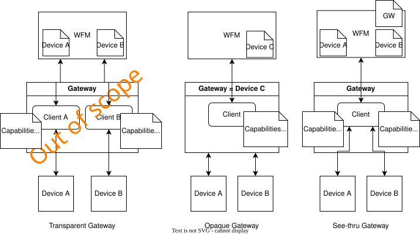
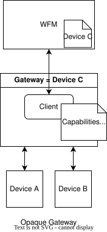
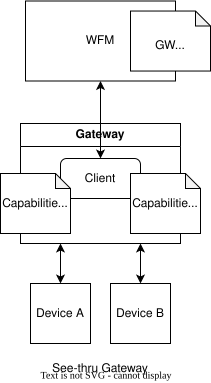

# Specification Update Proposal

## Owner

Merrill Harriman, Julien Duquesnay

## Summary

We propose to enhance the Workload Fleet Manager to device interface to allow a client - a gateway service for example - to provide device capabilities, retrieve desired states, etc. on behalf of one or multiple target devices. 

The idea is to augment the Workload Fleet Manager interface to enable the connection of a "gateway service", while the communication between the "gateway service" and the target devices stays out of the scope of Margo (it could be a proprietary communication).

Additional services required by Margo to be provided by the device, e.g. OTEL collector, are not in the scope of this SUP.

We envision three types of gateway service:

* **Transparent gateway** - The WFM sees the devices behind the gateway as directly connected to it, the Margo client is moved from the device to the gateway. This is out of scope of the SUP as it does not require changes to the Margo API or the Margo artifacts as currently defined.
* **Opaque gateway** - the WFM sees the gateway as a single device with the combined capabilities of the devices behind the gateway. It is not aware of the devices behind the gateway. This is in the scope of this SUP.
* **See-thru gateway** - the WFM is aware of the devices and the gateway, it communicates with the devices via the gateway. This is in the scope of the gateway.



While the opaque gateway and see-thru gateway are quite different we believe the changes to the API and artifacts needed to enable them will be similar and propose to manage them in this SUP. If we find a strong divergence we can split the work into two SUP.

## Reason for proposal

These enhancements will allow devices that can host Margo applications but do not implement the Margo interface to be managed by a Margo compliant WFM, and thus decrease the barrier to entry for the device vendors. 

They could also allow managing devices that required a higher level of network isolation - no direct connection with the outside world for example.

These enhancements may also prepare the way for supporting constrained devices.

## Requirements alignment acknowledgement

This SUP is related to the following technical features:

- https://github.com/margo/specification/issues/99
- https://github.com/margo/specification/issues/101

It is not intended to be part of PR1 as it introduces new functionalities. We expect that the changes it will introduce will be localized and will not challenge what has already been defined.

## Technical proposal

> The SUP's technical details. There must be enough technical details that someone can take the information in this section and implement it on their own.
> 
> Complete as part of Phase 3: SUP Technical Development

A Margo Gateway allows a Margo Workload Fleet Manager (WFM) to connect and deploy workloads to non-margo devices. It translates the Margo WFM's interfaces to the non-margo devices' interfaces.

A gateway and a compound device share concerns to manage sub-device and the proposed solution could work for both. We define a compound device as a device made of several independent sub-devices, e.g, 

* a device with two independent CPU (an Arm A core and an Arm M core for example) each with their own OS and memory.
* a modular or rack based device which can be extended with compute modules.

In terms of deployments, a gateway could have three modes of operation: 

* **autonomous** where the gateway decides on its own which sub-devices to use for the deployments provided by the WFM.
* **directed** where the WFM dictates the sub-device to use for each deployment.
* **mixed** where the WFM dictates the placement of some deployments and let the gateway decide the placement of the other deployments. 

An **opaque** gateway is a gateway that does not provide visibility on the sub-devices it manages, it simply provide the sum of the capabilities of the sub-devices to the WFM. It can only support the autonomous mode of operation.

A **see-thru** gateway ia gateway that provides visibility on the sub-devices it manages, providing the capabilities of each sub-devices to he WFM. It could support all three types of modes of operation.




In both cases, opaque or see-thru, the gateway is responsible for onboarding and verifying the identity of the sub-devices it manages.

The gateway interfaces with the WFM with 4 APIs:

* when **Onboarding** with the WFM
* when providing its **Capabilities**
* when retrieving its **Desired state** and deployments
* when providing **Deployment status**


### Onboarding

The gateway provides its own identity to the WFM.

No changes needed to the current definition of the onboarding API.


### Capabilities

#### Opaque gateway

No change necessary to the defined API. The gateway will simply reports the sum of the capabilities of all its sub-devices.

As a consequence, some deployments that may appear as acceptable from the combined capabilities may not work because the resources they require are spread among multiple sub-devices.

*Example:* An opaque gateway has two "standalone device" sub-devices. Each sub-device has an ARM64 processor with 2 cores and 5 GB of memory. The gateway will report capabilities of 4 cores and 10 GB of memory and a role of "Standalone Device". If the WFM wants to deploy an application requiring 2 cores and 6 GB of memory, it will look possible based on the capabilities reported but will fails because the gateway does not have a sub-device with 2 cores and 6 GB of memory available.

*Example:* An opaque gateway has two sub-device. One is the equivalent to "Standalone Cluster" sub-device (supporting helm) and the other one is the equivalent to a "Standalone Device" (supporting compose). The Gateway will report both roles, Standalone Cluster and Standalone Device, in its capability payload. 

#### See-thru gateway

For the WFM to be able to assign deployment to specific sub-devices it must be made aware of all the available sub-devices and their capabilities (including roles to know if they can deploy compose file or helm chart, and resources).

We assign an id to each sub-device to differentiate them. This id should be assigned by the Device Management, but it could be assigned by the gateway.

We propose the following script for the reporting of the sub-devices and their capabilities by the gateway to the WFM:

1. The gateway reports its own capabilities, indicating it is a gateway by using the new `Gateway` value in the roles attribute.
   
   ```json
   {
        "apiVersion": "device.margo.org/v1alpha1",
        "kind": "DeviceCapabilitiesManifest",
        "properties": {
            "id": "gateway01",
            "vendor": "Northstar Industrial devices",
            "modelNumber": "332ANZE1-N1",
            "serialNumber": "PF45343-AA",
            "roles": ["Gateway"],
        }
   }
   ```

   If the gateway has a single role, "Gateway", then the `resources` array of the `Properties` section can be omitted.  
   If the gateway has additional roles (e.g. Standalone Cluster, Standalone Device, or Cluster Leader) it will add them to the `roles` array and will need to provide the resources available for those roles as well in the `resources` array.

2. The gateway reports the capabilities of all its sub-devices, one at a time. The `properties.id` attribute provides the id of the sub-device and is built as a path to indicate the hierarchy: `{gateway-device-id}/{sub-device-id}`.

   ```json
   {
       "apiVersion": "device.margo.org/v1alpha1",
       "kind": "DeviceCapabilitiesManifest",
       "properties": {
            "id": "gateway01/dev01",
            "vendor": "ACME Devices",
            "ModelNumber": "11AD01",
            "SerialNumber": "11AD012026010001",
            "roles": [
                "Standalone Device"
            ],
            "resources": {
                ...
            }
       }
   }
   ```

The request body structure does not change, but some small changes are needed for some of the `Properties` attributes:

| Field | Type | Required? | Description |
| --- | --- | :---: | --- | 
| id | string | Y | **Unique deviceID assigned to the device via the Device Owner. In case of a device behind a gateway, it takes the form of a path with the id of the parent gateway and the id of the device, i.e., "{gateway-device-id}/{sub-device-id}".** |
| vendor | string | Y | Defines the device vendor. |
| modelNumber | string | Y | Defines the model number of the device. |
| serialNumber | string | Y | Defines the serial number of the device. |
| roles | []string | Y | **Element that defines the device role it can provide to the Margo environment. MUST be one of the following: Standalone Cluster, Cluster Leader, Standalone Device, or Gateway** |
| resources | []Resource | **N** | **Element that defines the device's resources available to the application deployed on the device. See the Resource Fields section below.<br> The element is required if the device has any of the following roles: Standalone Cluster, Cluster Leader, Standalone Device** |

To enable the gateway to inform the WFM that a aub-device is not managed by the gateway we propose to add the DELETE method to the endpoint (keeping the same route).

```
DELETE /api/v1/clients/{clientId}/capabilities
```

The minimum payload required is 

```json
{
    "apiVersion": "device.margo.org/v1alpha1",
    "kind": "DeviceCapabilitiesManifest",
    "properties": {
        "id": "{gateway-device-id/sub-device-id}"
    }
}
```

### Desired state

For the **autonomous** operating mode, since the gateway decides where to place the deployments without special guidance by the WFM, there is no need to change to the desired state payload.

For the **directed** and **mixed** operating modes the WFM needs to associate a deployment with a specific sub-device.

We propose to do that by adding a new optional attribute to the `ApplicationDeployment` yaml: `subDeviceId`.

New `deploymentProfile` attribute:

| Attribute	| Type | Required? | Description |
| :--- | :--- | :--- | :--- |
| `subDeviceId` | string | N | the sub-device id to which the deployment is assigned if gateway. |

```yaml
apiVersion: application.margo.org/v1alpha1
kind: ApplicationDeployment
metadata:
  annotations:
    id: 
    applicationId: 
  name: 
  namespace: 
  subDeviceId:
spec:
    deploymentProfile:
        type: 
        components:
            - name: 
              properties:
    parameters:
        param:
            value: 
            targets:
                - pointer: 
                  components:[]
```

The assumption is that the gateway will need to convert the content of the `ApplicationDeployment` yaml file into something understandable by the sub-device. So putting this information into the yaml file does not really inconvenience the gateway. 


### Deployment Status

We propose to add a new optional attribute to the deployment status API request body: `subDeviceId`.

While not necessary to report the status of a deployment since each deployment has its own unique ID, it allows for a see-thru gateway in autonomous or mixed mode to inform about the sub-device it has selected for the deployment. 

New attribute: 

| Fields | Type | Required? | Description |
| :--- | :--- | :--- | :--- |
| `subDeviceId` | string | N | sub-device hosting the deployment |

```json
{
    "apiVersion": "deployment.margo.org/v1alpha1",
    "kind": "DeploymentStatusManifest",
    "subDeviceId": "gateway01/subdevice01",
    "deploymentId": "a3e2f5dc-912e-494f-8395-52cf3769bc06",
    "status": {
        "state": "pending",
        "error": {
            "code": "",
            "message": ""
        }
    },
    "components": [
        {
            "name": "digitron-orchestrator",
            "state": "pending",
            "error": {
                "code":"",
                "message":""
            }
        },
        {
            "name": "database-services",
            "state": "pending",
            "error": {
                "code": "",
                "message ": ""
            }
        }
    ]
}
```

We propose to define the following two error codes/messages for the `status` attribute to handle cases when the deployment fails because the sub-device is not available:

| Use case | Error code | Error message |
| --- | --- | --- |
| Sub-device ID is not known by the gateway | 101 | Unknown sub-device ID | 
| Sub-device is not reachable by the gateway | 102 | Sub-device unreachable |


## Alternatives considered (optional)

> List any alternative solutions considered while working on the SUP and the reason for not choosing them. If the SUP owner knows that there is a risk of a competing SUP, this section can be used to make their case ahead of any potential votes on why their solution is better.
> 
> Complete as part of Phase 3: SUP Technical Development

A few alternatives options were explored. The option we selected appeared to be the most elegant to us.

### Capabilities

#### Alternative Option A - add array of sub-devices

A new optional array, `subDevices`, is added to the `properties` section to provide the roles and resources of each sub-device. This array is needed only in the case of a gateway. If this array is present then the `properties.roles` and `properties.resources` attributes should be omitted or left empty.

New attribute in `properties` section:

| Attribute	| Type | Required? | Description |
| :--- | :--- | :--- | :--- |
| subDevices | array | N |  |
| subDevices[].id | string | Y | Id of the sub-device. Assigned by the Device Management. |
| subDevices[].vendor | string | Y | Defines the device vendor. |
| subDevices[].modelNumber | string | Y | Defines the model number of the device. |
| subDevices[].serialNumber | string | Y | Defines the serial number of the device. |
| subDevices[].roles | []string | Y | Role(s) of the sub-device. MUST be selected from following: Standalone Cluster, Cluster Leader, or Standalone Device. |
| subDevices[].resources | Resource | Y | Element that defines the sub-device's resources available to the application deployed on the device. See the Resource Fields section below. |

Changes to existing attributes of the `properties` section:

| Attribute	| Type | Required? | Description |
| :--- | :--- | :--- | :--- |
| roles | []string | **N** | Element that defines the device role it can provide to the Margo environment. MUST be one of the following: Standalone Cluster, Cluster Leader, or Standalone Device. **Required if `properties.subDevices` is not present, otherwise it should be ignored if present.** |
| resources | []Resource | **N** | Element that defines the device's resources available to the application deployed on the device. See the Resource Fields section below. **Required if `properties.subDevices` is not present, otherwise it should be ignored if present.** | 

> [!NOTE]
> In a separate SUP we should explore the idea of replacing the `roles` attribute with a `supportedDeployments` attribute that would list the types of deployment supported by the device, i.e., `compose` and `helm.v3`.

```json
{
    "apiVersion": "device.margo.org/v1alpha1",
    "kind": "DeviceCapabilitiesManifest",
    "properties": {
        "id": "device.c",
        "vendor": "Northstar Industrial devices",
        "modelNumber": "332ANZE1-N1",
        "serialNumber": "PF45343-AA",
        "roles": [],
        "subDevices": [
            {
                "id": "001",
                "vendor": "ACME Devices",
                "ModelNumber": "11AD01",
                "SerialNumber": "11AD012026010001",
                "roles": [
                    "standalone Cluster",
                    "Cluster Leader"
                ],
                "resources": {
                  ...
                }
            },
            {
                "id": "002",
                "vendor": "ACME Devices",
                "ModelNumber": "01AD55",
                "SerialNumber": "01AD5520255200100",
                "roles": [
                    "standalone device"
                ],
                "resources": {
                  ...
                }            
            } 
        ]
    }
}
```

### Desired state

#### Alternative Option A - use sub-device id in endpoint

**Endpoints**:

* **Manifest**: `GET /api/v1/clients/{clientId}-{subDeviceId}/deployments`
* **Individual deployment**: `GET /api/v1/clients/{clientsId}-{subDeviceId}/deployments/{deploymentId}/{digest}`
* **Bundle**: `GET /api/v1/clients/{clientId}-{subDeviceId}/bundles/{digest}`

e.g.:

```
GET /api/v1/clients/client.c-001/deployments
GET /api/v1/clients/client.c-002/deployments
```

No change to the request bodies and response bodies of the different API.

#### Alternative Option B - organize deployment by sub-device in manifest

```json
{
  "manifestVersion": 101,
  "subDevices": [
    {
      "subDeviceId": "001"
      "bundle": {
        ...
      },
      "deployments": {
        ...
      }
    }
  ]
  "bundle": {
    "mediaType": "application/vnd.margo.bundle.v1+tar+gzip",
    "digest": "sha256:b5c6d7e8f9...",
    "url": "/api/v1/clients/northstarida.xtapro.k8s.edge/bundles/sha256:b5c6d7e8f9..."
  },
  "deployments": [
    {
      "deploymentId": "a3e2f5dc-912e-494f-8395-52cf3769bc06",
      "applicationId": "com-northstartida-digitron-orchestrator",
      "version": "2.1.1",
      "digest": "sha256:a4e01b2c3d...",
      "url": "/api/v1/clients/northstarida.xtapro.k8s.edge/deployments/a3e2f5dc-912e-494f-8395-52cf3769bc06"
    }
  ]
}
```
New attribute:

| Field | Type | Required? | Description |
| :--- | :--- | :--- | :--- |
| `subDevices` | array | N | list of sub-devices |
| `subDevices[].subDeviceId` | string | Y | |
| `subDevices[].bundle` | object | N | |
| `subDevices[].bundle.mediaType`| string | Y | The format of the bundle. For `application/vnd.margo.bundle.v1+tar+gzip`, the archive **MUST** contain the individual `ApplicationDeployment` YAML files in its root folder |
| `subDevices[].bundle.digest` | string | Y | The [digest](#digest-specification) of the bundle archive for integrity verification |
| `subDevices[].bundle.url` | string | Y | The endpoint to retrieve the bundle |
| `subDevices[].deployments` | array | Y | |
| `subDevices[].deployments[].deploymentId`| string | Y | The unique UUID from the `ApplicationDeployment`'s [`metadata.annotations.id`](https://specification.margo.org/margo-api-reference/workload-api/desired-state-api/desired-state/#annotations-attributes) |
| `subDevices[].deployments[].applicationId`| string | Y | An identifier from the associated [`ApplicationDescription`](https://specification.margo.org/margo-api-reference/workload-api/application-package-api/application-description/) for context |
| `subDevices[].deployments[].version`| string | Y | An identifier from the associated [`ApplicationDescription`](https://specification.margo.org/margo-api-reference/workload-api/application-package-api/application-description/) for context |
| `subDevices[].deployments[].digest` | string | Y | The [digest](#digest-specification) of the individual `ApplicationDeployment` YAML file |
| `subDevices[].deployments[].url` | string | Y | |

#### Alternative Option C - add sub-device to deployment info in manifest 

```json
{
  "manifestVersion": 101,

  "bundle": {
    "mediaType": "application/vnd.margo.bundle.v1+tar+gzip",
    "digest": "sha256:b5c6d7e8f9...",
    "url": "/api/v1/clients/northstarida.xtapro.k8s.edge/bundles/sha256:b5c6d7e8f9..."
  },
  "deployments": [
    {
      "deploymentId": "a3e2f5dc-912e-494f-8395-52cf3769bc06",
      "applicationId": "com-northstartida-digitron-orchestrator",
      "version": "2.1.1",
      "digest": "sha256:a4e01b2c3d...",
      "url": "/api/v1/clients/northstarida.xtapro.k8s.edge/deployments/a3e2f5dc-912e-494f-8395-52cf3769bc06",
      "subDeviceId": "001"
    }
  ]
}
```

New attribute: 

| Field | Type | Required? | Description |
| :--- | :--- | :--- | :--- |
| `deployments[].subDeviceId` | string | N | ID of the sub-device to which this deployment is assigned in case of gateway |

### Deployment status

#### Alternative option A: no change

Since the deployment ID is unique for each deployment on a device, no change is required to the defined interface for the gateway to report the status a deployment.

#### Alternative option B - use sub-device id in endpoint

**Endpoint**: `POST /api/v1/clients/{clientId}-{subDeviceId}/deployments/{deploymentId}/status`

While not really necessary, this option makes sense if the endpoints used for the desired state also uses the sub-device id. This allows the WFM to treat each sub-device like they are regular device and no other changes is necessary.


## Rejection reason

> If a SUP is rejected, indicate the reason why it was rejected.
> 
> Complete if SUP is rejected at Phase 2: Proposal Creation or Phase 4: Final Decision 
