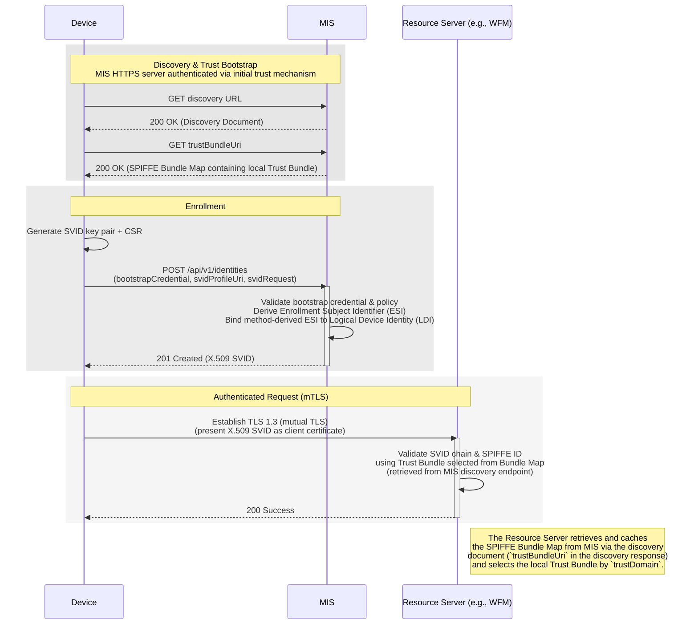
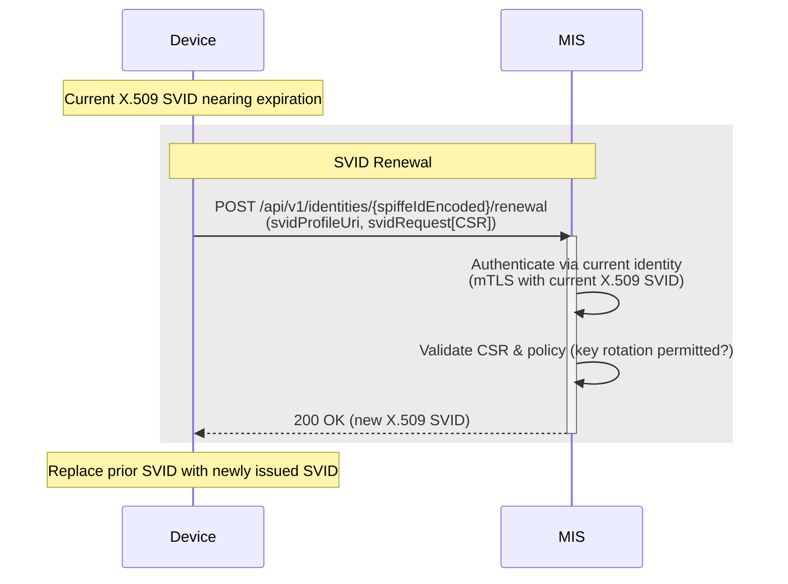
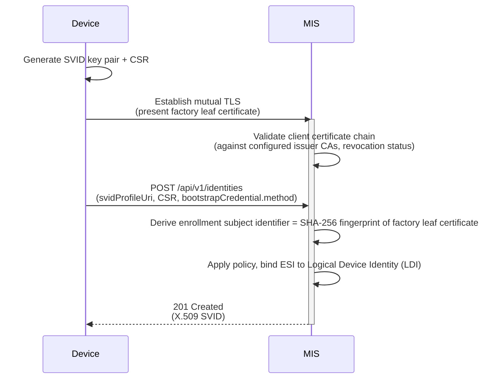

# Specification Update Proposal <!-- omit from toc -->

- [Owner](#owner)
- [Summary](#summary)
- [Reason for proposal](#reason-for-proposal)
- [Requirements alignment acknowledgement](#requirements-alignment-acknowledgement)
- [Technical proposal](#technical-proposal)
  - [1. Scope and Structure](#1-scope-and-structure)
  - [2. Terminology](#2-terminology)
  - [3. Margo Identity and Authorization Framework (MIAF)](#3-margo-identity-and-authorization-framework-miaf)
    - [Framework overview](#framework-overview)
    - [Identity model](#identity-model)
    - [SVID profiles and negotiation](#svid-profiles-and-negotiation)
      - [X.509 SVID Profile](#x509-svid-profile)
    - [Trust Bundles and Distribution](#trust-bundles-and-distribution)
    - [Cryptographic Requirements](#cryptographic-requirements)
    - [MIS Deployment Modes (Informative)](#mis-deployment-modes-informative)
  - [4. Edge Compute Device Identity Profile](#4-edge-compute-device-identity-profile)
    - [Profile Scope](#profile-scope)
    - [Logical Device Identity](#logical-device-identity)
    - [Logical Device Identity Lifecycle](#logical-device-identity-lifecycle)
    - [Profile-specific Constraints on the X.509 SVID Profile](#profile-specific-constraints-on-the-x509-svid-profile)
    - [Profile-specific Enrollment and Identity Issuance](#profile-specific-enrollment-and-identity-issuance)
    - [Device Key Protection](#device-key-protection)
  - [5. APIs](#5-apis)
    - [Common URI and Encoding Rules](#common-uri-and-encoding-rules)
    - [Discovery Document Endpoint](#discovery-document-endpoint)
    - [Trust Bundle Retrieval Endpoint](#trust-bundle-retrieval-endpoint)
    - [Enrollment and Identity Issuance Endpoint](#enrollment-and-identity-issuance-endpoint)
    - [SVID Renewal Endpoint](#svid-renewal-endpoint)
  - [6. Typical Workflows (informative)](#6-typical-workflows-informative)
    - [End-to-End Device Lifecycle Flow](#end-to-end-device-lifecycle-flow)
    - [Device SVID Renewal Flow](#device-svid-renewal-flow)
  - [7. Transport Layer Security (TLS) Requirements](#7-transport-layer-security-tls-requirements)
    - [Initial Trust Bootstrap](#initial-trust-bootstrap)
    - [Minimum TLS Baseline](#minimum-tls-baseline)
    - [Certificate Validation](#certificate-validation)
  - [8. Security Considerations](#8-security-considerations)
  - [9. Roadmap and Forward Extensibility (Informative)](#9-roadmap-and-forward-extensibility-informative)
- [Alternatives considered](#alternatives-considered)
  - [Certificate-Based Device Enrollment Protocols](#certificate-based-device-enrollment-protocols)
  - [OAuth 2.0 / Authorization Server Integration](#oauth-20--authorization-server-integration)
  - [Alternative Trust Frameworks](#alternative-trust-frameworks)
- [Appendix A: Bootstrap Methods (Normative)](#appendix-a-bootstrap-methods-normative)
  - [Common Bootstrap Contract Requirements](#common-bootstrap-contract-requirements)
  - [Factory Certificate Method (mTLS)](#factory-certificate-method-mtls)
  - [Using IEEE 802.1AR DevIDs with Bootstrap Methods (Informative)](#using-ieee-8021ar-devids-with-bootstrap-methods-informative)
- [Appendix B: Error Responses (Normative)](#appendix-b-error-responses-normative)
  - [Error Representation Format](#error-representation-format)
  - [Problem Details Object Schema](#problem-details-object-schema)
  - [Error Type Conventions](#error-type-conventions)
  - [Error Handling for Specific APIs](#error-handling-for-specific-apis)
  - [Client Behavior](#client-behavior)

## Owner

[@matlec](https://github.com/matlec)

## Summary

This Specification Update Proposal introduces the **Margo Identity and Authorization Framework (MIAF)** and defines its first normative **Edge Compute Device Identity Profile**.

**MIAF** is a common foundation for identity, authentication, and authorization across Margo components, based on cryptographically verifiable credentials aligned with open cloud-native identity standards. It defines a **Margo Identity Service (MIS)** that issues and renews identities within a **Trust Domain**, and a shared trust model that all Margo components can rely on. The **Edge Compute Device Identity Profile** is the first normative application of MIAF: it defines a persistent, verifiable device identity, a managed lifecycle, and an extensible bootstrap mechanism. The v0 profile delivers a deliberately narrow first slice — one bootstrap method (Factory Certificate via mTLS, accepting IEEE 802.1AR DevID-based certificates), one SVID profile (X.509-SVID), the enrollment / active / renewal / revocation lifecycle phases, and the discovery, Trust Bundle, enrollment, and SVID renewal APIs.

Throughout this document, **v0** refers to MIAF and the Edge Compute Device Identity Profile as defined by this SUP, prior to the extensions described in [Roadmap and Forward Extensibility](#9-roadmap-and-forward-extensibility-informative).

Together with its [active sibling SUP](#active-sibling-sup), this SUP replaces PR1's WFM Client onboarding flow, per-WFM trust anchor distribution, and cryptographic requirements with a unified, lifecycle-managed model anchored on a new device identity foundation.

## Reason for proposal

Preview Release 1 (PR1) defines a secure Management Interface between a **WFM Client** running on an Edge Compute Device and its **Workload Fleet Manager (WFM)**: each WFM assigns a `clientId` to the WFM Client and associates it with a certificate the device presents during onboarding. That certificate is used to sign HTTP payloads via [RFC 9421](https://datatracker.ietf.org/doc/html/rfc9421); TLS to the WFM is server-authenticated only and uses the WFM's separate server certificate. PR1's identity model therefore ends at the WFM boundary — it does not represent the Edge Compute Device as a verifiable identity, share a trust model with other Margo components (DFM, observability, registries), define a credential lifecycle (renewal, rotation, revocation), or reuse supply-chain credentials such as TPM keys, IEEE 802.1AR DevIDs, or FDO vouchers.

This SUP fills those gaps by separating **Device Identity** (the platform itself) from **Client or Workload Identity** (software running on it). The device-level identity establishes a verifiable foundation within a Trust Domain on which client and workload identities can be layered by future SUPs, so platform trust and software trust are managed independently.

### Relationship to PR1 <!-- omit from toc -->

The table below maps PR1 elements (or gaps) to what this MIAF SUP directly contributes.

| PR1 element / gap | MIAF contribution |
| :---------------- | :---------------- |
| No device-level identity in PR1 | **Logical Device Identity (LDI)** issued by **MIS** within a **Trust Domain** — a new identity foundation |
| Informational hardware key protection references in PR1 device requirements | Normative [Device Key Protection](#device-key-protection) requirements |

The PR1 **WFM Client trust and authentication surface** — `clientId` as identifier, `POST /api/v1/onboarding` for issuance, `GET /api/v1/onboarding/certificate` for per-WFM root CA distribution, RFC 9421 HTTP Message Signatures for authentication, and the `{clientId}` path parameter for caller identity — is replaced by the [active sibling SUP](#active-sibling-sup) (the **WFM Client Identity Profile and Margo Management Interface Update**), which adopts this MIAF foundation: it defines the WFM Client SPIFFE ID and binding-assertion bootstrap method (using MIAF's `POST /api/v1/identities` endpoint and the SPIFFE Trust Bundle distributed via the [discovery document](#discovery-document-endpoint)), removes the PR1 endpoints, and switches authentication to mTLS using the WFM Client X.509-SVID, which inherits MIAF's [Cryptographic Requirements](#cryptographic-requirements).

**Not in scope of v0:** several capabilities that were originally part of this SUP have been intentionally deferred to follow-up SUPs to meet the PR2 deadline. See [Deferred SUPs](#deferred-sups) to learn more about these capabilities.

## Requirements alignment acknowledgement

This SUP addresses [margo/specification#127 — *Define Margo strategy for ecosystem identity and authorization*](https://github.com/margo/specification/issues/127). Its acceptance criteria are met as follows:

- **Defined device identity strategy** — Logical Device Identity with enrollment / active / renewal / revocation lifecycle ([§4](#4-edge-compute-device-identity-profile)).
- **Inter-vendor authentication** — Trust Domain model with SPIFFE-based identity recognition across vendors ([§3](#3-margo-identity-and-authorization-framework-miaf)).
- **Shared trust-anchor distribution** — SPIFFE Trust Bundle retrieved via the discovery document ([§5](#trust-bundle-retrieval-endpoint)).
- **Standard device identity schema** — SPIFFE ID format `spiffe://<trust-domain>/margo/device/<uuid-v4>` ([§4](#logical-device-identity)).

The non-functional requirement to integrate with the existing PR1 `clientId` model is addressed jointly with the [active sibling SUP](#active-sibling-sup).

## Technical proposal

### 1. Scope and Structure

This SUP defines two layers (the MIAF framework and the Edge Compute Device Identity Profile) as introduced in the [Summary](#summary). This section describes the document structure and the relationship to existing [SPIFFE](https://spiffe.io/docs/latest/spiffe-specs/spiffe/) primitives.

The **normative core** of this SUP is based on cryptographically verifiable identities.
Authentication and authorization decisions are performed directly using these identities (mTLS with an **X.509 SVID**).

A conceptual overview of how the **Margo Identity Service**, **Trust Domains**, and Margo components interact appears as an informative architecture diagram at the start of [Section 3](#3-margo-identity-and-authorization-framework-miaf).

#### Relationship to SPIFFE <!-- omit from toc -->

MIAF is intended to **reuse SPIFFE identity primitives** rather than invent Margo-specific credential formats or trust semantics.
In particular, this SUP:

- **adopts by reference** the SPIFFE concepts of **Trust Domain**, **SPIFFE ID**, **X.509-SVID**, and **Trust Bundle / Bundle Map**;
- **profiles or constrains** some of those standards where Margo needs device-specific rules; and
- **defines new Margo-specific behavior** for device bootstrap, lifecycle management, discovery, enrollment, renewal, and profile-specific authorization behavior.

MIAF does not adopt the SPIFFE Workload API or Workload Endpoint as a normative interface — those define a local gRPC mechanism for delivering identities to workloads already running on a host, a different problem from MIAF's remote HTTPS bootstrap, enrollment, and renewal flows. Implementations **MAY** still run the Workload API alongside MIAF for local identity delivery, provided it does not replace MIAF's normative interfaces.

Margo components in the Trust Domain that are not covered by a MIAF profile **MAY** obtain their SVIDs through any SPIFFE-conformant mechanism (for example, SPIRE node attestation), provided the resulting SVIDs chain to the Trust Domain's authoritative trust anchors.

| Topic | Source | Notes |
| :---- | :----- | :---- |
| SPIFFE ID syntax and validation rules | SPIFFE, adopted by reference | This SUP defines only Margo path conventions where needed. |
| X.509-SVID baseline semantics | SPIFFE, adopted by reference + constrained | This SUP adds device-profile constraints. |
| Trust Bundle / Bundle Map | SPIFFE, adopted by reference | This SUP defines discovery and retrieval conventions around it. |
| Discovery document | Margo | Not part of SPIFFE. |
| Enrollment and renewal APIs | Margo | Remote HTTPS lifecycle interfaces. |
| LDI / ESI model | Margo | Device-specific concepts introduced by this SUP. |
| Bootstrap methods | Margo + external standards | The Factory Certificate (mTLS) method is integrated here. IEEE 802.1AR DevIDs are usable as factory certificates within this method. |

### 2. Terminology

The following terms define the common vocabulary for Margo's non-human identity and authorization model.
Some are adopted directly from open standards such as [**SPIFFE**](https://spiffe.io/); others are Margo-specific concepts introduced by this SUP.

This SUP concerns identities used by *non-human* **Margo components** - logical units of the Margo system such as the Device Fleet Manager (DFM), Workload Fleet Manager (WFM), their clients, and infrastructure services such as registries or observability collectors, as defined in the [Envisioned System Design](https://specification.margo.org/overview/envisioned-system-design/).

#### Terms adopted from SPIFFE <!-- omit from toc -->

The following terms are used as defined by SPIFFE. This SUP does not redefine them; it applies them within the Margo context.

##### Trust Domain <!-- omit from toc -->

The governed security boundary within which identities are issued and mutually recognized. This SUP uses **Trust Domain** in the SPIFFE sense: a trust-root-backed identity namespace and policy boundary. A Trust Domain defines:

- authoritative **trust anchors** (for example, the X.509 authority certificates published for the Trust Domain);
- the namespace for **SPIFFE IDs**; and
- policies for identity lifecycle and authorization.

##### SPIFFE ID <!-- omit from toc -->

A URI of the form `spiffe://<trust-domain>/<path>` that names an identity within a Trust Domain. This SUP adopts SPIFFE ID syntax and validation rules by reference; Margo path conventions are defined where needed (see [§3](#3-margo-identity-and-authorization-framework-miaf) for the framework and [§4](#4-edge-compute-device-identity-profile) for the device profile).

##### SPIFFE Verifiable Identity Document (SVID) <!-- omit from toc -->

The verifiable credential representing an identity within a Trust Domain. An SVID binds a SPIFFE ID to a key pair.

##### Trust Bundle <!-- omit from toc -->

The cryptographic material (X.509 trust anchors) used to validate SVIDs issued within a Trust Domain. Distributed via the SPIFFE Bundle Map; see [§3 Trust Bundles and Distribution](#trust-bundles-and-distribution) for the framework rules.

#### Terms introduced by this SUP <!-- omit from toc -->

##### Principal <!-- omit from toc -->

A non-human Margo component that has been issued, or is enrolling for, a SPIFFE identity within a Trust Domain. Edge Compute Devices, WFM Servers, and WFM Clients are all principals under MIAF.

A *candidate principal* is a principal that is enrolling — before the MIS has issued its SVID.

##### Identity Profile <!-- omit from toc -->

A normative specialization of MIAF for a class of principal, identified by a profile URI. A profile pins down the SPIFFE ID layout, the SVID profile, the lifecycle, key-protection rules, and which bootstrap methods apply. This SUP defines the [Edge Compute Device Identity Profile](#4-edge-compute-device-identity-profile); future SUPs may add profiles for WFM Clients, workloads, or other principals.

##### Margo Identity Service (MIS) <!-- omit from toc -->

The identity authority of a Trust Domain. The MIS issues, renews, and revokes SVIDs for principals; validates **Bootstrap Credentials**; and binds the validated bootstrap material to a stable identity within the Trust Domain.

Each Margo deployment must fill the MIS role. Margo does not provide an implementation; vendors, operators, or deployment tooling do.

##### Bootstrap (Method and Credential) <!-- omit from toc -->

A **Bootstrap Method** is a pluggable, normative way for a candidate principal to obtain its first SVID; each method must satisfy the MIAF bootstrap contract (defined in [Appendix A](#common-bootstrap-contract-requirements)). A method specifies the **Bootstrap Credential** — the evidence the candidate presents to prove authenticity, its format, and how the MIS verifies it.

This SUP defines one method, [Factory Certificate (mTLS)](#factory-certificate-method-mtls), for Edge Compute Devices. The registry is extensible: future SUPs may register additional methods (e.g., FIDO Device Onboard, Enrollment Token, JWT-Assertion variants) without changing the proposed API.

*Example (device profile):* under Factory Certificate (mTLS), the bootstrap credential is the device's factory leaf certificate plus proof of the matching private key, demonstrated through the TLS 1.3 handshake.

##### Logical Device Identity (LDI) <!-- omit from toc -->

The persistent, verifiable identity assigned to an **Edge Compute Device** within a Trust Domain. It is named by a SPIFFE URI — for example, `spiffe://<trust-domain>/margo/device/<uuid-v4>` — and represented by an **X.509 SVID**. The LDI is the device's anchor for authentication and authorization in the Trust Domain.

The LDI is designed to remain stable across hardware replacement or firmware updates; the policy-controlled rebinding semantics that realize this are deferred to a future SUP (see [Deferred SUPs](#deferred-sups)).

##### Policy-Based Authorization <!-- omit from toc -->

Authorization decisions made locally by each verifier, based on the peer's verified **SPIFFE ID**. MIAF does not use OAuth-style token scopes or a central authorization server.

### 3. Margo Identity and Authorization Framework (MIAF)

The **Margo Identity and Authorization Framework (MIAF)** defines how Margo components establish trust, authenticate, and are authorized within a **Trust Domain**. It specifies the identity authority (**MIS**), the identity representation (**[SVIDs](https://github.com/spiffe/spiffe/blob/main/standards/SPIFFE.md)**), and the trust material (**Trust Bundles**) that components use for mTLS authentication and policy-based authorization on verified **SPIFFE IDs**.

#### Framework overview

MIAF has four elements (see [§2 Terminology](#2-terminology) for full definitions):

1. **Trust Domain** - the security boundary within which MIAF identities are issued and validated. Each SPIFFE ID is scoped to exactly one Trust Domain; verifiers **MAY** validate identities from multiple Trust Domains via configuration or federation.

2. **Margo Identity Service (MIS)** - the identity authority of a Trust Domain. MIS validates **Bootstrap Credentials**, issues/renews/revokes **SVIDs**, and maintains the binding between validated bootstrap material and **Logical Device Identities (LDIs)** for devices covered by this SUP. MIS exposes **discovery**, **enrollment**, and **renewal** APIs that all identity profiles build upon. Revocation publication is deferred (see [Deferred SUPs](#deferred-sups)).

3. **Margo components using MIAF** - DFMs, WFMs, their clients, and telemetry agents act as **SVID holders** during mTLS authentication and as **verifiers** that validate peer SVIDs against the Trust Bundle and apply policy-based authorization on verified SPIFFE IDs.

4. **Trust Bundles** - each Trust Domain publishes a Trust Bundle containing X.509 trust-anchor certificates for SVID chain validation. Bundles are identified by Trust Domain name and distributed via the SPIFFE [Bundle Map mechanism](https://github.com/spiffe/spiffe/blob/main/standards/SPIFFE_Trust_Domain_and_Bundle.md).

A typical interaction sequence:

1. **Discovery:** A component locates MIS endpoints and Trust Bundle locations via the discovery document URL.
2. **Enrollment:** The component presents a **Bootstrap Credential** to MIS and receives an **SVID**.
3. **Renewal:** The component renews its SVID before expiry via an authenticated request (e.g., mTLS using the current SVID).
4. **Authentication to peers:** The component authenticates to other components using mTLS with its **X.509 SVID**.
5. **Authorization:** The peer validates the SVID against the **Trust Bundle** and applies policy-based authorization on the verified SPIFFE ID.

Device-specific flows are defined in the [Edge Compute Device Identity Profile](#4-edge-compute-device-identity-profile).

> **Conceptual Trust and Identity Architecture (Informative)**
> The diagram below illustrates MIAF in its most general form: any Margo component enrolls with MIS to obtain an X.509 SVID within a governed Trust Domain, then authenticates to peers via mTLS. The Trust Domain publishes the Trust Bundle that participants use to validate identities.
>
> ```mermaid
> flowchart LR
>  %% Figure 1: Conceptual Trust and Identity Architecture (Framework Level, Informative)
>
>  Client["**Margo Client Component**<br/>(e.g., DFM Client, WFM Client, Telemetry Agent)"]
>  Server["**Margo Server Component**<br/>(e.g., DFM, WFM, Observability Platform, Component Registry)"]
>  MIS["**Margo Identity Service (MIS)**<br/>Issues, renews, and revokes SVIDs"]
>  TD["**Trust Domain**<br/>Defines trust anchors, policies, and namespace"]
>  X509["**X.509 SVID**<br/>Certificate binding SPIFFE ID to key pair"]
>  TB["**Trust Bundle**<br/>X.509 trust anchors"]
>
>  Client -->|"requests identity (X.509 SVID)"| MIS
>  MIS -->|"issues X.509 SVID"| X509
>  X509 -->|"certificate bound to locally generated private key"| Client
>  Client -->|"authenticates using X.509 SVID (mTLS)"| Server
>  Server -->|"verifies SVID using Trust Bundle of"| TD
>  TD -->|"publishes"| TB
>
>  classDef comp fill:#e8f1ff,stroke:#5b8def,stroke-width:1px,rx:8px,ry:8px,color:#0b3b8c;
>  classDef ident fill:#e8f7ee,stroke:#2ca36b,stroke-width:1px,rx:8px,ry:8px,color:#0f5132;
>  classDef trust fill:#f7f7f7,stroke:#bdbdbd,stroke-width:1px,rx:8px,ry:8px,color:#333;
>
>  class Client,Server,MIS comp;
>  class X509 ident;
>  class TD,TB trust;
> ```

#### Identity model

MIAF defines a unified identity model for all Margo components.

- **Identity representation:** An identity is named by a **SPIFFE ID** and represented by an **SVID** issued by MIS. For devices, the **Logical Device Identity (LDI)** is the device-specific realization.
- **Path namespace:** SPIFFE IDs issued by MIS under a MIAF identity profile **MUST** have a path beginning with `/margo/`. Each identity profile claims a non-conflicting sub-prefix under `/margo/` and defines the structure within it; this SUP defines `/margo/device/<uuid-v4>` for the Edge Compute Device Identity Profile. To preserve `/margo/` as a reliable signal of MIAF provenance, non-MIAF SVIDs issued in the same Trust Domain via other SPIFFE-conformant mechanisms (per [§1 Relationship to SPIFFE](#relationship-to-spiffe)) **SHOULD NOT** use the `/margo/` prefix.
- **Uniqueness and stability:** Each SPIFFE ID uniquely identifies one logical component within its Trust Domain. The LDI remains stable across hardware or firmware changes if policy permits rebinding.
- **Lifecycle:** All identities follow a consistent lifecycle:
  1. **Enrollment:** A new identity is created and an initial SVID is issued.
  2. **Active:** The SVID is valid and used for authentication.
  3. **Renewal:** The SVID is renewed before expiry.
  4. **Revocation / Termination:** The identity is invalidated and retired due to compromise or policy.

  The device-specific realization is defined in [Logical Device Identity Lifecycle](#logical-device-identity-lifecycle).
- **Extensibility:** The MIS, Trust Domain, SVID, and Trust Bundle concepts are intentionally generic. Future SUPs may define profiles for other Margo components (e.g., WFM Clients or workloads) without redefining the framework.

#### SVID profiles and negotiation

This SUP uses one SPIFFE-defined SVID type, **X.509-SVID**, for mTLS authentication. Profiles are referenced by **profile URIs** in API exchanges.
For the **Edge Compute Device Identity Profile**, X.509-SVID is the only permitted representation for device enrollment and Logical Device Identity issuance.

**Profile identifiers:**

| Type        | Profile URI                                      | Status |
| :---------- | :----------------------------------------------- | :----- |
| `x509-svid` | `https://margo.org/profiles/spiffe/x509-svid/v1` | **Normative** ([adopts SPIFFE X.509-SVID by reference; constrained by this SUP](#x509-svid-profile)) |

##### X.509 SVID Profile

This SUP adopts the [SPIFFE X.509-SVID specification](https://github.com/spiffe/spiffe/blob/main/standards/X509-SVID.md) by reference. Validity periods are profile-specific; the device profile defines binding maxima — see [Profile-specific Constraints on the X.509 SVID Profile](#profile-specific-constraints-on-the-x509-svid-profile).

Validation and chain delivery (per SPIFFE X.509-SVID):

- When an X.509 SVID is presented to a verifier, the presenter **MUST** deliver the complete SVID chain - the leaf SVID followed by all intermediate CA certificates required for path validation. The root **MAY** be omitted. This requirement applies wherever an X.509 SVID is conveyed to a verifier in this SUP, including the TLS Certificate message during mTLS.
- Verifiers **MUST** validate the presented chain against the Trust Bundle's X.509 trust anchors for the relevant Trust Domain. Verifiers **MUST NOT** rely on AIA fetching or other out-of-band intermediate retrieval to complete path validation.
- Each SPIFFE ID **MUST** be unique within its Trust Domain.

#### Trust Bundles and Distribution

This SUP adopts the SPIFFE **Trust Domain and Bundle / Bundle Map** model by reference. Each Trust Domain maintains a **Trust Bundle**, the authoritative set of cryptographic material used to validate SVIDs within that domain. A Trust Bundle becomes authoritative only after it has been retrieved over an HTTPS connection authenticated per [Initial Trust Bootstrap](#initial-trust-bootstrap).

A Trust Bundle **MUST** include X.509 trust-anchor certificates for SVID chain validation. Intermediate CA certificates required for path validation are conveyed with the SVID chain itself per the [X.509 SVID Profile](#x509-svid-profile); they are not part of the Trust Bundle.

Bundles:

- **SHOULD** be published and discovered via the SPIFFE [Trust Domain and Bundle Map](https://github.com/spiffe/spiffe/blob/main/standards/SPIFFE_Trust_Domain_and_Bundle.md);
- **MAY** be distributed through deployment tooling or provisioning flows;
- **MUST** be refreshed before expiry or rotation; and
- **SHOULD** be cached locally to support offline validation.

Validation process:

1. Determine the peer's Trust Domain from its SPIFFE ID.
2. Retrieve the SPIFFE Bundle Map (via the [discovery document](#discovery-document-endpoint)'s `trustBundleUri` or from cache) over HTTPS authenticated per [Initial Trust Bootstrap](#initial-trust-bootstrap), and select the corresponding Trust Bundle.
3. Validate the SVID chain using that Trust Bundle.
4. If validation succeeds and local policy allows, apply **policy-based authorization**.

Cross-domain trust is configured explicitly by associating a Trust Domain with the correct Trust Bundle. The SPIFFE Bundle Map format supports inclusion of bundles for multiple Trust Domains, which can serve as a basis for cross-domain trust. Full federation lifecycle semantics, as defined by SPIFFE Federation, are out of scope for this SUP and may be addressed in future work.

#### Cryptographic Requirements

All cryptographic operations under MIAF - including key generation, CSR signing, SVID issuance, and verification - **MUST** conform to [RFC 9325](https://datatracker.ietf.org/doc/rfc9325/) and [NIST SP 800-131A Rev 2](https://nvlpubs.nist.gov/nistpubs/SpecialPublications/NIST.SP.800-131Ar2.pdf).

| Algorithm | Requirements |
| :-------- | :----------- |
| **ECDSA (P-256 + SHA-256)** | Keys **MUST** use curve P-256 (`prime256v1`) and signatures **MUST** use SHA-256 (`ES256`). |
| **RSA (PSS 3072 + SHA-256)** | Modulus **MUST** >= 3072 bits; signatures **MUST** use RSASSA-PSS with SHA-256 (`PS256`). `RS256` (PKCS#1 v1.5) **MUST NOT** be used. |

Additional rules:

- Components that **present** SVIDs **MUST** implement at least one of the algorithms above and use it for their keys.
- Components that **validate** SVIDs (including the MIS) **MUST** implement both algorithms, because they cannot know in advance which algorithm a peer will present.

#### MIS Deployment Modes (Informative)

MIS implementations have flexibility in how they fit into an existing PKI. The three modes below differ only in the certificate hierarchy used to issue SVIDs — the APIs, request/response shapes, and trust semantics defined elsewhere in this SUP are identical across all three.

| Mode | Description | Typical Use Case |
| :--- | :---------- | :--------------- |
| **Root CA Mode** | MIS operates as a self-signed **Root CA**, directly issuing all SVIDs. | Self-contained or air-gapped environments. |
| **Intermediate CA Mode** | MIS is an **Intermediate CA** signed by an enterprise or offline Root CA, chaining issued SVIDs to an enterprise trust root. | Enterprise environments aligned with corporate PKI. |
| **Registration Authority (RA) Mode** | MIS acts as a **Registration Authority**, validating enrollment and delegating issuance to a backend CA (e.g., EST, CMPv2, ACME). | Shared or external issuance infrastructures. |

### 4. Edge Compute Device Identity Profile

This profile applies MIAF to **Edge Compute Devices**, specifying the SPIFFE ID structure, X.509 SVID constraints, lifecycle, and key-protection requirements for a device's **Logical Device Identity (LDI)** within a **Trust Domain**.

#### Profile Scope

This profile applies to all Edge Compute Devices in a Margo deployment.

#### Logical Device Identity

A device's LDI is identified by a SPIFFE URI and represented by an X.509 SVID called the **Device SVID**:

```text
spiffe://<trust-domain>/margo/device/<uuid-v4>
```

The `<uuid-v4>` component:

- **MUST** be a random RFC 4122 version 4 UUID generated by the MIS;
- **MUST** use lowercase hex with hyphens;
- **MUST NOT** be predictable or sequential; and
- **MUST** remain unchanged across the LDI's lifetime, including SVID renewal and operator-permitted key rotation.

#### Logical Device Identity Lifecycle

The LDI follows the generic lifecycle defined in [§3 Identity model](#identity-model); the table below maps each phase to device-specific behavior.

| Lifecycle Phase | Description |
| :---- | :---------- |
| **Enrollment** | The device (or its operator) presents a **Bootstrap Credential**. MIS validates it according to the selected method and issues an initial **X.509 SVID** representing a new (or matched) LDI. |
| **Active** | The device uses its valid SVID to authenticate to Margo components within the Trust Domain. |
| **Renewal** | Before expiry, the device renews its SVID via an authenticated request (e.g., mTLS with the current SVID). Renewal semantics, including rate-limiting and backoff, are defined in [SVID Renewal Endpoint](#svid-renewal-endpoint). |
| **Revocation / Termination** | MIS invalidates the LDI when keys are compromised, the device is decommissioned, or policy mandates retirement. Once revoked/terminated, an LDI **MUST NOT** be re-issued. |

#### Profile-specific Constraints on the X.509 SVID Profile

This profile refines the generic [X.509 SVID Profile](#x509-svid-profile) for device identities. The MIS **MUST** issue device SVIDs as follows:

| Field | Requirement | Source | Notes |
| :---- | :---------- | :----- | :---- |
| **Subject Alternative Name (URI)**| Exactly one URI SAN containing `spiffe://<trust-domain>/margo/device/<uuid-v4>`. | **MIAF** | The Margo device path convention. The SAN is the authoritative device identity. |
| **Validity** | **MUST NOT** exceed **5 years**. **RECOMMENDED:** <= **90 days** for regularly online devices. | **MIAF** | SPIFFE does not constrain validity. Shorter lifetimes reduce risk; operators may choose longer for intermittently connected fleets. |

All other fields **MUST** comply with the base [X.509 SVID Profile](#x509-svid-profile).

#### Profile-specific Enrollment and Identity Issuance

Device enrollment uses the generic API in [Section 5](#enrollment-and-identity-issuance-endpoint) with the following constraints:

- The only permitted `svidProfileUri` for devices is `https://margo.org/profiles/spiffe/x509-svid/v1`; other values **MUST** be rejected with `422` (`unsupported-svid-profile`).
- Device enrollment **MUST** use the [Factory Certificate Method (mTLS)](#factory-certificate-method-mtls) defined in [Appendix A](#appendix-a-bootstrap-methods-normative); future SUPs may register additional methods. Both the device and the MIS **MUST** implement this method for baseline interoperability.
- The device-profile constraints in this section (X.509-only `svidProfileUri`, [Device Key Protection](#device-key-protection), the LDI lifecycle) **MUST** be honored.

#### Device Key Protection

All device-identity cryptographic operations (key generation, CSR signing, SVID issuance) **MUST** comply with [Cryptographic Requirements](#cryptographic-requirements). Device private keys **MUST** be protected as follows:

- Keys **MUST** be generated and stored in secure hardware (TPM, Secure Element, or TEE) where available; hardware-stored keys **MUST NOT** be exportable.
- Where only software storage is possible, implementations **MUST** provide at-rest encryption, integrity protection, and OS/process isolation (e.g., a dedicated key service with strict ACLs).
- Where neither is feasible (e.g., MCU-class devices without secure storage), implementations **SHOULD** apply the strongest key protection available.
- Implementations **MAY** support attestation evidence of key provenance (e.g., TPM quotes, TEE reports). A future SUP is expected to define key-protection classification, attestation formats, and verification semantics.

### 5. APIs

The Margo Identity and Authorization APIs are the normative RESTful interfaces over HTTPS through which Margo components interact with the **Margo Identity Service (MIS)** for bootstrap and lifecycle management of devices and any future profiles defined by this framework. The relationship to the SPIFFE Workload API / Workload Endpoint is covered in [§1 Relationship to SPIFFE](#relationship-to-spiffe).

Request and response bodies **MUST** use JSON unless otherwise specified, and errors **MUST** be returned in [RFC 9457](https://datatracker.ietf.org/doc/html/rfc9457) Problem Details format (see [Appendix B](#appendix-b-error-responses-normative)). All HTTPS connections to MIAF endpoints **MUST** be authenticated per [Initial Trust Bootstrap](#initial-trust-bootstrap).

MIS implementations **MUST** reject request bodies that contain fields not defined by this SUP (or by a profile or extension recognized by the MIS) with `400 Bad Request`. Clients **MUST** ignore fields they do not recognize in MIS responses. Together, these rules let future SUPs add fields without breaking v0 implementations: servers reject unknown inputs and clients tolerate unknown outputs.

> **Note:**
> Integration with OAuth2 and API gateways is described **informatively** in a deferred SUP (see [`deferred/miaf-oauth2-bridge.md`](./deferred/miaf-oauth2-bridge.md)) and is **not required for compliance** with this SUP.

#### Common URI and Encoding Rules

Some API endpoints (e.g., [SVID Renewal](#svid-renewal-endpoint)) include a `{spiffeIdEncoded}` placeholder. This value **MUST** be computed as follows:

- Take the SPIFFE ID as a UTF-8 string.
- Encode it using **Base64URL** as defined in [RFC 4648 § 5](https://datatracker.ietf.org/doc/html/rfc4648#section-5), omitting padding (`=`).
- Use this encoded value wherever `{spiffeIdEncoded}` appears in an endpoint path.

> **Example**
>
> ```text
> spiffe://northstar-ida.com/margo/device/123e4567-e89b-12d3-a456-426614174000
> becomes
> c3BpZmZlOi8vbm9ydGhzdGFyLWlkYS5jb20vbWFyZ28vZGV2aWNlLzEyM2U0NTY3LWU4OWItMTJkMy1hNDU2LTQyNjYxNDE3NDAwMA
> ```

#### Discovery Document Endpoint

The discovery document is the entry point to a Trust Domain: it advertises the MIS location, supported bootstrap methods, and compatible SVID profiles, and points to the SPIFFE Bundle Map for the Trust Domain. Before its first interaction with a Trust Domain, a client **MUST** retrieve this document; for subsequent operations, the client **MAY** rely on a cached copy and **SHOULD** revalidate using `ETag`/`Last-Modified`.

Each discovery document describes exactly one Trust Domain. When an HTTPS origin serves exactly one Trust Domain, deployments **SHOULD** expose the document at `GET /.well-known/margo`; otherwise (e.g., one origin serving multiple Trust Domains), deployments **MAY** use another absolute HTTPS discovery URL.

When a bootstrap method, provisioning flow, or deployment configuration supplies a discovery URL, clients **MUST** use that URL as-is; otherwise, clients **SHOULD** default to `GET /.well-known/margo` on the expected HTTPS origin for that Trust Domain.

| Item | Value |
| :--- | :---- |
| **Endpoint** | `GET <discovery-url>` (default convention: `GET /.well-known/margo`) |
| **Authentication** | None (application-layer); transport per [Initial Trust Bootstrap](#initial-trust-bootstrap) |
| **Headers** | `Accept: application/json` |
| **Body schema (request)** | None |
| **Body schema (response)** | See below |
| **Responses** | `200 OK` - discovery document<br>`404 Not Found` - not available |
| **Errors** | RFC 9457 Problem Details as per [Appendix B](#appendix-b-error-responses-normative) |

**Response body schema (`200 OK`, `application/json`):**

| Field | Type | Required | Description |
| :---- | :--- | :------- | :---------- |
| `trustDomain` | string | Y  | Identifier of the Trust Domain (e.g., `factory.example`). All SPIFFE IDs issued by the MIS **MUST** belong to this trust domain. |
| `trustBundleUri` | string | Y | Absolute HTTPS URL to the **SPIFFE Bundle Map** resource for this Trust Domain. The resource **MUST** conform to the [SPIFFE Trust Domain and Bundle Map specification](https://github.com/spiffe/spiffe/blob/main/standards/SPIFFE_Trust_Domain_and_Bundle.md#5-spiffe-bundle-map) and **MUST** contain an entry for the domain identified by `trustDomain`; that entry is the authoritative local Trust Bundle for this specification. The resource **SHOULD** expose caching headers (`ETag`, `Last-Modified`). |
| `margoIdentityServiceBaseUri` | string | Y | Absolute HTTPS base URL of the Margo Identity Service (MIS). All MIS endpoints defined in this section are derived from this base URI. |
| `supportedBootstrapMethods` | array of string | Y | URNs of supported bootstrap methods. Each URN **MUST** reference a method defined in [Appendix A](#appendix-a-bootstrap-methods-normative) or a registered vendor extension (`urn:margo:bootstrap:<method>:<version>`). Custom methods **SHOULD** use an organization-scoped namespace (e.g., `urn:margo:bootstrap:acme-factory:v1`). Servers **MUST NOT** advertise a method without a corresponding verification configuration in MIS. |
| `svidProfilesSupported` | array of string | Y | Absolute URIs of supported SVID profile versions. Clients **MUST** select one URI from this list when enrolling and submit it as `svidProfileUri`. |

Future SUPs may register additional discovery-document fields (for example, a revocation list URI when [`deferred/miaf-revocation-list.md`](./deferred/miaf-revocation-list.md) is promoted); existing clients tolerate this per the unknown-fields rule in the [§5 APIs](#5-apis) intro.

##### Example: Discovery Document <!-- omit from toc -->

```http
GET /.well-known/margo
Accept: application/json
```

**Response (`200 OK`):**

```jsonc
{
  "trustDomain": "northstar-ida.com",
  "trustBundleUri": "https://mis.northstar-ida.com/.well-known/spiffe/bundle.json",
  "margoIdentityServiceBaseUri": "https://mis.northstar-ida.com",
  "supportedBootstrapMethods": [
    "urn:margo:bootstrap:factory-cert-mtls:v1"
  ],
  "svidProfilesSupported": [
    "https://margo.org/profiles/spiffe/x509-svid/v1"
  ]
}
```

#### Trust Bundle Retrieval Endpoint

The resource identified by `trustBundleUri` returns a SPIFFE Bundle Map. The entry keyed by the local `trustDomain` contains the authoritative set of public trust anchors for that Trust Domain.

| Item | Value |
| :--- | :---- |
| **Endpoint** | `<trustBundleUri>` (for example: `https://mis.example.com/.well-known/spiffe/bundle.json`) |
| **Authentication** | None (application-layer); transport per [Initial Trust Bootstrap](#initial-trust-bootstrap) |
| **Media type** | `application/json` |
| **Body schema (response)** | The response **MUST** conform to the [SPIFFE Bundle Map format](https://github.com/spiffe/spiffe/blob/main/standards/SPIFFE_Trust_Domain_and_Bundle.md#5-spiffe-bundle-map). |
| **Responses** | `200 OK` - Bundle Map retrieved<br>`304 Not Modified` - cached copy still valid<br>`404 Not Found` - bundle unavailable |
| **Caching** | The endpoint **SHOULD** support HTTP caching headers (`ETag`, `Last-Modified`). |

Clients select the Trust Bundle for `trustDomain` from the retrieved Bundle Map and use it as the authoritative source when validating SVIDs issued within the Trust Domain.

#### Enrollment and Identity Issuance Endpoint

A principal (for this SUP: an Edge Compute Device) calls this endpoint to **enroll** with the MIS by presenting its **Bootstrap Credential**. On success, the MIS issues a new SVID for the principal.

| Item | Value |
| :--- | :---- |
| **Endpoint** | `POST /api/v1/identities` |
| **Authentication** | Defined by the selected [bootstrap method](#appendix-a-bootstrap-methods-normative) (for example, device-held mTLS) |
| **Headers** | `Content-Type: application/json` |
| **Body schema (request)** | See below |
| **Body schema (response)** | See below |
| **Responses** | `201 Created` (initial enrollment)<br>`200 OK` (re-enrollment)<br>`400`, `401`, `403`, `409`, `422`, `429` - per RFC 9457 |
| **Errors** | RFC 9457 Problem Details as per [Appendix B](#appendix-b-error-responses-normative) |

**Request body schema (`application/json`):**

| Field | Type | Required | Description |
| :---- | :--- | :------- | :---------- |
| `svidProfileUri` | string | Y | Absolute URI identifying the SVID profile requested. **MUST** match one of the URIs listed in `svidProfilesSupported` from the [discovery document](#discovery-document-endpoint). |
| `svidRequest` | object | Y | Profile-specific payload containing parameters required to issue an SVID. See the profile-specific `svidRequest` formats below. |
| `bootstrapCredential` | object | Y | Credential and associated proof used to authenticate the enrollment. See [Bootstrap Methods](#appendix-a-bootstrap-methods-normative) for normative method definitions. |
| `bootstrapCredential.method` | string | Y | URN uniquely identifying the bootstrap method (e.g., `urn:margo:bootstrap:factory-cert-mtls:v1`). |
| `bootstrapCredential.proof` | object | N | Method-specific proof of possession (for example, a signed JWT assertion or an enrollment token). Present only if the bootstrap method requires explicit proof material. |

**Response body schema (`201 Created` or `200 OK`, `application/json`):**

| Field | Type | Required | Description |
| :---- | :--- | :------- | :---------- |
| `svidProfileUri` | string | Y | URI of the SVID profile used for issuance. Identifies the structure and semantics of the `svid` object returned. |
| `svid` | object | Y | Profile-specific payload containing the issued SVID. See the profile-specific `svid` formats below. |

##### X.509 SVID profile payloads <!-- omit from toc -->

When `svidProfileUri = "https://margo.org/profiles/spiffe/x509-svid/v1"`, the `svidRequest` and `svid` objects **MUST** conform to the structures below.

**`svidRequest` (request):**

```json
{
  "csr": "<base64 DER PKCS#10>"
}
```

| Field | Type | Required | Description |
| :---- | :--- | :------- | :---------- |
| `csr` | string | Y | Base64-encoded (standard alphabet, no newlines) representation of a DER-encoded PKCS#10 CSR. The CSR public key **MUST** comply with [Cryptographic Requirements](#cryptographic-requirements). |

Validation:

- The MIS **MUST** ignore any Subject DN and SANs in the CSR and set the authoritative SPIFFE ID in the URI SAN of the issued certificate according to the identity profile in effect (for devices, the Logical Device Identity format). However, the MIS **MAY** enforce structural requirements (e.g., requiring a Common Name) if backed by a strict PKI.
- Inputs containing PEM armor or malformed Base64 **MUST** be rejected with `400 Bad Request` and the `invalid-svid-request` error type.
- CSRs using unsupported key types or signature algorithms **MUST** be rejected per [Cryptographic Requirements](#cryptographic-requirements) with `400 Bad Request` and the `invalid-svid-request` error type (see [Appendix B](#appendix-b-error-responses-normative)).

**`svid` (response):**

```json
{
  "certificateChainPem": ["<leaf>", "<intermediate-1>", "..."]
}
```

| Field | Type | Required | Description |
| :---- | :--- | :------- | :---------- |
| `certificateChainPem` | array of string | Y | PEM-encoded X.509 certificate chain. The first element **MUST** be the SVID (leaf certificate representing the issued identity). The MIS **MUST** include all intermediate CA certificates required for path validation; the root **MAY** be omitted. The client receiving this chain **MUST** retain it in full and present the complete chain to verifiers as required by the [X.509 SVID Profile](#x509-svid-profile). PEM strings **MUST** be base64 with line breaks; clients **MUST NOT** assume a specific wrap width. |

##### Example: Enrollment and Identity Issuance <!-- omit from toc -->

**Request (device with X.509 profile, factory-cert mTLS):**

```http
POST /api/v1/identities
Content-Type: application/json
```

```jsonc
{
  "svidProfileUri": "https://margo.org/profiles/spiffe/x509-svid/v1",
  "svidRequest": {
    "csr": "MIICVzCCAT8CAQAwEjEQMA4GA1UEAwwHbWFyZ28tZGUwWTATBgcqhkjOPQIBBggqhkjOPQMBBwNCAATKxRZ8YtMUVcgG9l7oY7OqDyy0kchPr0ET6lm3MKbkT2vSzr6X0Spbz4cPmgqK4pYpFV4lLhl9pKUx3Cdd5L0YoycwJQYJKoZIhvcNAQkOMRYwFDASBgNVHRETCzAJggdtYXJnby1kZTAKBggqhkjOPQQDAgNHADBEAiB5VsvzqBhw+L4i6V60oU5gN1jKMmGfdyR2PqQ8q5RdjQIgQdBBQLehRzCwH8ApVfP1PZAfV1qTLp1vR7m1LcwTnXs="
  },
  "bootstrapCredential": {
    "method": "urn:margo:bootstrap:factory-cert-mtls:v1"
  }
}
```

**Response (`201 Created`):**

```jsonc
{
  "svidProfileUri": "https://margo.org/profiles/spiffe/x509-svid/v1",
  "svid": {
    "certificateChainPem": [
      "-----BEGIN CERTIFICATE-----\nMIIC4TCCAcigAwIBAgIUFsO2...\n-----END CERTIFICATE-----",
      "-----BEGIN CERTIFICATE-----\nMIIDdTCCAl2gAwIBAgIURv7O...\n-----END CERTIFICATE-----"
    ]
  }
}
```

##### MIS Validation and Processing Logic <!-- omit from toc -->

Upon receiving an enrollment request, the MIS **MUST** perform the following validation and issuance steps.

1. **Validate bootstrap proof**

   The MIS **MUST** verify the cryptographic proof included in the `bootstrapCredential` according to the verification rules defined by the selected bootstrap `method`.

   If proof validation fails, the MIS **MUST** reject the request with `401 Unauthorized` and the `invalid-bootstrap-proof` error type.

1. **Derive Enrollment Subject Identifier**

   The MIS **MUST** derive an **Enrollment Subject Identifier (ESI)** — a deterministic identifier — from the validated bootstrap proof material, per the rule defined by the selected `bootstrapCredential.method` (see [Appendix A](#appendix-a-bootstrap-methods-normative)). The ESI anchors the binding between the bootstrap material and the resulting identity, letting the MIS recognize whether a presented bootstrap proof maps to an existing identity in the Trust Domain or a new one.

   The derived ESI **MUST** be stable for repeated enrollments using the same bootstrap credential, **MUST** be unique within the Trust Domain, and **MUST NOT** be reversible to the original credential material.

1. **Validate requested profile**

   The MIS **MUST** verify that the `svidProfileUri` appears in its `svidProfilesSupported` list as published in the discovery document.

   - If unsupported, the MIS **MUST** return `422 Unprocessable Entity` with an `unsupported-svid-profile` error type (see [Appendix B](#appendix-b-error-responses-normative)).
   - If the provided `svidRequest` fails profile-specific validation (for example, malformed CSR under the X.509 profile), the MIS **MUST** return `400 Bad Request` with an `invalid-svid-request` error type.

1. **Check for existing identity binding**

   The MIS **MUST** maintain a single authoritative ESI-to-identity mapping within the Trust Domain.

   - **No binding exists (initial enrollment)**

     - The MIS applies operator-defined Trust Domain policy to determine whether new identities may be created.
     - If Trust Domain policy requires explicit operator admission before issuance, the MIS **MAY** return `409 Conflict` with the `enrollment-pending` error type and a `Retry-After` header indicating when the device **SHOULD** retry. Devices **MUST** treat `enrollment-pending` as a transient condition and retry; they **MUST NOT** treat it as a permanent rejection.
     - Upon approval, the MIS **MUST** create a new identity and persist a mapping between the enrollment subject identifier and that identity.
     - The MIS then issues an SVID according to the selected `svidProfileUri` and returns `201 Created` with the profile-conformant response body.

   - **Binding exists (re-enrollment / recovery)**

     - The MIS **MUST** retrieve the existing identity bound to the enrollment subject identifier.
     - If the CSR contains a **new** public key, the MIS **MUST** apply operator policy to decide if **key rotation** (same identity, new key) is permitted. If not permitted, return `409 Conflict`. If permitted, issue a new SVID and invalidate the prior SVID.
     - The MIS then issues a new SVID for the same identity and returns `200 OK`.

1. **Finalize and audit**

   The MIS **SHOULD** record enrollment metadata (bootstrap method, time, trust anchor) for auditability.

##### MIS Enrollment Rate-Limiting Policy <!-- omit from toc -->

The MIS **MUST** apply rate-limiting controls to enrollment requests to prevent resource exhaustion and replay abuse.

1. **Rate-limit dimension**
   - The dimension to rate-limit by (e.g., source IP, bootstrap credential, derived ESI) is deployment-specific, since enrollment requests are not yet associated with a SPIFFE ID.

2. **Error handling**
   - When limits are exceeded, the MIS **MUST** return `429 Too Many Requests` using the RFC 9457 Problem Details format.
   - The MIS **MUST** include a `Retry-After` response header (delta-seconds) indicating when the client may retry.

3. **Client behavior**
   - Clients **MUST NOT** automatically retry failed enrollment requests before the `Retry-After` duration has elapsed.
   - Clients **SHOULD** apply exponential backoff to avoid synchronized retry storms.

#### SVID Renewal Endpoint

This endpoint renews an expiring SVID while preserving the existing identity. The client presents its current X.509 SVID as a TLS client certificate (mTLS), and the MIS issues a new SVID for the same SPIFFE ID.

| Item | Value |
| :--- | :---- |
| **Endpoint** | `POST /api/v1/identities/{spiffeIdEncoded}/renewal` |
| **Authentication**         | **Mutual TLS:** The client **MUST** present its current X.509 SVID as the TLS client certificate. The MIS **MUST** extract the SPIFFE ID from the URI SAN and verify that it matches `{spiffeIdEncoded}`.<br>`{spiffeIdEncoded}` **MUST** be computed as defined in the [Common URI and Encoding Rules](#common-uri-and-encoding-rules). |
| **Headers** | `Content-Type: application/json` |
| **Body schema (request)**  | See below |
| **Body schema (response)** | Same as [Enrollment response](#enrollment-and-identity-issuance-endpoint) |
| **Responses**              | `200 OK` on success<br>`400`, `401`, `422`, `429` - RFC 9457 errors |
| **Errors**                 | RFC 9457 Problem Details as per [Appendix B](#appendix-b-error-responses-normative) |

**Request body schema (`application/json`):**

| Field | Type | Required | Description |
| :---- | :--- | :------- | :---------- |
| `svidProfileUri` | string | Y | Absolute URI of the SVID profile used for renewal. **MUST** match a profile supported by MIS and **SHOULD** match the currently active profile unless explicitly allowed by policy. |
| `svidRequest` | object | Y | Profile-specific renewal payload. For X.509 SVID, this object contains a Base64-encoded CSR as defined in [X.509 SVID profile payloads](#x509-svid-profile-payloads). |

> **Note:**
> Renewal **MAY** include a new key pair; acceptance is policy-controlled. As a **RECOMMENDED** default, MIS policy **SHOULD** permit renewal with a new key pair while preserving the existing identity. Deployments whose [Device Key Protection](#device-key-protection) policy requires continuity of the same hardware-bound or non-exportable private key **MAY** instead require re-enrollment.

##### Example: SVID Renewal <!-- omit from toc -->

**Request (device renewing X.509 SVID over mTLS):**

```http
POST /api/v1/identities/c3BpZmZlOi8vbm9ydGhzdGFyLWlkYS5jb20vbWFyZ28vZGV2aWNlLzEyM2U0NTY3LWU4OWItMTJkMy1hNDU2LTQyNjYxNDE3NDAwMA/renewal
Content-Type: application/json
# TLS 1.3, client certificate = current device X.509 SVID
```

```jsonc
{
  "svidProfileUri": "https://margo.org/profiles/spiffe/x509-svid/v1",
  "svidRequest": {
    "csr": "MIICVjCCAT8CAQAwEjEQMA4GA1UEAwwHbWFyZ28tZGUwWTATBgcqhkjOPQIBBggqhkjOPQMBBwNCAATKxRZ8YtMUVcgG9l7oY7OqDyy0kchPr0ET6lm3MKbkT2vSzr6X0Spbz4cPmgqK4pYpFV4lLhl9pKUx3Cdd5L0YoycwJQYJKoZIhvcNAQkOMRYwFDASBgNVHRETCzAJggdtYXJnby1kZTAKBggqhkjOPQQDAgNHADBEAiB5VsvzqBhw+L4i6V60oU5gN1jKMmGfdyR2PqQ8q5RdjQIgQdBBQLehRzCwH8ApVfP1PZAfV1qTLp1vR7m1LcwTnXs="
  }
}
```

On success, the response body matches the [Enrollment response](#enrollment-and-identity-issuance-endpoint), and the client **MUST** replace its previous SVID with the newly issued one.

##### MIS Renewal Rate-Limiting and Backoff Policy <!-- omit from toc -->

The MIS **MUST** apply rate-limiting controls to all renewal operations to prevent resource exhaustion, credential churn, and replay abuse.

1. **Renewal frequency control**
   - The MIS **MUST** track renewal frequency per SPIFFE ID.
   - A **RECOMMENDED** baseline policy is no more than 5 successful renewals per 24-hour period per identity, **configurable by deployment**.

2. **Error handling**
   - When limits are exceeded, the MIS **MUST** return `429 Too Many Requests` using the RFC 9457 Problem Details format.
   - The MIS **MUST** include a `Retry-After` response header (delta-seconds) indicating when the client may retry.

3. **Client behavior**
   - Clients **MUST NOT** automatically retry failed renewals before the `Retry-After` duration has elapsed.
   - Clients **SHOULD** apply exponential backoff to avoid synchronized retry storms.

### 6. Typical Workflows (informative)

#### End-to-End Device Lifecycle Flow

This flow represents the complete "golden path" for a new **Edge Compute Device**, from bootstrap through its first authenticated request using **mutual TLS (mTLS)** with an **X.509 SVID**.

> **Note:** This flow assumes the device already has an initial trust basis for the MIS HTTPS endpoint per [Initial Trust Bootstrap](#initial-trust-bootstrap). Discovery retrieval and `trustBundleUri` retrieval both rely on that HTTPS server authentication; the retrieved Trust Bundle becomes authoritative only after those steps succeed.



In this v0 of the framework, enrollment uses the [Factory Certificate Method (mTLS)](#factory-certificate-method-mtls), and the device renews its X.509 SVID before expiry via the [SVID Renewal Endpoint](#svid-renewal-endpoint).

#### Device SVID Renewal Flow

This sequence shows how a device renews its SVID before expiry.



> **Note:** Key rotation during renewal is **policy-controlled**. If a new key pair is presented in the CSR and rotation is disallowed, MIS returns `409 Conflict`.

### 7. Transport Layer Security (TLS) Requirements

All communication between **Margo components** - including **Edge Compute Devices**, the **Margo Identity Service (MIS)**, and **Resource Servers** - **MUST** occur over **HTTPS secured with TLS**. When mTLS is used between Margo components, the client certificate **MUST** be a valid **X.509 SVID** issued by the **Margo Identity Service** of the applicable **Trust Domain**.

This section defines the **interoperability and security baseline** for TLS in Margo.

#### Initial Trust Bootstrap

A client cannot validate MIS-issued SVIDs against the Trust Bundle until it has retrieved the SPIFFE Bundle Map from `trustBundleUri`. The HTTPS connections used to retrieve the discovery document and the SPIFFE Bundle Map therefore require an **initial trust mechanism** that exists prior to MIAF.

The discovery URL itself may be supplied by a bootstrap method, provisioning flow, or deployment configuration, or derived from the default `/.well-known/margo` convention for the expected MIS origin.

Clients **MUST** authenticate both HTTPS connections using at least one of the following mechanisms:

1. **Web PKI / enterprise PKI:** Validate the MIS server certificate chain to a configured set of trust anchors and validate the expected DNS name per [RFC 6125](https://datatracker.ietf.org/doc/html/rfc6125).
2. **Pinned trust:** Validate the MIS server certificate chain or public key against operator-provisioned pins (for example, a pinned CA certificate).
3. **Secure bootstrap delivery:** Obtain, through the authenticated bootstrap channel defined by the selected bootstrap method, the discovery URL and any deployment-specific inputs needed to authenticate the first HTTPS retrieval. This SUP does **not** define a common wire format for bootstrap-channel delivery of HTTPS trust anchors.

Once retrieved over an authenticated HTTPS connection, the discovery document and the SPIFFE Bundle Map are the authoritative MIAF sources; the selected Trust Bundle is then used to validate SVIDs within the Trust Domain.

If neither HTTPS connection can be authenticated by one of these mechanisms, the client **MUST** abort bootstrap. Clients **MUST NOT** treat the first retrieval of either resource as unauthenticated or "trust on first use".

#### Minimum TLS Baseline

| Requirement | Normative Directive | Reference |
| :---------- | :------------------ | :-------- |
| **Protocol Version** | Implementations **MUST** support **TLS 1.3**. Support for TLS 1.2 **MAY** be provided for compatibility but **MUST** follow modern security guidance. | [RFC 8446 - TLS 1.3](https://datatracker.ietf.org/doc/html/rfc8446), [RFC 9325 §4](https://datatracker.ietf.org/doc/html/rfc9325#section-4) |
| **Deprecated Versions** | SSL v2, SSL v3, TLS 1.0, and TLS 1.1 **MUST NOT** be used. | [RFC 8996](https://datatracker.ietf.org/doc/html/rfc8996) |

#### Certificate Validation

Each endpoint **MUST** validate the peer's TLS certificate chain and identity in accordance with [RFC 5280 - X.509 Certificate Profile](https://datatracker.ietf.org/doc/html/rfc5280).

Validation **MUST** include the following, depending on context:

- The validating party **MUST** verify that the presented certificate chain is within its validity period and **MUST** reject expired certificates.

- **Server identity for MIS HTTPS endpoints (discovery, Trust Bundle retrieval, and MIS APIs):**

  - The client **MUST** validate the server certificate chain to its configured initial trust anchors (see [Initial Trust Bootstrap](#initial-trust-bootstrap)).
  - The client **MUST** validate the expected DNS name per [RFC 6125 - Service Identity in TLS](https://datatracker.ietf.org/doc/html/rfc6125).
  - The Trust Bundle selected from `trustBundleUri` **MUST NOT** replace these TLS server-validation checks for MIS HTTPS endpoints; it is used to validate SVIDs within the Trust Domain.

- **SVID identity for MIAF mTLS (X.509 SVIDs):**

  - The verifier **MUST** validate any presented X.509 SVID chain against the Trust Domain's Trust Bundle.
  - The verifier **MUST** extract the SPIFFE ID from the **URI SAN** and treat it as the **authoritative identity claim**.
  - DNS hostname matching is not applicable to SVID identity validation and **MUST NOT** override SPIFFE ID validation.

  Revocation checking for X.509 SVIDs is not standardized in this SUP; deployments rely on short SVID lifetimes for revocation-by-expiry. A standardized revocation list endpoint is a planned future addition (see [`deferred/miaf-revocation-list.md`](./deferred/miaf-revocation-list.md)).

### 8. Security Considerations

MIAF assumes an adversarial network and the possibility of compromised individual devices or services. Its primary objectives are to protect private keys, preserve identity integrity, and minimize blast radius. The threats below summarize the residual risks MIAF addresses; concrete normative mitigations live in the sections referenced from each row.

| Threat | Description | Mitigation  |
| :----- | :---------- | :---------- |
| **Unauthorized Enrollment** | An attacker attempts to enroll without valid bootstrap credentials. | MIS **MUST** validate all bootstrap proofs per the selected method, and operators **SHOULD** apply differentiated enrollment, issuance, or rebinding policies based on the method used. |
| **Replay or Theft of SVIDs** | An intercepted SVID is reused outside its intended context. | SVIDs **MUST** be short-lived; verifiers **MUST** validate the SVID chain against the Trust Bundle and verify the SPIFFE ID before authorization; private keys **MUST** be protected per [Device Key Protection](#device-key-protection). |
| **Private Key Compromise** | An attacker exfiltrates a device's private key. | Keys **MUST** be stored in secure hardware where available, otherwise with at-rest encryption, integrity protection, and OS/process isolation (see [Device Key Protection](#device-key-protection)); MIS renewal **MUST** require fresh proof of possession before issuing a replacement SVID. |
| **Initial Trust Anchor Confusion** | An attacker causes a device to trust the wrong HTTPS authority and serves a malicious discovery document or SPIFFE Bundle Map. | Devices **MUST** authenticate the first HTTPS retrieval of the discovery document and `trustBundleUri` per [Initial Trust Bootstrap](#initial-trust-bootstrap). |
| **Certificate Revocation Lag** | Revocation events are not propagated promptly. | v0 has no revocation endpoint; deployments rely on short SVID lifetimes for revocation-by-expiry per [Profile-specific Constraints on the X.509 SVID Profile](#profile-specific-constraints-on-the-x509-svid-profile). A standardized revocation list endpoint is a planned future addition (see [`deferred/miaf-revocation-list.md`](./deferred/miaf-revocation-list.md)). |
| **Denial-of-Service (DoS)** | Attackers flood enrollment or renewal requests. | MIS rate-limiting and client backoff are normatively defined per endpoint (see [MIS Enrollment Rate-Limiting Policy](#mis-enrollment-rate-limiting-policy) and [MIS Renewal Rate-Limiting and Backoff Policy](#mis-renewal-rate-limiting-and-backoff-policy)). |
| **Service Impersonation / MITM** | An adversary attempts to impersonate MIS or another service. | All endpoints **MUST** use HTTPS with strict certificate validation per [Transport Layer Security (TLS) Requirements](#7-transport-layer-security-tls-requirements); peers **MUST** verify presented SVIDs against the configured Trust Domain and Trust Bundle. |
| **Replay of bootstrap material** | Captured bootstrap material is re-submitted by an attacker. | MIS **MUST** enforce the freshness and replay-protection rules defined by each bootstrap method (see [Appendix A](#appendix-a-bootstrap-methods-normative)). |
| **Cross-Domain Trust Confusion** | Components accept identities from unintended Trust Domains. | Verifiers **MUST** determine the Trust Domain from the SPIFFE ID and **MUST NOT** trust SVIDs unless the domain is explicitly configured or federated. |

### 9. Roadmap and Forward Extensibility (Informative)

This section maps the SUP family that builds on top of MIAF.

#### Active sibling SUP <!-- omit from toc -->

One active sibling SUP is being developed alongside this MIAF SUP for PR 2: the **[WFM Client Identity Profile and Margo Management Interface Update](./wfm-client-identity-profile.md)**. It defines the WFM Client identity, the WFM Client bootstrap method, and updates the existing PR1 Management Interface for Workload Fleet Management to consume MIAF-aligned identities — dropping `{clientId}` from URL paths, replacing RFC 9421 HTTP Message Signatures with mTLS, and removing the existing endpoint for distributing certificates. This is a clean break from PR 1 and depends on this MIAF SUP for the device identity foundation, X.509-SVID profile, enrollment / renewal APIs, and Trust Bundle distribution.

#### Deferred SUPs <!-- omit from toc -->

The following SUPs are parked under [`proposals/deferred/`](./deferred/) as draft skeletons. Each is purely additive on top of v0 and can land later through the standard SUP workflow without breaking changes to MIAF or the active sibling SUP.

| File | Scope | Why deferred for PR 2 |
| :--- | :--- | :--- |
| [`miaf-non-mtls-environments.md`](./deferred/miaf-non-mtls-environments.md) | JWT-SVID profile + JWT SVID Exchange endpoint + JWT-Bearer authentication for SVID renewal + Factory Certificate (JWT Assertion) bootstrap method | MIAF-based deployments use end-to-end mTLS with X.509-SVID for both enrollment and operations. This SUP covers deployments with TLS-terminating proxies on the path to MIS or Resource Servers — i.e. environments where end-to-end mTLS is not feasible at enrollment time, at operation time, or both. |
| [`miaf-fdo-bootstrap-method.md`](./deferred/miaf-fdo-bootstrap-method.md) | FIDO Device Onboard bootstrap method | Hardware-rooted onboarding via FDO is broadly relevant but not required for v0. The Factory Certificate (mTLS) method covers baseline interop. |
| [`miaf-enrollment-token-bootstrap-method.md`](./deferred/miaf-enrollment-token-bootstrap-method.md) | Enrollment Token (operator-issued, principal-agnostic) bootstrap method | Useful for principals lacking any pre-provisioned X.509 client certificate suitable for bootstrap (e.g., constrained devices, or brownfield devices in deployments without an issuing PKI), but not required for v0. The active WFM Client Identity Profile assumes the WFM Server identity is operator-pre-provisioned. |
| [`miaf-revocation-list.md`](./deferred/miaf-revocation-list.md) | MIS revocation list endpoint + JSON revocation model | v0 relies on short SVID lifetimes for revocation-by-expiry (see [Profile-specific Constraints on the X.509 SVID Profile](#profile-specific-constraints-on-the-x509-svid-profile)). Explicit revocation publication is a future need bound up with longer-lived credentials and DFM lifecycle work. |
| [`miaf-device-replacement.md`](./deferred/miaf-device-replacement.md) | LDI replacement / rebinding rules + `replacementAuthorization` request field semantics | Hardware replacement and credential reissuance are operationally important across long device lifetimes, but standardizing the rebinding semantics is bound up with wider DFM work that is out of scope for v0. The `replacementAuthorization` field is introduced by this deferred SUP. |
| [`miaf-oauth2-bridge.md`](./deferred/miaf-oauth2-bridge.md) | OAuth 2.0 Token Exchange bridge mapping MIAF SVIDs onto OAuth access tokens for API gateway interop | Informative-only; no MIAF compliance impact. Defers complexity that does not affect the v0 critical path. |
| [`miaf-multi-holder-identities-and-cluster-topology.md`](./deferred/miaf-multi-holder-identities-and-cluster-topology.md) | Framework-level multi-holder logical identity primitive + WFM Client cluster topology | A multi-holder SVID is wire-compatible with a single-holder SVID (same X.509 cert), so verifiers do not need to know about the multi-holder pattern in v0. PR 2 covers single-holder WFM Client identities (standalone topology, plus gateway deployments via a binding-subject choice in the WFM Client Identity Profile); the multi-node cluster topology profile can be added later. |

## Alternatives considered

This section documents alternative mechanisms that were evaluated during the design of the **Margo Identity and Authorization Framework (MIAF)** and the **Edge Compute Device Identity Profile**, and why each was rejected.

### Certificate-Based Device Enrollment Protocols

| Protocol | Reference | Evaluation Summary |
| :------- | :-------- | :----------------- |
| **EST (Enrollment over Secure Transport)** | [RFC 7030](https://datatracker.ietf.org/doc/html/rfc7030) | Provides standardized certificate enrollment over HTTPS, but assumes TLS-based client authentication only. Lacks extensibility for modern, pluggable bootstrap proofs (e.g., JWT or FDO) and cannot carry structured JSON credentials natively. |
| **SCEP (Simple Certificate Enrollment Protocol)** | [IETF Draft](https://datatracker.ietf.org/doc/html/draft-nourse-scep-00) | Relies on PKCS#7 payloads and a shared-secret "challenge password." Mechanically incompatible with SPIFFE identity semantics and unsuitable for modern cryptographic agility. |
| **ACME (Automated Certificate Management Environment)** | [RFC 8555](https://datatracker.ietf.org/doc/html/rfc8555) | Uses modern JSON/HTTPS exchanges but is designed for *proving control over existing identifiers* (e.g., DNS names), not for *assignment* of new device identities. Would require non-standard challenges and multi-step orchestration. |

### OAuth 2.0 / Authorization Server Integration

Early designs proposed using OAuth 2.0 **Authorization Servers (AS)** as part of the normative enrollment and authorization workflow.
This was **rejected for the normative core**, because it would:

- require every MIAF-compliant deployment to maintain a full OAuth 2.0 infrastructure;
- introduce additional moving parts (token lifecycles, introspection endpoints) unrelated to MIAF's cryptographic identity model; and
- duplicate functionality already achieved through verified SPIFFE IDs and SVIDs.

Instead, an informative OAuth 2.0 Token Exchange bridge is captured as a deferred SUP (see [`deferred/miaf-oauth2-bridge.md`](./deferred/miaf-oauth2-bridge.md)). Deployments that require interoperability with existing enterprise access control systems may map MIAF-issued SVIDs to OAuth tokens or API-gateway mechanisms at that layer; the deferred SUP describes one such mapping, but no bridge is required for MIAF compliance.

### Alternative Trust Frameworks

- **Vendor-specific PKI hierarchies.**
  Rejected because per-vendor roots would fragment the ecosystem and prevent cross-vendor interoperability.
  MIAF's **SPIFFE-based Trust Domain** model provides a unified namespace and validation semantics across all vendors and components.

- **Device identity as static bearer tokens.**
  Rejected because static tokens cannot offer hardware-bound, verifiable authenticity or controlled lifecycle management.
  MIAF's use of **short-lived, cryptographically verifiable SVIDs** ensures continuous proof of possession and prevents long-term credential reuse.

- **Proprietary API-key or non-standard authorization schemes.**
  Rejected because they lack verifiable identity semantics and auditable lifecycle management.
  MIAF adopts **policy-based authorization** directly over verified SPIFFE IDs.

## Appendix A: Bootstrap Methods (Normative)

This appendix defines the MIAF bootstrap contract and the registered **bootstrap methods** supported by this specification. Each method defines the authenticated actor, the bootstrap proof accepted by the MIS, the derivation of the **Enrollment Subject Identifier (ESI)**, and the validation requirements needed before the MIS issues an SVID for the principal. Under the Edge Compute Device Identity Profile, that SVID represents the device's **Logical Device Identity (LDI)**.

This SUP defines one bootstrap method (Factory Certificate via mTLS). The bootstrap method registry is extensible: future SUPs may register additional methods using new URN values for `bootstrapCredential.method`.

Unless a method states otherwise, [Cryptographic Requirements](#cryptographic-requirements) apply to MIAF-generated identity artifacts, principal-generated SVID keys and CSRs, and any MIAF-defined signed assertions in this appendix. External bootstrap ecosystems referenced by a method (for example, manufacturer certificate PKI) **MAY** use the algorithms permitted by their governing standard, subject to Trust Domain policy and any narrower constraints imposed by the method profile.

### Common Bootstrap Contract Requirements

Every bootstrap exchange happens over an authenticated HTTPS connection to the MIS, so the [Initial Trust Bootstrap](#initial-trust-bootstrap) requirements apply to every method.

Unless a method states stricter requirements, every method in this appendix **MUST** satisfy the following contract; each method below then profiles these requirements for its own actor model, proof format, and ESI derivation rule.

1. **ESI derivation:** The MIS **MUST** derive the Enrollment Subject Identifier exactly as specified by the selected method and use it to locate or create the LDI binding, as described in the MIS validation and processing logic in Section 5.

2. **Bootstrap proof validation:** The MIS **MUST** validate the bootstrap proof according to the selected method before issuing an identity.

3. **Certificate-chain validation:** Any certificate chain that a selected method requires the MIS to validate **MUST** chain to a trust anchor authorized by Trust Domain policy. Where revocation information is available and relevant to the method, the MIS **SHOULD** evaluate it according to Trust Domain policy and the selected method profile.

4. **Bootstrap trust anchor provisioning:** For methods that rely on certificate-based credentials, the MIS **MUST** be configured with the trust anchors (e.g., manufacturer or OEM root and intermediate CA certificates) needed to validate Bootstrap Credentials. For methods that use operator-issued credentials (such as enrollment tokens), the MIS **MUST** be configured with the necessary verification material (e.g., the token database or validation service). The mechanism for provisioning trust anchors or verification material is deployment-specific and outside the scope of this specification.

5. **Auditability:** The MIS **SHOULD** record the selected bootstrap method, relevant trust anchor or bootstrap authority, and the resulting ESI for auditability.

### Factory Certificate Method (mTLS)

This method enables **certificate-based onboarding** using a **pre-provisioned X.509 client certificate** presented via **mutual TLS**.

The typical case is a manufacturer-issued certificate (e.g., an [IEEE 802.1AR](https://1.ieee802.org/security/802-1ar/) IDevID), but the method accepts any X.509 client certificate chained to a CA the Trust Domain trusts. This includes operator-issued certificates provisioned at deployment time, which supports brownfield deployments where the operator runs the issuing PKI rather than relying on certificates from the device manufacturer.

#### Method definition <!-- omit from toc -->

The device authenticates directly to the MIS using mutual TLS, and the TLS session itself carries the bootstrap credential.

**Bootstrap Method Identifier (URN):**
`urn:margo:bootstrap:factory-cert-mtls:v1`

**Enrollment Subject Identifier (ESI):**
Implementations **MUST** derive the ESI as the **SHA-256 fingerprint of the DER-encoded leaf certificate** presented during the TLS handshake.

> **Operational note (informative):**
> Manufacturer-driven rotation of the factory leaf certificate changes the derived ESI. v0 does not define replacement / rebinding semantics, so the new ESI is treated as a fresh enrollment that yields a new LDI. A future SUP (see [`deferred/miaf-device-replacement.md`](./deferred/miaf-device-replacement.md)) is expected to introduce policy-controlled rebinding that lets a deployment keep the existing LDI across such a rotation.

**`bootstrapCredential` object schema (`application/json`):**

| Field | Type | Required | Description |
| :---- | :--- | :------- | :---------- |
| `method` | string | Y | **MUST** be `urn:margo:bootstrap:factory-cert-mtls:v1`. |
| `proof` | object or null | N | **MUST** be omitted (`null` or absent); the credential is conveyed by the mTLS client certificate. |

#### Factory mTLS validation requirements (normative) <!-- omit from toc -->

- The device **MUST** authenticate directly to the MIS using mutual TLS (per [Transport Layer Security (TLS) Requirements](#7-transport-layer-security-tls-requirements)) with the pre-provisioned client certificate. The pre-provisioned client certificate authenticates the device to the MIS only; the MIS HTTPS server **MUST** be authenticated separately per [Initial Trust Bootstrap](#initial-trust-bootstrap).
- The MIS **MUST** validate the presented certificate chain against Trust Domain policy before deriving or accepting the ESI.
- Where revocation information is available, the MIS **SHOULD** evaluate revocation status according to Trust Domain policy.

#### Workflow (informative) <!-- omit from toc -->



### Using IEEE 802.1AR DevIDs with Bootstrap Methods (Informative)

Devices that carry an [IEEE 802.1AR](https://1.ieee802.org/security/802-1ar/) **Initial Device Identity (IDevID)** in their DevID module can use it as the manufacturer-issued X.509 certificate in any bootstrap method that accepts one.

IEEE 802.1AR defines the credential format, hardware-binding requirements, and DevID module service interface for the IDevID, but it does not define an enrollment or onboarding protocol; that is provided by the bootstrap methods defined in this appendix.

Under the **[Factory Certificate Method (mTLS)](#factory-certificate-method-mtls)**, the device presents its IDevID as the factory certificate via the TLS client certificate in the mTLS handshake. The MIS validates the IDevID certificate chain against its configured trust anchors like any other manufacturer certificate. Operators that wish to enforce 802.1AR-specific properties (for example, the `HardwareModuleName` in the `subjectAltName` extension or IDevID subject field conventions) can do so through Trust Domain policy applied during certificate-chain validation.

> **Note - Cryptographic algorithm compatibility:**
> IEEE 802.1AR-2018 defines signature suites including RSA-2048/SHA-256 (RSASSA-PKCS1-v1.5), ECDSAP-256/SHA-256, and ECDSAP-384/SHA-384. Of these, only the ECDSA suites are directly compatible with MIAF's [Cryptographic Requirements](#cryptographic-requirements), which require ECDSA P-256 or RSA-PSS >= 3072 bits and prohibit PKCS#1 v1.5 for MIAF-generated artifacts. However, IDevID certificates are part of the manufacturer PKI (an external bootstrap ecosystem), which **MAY** use the algorithms permitted by its governing standard subject to Trust Domain policy. The device-generated SVID key and CSR submitted during enrollment **MUST** independently conform to MIAF's cryptographic requirements regardless of the IDevID's signature suite.

## Appendix B: Error Responses (Normative)

This appendix defines the mandatory error handling model for all MIS and Trust Domain endpoints introduced in this SUP.

### Error Representation Format

All Margo-compliant services **MUST** return error details for any `4xx` or `5xx` HTTP status code as a Problem Details JSON Object per [RFC 9457](https://datatracker.ietf.org/doc/html/rfc9457). Error responses **MUST** set `Content-Type: application/problem+json`, the response body **MUST** conform to the schema defined below, and the body's `status` field **MUST** match the actual HTTP status code. For `429 Too Many Requests`, services **MUST** also include a `Retry-After` response header (delta-seconds).

### Problem Details Object Schema

| Member | Type | Required | Description |
| :----- | :--- | :------- | :---------- |
| `type` | string (URI) | Y | Identifies the problem type. |
| `title` | string  | Y | Short, human-readable summary of the error. |
| `status` | integer | Y | The HTTP status code of the response. |
| `detail` | string | N | Developer-readable explanation of this specific problem instance. |
| `instance` | string (URI) | N | Unique URI reference identifying the specific error occurrence - e.g., correlation or audit ID. |

**Example (Generic Unauthorized Error):**

```json
{
  "type": "about:blank",
  "title": "Unauthorized",
  "status": 401,
  "detail": "The provided credential is invalid or expired."
}
```

### Error Type Conventions

Error `type` URIs fall into two categories:

1. **General HTTP Errors** — use `type: "about:blank"`; the `title` field **SHOULD** match the HTTP reason phrase.
2. **Margo-Specific Protocol Errors** — use absolute URIs under the Margo namespace (`https://margo.org/docs/errors/<error-code>`); these identify standardized error classes across MIS implementations and **MAY** be extended by future SUPs.

The Margo-specific error types defined by this SUP are:

| Condition | HTTP Status | `type` URI | `title` |
| :-------- | :---------- | :--------- | :------ |
| Invalid SVID request | 400 | `https://margo.org/docs/errors/invalid-svid-request` | Invalid SVID Request |
| Invalid bootstrap proof | 401 | `https://margo.org/docs/errors/invalid-bootstrap-proof` | Invalid Bootstrap Proof |
| Invalid audience | 400 | `https://margo.org/docs/errors/invalid-audience` | Invalid Audience |
| Unsupported bootstrap method | 422 | `https://margo.org/docs/errors/unsupported-method` | Unsupported Bootstrap Method |
| Unsupported SVID profile | 422 | `https://margo.org/docs/errors/unsupported-svid-profile` | Unsupported SVID Profile |
| Key rotation not permitted | 409 | `https://margo.org/docs/errors/key-rotation-not-permitted` | Key Rotation Not Permitted |
| Enrollment or renewal rate limit exceeded | 429 | `https://margo.org/docs/errors/too-many-requests` | Too Many Requests |
| Enrollment pending operator admission | 409 | `https://margo.org/docs/errors/enrollment-pending` | Enrollment Pending |

### Error Handling for Specific APIs

Each endpoint **MUST** map validation and authorization failures per the following table.

| Endpoint | Error Condition | Status | Error Type | Required Action |
| :------- | :-------------- | :----- | :--------- | :-------------- |
| `POST /api/v1/identities` | Unknown `bootstrapCredential.method` | 422 | `unsupported-method` | Client **MUST** retry only with a supported method. |
| `POST /api/v1/identities` | Invalid or missing `svidRequest` for the requested SVID profile (for example, malformed or invalid CSR under the X.509 SVID profile) | 400 | `invalid-svid-request` | Client **MAY** resubmit with a corrected SVID request. |
| `POST /api/v1/identities` | Bootstrap proof invalid, malformed, expired, replayed, or otherwise fails method-specific validation | 401 | `invalid-bootstrap-proof` | Client **MUST** correct or regenerate the bootstrap proof before retrying. |
| `POST /api/v1/identities` | Requested key rotation not permitted by policy | 409 | `key-rotation-not-permitted` | Client **MUST** retry with the existing key or obtain operator approval before rotating keys. |
| `POST /api/v1/identities` | New identity creation deferred pending explicit operator admission | 409 | `enrollment-pending` | Client **MUST** retry after the interval indicated by the `Retry-After` response header. |
| `POST /api/v1/identities/{spiffeIdEncoded}/renewal` | Unsupported SVID profile | 422 | `unsupported-svid-profile` | Client **MUST** retry with a supported profile. |
| Any endpoint requiring mTLS with an existing SVID | Presented SVID is invalid or expired | 401 | `about:blank` | Client **MUST** re-authenticate and retry. |
| Any endpoint | Rate limit exceeded | 429 | `too-many-requests` | Client **SHOULD** apply backoff and alert operator. |

### Client Behavior

The following client behaviors apply:

1. **Structured Error Mapping** — clients **SHOULD** map known `type` URIs to internal enums; unknown `type` URIs **MUST** be treated as generic errors using `status` and `title`.
2. **Retry Logic** — for recoverable errors (e.g., `429 too-many-requests`, `409 enrollment-pending`) clients **MAY** retry per `Retry-After`; for permanent errors (e.g., `422`, `400`, `409 key-rotation-not-permitted`) clients **MUST NOT** retry without correction or operator action.
3. **Logging and Auditability** — clients **SHOULD** log the full Problem Details object and, when present, include `instance` in operator and support logs for cross-correlation.

