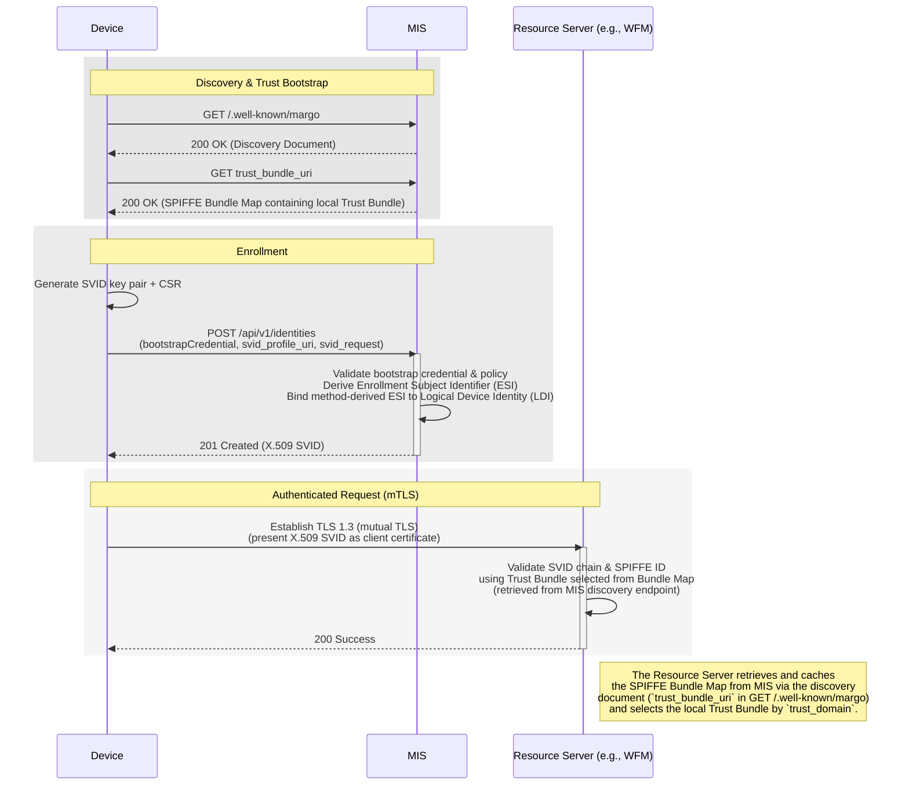
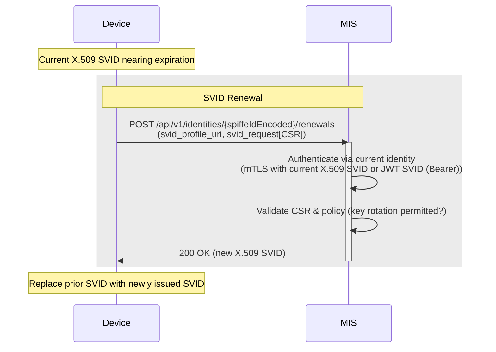
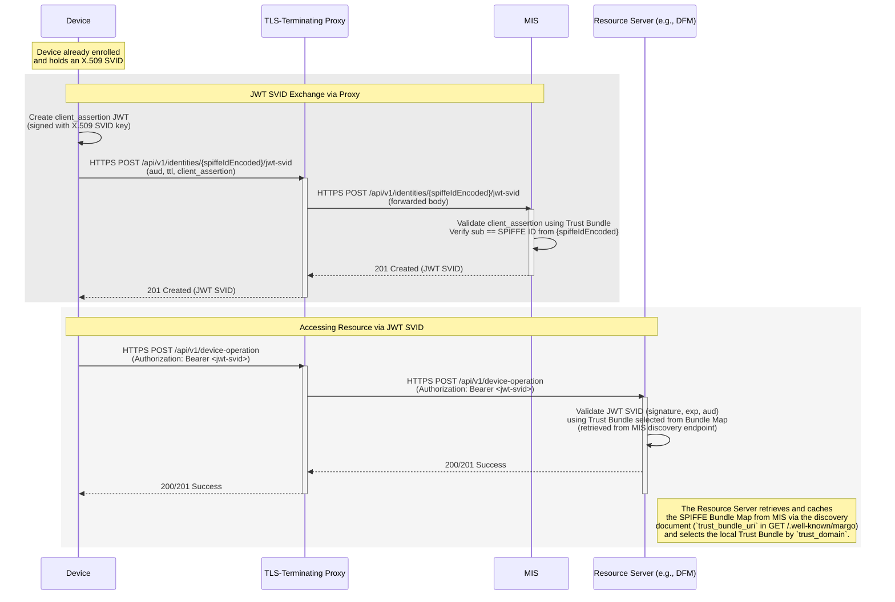
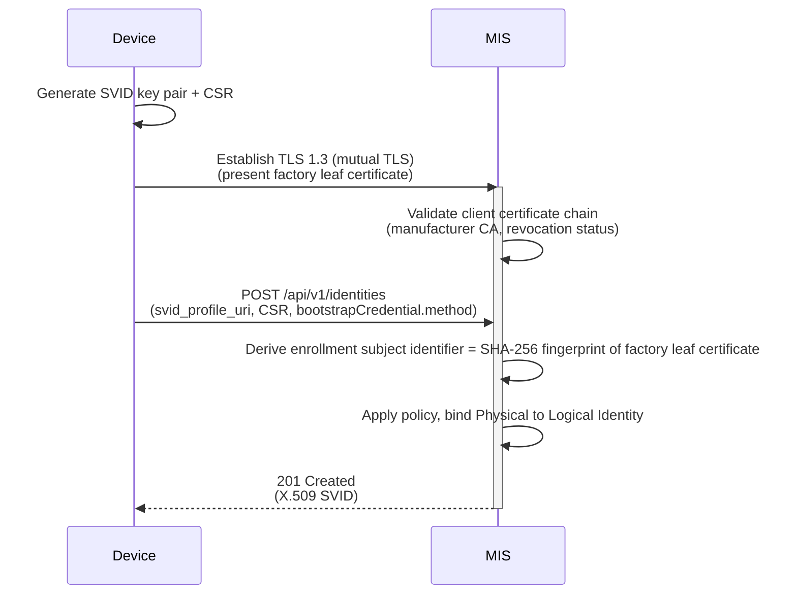
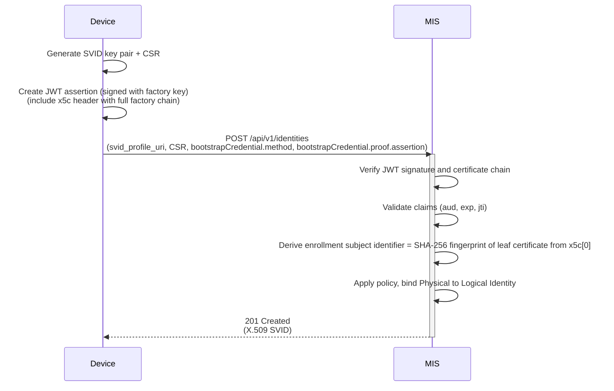
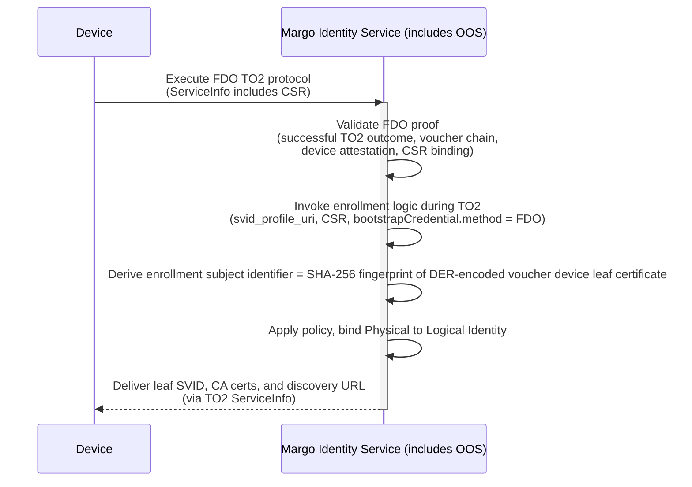
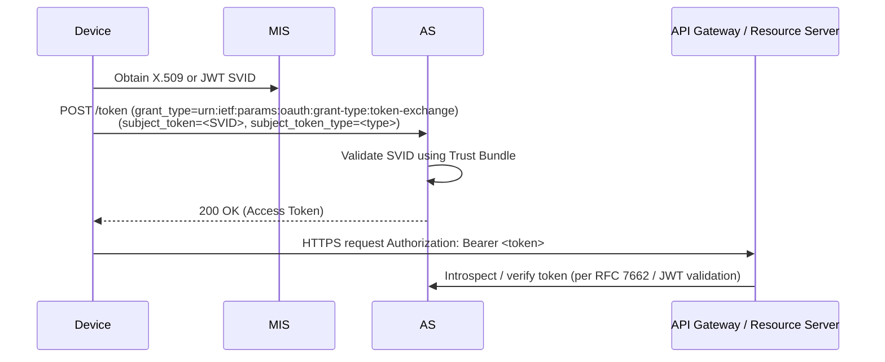

# Specification Update Proposal <!-- omit from toc -->

- [Owner](#owner)
- [Summary](#summary)
- [Reason for proposal](#reason-for-proposal)
- [Requirements alignment acknowledgement](#requirements-alignment-acknowledgement)
- [Technical proposal](#technical-proposal)
  - [1. Scope and Structure](#1-scope-and-structure)
  - [2. Terminology](#2-terminology)
  - [3. Margo Identity and Authorization Framework (MIAF)](#3-margo-identity-and-authorization-framework-miaf)
    - [Framework overview](#framework-overview)
    - [Identity model](#identity-model)
    - [SVID profiles and negotiation](#svid-profiles-and-negotiation)
      - [X.509 SVID Profile](#x509-svid-profile)
      - [JWT SVID Profile](#jwt-svid-profile)
    - [Trust Bundles and Distribution](#trust-bundles-and-distribution)
    - [Cryptographic Requirements](#cryptographic-requirements)
    - [MIS Deployment Modes (Informative)](#mis-deployment-modes-informative)
  - [4. Edge Compute Device Identity Profile](#4-edge-compute-device-identity-profile)
    - [Profile Scope](#profile-scope)
    - [Logical Device Identity](#logical-device-identity)
    - [Logical Device Identity Lifecycle](#logical-device-identity-lifecycle)
    - [Profile-specific Constraints on the X.509 SVID Profile](#profile-specific-constraints-on-the-x509-svid-profile)
    - [Profile-specific Enrollment and Identity Issuance](#profile-specific-enrollment-and-identity-issuance)
    - [Device Key Protection](#device-key-protection)
    - [JWT SVID Exchange (Optional)](#jwt-svid-exchange-optional)
  - [5. APIs](#5-apis)
    - [Common URI and Encoding Rules](#common-uri-and-encoding-rules)
    - [Discovery Document Endpoint](#discovery-document-endpoint)
    - [Trust Bundle Retrieval Endpoint](#trust-bundle-retrieval-endpoint)
    - [Enrollment and Identity Issuance Endpoint](#enrollment-and-identity-issuance-endpoint)
    - [SVID Renewal Endpoint](#svid-renewal-endpoint)
    - [JWT SVID Exchange Endpoint](#jwt-svid-exchange-endpoint)
    - [Revocation List Endpoint](#revocation-list-endpoint)
  - [6. Typical Workflows (informative)](#6-typical-workflows-informative)
    - [End-to-End Device Lifecycle Flow](#end-to-end-device-lifecycle-flow)
    - [Device SVID Renewal Flow](#device-svid-renewal-flow)
    - [JWT SVID Usage in Proxy Scenarios](#jwt-svid-usage-in-proxy-scenarios)
    - [Bootstrap Method Flows](#bootstrap-method-flows)
      - [Example: Factory Certificate Method (mTLS)](#example-factory-certificate-method-mtls)
      - [Example: Factory Certificate Method (JWT Assertion)](#example-factory-certificate-method-jwt-assertion)
      - [Example: FIDO Device Onboard (MIS-integrated OOS)](#example-fido-device-onboard-mis-integrated-oos)
      - [Example: Enrollment Token Method](#example-enrollment-token-method)
  - [7. Transport Layer Security (TLS) Requirements](#7-transport-layer-security-tls-requirements)
    - [Relationship to MIAF and Profiles](#relationship-to-miaf-and-profiles)
    - [Initial Trust Bootstrap](#initial-trust-bootstrap)
    - [Minimum TLS Baseline](#minimum-tls-baseline)
    - [Certificate Validation](#certificate-validation)
  - [8. Security Considerations](#8-security-considerations)
    - [Threat Model Overview](#threat-model-overview)
  - [9. Future Work: WFM Client Identity Profile (Informative)](#9-future-work-wfm-client-identity-profile-informative)
- [Alternatives considered (optional)](#alternatives-considered-optional)
  - [Certificate-Based Device Enrollment Protocols](#certificate-based-device-enrollment-protocols)
    - [Rationale for standardized `/api/v1/identities` endpoint](#rationale-for-standardized-apiv1identities-endpoint)
  - [OAuth 2.0 / Authorization Server Integration](#oauth-20--authorization-server-integration)
  - [Alternative Trust Frameworks](#alternative-trust-frameworks)
- [Appendix A: Bootstrap Methods (Normative)](#appendix-a-bootstrap-methods-normative)
  - [Common Bootstrap Contract Requirements](#common-bootstrap-contract-requirements)
  - [FIDO Device Onboard (FDO) Method](#fido-device-onboard-fdo-method)
  - [Factory Certificate Method (mTLS)](#factory-certificate-method-mtls)
  - [Factory Certificate Method (JWT Assertion)](#factory-certificate-method-jwt-assertion)
  - [Enrollment Token Method](#enrollment-token-method)
  - [Using IEEE 802.1AR DevIDs with Bootstrap Methods (Informative)](#using-ieee-8021ar-devids-with-bootstrap-methods-informative)
- [Appendix B: Error Responses (Normative)](#appendix-b-error-responses-normative)
  - [Error Representation Format](#error-representation-format)
  - [Problem Details Object Schema](#problem-details-object-schema)
  - [Error Type Conventions](#error-type-conventions)
  - [Error Handling for Specific APIs](#error-handling-for-specific-apis)
  - [Example - Unsupported Bootstrap Method](#example---unsupported-bootstrap-method)
  - [Example - Invalid Enrollment Token](#example---invalid-enrollment-token)
  - [Client Behavior Recommendations](#client-behavior-recommendations)
- [Appendix C: OAuth2 and API Gateway Interoperability (Informative)](#appendix-c-oauth2-and-api-gateway-interoperability-informative)
  - [Purpose and Context](#purpose-and-context)
  - [Token Exchange Bridge](#token-exchange-bridge)
    - [Token Exchange Request](#token-exchange-request)
    - [Token Exchange Response](#token-exchange-response)
    - [Validation and Security Considerations](#validation-and-security-considerations)

## Owner

[@matlec](https://github.com/matlec)

## Summary

This Specification Update Proposal introduces the **Margo Identity and Authorization Framework (MIAF)** and defines its first normative **Edge Compute Device Identity Profile**.

**MIAF** provides a common foundation for identity, authentication, and authorization across all **Margo components** - including the **Device Fleet Manager (DFM)**, **Workload Fleet Manager (WFM)**, and their respective clients.
With this SUP, that vision becomes tangible through its first concrete application: a unified identity model for Edge Compute Devices.

MIAF defines:

- a **Margo Identity Service (MIS)** that issues, renews, and revokes identities within a **Trust Domain**, and
- a shared identity and trust model based on cryptographically verifiable credentials, aligned with open cloud-native identity standards, with its first normative application defining device identity.

A **Trust Domain** is the security boundary of a Margo deployment - for example, an end-user's factory network or a multi-tenant environment operated by a fleet management vendor. Within a Trust Domain, identities, policies, and trust anchors are governed consistently and understood by all participating Margo components.

This SUP defines roles, profiles, and APIs for Margo deployments. It does **not** define or provide a centrally operated identity service.

Preview Release 1 (PR1) focuses on **Workload Fleet Management** and defines the **Margo Management Interface for Workload Fleet Management**, where a **WFM Client**, running on an Edge Compute Device (standalone or as a single-node Kubernetes cluster), connects securely to its **WFM** using client-provided certificates and WFM-specific *client identifiers*.
This proves that a Margo Management Interface can be secured, but it does **not** define a portable, verifiable identity for the **Edge Compute Device** itself, nor a shared trust model that other Margo components can reuse.

This SUP therefore does two things:

1. **Defines MIAF** - a framework for non-human identity and authorization in Margo, based on cryptographically verifiable identities following open, widely adopted cloud-native standards. It aligns Margo with modern IT practices while remaining extensible to enterprise PKI and API gateway infrastructures where needed.
2. **Applies MIAF to Edge Compute Devices** through the **Edge Compute Device Identity Profile**, which introduces a persistent, verifiable **device identity**, a defined lifecycle, and an **extensible bootstrap mechanism**. This model allows Margo to leverage standard onboarding methods (for example, **FIDO Device Onboard** and **factory certificates**, including **IEEE 802.1AR DevIDs**) and to support **late binding** to a Trust Domain.

In short:

> **PR1 gave us WFM Client identities. This SUP gives us Device identities - under a framework that every Margo component can build on.** MIAF directly replaces PR1's device onboarding, trust anchor distribution, and cryptographic requirements with a unified, standards-based approach, and lays the groundwork for replacing PR1's client authentication model. A future **WFM Client Identity Profile** will build on this device identity foundation to address the distinct authentication needs of WFM Clients across standalone, cluster, and gateway topologies.

This proposal is:

- a key enabler for **Device Fleet Management**,
- a foundation for **multi-vendor deployments**, where Edge Compute Devices, DFMs, and WFMs can share a consistent and verifiable device identity model, and
- a **common basis** for Margo components to:

  - **express and verify identities** (who is calling), and
  - **enforce authorization policies** (what they are allowed to do)

  within a shared **Trust Domain**.

Finally, this identity foundation **enables** - though does not yet integrate with - related work such as the **[Gateway SUP](https://github.com/margo/specification-enhancements/blob/28f04d64e8cedad8b82dad09840d0918bf6c699a/proposals/single-client-for-multiple-devices.md)** by providing the Logical Device Identity model that gateway-capable Edge Compute Devices could build upon in the future.

## Reason for proposal

### Current state in PR1 <!-- omit from toc -->

Preview Release 1 (PR1) focuses on **Workload Fleet Management (WFM)** and defines a secure Management Interface between a **WFM Client**, running on an Edge Compute Device, and its corresponding **Workload Fleet Manager**.

- Each WFM assigns a `client_id` to the WFM Client and associates it with a **client-provided certificate**.
- This certificate is used to:

  - establish a secure HTTPS connection (server-side TLS authentication), and
  - sign HTTP payloads using an [RFC 9421](https://datatracker.ietf.org/doc/html/rfc9421)-based request-signing mechanism.

This design achieves its goal for PR1: it enables the WFM Client to authenticate to its WFM and securely exchange **desired and actual workload deployment state** and **device capability information**.

However, PR1's identity model ends at the WFM boundary. It does **not** define:

- how to represent the **Edge Compute Device** itself as a verifiable identity within Margo,
- how other Margo components (for example, the **Device Fleet Manager (DFM)**, **Observability services**, or **Container Registries**) can rely on a shared trust model, or
- how device or client identities are **enrolled, renewed, revoked, or audited** throughout their operational lifetime.

As a result, the current system cannot provide consistent trust or authorization across multiple Margo components or vendors.

### Limitations of the PR1 Identity Model <!-- omit from toc -->

While PR1 successfully secures the Management Interface for WFM, its identity model is narrowly scoped to that single interface.
It does not yet provide a framework for consistent, lifecycle-managed identities across the broader Margo ecosystem.

- **No standardized device identity:** PR1 identifies WFM Clients, but not the underlying hardware platform. Other components (such as DFMs, registries, or observability platforms) cannot correlate activity to a specific physical device across the fleet.
- **Siloed trust anchors:** Each WFM manages its own trust configuration. There is no shared mechanism to distribute trust anchors across a deployment, requiring operators to manually configure trust for every new component or vendor.
- **Undefined identity lifecycle:** PR1 provides no guidance on how device credentials are renewed, rotated, or revoked over time. This creates operational risk for long-lived devices and large fleets, where credentials must be managed automatically and at scale.
- **No shared authorization model:** PR1 defines only binary trust decisions (trusted or untrusted) within the WFM boundary. There is no consistent way for other Margo components to evaluate what a verified entity is *allowed* to do based on its identity.
- **Unutilized supply-chain credentials:** Many devices already include hardware-based credentials such as TPM keys, FIDO Device Onboard (FDO) vouchers, or IEEE 802.1AR DevIDs. PR1 does not define how these can be reused for onboarding, leading to proprietary, non-interoperable solutions.

This proposal addresses these gaps by clearly separating two concepts:

- a **Device Identity**, representing the physical or virtual platform itself, and
- a **Client or Workload Identity**, representing the software components that operate on that platform (such as the WFM Client).

The new device-level identity defined in this SUP establishes a **trusted foundation** for the platform - a verifiable identity for the device within a Trust Domain, with assurance derived from the selected bootstrap method and the platform's key-protection capabilities.
Once this trusted base exists, additional software components running on the device (for example, WFM Clients or managed workloads) can securely obtain their **own, distinct identities** in future extensions of the framework.
This layered model ensures that platform trust and software trust are managed independently, enabling secure, auditable, and interoperable relationships across the Margo ecosystem.

### What this SUP introduces <!-- omit from toc -->

To address these limitations, this SUP **replaces PR1's device identity and onboarding model, and lays the foundation for replacing its client authentication model,** by introducing two closely related elements:

1. **The Margo Identity and Authorization Framework (MIAF):** A shared framework for all Margo components, based on cryptographically verifiable identities and a unified trust-domain model.
   It enables authentication and authorization decisions to be made directly using verifiable identities.

2. **The Edge Compute Device Identity Profile:** The first concrete application of MIAF, providing a consistent device identity model for Edge Compute Devices.
   This profile defines:

   - a stable **device identity** for each edge node,
   - how that identity is represented in X.509 certificates, and
  - lifecycle operations and **bootstrap methods** that map device bootstrap credentials - including hardware credentials (for example, FDO vouchers, TPM-protected keys, or IEEE 802.1AR DevIDs) and operator-issued enrollment tokens - into the Margo identity model.

Together, these establish the foundation for interoperable identity and trust across Margo components and vendors, replacing PR1's device onboarding and trust model with a unified, lifecycle-managed approach and providing the basis for future WFM Client identity changes.

### Relationship to PR1 <!-- omit from toc -->

MIAF replaces core elements of the device identity, trust, and onboarding model introduced in Preview Release 1, and defines the framework that will enable replacement of WFM client authentication in a future profile.

**Directly replaced by this SUP:**

- **Device identity foundation:** PR1's device-facing identity and per-WFM trust model are replaced by Trust Domain-scoped device identities issued by the Margo Identity Service (MIS). The device's identity is no longer WFM-specific but portable across all Margo components within the Trust Domain.
- **Onboarding:** PR1's WFM-centric onboarding flow (`POST /api/v1/onboarding`) is replaced by MIAF's bootstrap and enrollment mechanism (`POST /api/v1/identities`), which binds validated device bootstrap material, represented by a method-derived Enrollment Subject Identifier (ESI), to a Logical Device Identity within the Trust Domain. For PDI-based methods, that binding is rooted in validated Physical Device Identity evidence.
- **Trust anchor distribution:** PR1's per-WFM root CA endpoint (`GET /api/v1/onboarding/certificate`) is replaced by the SPIFFE Trust Bundle, retrieved from a standardized Trust Bundle endpoint and distributed in the SPIFFE Bundle Map format.
- **Cryptographic requirements:** PR1's permitted signature algorithms are superseded by MIAF's cryptographic requirements.
- **Device security requirements:** PR1's informational references to hardware key protection (TPM, secure boot, attestation) become normative requirements under MIAF's [Device Key Protection](#device-key-protection) section.

**Enabled but not yet defined by this SUP:**

A dedicated **WFM Client Identity Profile** (see [Future Work](#future-work-wfm-client-identity-profile-informative)) is expected to:

- replace PR1's WFM-specific `client_id` model with a MIAF-defined WFM Client identity;
- define the SPIFFE ID path format for WFM Client identities within the Trust Domain;
- define how device identities are used to bind WFM Client credentials for each supported deployment topology;
- address the lifecycle requirements of each supported topology (standalone, cluster, gateway); and
- inform the corresponding updates to the WFM API specification (for example, replacing `{clientId}` path parameters and PR1's [RFC 9421](https://datatracker.ietf.org/doc/html/rfc9421) HTTP Message Signatures security scheme with MIAF-based authentication).

Until that profile is defined, this SUP does **not** specify how WFM Clients authenticate to WFM APIs. A device SVID is not itself a WFM Client credential. The device identity defined here is the prerequisite for, but not a substitute for, WFM Client identity.

The WFM API's **API behavior** - desired state retrieval, deployment content distribution, and status reporting - is not changed by this SUP.

## Requirements alignment acknowledgement

This SUP supports Margo's core goals of **security**, **scalability**, **interoperability**, and **flexibility**, and aligns directly with the Product Management Group's roadmap epics.

### Security <!-- omit from toc -->

- Establishes a **cryptographically verifiable identity model** for Edge Compute Devices within a Trust Domain, using open, cloud-native non-human identity standards.
- Introduces stronger guidance and extensions around protecting private keys associated with device identities, refining the Margo Device Requirements specification.
- Authentication - and the basis for authorization decisions - is provided directly by verified device identities, rather than opaque, ad-hoc credentials.
- The MIS and associated trust-bundle mechanisms provide standard, auditable points for identity issuance, renewal, and publication of revocation state.

### Scalability <!-- omit from toc -->

- Separates **identity issuance and lifecycle management** (MIS) from individual consuming components, allowing MIS to scale independently while devices and services validate identities locally.
- Margo components such as the DFM can validate identities using trust bundles and profile rules, avoiding per-session coupling with MIS and minimizing centralized state.
- Standard enrollment and renewal APIs, standardized replacement authorization conveyance, and publication of revocation state simplify long-term fleet management.

### Interoperability <!-- omit from toc -->

- Builds on open, widely adopted cloud-native identity standards (for example, SPIFFE/SVID) for non-human identity.
- Integrates cleanly with existing enterprise PKI and identity infrastructures that can issue or validate the underlying certificates used for device identities.
- Defines a **bootstrap-independent Logical Device Identity format**, enabling devices from multiple vendors to interoperate within a shared Trust Domain and be managed consistently by DFM and other components.
- Provides informative mappings to OAuth2 or API-gateway models for deployments that wish to reuse existing authorization infrastructure.

### Flexibility and resilience <!-- omit from toc -->

- The **pluggable bootstrap mechanism** supports multiple device bootstrap methods, including PDI-based proofs (FIDO Device Onboard, factory certificates - including IEEE 802.1AR DevIDs) and operator-issued enrollment tokens, ensuring wide hardware and deployment coverage.
- All supported bootstrap methods converge to the same Logical Device Identity, allowing operators to:

  - start with existing factory-issued X.509 certificates, and
  - raise assurance levels over time (for example, mandate FDO or hardware-rooted credentials such as 802.1AR IDevIDs for production) without changing DFM or other consumers of the identity model.
- Support for both mTLS-based and JWT-style identity representations (for example, JWT-SVID in proxy-rich environments) allows deployments to operate behind TLS-terminating infrastructure while keeping a single, consistent identity model.

### Alignment with Product Management Epics <!-- omit from toc -->

- **[Parent Epic 5: Build a Margo compatible edge device (#41)](https://github.com/margo/product_management/issues/41):**
  Satisfies **[#56](https://github.com/margo/product_management/issues/56)** by defining the minimal identity and security capabilities every Margo-compatible device must implement and by extending the device requirements around key protection and identity representation.
- **[Parent Epic 6: Enroll an edge device with a workload fleet manager (#42)](https://github.com/margo/product_management/issues/42):**
  Replaces PR1's WFM-centric onboarding model with a Trust Domain-scoped enrollment mechanism based on standardized **device-level identity** and extensible bootstrap methods, aligning with **[#57](https://github.com/margo/product_management/issues/57)** and supporting late binding and pre-provisioned credentials (**[#62](https://github.com/margo/product_management/issues/62)**, **[#63](https://github.com/margo/product_management/issues/63)**).
- **[Parent Epic 12: Manage enrolled edge devices (#48)](https://github.com/margo/product_management/issues/48):**
  Provides the lifecycle primitives and lifecycle-state semantics required for large-scale device management and auditability, including enrollment, renewal, replacement, revocation, and termination.
- **[Parent Epic 7: Enroll an edge device with a device fleet manager (#43)](https://github.com/margo/product_management/issues/43):**
  Supplies the trust model for DFM onboarding and verification (**[#58](https://github.com/margo/product_management/issues/58)**, **[#64](https://github.com/margo/product_management/issues/64)**), enabling consistent authenticity verification across devices.

Together, these ensure that this SUP is not a standalone addition but the **identity foundation** for Margo's evolution - including **Device Fleet Management**, **gateway use cases**, and future profiles extending MIAF to additional Margo components such as WFM clients or telemetry agents.

## Technical proposal

### 1. Scope and Structure

This Specification Update Proposal defines the normative technical foundation for **non-human identity and authorization** in the Margo ecosystem.

It introduces the **Margo Identity and Authorization Framework (MIAF)** and applies it to the first concrete use case: the **Edge Compute Device Identity Profile**.

This SUP is therefore two-layered:

- **Framework (MIAF):** shared trust and identity concepts for any Margo component:

  - how a **Margo Identity Service (MIS)** issues, renews, and revokes identities;
  - how identities are expressed as verifiable credentials (**SVIDs**); and
  - how policies and **Trust Bundles** define the security boundary of a **Trust Domain**.

- **Edge Compute Device Identity Profile:** a specialization for Edge Compute Devices:

  - the **Logical Device Identity (LDI)**, its lifecycle, and its **X.509** representation;
  - handling of hardware-bound keys and **Bootstrap Credentials**; and
  - normative APIs for enrollment and renewal of device identities, plus standardized replacement authorization conveyance and revocation-state publication.

The **normative core** of this SUP is based on cryptographically verifiable identities.
Authentication and authorization decisions are performed directly using these identities (for example, mTLS with an **X.509 SVID**).
Where mTLS is not feasible, a short-lived **JWT SVID** may be issued as a bearer credential. Optional mappings to OAuth 2.0 or enterprise token infrastructures are provided in an [informative appendix](#appendix-c-oauth2-and-api-gateway-interoperability-informative) and are **not required for compliance**.

A conceptual overview of how the **Margo Identity Service**, **Trust Domains**, and Margo components interact appears as an informative architecture diagram at the start of [Section 3](#3-margo-identity-and-authorization-framework-miaf).

#### Relationship to SPIFFE <!-- omit from toc -->

MIAF is intended to **reuse SPIFFE identity primitives** rather than invent Margo-specific credential formats or trust semantics.
In particular, this SUP:

- **adopts by reference** the SPIFFE concepts of **Trust Domain**, **SPIFFE ID**, **X.509-SVID**, **JWT-SVID**, and **Trust Bundle / Bundle Map**;
- **profiles or constrains** some of those standards where Margo needs device-specific rules; and
- **defines new Margo-specific behavior** for device bootstrap, lifecycle management, discovery, enrollment, renewal, revocation, and profile-specific authorization behavior.

This SUP does **not** use the **SPIFFE Workload API** or **SPIFFE Workload Endpoint** as the normative interface for the device bootstrap and lifecycle APIs defined here. Those specifications define a local gRPC-based interface for workload identity delivery. The APIs defined here are **remote HTTPS lifecycle interfaces** designed for the device bootstrap and management problem.

Existing SPIFFE libraries and tooling can be used for SVID validation, Trust Bundle handling, and SPIFFE ID processing. Principals covered by a MIAF profile that defines specific bootstrap and lifecycle requirements - such as Edge Compute Devices under the profile defined in this SUP - **MUST** use the bootstrap methods, device identity lifecycle, discovery, and remote APIs defined by that profile. Other Margo components within the same **Trust Domain** **MAY** obtain their SPIFFE identities through any SPIFFE-conformant mechanism (for example, SPIRE Agent node attestation against a SPIFFE-conformant server backing the MIS), provided the resulting SVIDs are issued under the authoritative trust anchors of the Trust Domain. A conformant implementation **MAY** also expose a local SPIFFE Workload API / Workload Endpoint as an implementation mechanism for local identity delivery or future profiles, provided this does not replace or alter the normative bootstrap methods, discovery, device identity lifecycle, or remote APIs defined by the applicable profile.

| Topic | Source | Notes |
| :---- | :----- | :---- |
| SPIFFE ID syntax and validation rules | SPIFFE, adopted by reference | This SUP defines only Margo path conventions where needed. |
| X.509-SVID baseline semantics | SPIFFE, adopted by reference + constrained | This SUP adds device-profile constraints. |
| JWT-SVID baseline semantics | SPIFFE, adopted by reference + constrained | This SUP defines device-profile usage and exchange behavior. |
| Trust Bundle / Bundle Map | SPIFFE, adopted by reference | This SUP defines discovery and retrieval conventions around it. |
| Discovery document | Margo | Not part of SPIFFE. |
| Enrollment / renewal / revocation-state publication / JWT exchange APIs | Margo | Remote HTTPS lifecycle interfaces; a deployment may additionally expose local SPIFFE Workload API / Workload Endpoint interfaces without changing these normative Margo APIs. |
| LDI / PDI / ESI model | Margo | Device-specific concepts introduced by this SUP. |
| Bootstrap methods | Margo + external standards | FDO, factory-certificate, and enrollment-token methods are integrated here. IEEE 802.1AR DevIDs are usable as factory certificates within the existing methods. |

### 2. Terminology

The following terms define the common vocabulary for Margo's non-human identity and authorization model.
Some are adopted directly from open standards such as [**SPIFFE**](https://spiffe.io/); others are Margo-specific concepts introduced by this SUP.

This SUP concerns identities used by *non-human* **Margo components** - logical units of the Margo system such as the Device Fleet Manager (DFM), Workload Fleet Manager (WFM), their clients, and infrastructure services such as registries or observability collectors, as defined in the [Envisioned System Design](https://specification.margo.org/overview/envisioned-system-design/).

The **WFM Client** is called out specifically because this SUP draws a sharp distinction between *device identity* and *client identity*. A WFM Client runs on an Edge Compute Device, but its identity represents the deployed **client instance**, not the device itself. The **Logical Device Identity** defined here provides the stable, lifecycle-managed identity of the device; a planned **WFM Client Identity Profile** will define how WFM Clients obtain their own distinct identities, building on the device identity as their authentication foundation. This separation is necessary because device identity and WFM Client identity have different lifecycles, authorization scopes, and cardinalities across topologies (standalone devices, Kubernetes clusters, device gateways).

#### Terms adopted from SPIFFE <!-- omit from toc -->

The following terms are used as defined by SPIFFE. This SUP does not redefine them; it applies them within the Margo context.

##### Trust Domain <!-- omit from toc -->

The governed security boundary within which identities are issued and mutually recognized. This SUP uses **Trust Domain** in the SPIFFE sense: a trust-root-backed identity namespace and policy boundary. A Trust Domain defines:

- authoritative **trust anchors** (root and intermediate CAs);
- the namespace for **SPIFFE IDs**; and
- policies for identity lifecycle and authorization.

##### SPIFFE Verifiable Identity Document (SVID) <!-- omit from toc -->

The verifiable credential representing an identity within a Trust Domain. An SVID binds a SPIFFE ID to a key pair.
This SUP adopts SPIFFE **X.509-SVID** and **JWT-SVID** by reference and defines how Margo components use them. For the Edge Compute Device Identity Profile, LDIs are represented by **X.509 SVIDs**, while **JWT SVIDs** are optional derived credentials for short-lived bearer use in non-mTLS scenarios.

#### Terms introduced by this SUP <!-- omit from toc -->

The following terms are defined by this SUP. They represent Margo-specific concepts that build on the SPIFFE primitives above.

##### Policy-Based Authorization <!-- omit from toc -->

Authorization based on verified **SPIFFE IDs** and associated attributes, evaluated locally within the Trust Domain - not on external token scopes.

##### Margo Identity Service (MIS) <!-- omit from toc -->

A role that each Margo deployment must fill: the identity service within a Margo deployment that issues, renews, and revokes identities for components in a Trust Domain.
The MIS validates **Bootstrap Credentials**, enforces Trust Domain policy, and binds validated bootstrap material, represented by a method-derived **Enrollment Subject Identifier (ESI)**, to a stable identity within the Trust Domain. For PDI-based or hardware-attested methods, that binding may be anchored in device-bound evidence. For this SUP, MIS issues **device identities** under the Edge Compute Device Identity Profile. Future SUPs may extend MIS to issue identities for other components such as WFM Clients or workloads.
The MIS is **not** a centrally provided Margo implementation; vendors, operators, or deployment tooling provide the actual service.

##### Logical Device Identity (LDI) <!-- omit from toc -->

The persistent, verifiable identity assigned to an **Edge Compute Device** within a Trust Domain. It is expressed as a SPIFFE URI, for example:

```text
spiffe://<trust-domain>/margo/device/<uuid-v4>
```

and represented by an **X.509 SVID**.
The LDI remains stable across hardware replacement or firmware updates when policy permits rebinding and serves as the anchor for device-level authentication and authorization.

##### Physical Device Identity (PDI) <!-- omit from toc -->

A hardware-rooted credential or attested bootstrap identity source used during enrollment, such as a factory X.509 certificate, a TPM-/TEE-protected key, a certificate-backed **FIDO Device Onboard (FDO)** device attestation chain bound to a successful onboarding session, or an **IEEE 802.1AR DevID**. The MIS verifies the PDI, directly or through an authorized bootstrap intermediary defined by the selected method, and binds it to a **Logical Device Identity** during enrollment.

##### Bootstrap Credential <!-- omit from toc -->

Evidence presented to the MIS, or conveyed through an authorized bootstrap intermediary, to prove authenticity during initial enrollment.
For devices, it typically carries or references evidence of the **Physical Device Identity**. For methods that do not rely on a PDI (such as enrollment tokens), it carries operator-issued enrollment credentials. Each supported **Bootstrap Method** defines the authenticated actor, the proof format or validated bootstrap result, the ESI derivation rule, and the method-specific verification requirements.

##### Bootstrap Method <!-- omit from toc -->

A pluggable, normative method by which a Margo component, or an authorized intermediary defined by the method, satisfies the MIAF bootstrap contract for enrollment.
This SUP defines methods for Edge Compute Devices, including **FDO**, **factory certificate** (via mTLS or JWT assertion), and **enrollment token**. Future SUPs may introduce methods for other Margo components.

##### Enrollment Subject Identifier (ESI) <!-- omit from toc -->

A deterministic, globally unique identifier derived by the MIS from the validated bootstrap proof material defined by the selected **Bootstrap Method** during enrollment.
It is used to decide whether the presented bootstrap proof corresponds to an existing identity within the Trust Domain or a new one.

The derivation is **method-specific** and defined by each **Bootstrap Method**.
*Example (device profile):* from a verified PDI, the ESI may be the certificate fingerprint, a hash derived from a device certificate contained in an FDO Ownership Voucher, or (for token-based methods) a hash of an operator-issued token identifier.
ESIs **MUST** be stable for repeated enrollments using the same bootstrap credential state, **MUST** be unique within the Trust Domain, and **MUST NOT** be reversible to the original credential material.

##### JWT SVID Exchange <!-- omit from toc -->

An API by which a holder of a valid **X.509 SVID** requests a short-lived **JWT SVID** for use behind TLS-terminating infrastructure. The request uses a **Client Authentication Assertion** signed with the SVID's private key.

### 3. Margo Identity and Authorization Framework (MIAF)

The **Margo Identity and Authorization Framework (MIAF)** defines how Margo components establish trust, authenticate, and are authorized within a **Trust Domain**.

MIAF prevents per-component identity silos by standardizing:

- how identities are **issued, renewed, and revoked** by the **Margo Identity Service (MIS)**;
- how identities are represented as **[SVIDs](https://github.com/spiffe/spiffe/blob/main/standards/SPIFFE.md)**; and
- how **policy-based authorization** is applied to verified **SPIFFE IDs**.

> **Architectural principle:** *Identity* ("who you are") and *authorization* ("what you can do") are distinct. MIAF defines the shared, verifiable identity layer; components apply local policy for authorization.

#### Framework overview

Conceptually, the **Margo Identity and Authorization Framework (MIAF)** consists of four main elements that together define how trust is established and maintained across the Margo ecosystem:

1. **Trust Domain**
   
   The logical and administrative boundary within which identities are issued and mutually recognized - for example, an end-user's factory network or a managed service operated by a fleet-management vendor.
   A Trust Domain defines:

   - the authoritative **trust anchors** (root and intermediate CAs);
   - the namespace for **SPIFFE IDs** (e.g., `spiffe://factory.example/...`);
   - and the **policies** governing identity lifecycle and authorization within that boundary.

   Each issued SPIFFE ID is scoped to exactly one Trust Domain; verifiers **MAY** validate identities from multiple Trust Domains via configuration and/or federation.

2. **Margo Identity Service (MIS)**
   
   The identity authority of a Trust Domain.
   MIS is responsible for:

   - validating **Bootstrap Credentials** presented by components during enrollment;
   - issuing, renewing, and revoking **SVIDs** for identities in the Trust Domain; and
  - maintaining the authoritative binding between method-derived **Enrollment Subject Identifiers (ESIs)** and **Logical Device Identities (LDIs)** for devices covered by this SUP.

   MIS exposes a consistent set of APIs - **discovery**, **enrollment**, **renewal**, **revocation**, and **JWT SVID exchange** - that all identity profiles build upon.
   This API design allows other components (e.g., WFM Clients or telemetry agents) to reuse the same trust foundation in future SUPs.

3. **Margo components using MIAF**
   
   Components such as DFMs, WFMs, their clients, and telemetry agents act as:

   - **SVID holders**, presenting their SVIDs during mTLS authentication or when requesting a short-lived **JWT SVID**; and
   - **verifiers**, validating peer SVIDs using the Trust Domain's **Trust Bundle**, then applying **policy-based authorization** based on verified **SPIFFE IDs** and attributes.

4. **Trust Bundles**
   
   Each Trust Domain publishes a **Trust Bundle** containing:

   - root and intermediate certificates used to validate X.509 SVID chains; and
   - public keys used to verify JWT SVIDs (if used).

   Trust Bundles are identified by their Trust Domain name and distributed using the SPIFFE **Bundle Map mechanism**, as defined in the [SPIFFE Trust Domain and Bundle specification](https://github.com/spiffe/spiffe/blob/main/standards/SPIFFE_Trust_Domain_and_Bundle.md).
   Margo clients and servers use these bundles when validating SVIDs during mutual authentication.

A typical interaction sequence in MIAF (applicable to all Margo components, not just devices) is as follows. This sequence is **informative** and illustrates a typical flow; normative API details are in [Section 5](#5-apis).

1. **Discovery:** A Margo component locates MIS endpoints and Trust Bundle locations via the `.well-known/margo` discovery document defined in this SUP.
2. **Enrollment:** The component presents a **Bootstrap Credential** (per its Bootstrap Method) to the MIS and receives an **SVID** for its identity.
3. **Renewal:** Before expiry, the component renews its SVID via an authenticated request (for example, mTLS using the current SVID).
4. **Authentication to peers:** The component authenticates to other Margo components using mTLS with its **X.509 SVID**, or, where mTLS is not possible, using a short-lived **JWT SVID** obtained from the MIS.
5. **Authorization:** The receiving component validates the SVID (or JWT SVID) against the **Trust Bundle** and applies local **policy-based authorization** using the verified **SPIFFE ID** and associated attributes.

Specific details of these flows for **Edge Compute Devices** are defined later in the [Edge Compute Device Identity Profile](#4-edge-compute-device-identity-profile).

> **Conceptual Trust and Identity Architecture (Informative)**
> The diagram below illustrates MIAF in its most general form.
> Any Margo component - for example, a DFM Client, WFM Client, or OTEL Agent - enrolls with the **Margo Identity Service (MIS)** to obtain a verifiable identity, represented as either an **X.509 SVID** or a **JWT SVID** within a governed **Trust Domain**.
> Components authenticate to one another using these SVIDs:
>
> - X.509 SVIDs are typically used for mTLS-based authentication.
> - JWT SVIDs may be used for bearer-style authentication in environments with TLS-terminating proxies.
>
> The **Trust Domain** defines and distributes the **Trust Bundle** that all participants use to validate identities and enforce policy.
>
> ```mermaid
> flowchart LR
>  %% Figure 1: Conceptual Trust and Identity Architecture (Framework Level, Informative)
>
>  Client["**Margo Client Component**<br/>(e.g., DFM Client, WFM Client, Telemetry Agent)"]
>  Server["**Margo Server Component**<br/>(e.g., DFM, WFM, Observability Platform, Component Registry)"]
>  MIS["**Margo Identity Service (MIS)**<br/>Issues, renews, and revokes SVIDs"]
>  TD["**Trust Domain**<br/>Defines trust anchors, policies, and namespace"]
>  X509["**X.509 SVID**<br/>Certificate binding SPIFFE ID to key pair"]
>  JWT["**JWT SVID**<br/>Token binding SPIFFE ID to signed JWT claim set"]
>  TB["**Trust Bundle**<br/>Root and intermediate certificates,<br/>JWT verification keys"]
>
>  Client -->|"requests identity (X.509 SVID)"| MIS
>  MIS -->|"issues X.509 SVID"| X509
>  X509 -->|"certificate bound to locally generated private key"| Client
>  Client -->|"requests identity (JWT SVID)"| MIS
>  MIS -->|"issues JWT SVID"| JWT
>  Client -->|"authenticates using JWT SVID (bearer authentication)"| Server
>  Client -->|"authenticates using X.509 SVID (mTLS)"| Server
>  Server -->|"verifies SVID using Trust Bundle of"| TD
>  TD -->|"publishes"| TB
>
>  classDef comp fill:#e8f1ff,stroke:#5b8def,stroke-width:1px,rx:8px,ry:8px,color:#0b3b8c;
>  classDef ident fill:#e8f7ee,stroke:#2ca36b,stroke-width:1px,rx:8px,ry:8px,color:#0f5132;
>  classDef trust fill:#f7f7f7,stroke:#bdbdbd,stroke-width:1px,rx:8px,ry:8px,color:#333;
>
>  class Client,Server,MIS comp;
>  class X509,JWT ident;
>  class TD,TB trust;
> ```

#### Identity model

MIAF defines a unified identity model for all Margo components:

- **Identity representation:** An identity in a Trust Domain is named by a **SPIFFE ID** and represented by an **SVID** issued by the MIS.
  For devices, this SUP defines the **Logical Device Identity (LDI)** as the device-specific realization of that model.

- **Uniqueness and stability:** Each SPIFFE ID uniquely identifies one logical component within its Trust Domain.
  For devices, the **LDI** remains stable across hardware or firmware changes if policy permits rebinding.

- **Lifecycle:** All identities follow a consistent lifecycle:

  1. **Enrollment:** A new identity is created and an initial SVID is issued.
  2. **Active:** The SVID is valid and used for authentication.
  3. **Renewal:** The SVID is renewed before expiry.
  4. **Replacement:** The identity is rebound to new hardware or credentials (profile-specific).
  5. **Revocation:** The identity is invalidated due to compromise or policy.
  6. **Termination:** The identity is permanently retired.

  The **device-specific** realization of this lifecycle is defined later in [Logical Device Identity Lifecycle](#logical-device-identity-lifecycle).

- **Extensibility:**
  Although this SUP focuses on Edge Compute Devices, the same MIS, Trust Domain, SVID, and Trust Bundle concepts are intentionally generic.
  Future SUPs can therefore define profiles for other Margo components (such as WFM Clients or workloads) **without redefining** the underlying identity framework.

#### SVID profiles and negotiation

Within a Trust Domain, MIAF uses **[SPIFFE Verifiable Identity Documents (SVIDs)](https://github.com/spiffe/spiffe/blob/main/standards/SPIFFE.md)** to represent verifiable identities.
Each **SVID profile** defines how an identity is encoded, validated, and used for authentication (for example, as an **X.509 certificate** or a **JWT**).
Profiles are referenced by **profile URIs** in API exchanges.

This SUP uses two SPIFFE-defined SVID types:

- **X.509-SVID**, used for mTLS authentication; and
- **JWT-SVID**, used for bearer-style authentication.

> **Informative summary:**
> At the framework level, both are SVID-based representations of an identity. They differ in transport and validation semantics: X.509-SVIDs validate through certificate chains, while JWT-SVIDs validate through public keys distributed in the **Trust Bundle**.

For the **Edge Compute Device Identity Profile**, this SUP mandates:

- **X.509-SVIDs** as the only permitted representation for device enrollment and issuance of Logical Device Identities; and
- optional **JWT-SVIDs**, obtained only after enrollment via the **JWT SVID Exchange Endpoint**, for environments where end-to-end mTLS is not feasible.

**Profile identifiers:**

| Type        | Profile URI                                      | Status |
| :---------- | :----------------------------------------------- | :----- |
| `x509-svid` | `https://margo.org/profiles/spiffe/x509-svid/v1` | **Normative** ([adopts SPIFFE X.509-SVID by reference; constrained by this SUP](#x509-svid-profile)) |
| `jwt-svid`  | `https://margo.org/profiles/spiffe/jwt-svid/v1`  | **Normative** ([adopts SPIFFE JWT-SVID by reference; constrained by this SUP](#jwt-svid-profile)) |

A Trust Domain **MAY** support both types through the lifecycle APIs. Individual identity profiles define which types are permitted; for the Edge Compute Device Identity Profile, X.509-SVID is mandatory and JWT-SVID is optional and derived.
Future SUPs may introduce additional SVID profiles, but all **MUST** remain interoperable with the SPIFFE-based identity model used here.

##### X.509 SVID Profile

This SUP adopts the
[SPIFFE X.509-SVID specification](https://github.com/spiffe/spiffe/blob/main/standards/X509-SVID.md) by reference.
The following requirements are the **MIAF-specific constraints** that apply in addition to the base specification.

> **Informative summary:**
> An X.509-SVID carries exactly one SPIFFE ID in a URI SAN and is validated using the Trust Bundle for the SPIFFE ID's Trust Domain.

| Field | Requirement | Source | Notes |
| :---- | :---------- | :----- | :---- |
| **Subject Alternative Name (URI)** | Exactly one URI SAN containing the SPIFFE ID (e.g., `spiffe://<trust-domain>/margo/<component>/<uuid>`). | SPIFFE X.509-SVID | The SAN URI is the **only authoritative identity claim**; the Subject DN MUST be ignored. |
| **BasicConstraints** | `CA=false` for leaf SVIDs; `CA=true` permitted for intermediate issuers. | SPIFFE X.509-SVID | Issuer SVIDs SHOULD use `nameConstraints` to restrict SPIFFE ID namespaces. |
| **KeyUsage** | `digitalSignature` (**MUST**). `keyCertSign` and `cRLSign` **MUST NOT** be set. | SPIFFE X.509-SVID | Other usages such as `keyEncipherment` or `keyAgreement` **MAY** be set, per SPIFFE X.509-SVID. |
| **ExtendedKeyUsage** | If present, **MUST** follow the SPIFFE X.509-SVID specification. | SPIFFE X.509-SVID | MIAF does not introduce a different EKU rule at the framework level. |
| **Validity Period** | **RECOMMENDED:** <= 1 year | **MIAF** | Framework-level recommendation only. SPIFFE does not define validity period constraints; applicable identity profiles define binding maxima and narrower operational guidance. For devices, see [Profile-specific Constraints on the X.509 SVID Profile](#profile-specific-constraints-on-the-x509-svid-profile). |
| **NameConstraints** | **OPTIONAL** | SPIFFE X.509-SVID | May be used by MIS to limit valid SPIFFE ID namespaces. |

Validation (per SPIFFE X.509-SVID):

- Certificate chains **MUST** validate against the **Trust Bundle** of the Trust Domain.
- Each SPIFFE ID **MUST** be unique within its Trust Domain.

##### JWT SVID Profile

This SUP adopts the
[SPIFFE JWT-SVID specification](https://github.com/spiffe/spiffe/blob/main/standards/JWT-SVID.md) by reference.
The following requirements are the **MIAF-specific constraints** that apply in addition to the base specification.

> **Informative summary:**
> A JWT-SVID carries the SPIFFE ID in its `sub` claim and is validated using JWT signing keys from the Trust Bundle for the subject's Trust Domain.

| Field | Requirement | Source | Notes |
| :---- | :--------- | :----- | :----- |
| **`sub` (Subject Claim)** | MUST contain the SPIFFE ID. | SPIFFE JWT-SVID | Authoritative identity binding. |
| **`aud` (Audience Claim)** | MUST be present. | SPIFFE JWT-SVID | Specifies the intended verifier(s). |
| **Signature Algorithm** | MUST follow [Cryptographic Requirements](#cryptographic-requirements). | **MIAF** | SPIFFE allows a broader set of algorithms. |

Validation (per SPIFFE JWT-SVID):

- JWT-SVIDs are verified using **public keys** distributed via the **Trust Bundle**.
- Audience, expiry, and signature validation are mandatory.

#### Trust Bundles and Distribution

This SUP adopts the SPIFFE **Trust Domain and Bundle / Bundle Map** model by reference.
The following requirements describe how MIAF deployments publish and use Trust Bundles, and how clients retrieve them through SPIFFE Bundle Maps.

> **Informative summary:**
> A Trust Bundle contains the cryptographic material needed to validate SVIDs for exactly one Trust Domain. Trust Bundles from different Trust Domains must remain distinct and bound to the Trust Domain they represent.

Each Trust Domain maintains a **Trust Bundle**, the authoritative set of cryptographic material used to validate SVIDs within that domain.

A Trust Bundle **MUST** include:

- root and intermediate X.509 certificates for SVID chain validation; and
- public keys used to verify JWT SVID signatures.

Bundles:

- **SHOULD** be published and discovered via the SPIFFE [Trust Domain and Bundle Map](https://github.com/spiffe/spiffe/blob/main/standards/SPIFFE_Trust_Domain_and_Bundle.md);
- **MAY** be distributed through deployment tooling or provisioning flows;
- **MUST** be refreshed before expiry or rotation; and
- **SHOULD** be cached locally to support offline validation.

Validation process:

1. Determine the peer's Trust Domain from its SPIFFE ID.
2. Retrieve the SPIFFE Bundle Map (via the [discovery document](#discovery-document-endpoint)'s `trust_bundle_uri` or from cache) and select the corresponding Trust Bundle.
3. Validate the SVID chain or JWT signature using that Trust Bundle.
4. If validation succeeds and local policy allows, apply **policy-based authorization**.

Cross-domain trust is configured explicitly by associating a Trust Domain with the correct Trust Bundle. The SPIFFE Bundle Map format supports inclusion of bundles for multiple Trust Domains, which can serve as a basis for cross-domain trust. Full federation lifecycle semantics, as defined by SPIFFE Federation, are out of scope for this SUP and may be addressed in future work.

#### Cryptographic Requirements

All cryptographic operations under MIAF - including key generation, CSR signing, SVID issuance, and verification - **MUST** conform to [RFC 9325](https://datatracker.ietf.org/doc/rfc9325/) and [NIST SP 800-131A Rev 2](https://nvlpubs.nist.gov/nistpubs/SpecialPublications/NIST.SP.800-131Ar2.pdf).

| Algorithm | Requirements |
| :-------- | :----------- |
| **ECDSA (P-256 + SHA-256)** | Keys **MUST** use curve P-256 (`prime256v1`) and signatures **MUST** use SHA-256 (`ES256`). |
| **RSA (PSS 3072 + SHA-256)** | Modulus **MUST** >= 3072 bits; signatures **MUST** use RSASSA-PSS with SHA-256 (`PS256`). `RS256` (PKCS#1 v1.5) **MUST NOT** be used. |

Additional rules:

- All components **MUST** implement at least one algorithm; the MIS and all verifiers **MUST** implement both.
- Hashes **MUST** be SHA-256 or stronger (SHA-384/512 permitted); MD5 and SHA-1 **MUST NOT** be used.
- These requirements apply to all **SVID** operations (X.509 and JWT).

#### MIS Deployment Modes (Informative)

The **Margo Identity Service (MIS)** may be deployed under various PKI topologies depending on policy or existing infrastructure.
These modes differ only in internal PKI hierarchy; external APIs and semantics remain identical.

| Mode | Description | Typical Use Case |
| :--- | :---------- | :--------------- |
| **Root CA Mode** | MIS operates as a self-signed **Root CA**, directly issuing all SVIDs. | Self-contained or air-gapped environments. |
| **Intermediate CA Mode** | MIS is an **Intermediate CA** signed by an enterprise or offline Root CA, chaining issued SVIDs to an enterprise trust root. | Enterprise environments aligned with corporate PKI. |
| **Registration Authority (RA) Mode** | MIS acts as a **Registration Authority**, validating enrollment and delegating issuance to a backend CA (e.g., EST, CMPv2, ACME). | Shared or external issuance infrastructures. |

> **Informative:**
> These modes are operationally interchangeable.
> Regardless of internal topology, every conformant MIS **MUST** expose the same APIs, lifecycle behaviors, and trust semantics defined in this specification.

### 4. Edge Compute Device Identity Profile

The **Edge Compute Device Identity Profile** applies the **Margo Identity and Authorization Framework (MIAF)** to **Edge Compute Devices**, defining how each device receives and maintains a verifiable **Logical Device Identity (LDI)** within a **Trust Domain**.

This profile specifies the normative representation of device identities (X.509 SVIDs), their lifecycle, SPIFFE ID structure, cryptographic and key-protection requirements, and the process for obtaining short-lived JWT SVIDs when mTLS cannot be used.

#### Profile Scope

This profile applies to all Edge Compute Devices that participate in a Margo deployment. It defines:

- the relationship between the validated **Bootstrap Credential** used during enrollment and the device's **Logical Device Identity (LDI)**, including **PDI-based** methods that bind device-bound evidence to that identity;
- the lifecycle of that identity (enrollment, renewal, revocation, replacement, termination);
- the **X.509 SVID profile** constraints for representing LDIs;
- requirements for **hardware-bound key protection**; and
- the optional **JWT SVID exchange** mechanism for already-enrolled devices operating behind TLS-terminating infrastructure.

#### Logical Device Identity

A **Logical Device Identity** is a persistent, verifiable identity assigned to an Edge Compute Device within a Trust Domain. It provides a stable handle that can persist across hardware replacement or re-provisioning when permitted by operator policy.

Each LDI is identified by a SPIFFE-formatted URI and represented by an X.509 SVID called the **Device SVID**:

```text
spiffe://<trust-domain>/margo/device/<uuid-v4>
```

The `<uuid-v4>` component:

- **MUST** be a random RFC 4122 version 4 UUID generated by the MIS;
- **MUST** use lowercase hex with hyphens;
- **MUST NOT** be predictable or sequential; and
- **MUST** remain unchanged when the same LDI is legitimately rebound to new hardware under operator policy.

This identifier is unique within a Trust Domain and is the canonical reference for authenticating and authorizing the device across all Margo components.

#### Logical Device Identity Lifecycle

The LDI follows the **standard identity lifecycle** defined in [Identity model](#identity-model). The MIS applies device-specific policy and ensures consistent creation, renewal, replacement, and retirement within the Trust Domain.

| Lifecycle Phase | Description |
| :---- | :---------- |
| **Enrollment** | The device (or its operator) presents a **Bootstrap Credential**. MIS validates it according to the selected method, derives an **Enrollment Subject Identifier (ESI)**, and issues an initial **X.509 SVID** representing a new (or matched) LDI. For **PDI-based** methods, the bootstrap credential proves the device's **Physical Device Identity**. |
| **Active** | The device uses its valid SVID to authenticate to Margo components within the Trust Domain. |
| **Renewal** | Before expiry, the device renews its SVID via an authenticated request (e.g., mTLS with the current SVID). Renewal semantics, including rate-limiting and backoff, are defined in [SVID Renewal Endpoint](#svid-renewal-endpoint). |
| **Replacement** | When the logical identity must persist across hardware replacement or another operator-authorized rebinding, MIS binds a **new** method-derived ESI to the existing LDI and retires the previously active ESI, per operator policy. |
| **Revocation / Termination** | MIS invalidates the LDI when keys are compromised, the device is decommissioned, or policy mandates retirement. Once revoked/terminated, an LDI **MUST NOT** be re-issued. |

The MIS **MUST** maintain an authoritative mapping of ESI to LDI within the Trust Domain and **MUST NOT** allow duplicate or conflicting bindings.

> **Logical Device Identity Lifecycle (Informative)**
>
> ```mermaid
> flowchart TD
>   subgraph MIS["**Managed by MIS**"]
>     ENR["**Enrollment**<br/>Validate Bootstrap Credential<br/>Bind ESI to LDI"]
>     ACT["**Active**<br/>Valid X.509 SVID represents LDI"]
>     REN["**Renewal**<br/>Refresh SVID before expiry"]
>     REP["**Replacement**<br/>Rebind LDI to new ESI"]
>     REV["**Revocation / Termination**<br/>Invalidate and retire LDI"]
>   end
>   ENR -->|SVID issued| ACT
>   ACT -->|Before expiry| REN
>   REN -->|SVID renewed| ACT
>   ACT -->|Authorized rebinding (hardware replacement, credential refresh, operator-initiated)| REP
>   REP -->|Rebinding complete| ACT
>   ACT -->|Compromise / Decommission / Retirement| REV
>   REV -->|Identity retired| END([End of Lifecycle])
>   classDef phase fill:#e8f7ee,stroke:#2ca36b,stroke-width:1px,rx:8px,ry:8px,color:#0f5132;
>   classDef terminal fill:#f7f7f7,stroke:#bdbdbd,stroke-width:1px,rx:8px,ry:8px,color:#333;
>   class ENR,ACT,REN,REP,REV phase;
>   class END terminal;
> ```

##### Device replacement: binding rules <!-- omit from toc -->

Device replacement has two parts: what the MIS is allowed to do (this section) and how that action is authorized (next section).

For devices, the MIS **MUST** enforce the following binding model between Enrollment Subject Identifiers (ESIs) and Logical Device Identities (LDIs):

1. **ESI immutability:** Once an ESI is bound to an LDI, the MIS **MUST NOT** bind that ESI to a different LDI.
2. **LDI replacement support:** An LDI **MAY** have multiple ESIs associated with it over time, but at most one may be **active** at any point.
3. **Single-active bootstrap subject:** An LDI **MUST NOT** have more than one **active** ESI at a time.
4. **Replacement semantics:** Replacement binds a **new** ESI to an **existing** LDI and retires the previously active ESI for that LDI.
5. **Retired ESI handling:** A retired ESI **MUST NOT** be sufficient to obtain new SVIDs for the LDI unless explicitly re-authorized by Trust Domain policy.

An ESI is **active** for an LDI if the MIS will accept enrollment requests based on that bootstrap subject for the purpose of issuing SVIDs for the LDI. An ESI is **retired** if it is no longer accepted for enrollment for that LDI.

If an ESI is not currently bound to an LDI, the MIS **MUST NOT** bind it to an existing LDI unless explicitly authorized by Trust Domain policy.

Replacement authorization is **policy-controlled** and **SHOULD** be auditable.

##### Device replacement: authorization conveyance <!-- omit from toc -->

A request that attempts replacement / rebinding to an existing identity **MUST** convey the replacement authorization to the MIS in the enrollment request body using a `replacementAuthorization` object.

For baseline interoperability, this SUP defines one replacement-authorization method:

**Replacement Authorization Method Identifier (URN):**
`urn:margo:replacement-auth:operator-ticket:v1`

**`replacementAuthorization` object schema (`application/json`):**

| Field | Type | Required | Description |
| :---- | :--- | :------- | :---------- |
| `method` | string | Y | **MUST** be `urn:margo:replacement-auth:operator-ticket:v1`. |
| `proof` | object | Y | **MUST** contain `ticket`. |
| `proof.ticket` | string | Y | Opaque, single-use, time-bounded replacement ticket issued by operator tooling or another Trust Domain authority authorized by policy. The replacement device, or an authorized bootstrap intermediary acting for it, **MUST** present this value unchanged. |

**Validation requirements:**

- The MIS **MUST** validate the ticket before performing replacement / rebinding to an existing identity.
- A valid ticket **MUST** authorize binding the enrollment request's derived ESI to a specific existing LDI.
- The ticket **MUST** be single-use and time-bounded; the MIS **MUST** reject expired or replayed tickets.
- The ticket **MUST** be auditable and **MAY** additionally bind the expected ESI or other non-secret enrollment metadata extracted from the request.
- The exact encoding of the ticket is deployment-specific and opaque to the device; interoperability is achieved through the standard `replacementAuthorization` field, method identifier, and validation semantics defined here.
- If a replacement / rebinding request omits `replacementAuthorization`, uses an unsupported replacement authorization method, or presents a ticket that does not authorize the requested rebinding, the MIS **MUST** reject the request.

> **Informative:**
> The workflow by which an operator or an existing device obtains a valid replacement ticket remains deployment-specific. Deployments may realize this through planned handover, fleet tooling, or human-in-the-loop approval, but the on-the-wire conveyance to the MIS is standardized by this section.

#### Profile-specific Constraints on the X.509 SVID Profile

This profile **refines** the generic [X.509 SVID Profile](#x509-svid-profile) with additional certificate-level requirements for **device** identities. The MIS **MUST** issue device SVIDs as follows:

| Field | Requirement | Source | Notes |
| :---- | :---------- | :----- | :---- |
| **Subject Alternative Name (URI)**| Exactly one URI SAN containing `spiffe://<trust-domain>/margo/device/<uuid-v4>`. | **MIAF** | The Margo device path convention. The SAN is the authoritative device identity. |
| **Validity** | **MUST NOT** exceed **5 years**. **RECOMMENDED:** <= **90 days** for regularly online devices. | **MIAF** | SPIFFE does not constrain validity. Shorter lifetimes reduce risk; operators may choose longer for intermittently connected fleets. |

All other fields **MUST** comply with the base [X.509 SVID Profile](#x509-svid-profile).

The same LDI **MUST NOT** be active for multiple PDIs concurrently.

#### Profile-specific Enrollment and Identity Issuance

Device enrollment uses the generic API defined in [Section 5](#enrollment-and-identity-issuance-endpoint) with the following constraints. Within this profile, bootstrap methods are classified as follows:

- **Direct methods**: the device authenticates directly to the MIS, and the MIS validates the bootstrap proof from the device or its transport session.
- **Mediated methods**: a method-defined actor completes an external bootstrap protocol and establishes the validated bootstrap result consumed by the MIS enrollment logic. Unless the selected method defines an interoperable on-wire handoff, the transition from that validated method state to MIS enrollment **MAY** be internal to the MIS implementation.

- The only permitted `svid_profile_uri` for devices is `https://margo.org/profiles/spiffe/x509-svid/v1`. Attempts to enroll a device with `jwt-svid` **MUST** be rejected with `422` (`unsupported-svid-profile`).
- Device enrollment **MUST** use one of the device bootstrap methods defined in [Appendix A](#appendix-a-bootstrap-methods-normative) and **MUST** follow the actor model defined by the selected method.
- To ensure baseline interoperability, both the device and the MIS **MUST** implement the direct [Factory Certificate Method (mTLS)](#factory-certificate-method-mtls). Support for additional direct or mediated bootstrap methods defined in [Appendix A](#appendix-a-bootstrap-methods-normative) is **OPTIONAL**.
- For mediated methods, the MIS **MUST** follow the actor model and validation semantics defined by the selected method. Where the method defines an external intermediary handoff, the MIS **MUST** accept enrollment only from an intermediary authorized by Trust Domain policy to convey that method-defined validated bootstrap result.
- MIS **MUST** verify the validated bootstrap proof against Trust Domain policy and derive the **ESI** per the selected method before issuance.
- A request that seeks replacement / rebinding **MUST** include `replacementAuthorization` as defined in the device replacement authorization conveyance section. Where replacement is enabled by Trust Domain policy, the MIS **MUST** support `urn:margo:replacement-auth:operator-ticket:v1`.
- The enrollment request/response structure **MUST** conform to [Section 5](#enrollment-and-identity-issuance-endpoint).
- MIS **MUST** return `201 Created` when a new LDI is provisioned and `200 OK` for re-enrollments that match an existing LDI via the ESI.

#### Device Key Protection

> All device-identity cryptographic operations - key generation, CSR signing, SVID issuance - **MUST** comply with [Cryptographic Requirements](#cryptographic-requirements).

Private keys associated with device identities are critical assets and **MUST** be protected:

- Keys **MUST** be generated and stored in secure hardware (TPM, Secure Element, or TEE) where available and **MUST NOT** be exportable.
- Where only software storage is possible, implementations **MUST** provide at-rest encryption, integrity protection, and OS/process isolation (e.g., dedicated key service with strict ACLs).
- Where neither hardware key storage nor software isolation is feasible (for example, on constrained devices), implementations **SHOULD** apply the strongest key protection available on the platform. Operators **SHOULD** assess the risk posture of such devices and **MAY** apply differentiated MIS issuance or deployment policies (for example, shorter SVID lifetimes or tighter authorization controls).
- Keys **SHOULD** be regenerated upon re-enrollment or hardware replacement.
- Implementations **MAY** support attestation evidence of key provenance (e.g., TPM quotes or TEE reports) where platform capabilities exist. A future SUP is expected to define key protection classification, attestation formats, and verification semantics to enable verifiable, policy-driven key protection requirements.

This profile **refines and extends** the [Margo Device Requirements](https://specification.margo.org/specification/margo-devices/device-requirements/) by making hardware-backed key protection the expected norm for compliant devices.

#### JWT SVID Exchange (Optional)

Devices that already hold a valid X.509 SVID **MAY** obtain a short-lived **JWT SVID** for use behind TLS-terminating infrastructure via the **JWT SVID Exchange Endpoint** defined in [Section 5](#jwt-svid-exchange-endpoint). The following apply:

- The exchange **MUST** authenticate the device with **proof of possession** of the private key corresponding to the device's current **LDI**, using either:
  - **Mutual TLS** with the current X.509 SVID as the TLS client certificate, or
  - a **Client Authentication Assertion** JWT signed with the current LDI private key.
- JWT SVIDs **MUST** be short-lived and use algorithms permitted by [Cryptographic Requirements](#cryptographic-requirements).
- This mechanism **MUST NOT** be used for initial enrollment (see Appendix A's [**Bootstrap Assertion**](#factory-certificate-method-jwt-assertion) for the factory-key JWT method).

### 5. APIs

The Margo Identity and Authorization APIs define the network interfaces through which Margo components interact with the **Margo Identity Service (MIS)**.
This SUP normatively defines how these APIs apply to **Edge Compute Devices** via the Edge Compute Device Identity Profile, but the same endpoints and semantics are intended to be reusable by future profiles for other Margo components.

These APIs implement the operational behaviors described in previous sections - including identity issuance, renewal, publication of revocation state, and JWT SVID exchange - using RESTful patterns over HTTPS.
They are **Margo-specific lifecycle APIs**. The endpoints defined in this section are the normative remote interfaces for device bootstrap and lifecycle management; they are not replaced by the SPIFFE Workload API or SPIFFE Workload Endpoint specifications, which define a local gRPC-based interface for workload identity delivery. Implementations **MAY** additionally expose those local SPIFFE interfaces, so long as the behavior and remote interfaces defined in this SUP remain unchanged.

All APIs in this section are **normative**.
They **MUST** use JSON for all request and response bodies unless otherwise specified, and **MUST** return errors in [RFC 9457](https://datatracker.ietf.org/doc/html/rfc9457) Problem Details format (see [Appendix B](#appendix-b-error-responses-normative) for details).

> **Note:**
> Integration with OAuth2 and API gateways, including mapping SVID-based authentication to OAuth access tokens and the use of an Authorization Server (AS), is defined **informatively** in [Appendix C](#appendix-c-oauth2-and-api-gateway-interoperability-informative) and is **not required for compliance** with this SUP.

#### Common URI and Encoding Rules

Some API endpoints (e.g., [SVID Renewal](#svid-renewal-endpoint) and [JWT SVID Exchange](#jwt-svid-exchange-endpoint)) include a `{spiffeIdEncoded}` placeholder in their URL paths.
This value **MUST** be computed as follows:

- Take the SPIFFE ID as a UTF-8 string (for example:
  `spiffe://northstar-ida.com/margo/device/123e4567-e89b-12d3-a456-426614174000`).
- Encode it using **Base64URL** as defined in [RFC 4648 § 5](https://datatracker.ietf.org/doc/html/rfc4648#section-5), omitting padding (`=`).
- Use this encoded value wherever `{spiffeIdEncoded}` appears in an endpoint path.

> **Example**
>
> ```text
> spiffe://northstar-ida.com/margo/device/123e4567-e89b-12d3-a456-426614174000
> becomes
> c3BpZmZlOi8vbm9ydGhzdGFyLWlkYS5jb20vbWFyZ28vZGV2aWNlLzEyM2U0NTY3LWU4OWItMTJkMy1hNDU2LTQyNjYxNDE3NDAwMA
> ```

All endpoints using `{spiffeIdEncoded}` **MUST** follow this same encoding rule.

> **Informative:**
> Base64URL encoding ensures the SPIFFE ID can safely appear within a URI path without further escaping and maintains consistent, deterministic mapping across all Margo APIs.

#### Discovery Document Endpoint

The discovery document serves as the **entry point** to a Trust Domain. Before any enrollment, renewal, or JWT SVID exchange operation, a client **MUST** retrieve this document to discover MIS location, supported bootstrap methods, and compatible SVID profiles. It provides the foundational metadata required to interact with all subsequent APIs defined in this specification.

This document is **Margo-specific metadata**. It advertises Margo endpoints and bootstrap capabilities and points clients to the standard SPIFFE Bundle Map resource published for the Trust Domain, whose entry for `trust_domain` is the authoritative local Trust Bundle.

| Item | Value |
| :--- | :---- |
| **Endpoint** | `GET /.well-known/margo` |
| **Authentication** | None |
| **Headers** | `Accept: application/json` |
| **Body schema (request)** | None |
| **Body schema (response)** | See below |
| **Responses** | `200 OK` - discovery document<br>`404 Not Found` - not available |
| **Errors** | RFC 9457 Problem Details as per [Appendix B](#appendix-b-error-responses-normative) |

> **Initial trust bootstrap (normative):**
> The discovery document is intentionally unauthenticated at the application layer, but clients **MUST** authenticate the HTTPS connection used to retrieve it.
> Specifically, clients **MUST** validate the MIS server identity for `GET /.well-known/margo` using an **initial trust mechanism** that exists prior to this protocol, as defined in [Initial Trust Bootstrap](#initial-trust-bootstrap).

**Response body schema (`200 OK`, `application/json`):**

| Field | Type | Required | Description |
| :---- | :--- | :------- | :---------- |
| `trust_domain` | string | Y  | Identifier of the Trust Domain (e.g., `factory.example`). All SPIFFE IDs issued by the MIS **MUST** belong to this trust domain. |
| `trust_bundle_uri` | string | Y | Absolute HTTPS URL to the **SPIFFE Bundle Map** resource for this Trust Domain. The resource **MUST** conform to the [SPIFFE Trust Domain and Bundle Map specification](https://github.com/spiffe/spiffe/blob/main/standards/SPIFFE_Trust_Domain_and_Bundle.md#5-spiffe-bundle-map) and **MUST** contain an entry for the domain identified by `trust_domain`; that entry is the authoritative local Trust Bundle for this specification. The resource **SHOULD** expose caching headers (`ETag`, `Last-Modified`). Clients **MUST** authenticate the HTTPS connection used to retrieve this resource per [Initial Trust Bootstrap](#initial-trust-bootstrap). |
| `margo_identity_service_base_uri` | string | Y | Absolute HTTPS base URL of the Margo Identity Service (MIS). All MIS endpoints defined in this section are derived from this base URI. Clients **MUST** authenticate the HTTPS connection to this host per [Initial Trust Bootstrap](#initial-trust-bootstrap). |
| `supported_bootstrap_methods` | array of string | Y | URNs of supported bootstrap methods. Each URN **MUST** reference a method defined in [Appendix A](#appendix-a-bootstrap-methods-normative) or a registered vendor extension (`urn:margo:bootstrap:<method>:<version>`). Custom methods **SHOULD** use an organization-scoped namespace (e.g., `urn:margo:bootstrap:acme-factory:v1`). Servers **MUST NOT** advertise a method without a corresponding verification configuration in MIS. |
| `svid_profiles_supported` | array of object | Y | List of supported SVID profile descriptors, used by clients to negotiate compatible identity formats. |
| `svid_profiles_supported.type` | string | Y | Profile type identifier (e.g., `x509-svid`, `jwt-svid`). |
| `svid_profiles_supported.versions` | array of string | Y | Absolute URIs of supported profile versions for the given type. Clients **MUST** select one from this list when enrolling. |
| `recommended_svid_profile_uri` | string | Y | URI of the SVID profile version recommended by the MIS. Clients **SHOULD** prefer this profile when compatible. |

> **Informative:**
> The discovery document is the authoritative entry point for all identity operations. Clients **MUST** query this endpoint before enrollment or renewal to determine the MIS base URI, supported profiles, and authentication methods. This design allows Margo deployments to evolve profiles and bootstrap mechanisms without breaking existing clients, while keeping endpoint locations predictable.
> Clients **SHOULD** honor `ETag`/`Last-Modified` when polling the discovery document to minimize load.

##### Example: Discovery Document <!-- omit from toc -->

**Example request:**

```http
GET /.well-known/margo
Accept: application/json
```

**Example response (`200 OK`):**

```jsonc
{
  "trust_domain": "northstar-ida.com",
  "trust_bundle_uri": "https://mis.northstar-ida.com/.well-known/spiffe/bundle.json",
  "margo_identity_service_base_uri": "https://mis.northstar-ida.com",
  "supported_bootstrap_methods": [
    "urn:margo:bootstrap:factory-cert-mtls:v1",
    "urn:margo:bootstrap:factory-cert-jwt:v1",
    "urn:margo:bootstrap:fdo:v1",
    "urn:margo:bootstrap:enrollment-token:v1"
  ],
  "svid_profiles_supported": [
    {
      "type": "x509-svid",
      "versions": ["https://margo.org/profiles/spiffe/x509-svid/v1"]
    },
    {
      "type": "jwt-svid",
      "versions": ["https://margo.org/profiles/spiffe/jwt-svid/v1"]
    }
  ],
  "recommended_svid_profile_uri": "https://margo.org/profiles/spiffe/x509-svid/v1"
}
```

##### SVID Profile Negotiation <!-- omit from toc -->

Before enrollment, a client **MUST** inspect the `svid_profiles_supported` array in the discovery document to determine a compatible profile:

1. Iterate each entry in `svid_profiles_supported`.
2. If the entry's `type` (e.g., `x509-svid`, `jwt-svid`) is supported by the client, iterate its `versions` array and select one or more profile URIs the client recognizes.
3. If multiple compatible URIs exist, the client **SHOULD** prefer the `recommended_svid_profile_uri` when supported.

If no compatible profile URI is found, the client **MUST NOT** attempt enrollment.
During enrollment, the client **MUST** include the selected `svid_profile_uri` in the request body.

> **Rationale (informative):**
> This negotiation mechanism ensures forward compatibility between clients and servers. It allows both sides to adopt new SVID profile versions or types without protocol changes, preserving interoperability across Margo deployments.

#### Trust Bundle Retrieval Endpoint

The resource identified by `trust_bundle_uri` returns a SPIFFE Bundle Map.
The entry keyed by the local `trust_domain` contains the authoritative set of public trust anchors for that Trust Domain.

| Item | Value |
| :--- | :---- |
| **Endpoint** | `<trust_bundle_uri>` (for example: `https://mis.example.com/.well-known/spiffe/bundle.json`) |
| **Authentication** | None (public resource, HTTPS required) |
| **Media type** | `application/json` |
| **Body schema (response)** | The response **MUST** conform to the [SPIFFE Bundle Map format](https://github.com/spiffe/spiffe/blob/main/standards/SPIFFE_Trust_Domain_and_Bundle.md#5-spiffe-bundle-map). |
| **Responses** | `200 OK` - Bundle Map retrieved<br>`304 Not Modified` - cached copy still valid<br>`404 Not Found` - bundle unavailable |
| **Caching** | The endpoint **SHOULD** support HTTP caching headers (`ETag`, `Last-Modified`). |

> **Informative:**
> Clients **MUST** retrieve and validate this Bundle Map, select the Trust Bundle for `trust_domain`, and use that Trust Bundle before validating any SVIDs issued within the Trust Domain.
> The HTTPS connection used to retrieve the Bundle Map at `trust_bundle_uri` **MUST** be authenticated using an initial trust mechanism as defined in [Initial Trust Bootstrap](#initial-trust-bootstrap).
> The SPIFFE Bundle Map format supports inclusion of bundles for multiple Trust Domains, which can serve as a basis for cross-domain trust. Full federation lifecycle semantics, as defined by SPIFFE Federation, are out of scope for this SUP.

#### Enrollment and Identity Issuance Endpoint

This endpoint is used by a Margo component (for this SUP: an Edge Compute Device) or by an authorized bootstrap intermediary defined by the selected bootstrap method to perform **initial enrollment** with the Margo Identity Service (MIS).

During enrollment, the component authenticates using its **Bootstrap Credential** and requests issuance of a new identity, represented by an SVID.
For Edge Compute Devices, this operation establishes the authoritative binding between a method-derived **Enrollment Subject Identifier (ESI)** and the device's **Logical Device Identity** within the Trust Domain. For **PDI-based** methods, that binding is anchored in validated **Physical Device Identity** evidence.
For direct methods, the device authenticates directly to the MIS. For mediated methods, the intermediary authenticates to the MIS according to Trust Domain policy and conveys the validated bootstrap result defined by the selected method.

Method-specific constraints on the authenticated actor and on whether the transition into MIS enrollment is an interoperable on-wire handoff or an internal implementation step are defined by the selected bootstrap method in [Appendix A](#appendix-a-bootstrap-methods-normative).

| Item | Value |
| :--- | :---- |
| **Endpoint** | `POST /api/v1/identities` |
| **Authentication** | Defined by the selected [bootstrap method](#appendix-a-bootstrap-methods-normative) and its actor model (for example, device-held mTLS, device-held JWT assertion, or the method-defined actor for a mediated method) |
| **Headers** | `Content-Type: application/json` |
| **Body schema (request)** | See below |
| **Body schema (response)** | See below |
| **Responses** | `201 Created` (initial enrollment)<br>`200 OK` (re-enrollment or authorized replacement)<br>`400`, `401`, `403`, `409`, `422`, `429` - per RFC 9457 |
| **Errors** | RFC 9457 Problem Details as per [Appendix B](#appendix-b-error-responses-normative) |

**Request body schema (`application/json`):**

| Field | Type | Required | Description |
| :---- | :--- | :------- | :---------- |
| `svid_profile_uri` | string | Y | Absolute URI identifying the SVID profile requested. **MUST** match one of the URIs listed in `svid_profiles_supported` from the [discovery document](#discovery-document-endpoint). |
| `svid_request` | object | Y | Profile-specific payload containing parameters required to issue an SVID. See the profile-specific `svid_request` formats below. |
| `bootstrapCredential` | object | Y | Credential and associated proof, or method-specific validated bootstrap inputs, used to authenticate the enrollment. See [Bootstrap Methods](#appendix-a-bootstrap-methods-normative) for normative method definitions. |
| `bootstrapCredential.method` | string | Y | URN uniquely identifying the bootstrap method (e.g., `urn:margo:bootstrap:factory-cert-jwt:v1`). |
| `bootstrapCredential.proof` | object | N | Method-specific proof of possession or validated bootstrap input material (for example, a signed JWT assertion, an enrollment token, or the method-defined inputs associated with a mediated bootstrap flow). Present only if the bootstrap method requires explicit proof material. |
| `replacementAuthorization` | object | N | Policy-controlled replacement authorization used only for replacement / rebinding to an existing identity. It **MUST** be absent for initial enrollment and ordinary re-enrollment. |
| `replacementAuthorization.method` | string | Y | URN uniquely identifying the replacement-authorization method. This SUP defines `urn:margo:replacement-auth:operator-ticket:v1`. |
| `replacementAuthorization.proof` | object | Y | Method-specific proof material. For `urn:margo:replacement-auth:operator-ticket:v1`, it **MUST** contain `ticket`. |

**Response body schema (`201 Created` or `200 OK`, `application/json`):**

| Field | Type | Required | Description |
| :---- | :--- | :------- | :---------- |
| `svid_profile_uri` | string | Y | URI of the SVID profile used for issuance. Identifies the structure and semantics of the `svid` object returned. |
| `svid` | object | Y | Profile-specific payload containing the issued SVID. See the profile-specific `svid` formats below. |

> **Informative:**
> The MIS returns `201 Created` when it creates a new identity record and `200 OK` when it issues a new SVID for an existing identity as part of a re-enrollment or recovery flow.
> A bootstrap method that explicitly defines idempotent retry handling for a previously successful enrollment operation may replay that original successful enrollment outcome without reclassifying the request as a different lifecycle event.
> Identity-profile-specific interpretations (for example, how device bootstrap methods bind method-derived ESIs to Logical Device Identities, and how replacement authorization is conveyed) are defined in the corresponding profile section.

##### Device bootstrap method summary (normative) <!-- omit from toc -->

For the **Edge Compute Device Identity Profile**, the selected bootstrap method determines the authenticated actor, the bootstrap proof accepted by the MIS, and the ESI source as follows:

| Bootstrap method | Authenticated actor | Bootstrap proof accepted by the MIS | ESI source |
| :--------------- | :------------------ | :---------------------------------- | :--------- |
| `urn:margo:bootstrap:factory-cert-mtls:v1` | Device | Validated TLS client certificate chain from the mTLS session | SHA-256 fingerprint of the DER-encoded TLS leaf certificate |
| `urn:margo:bootstrap:factory-cert-jwt:v1` | Device | Signed Bootstrap Assertion JWT with `x5c` certificate chain | SHA-256 fingerprint of `x5c[0]` |
| `urn:margo:bootstrap:fdo:v1` | FDO Owner Onboarding Service (OOS) component of the MIS | Validated successful TO2 outcome, Ownership Voucher, and CSR binding produced by the FDO method profile in [Appendix A](#fido-device-onboard-fdo-method) | SHA-256 fingerprint of the first certificate in `OwnershipVoucher.OVDevCertChain` |
| `urn:margo:bootstrap:enrollment-token:v1` | Device | Single-use enrollment token presented as `bootstrapCredential.proof.token` over server-authenticated HTTPS | SHA-256 digest of the MIS-assigned token identifier (`token_id`), encoded as lowercase hexadecimal |

##### Profile-specific `svid_request` formats (request payload) <!-- omit from toc -->

###### X.509 SVID profile (`https://margo.org/profiles/spiffe/x509-svid/v1`) <!-- omit from toc -->

For `svid_profile_uri = "https://margo.org/profiles/spiffe/x509-svid/v1"`, the `svid_request` object **MUST** conform to the following structure:

```json
{
  "csr": "<base64 DER PKCS#10>"
}
```

| Field | Type | Required | Description |
| :---- | :--- | :------- | :---------- |
| `csr` | string | Y | Base64-encoded (standard alphabet, no newlines) representation of a DER-encoded PKCS#10 CSR. The CSR public key **MUST** comply with [Cryptographic Requirements](#cryptographic-requirements). |

**Validation (normative):**

- The MIS **MUST** ignore any Subject DN and SANs in the CSR and set the authoritative SPIFFE ID in the URI SAN of the issued certificate according to the identity profile in effect (for devices, the Logical Device Identity format). However, the MIS **MAY** enforce structural requirements (e.g., requiring a Common Name) if backed by a strict PKI.
- Inputs containing PEM armor or malformed Base64 **MUST** be rejected with `400 Bad Request`.
- CSRs using unsupported key types or signature algorithms **MUST** be rejected per [Cryptographic Requirements](#cryptographic-requirements) with `422 Unprocessable Entity` (`unsupported-svid-profile`) or another profile-appropriate error type (see [Appendix B](#appendix-b-error-responses-normative)).

> **Informative example**
> To generate `svid_request.csr` (be sure to remove the PEM armor and use DER + Base64 only):
>
> ```bash
> openssl req -new -key device_key.pem -outform DER -subj "/CN=my-margo-device" | base64 -w0
> ```

###### JWT SVID profile (`https://margo.org/profiles/spiffe/jwt-svid/v1`) <!-- omit from toc -->

For `svid_profile_uri = "https://margo.org/profiles/spiffe/jwt-svid/v1"`, the `svid_request` object **MUST** conform to the following minimal structure:

```json
{
  "aud": ["<audience-1>", "<audience-2>"],
  "ttl": 300
}
```

| Field | Type | Required | Description |
| :---- | :--- | :------- | :---------- |
| `aud` | array of string | Y | One or more audience identifiers to be placed into the JWT SVID `aud` claim. Each item **MUST** be a non-empty string. |
| `ttl` | integer (seconds) | N | Requested lifetime in seconds for the JWT SVID. The MIS **MAY** cap or override this value according to policy. |

**Validation (normative):**

- If `ttl` is omitted, the MIS **MUST** use a default configured lifetime.
- JWT SVID lifetime limits are defined by the applicable endpoint (see [JWT SVID Exchange Endpoint](#jwt-svid-exchange-endpoint)).

> **Important:**
> The **Edge Compute Device Identity Profile** defined in this SUP **MUST NOT** use the JWT SVID profile for enrollment. Devices **MUST** request X.509 SVIDs only. The JWT SVID profile is defined here for framework completeness and for future identity profiles.

##### Profile-specific `svid` formats (response payload) <!-- omit from toc -->

###### X.509 SVID profile (`https://margo.org/profiles/spiffe/x509-svid/v1`) <!-- omit from toc -->

For `svid_profile_uri = "https://margo.org/profiles/spiffe/x509-svid/v1"`, the `svid` object in the response **MUST** conform to the following structure:

```json
{
  "certificate_chain_pem": ["<leaf>", "<intermediate-1>", "..."]
}
```

| Field | Type | Required | Description |
| :---- | :--- | :------- | :---------- |
| `certificate_chain_pem` | array of string | Y | PEM-encoded X.509 certificate chain. The first element **MUST** be the SVID (leaf certificate representing the issued identity), followed by any required intermediates. The root **MAY** be omitted if distributed via the Trust Bundle. PEM strings **MUST** be base64 with line breaks; clients **MUST NOT** assume a specific wrap width. |

###### JWT SVID profile (`https://margo.org/profiles/spiffe/jwt-svid/v1`) <!-- omit from toc -->

For `svid_profile_uri = "https://margo.org/profiles/spiffe/jwt-svid/v1"`, the `svid` object **MUST** conform to:

```json
{
  "jwt": "<compact-jwt-svid>",
  "expires_at": "2025-10-25T14:12:31Z"
}
```

| Field | Type | Required | Description |
| :---- | :--- | :------- | :---------- |
| `jwt` | string | Y | The compact JWT SVID string, as defined by the [JWT SVID Profile](#jwt-svid-profile). Its `sub` claim **MUST** contain the SPIFFE ID of the issued identity. |
| `expires_at` | string (ISO 8601) | N | UTC timestamp indicating when the JWT SVID expires. If omitted, clients **MUST** derive expiry from the token's `exp` claim. |

> **Usage of JWT SVIDs (normative):**
> When used with HTTP APIs defined by this SUP, a JWT SVID **MUST** be presented to the server using the `Authorization: Bearer <jwt-svid>` header.

##### Example: Enrollment and Identity Issuance <!-- omit from toc -->

**Example request (device with X.509 profile):**

```http
POST /api/v1/identities
Content-Type: application/json
```

```jsonc
{
  "svid_profile_uri": "https://margo.org/profiles/spiffe/x509-svid/v1",
  "svid_request": {
    "csr": "MIICVzCCAT8CAQAwEjEQMA4GA1UEAwwHbWFyZ28tZGUwWTATBgcqhkjOPQIBBggqhkjOPQMBBwNCAATKxRZ8YtMUVcgG9l7oY7OqDyy0kchPr0ET6lm3MKbkT2vSzr6X0Spbz4cPmgqK4pYpFV4lLhl9pKUx3Cdd5L0YoycwJQYJKoZIhvcNAQkOMRYwFDASBgNVHRETCzAJggdtYXJnby1kZTAKBggqhkjOPQQDAgNHADBEAiB5VsvzqBhw+L4i6V60oU5gN1jKMmGfdyR2PqQ8q5RdjQIgQdBBQLehRzCwH8ApVfP1PZAfV1qTLp1vR7m1LcwTnXs="
  },
  "bootstrapCredential": {
    "method": "urn:margo:bootstrap:factory-cert-jwt:v1",
    "proof": {
      "assertion": "eyJhbGciOiJFUzI1NiIsInR5cCI6IkpXVCJ9..."
    }
  }
}
```

**Example response (`201 Created`):**

```jsonc
{
  "svid_profile_uri": "https://margo.org/profiles/spiffe/x509-svid/v1",
  "svid": {
    "certificate_chain_pem": [
      "-----BEGIN CERTIFICATE-----\nMIIC4TCCAcigAwIBAgIUFsO2...\n-----END CERTIFICATE-----",
      "-----BEGIN CERTIFICATE-----\nMIIDdTCCAl2gAwIBAgIURv7O...\n-----END CERTIFICATE-----"
    ]
  }
}
```

##### Example: Enrollment via Enrollment Token <!-- omit from toc -->

**Example request (device with enrollment token):**

```http
POST /api/v1/identities
Content-Type: application/json
```

```jsonc
{
  "svid_profile_uri": "https://margo.org/profiles/spiffe/x509-svid/v1",
  "svid_request": {
    "csr": "MIICVzCCAT8CAQAwEjEQMA4GA1UEAwwHbWFyZ28tZGUwWTATBgcqhkjOPQIBBggqhkjOPQMBBwNCAATKxRZ8YtMUVcgG9l7oY7OqDyy0kchPr0ET6lm3MKbkT2vSzr6X0Spbz4cPmgqK4pYpFV4lLhl9pKUx3Cdd5L0YoycwJQYJKoZIhvcNAQkOMRYwFDASBgNVHRETCzAJggdtYXJnby1kZTAKBggqhkjOPQQDAgNHADBEAiB5VsvzqBhw+L4i6V60oU5gN1jKMmGfdyR2PqQ8q5RdjQIgQdBBQLehRzCwH8ApVfP1PZAfV1qTLp1vR7m1LcwTnXs="
  },
  "bootstrapCredential": {
    "method": "urn:margo:bootstrap:enrollment-token:v1",
    "proof": {
      "token": "margo-et-v1.dGhpcyBpcyBhIGhpZ2gtZW50cm9weSB0b2tlbg..."
    }
  }
}
```

> **Note:** This method uses server-authenticated HTTPS only (no mTLS). The enrollment token in `bootstrapCredential.proof.token` authenticates the request at the application layer.

**Example response (`201 Created`):**

```jsonc
{
  "svid_profile_uri": "https://margo.org/profiles/spiffe/x509-svid/v1",
  "svid": {
    "certificate_chain_pem": [
      "-----BEGIN CERTIFICATE-----\nMIIC4TCCAcigAwIBAgIUFsO2...\n-----END CERTIFICATE-----",
      "-----BEGIN CERTIFICATE-----\nMIIDdTCCAl2gAwIBAgIURv7O...\n-----END CERTIFICATE-----"
    ]
  }
}
```

##### MIS Validation and Processing Logic <!-- omit from toc -->

Upon receiving an enrollment request, the Margo Identity Service (MIS) **MUST** perform the following sequence of validation and issuance steps.
This logic ensures consistent handling of first-time enrollments, re-enrollments or recoveries, and retried network submissions where the selected bootstrap method permits them. Methods that rely on single-use bootstrap credentials define additional retry behavior in their method profiles.

1. **Validate bootstrap proof**

   The MIS **MUST** verify the cryptographic proof included in the `bootstrapCredential` according to the verification rules defined by the selected bootstrap `method`.

  For **direct** methods, proof validation uses the credential conveyed by the device or its transport session. For **mediated** methods, proof validation **MUST** include verification that the intermediary is authorized to convey the validated bootstrap result defined by the selected method and that this result corresponds to a successfully completed external bootstrap protocol.

  If proof validation fails, the MIS **MUST** reject the request with `401 Unauthorized` using a Problem Details object. Validation includes method-specific checks such as certificate chain verification (for mTLS), signature verification (for JWT-based methods), temporal validity checks (`iat`, `exp`), token validity verification (for token-based methods: known, unexpired, and either unused or eligible for method-defined idempotent retry handling), and validation of intermediary-conveyed bootstrap results for mediated methods.

1. **Derive Enrollment Subject Identifier**

   The MIS **MUST** derive a deterministic Enrollment Subject Identifier (ESI) from the validated bootstrap proof material defined by the selected `bootstrapCredential.method`.
   This identifier anchors the binding between the presented bootstrap material and the resulting identity (for devices: between the validated bootstrap material and the Logical Device Identity). For **PDI-based** methods, this corresponds to binding the **Physical Device Identity** to the LDI. Where the selected bootstrap method defines a stable method-assigned identifier (for example, an enrollment-token `token_id`), the MIS **MUST** derive the ESI from that validated identifier rather than from the opaque secret presented by the device.

1. **Validate requested profile**

   The MIS **MUST** verify that the `svid_profile_uri` appears within its `svid_profiles_supported.versions` list as published in the discovery document.
   Validation semantics, including the structure and verification rules for `svid_request`, are defined by the selected SVID profile.

   - If unsupported, the MIS **MUST** return `422 Unprocessable Entity` with an `unsupported-svid-profile` error type (see [Appendix B](#appendix-b-error-responses-normative)).
   - If the provided `svid_request` fails profile-specific validation (for example, malformed CSR under the X.509 profile), the MIS **MUST** return `400 Bad Request`.

1. **Validate replacement authorization when present**

  If the request includes `replacementAuthorization`, the MIS **MUST** validate it according to the selected replacement-authorization method before attempting replacement / rebinding to an existing identity.

   - If the method is unsupported, the MIS **MUST** return `422 Unprocessable Entity` with an `unsupported-replacement-authorization-method` error type.
   - If the authorization is invalid, expired, replayed, or does not authorize binding the request's derived ESI to the target existing identity, the MIS **MUST** return `403 Forbidden` with a `replacement-not-authorized` error type.

1. **Check for existing identity binding**

  - **No binding exists (initial enrollment)**

      - The MIS applies operator-defined Trust Domain policy to determine whether new identities may be created.
      - Upon approval, the MIS **MUST** create a new identity (for devices: a UUIDv4 Logical Device Identity) and persist a mapping between the enrollment subject identifier and that identity.
      - The MIS then issues an SVID according to the selected `svid_profile_uri` and returns `201 Created` with the profile-conformant response body.

  - **Binding exists (re-enrollment / recovery)**

      - The MIS **MUST** retrieve the existing identity bound to the enrollment subject identifier.
      - If the CSR contains a **new** public key, the MIS **MUST** apply operator policy to decide if **key rotation** (same identity, new key) is permitted. If not permitted, return `409 Conflict`. If permitted, issue a new SVID and invalidate the prior SVID.
      - The MIS then issues a new SVID for the same identity and returns `200 OK`.

  - **Replacement / rebinding to an existing identity (policy-controlled)**

      - If the presented enrollment subject identifier is not currently bound to an identity, and a valid `replacementAuthorization` explicitly authorizes binding it to an existing identity, the MIS **MAY** bind the ESI to the authorized existing identity and issue an SVID for that identity.
      - On successful replacement, the MIS **MUST** return `200 OK`, because the logical identity already exists and only the active bootstrap subject binding changes.
      - Replacement approval workflows that lead to issuance of a valid replacement ticket remain deployment-specific, but the on-the-wire conveyance to the MIS is defined by the device replacement authorization conveyance section.

1. **Finalize and audit**

     The MIS **SHOULD** record enrollment metadata (bootstrap method, time, and trust anchor) for auditability and traceability.

> **Informative:**
> This deterministic workflow ensures consistent lifecycle semantics between new and returning Margo components and supports idempotent enrollment behavior where the selected bootstrap method defines retry-safe semantics.
> The Edge Compute Device Identity Profile specializes this generic behavior by defining how the enrollment subject identifier is derived from device bootstrap methods, including **PDI-based** methods, and how it is bound to LDIs.

#### SVID Renewal Endpoint

This endpoint allows an already enrolled component to **renew its expiring SVID** while preserving its existing identity.

Renewal is authenticated **directly with an existing SVID**:
the client either presents its current X.509 SVID as a TLS client certificate (mTLS), or presents a JWT SVID as an HTTP Bearer token, and the MIS issues a new SVID for the same SPIFFE ID.

> **Note:**
> This endpoint **MAY** accept JWT SVID bearer authentication because the caller is already presenting an issued identity and requesting refreshed credentials for that same SPIFFE ID. The [JWT SVID Exchange Endpoint](#jwt-svid-exchange-endpoint) intentionally does **not** accept JWT SVID bearer authentication because it is the mechanism used to obtain a JWT SVID from proof tied to an existing X.509 SVID.

| Item | Value |
| :--- | :---- |
| **Endpoint** | `POST /api/v1/identities/{spiffeIdEncoded}/renewals` |
| **Authentication**         | **Either:**<br>- **Mutual TLS:** The client **MUST** present its current X.509 SVID as the TLS client certificate. The MIS **MUST** extract the SPIFFE ID from the URI SAN and verify that it matches `{spiffeIdEncoded}`.<br>- **JWT SVID (Bearer):** The client **MUST** present a valid JWT SVID using `Authorization: Bearer <jwt-svid>`. The MIS **MUST** validate the JWT SVID according to the [JWT SVID Profile](#jwt-svid-profile), and verify that the `sub` claim's SPIFFE ID matches `{spiffeIdEncoded}`.<br>`{spiffeIdEncoded}` **MUST** be computed as defined in the [Common URI and Encoding Rules](#common-uri-and-encoding-rules). |
| **Headers** | `Content-Type: application/json` |
| **Body schema (request)**  | See below |
| **Body schema (response)** | Same as [Enrollment response](#enrollment-and-identity-issuance-endpoint) |
| **Responses**              | `200 OK` on success<br>`400`, `401`, `422`, `429` - RFC 9457 errors |
| **Errors**                 | RFC 9457 Problem Details as per [Appendix B](#appendix-b-error-responses-normative) |

**Request body schema (`application/json`):**

| Field | Type | Required | Description |
| :---- | :--- | :------- | :---------- |
| `svid_profile_uri` | string | Y | Absolute URI of the SVID profile used for renewal. **MUST** match a profile supported by MIS and **SHOULD** match the currently active profile unless explicitly allowed by policy. |
| `svid_request` | object | Y | Profile-specific renewal payload. For X.509 SVID, this object contains a Base64-encoded CSR as defined in [X.509 SVID Profile](#x509-svid-profile). For JWT SVIDs, it contains an `aud`/`ttl` object as defined in [JWT SVID Profile](#jwt-svid-profile). |

> **Note:**
> JWT SVID renewal behavior depends on the applicable **identity profile under MIAF**:
>
> - For the **Edge Compute Device Identity Profile** defined in this SUP, JWT SVIDs are **derived credentials** obtained from an X.509 SVID. They are short-lived and **MUST NOT** be renewed via this endpoint. Devices requiring a fresh JWT SVID **MUST** use the [JWT SVID Exchange Endpoint](#jwt-svid-exchange-endpoint).
> - For other (future) identity profiles that directly issue JWT SVIDs through `/identities`, renewal semantics **MAY** be defined in those profiles.
>
> When renewing an X.509 SVID, clients **MAY** rotate keys by submitting a CSR for a new key pair; acceptance is **policy-controlled** (see [MIS Validation and Processing Logic](#mis-validation-and-processing-logic)). As a **RECOMMENDED** default, MIS policy **SHOULD** permit renewal with a new key pair while preserving the existing identity, unless local policy forbids it. Deployments whose [Device Key Protection](#device-key-protection) policy requires continuity of the same hardware-bound or non-exportable private key **MAY** instead require re-enrollment rather than allowing renewal with a new key pair.

##### Example: SVID Renewal <!-- omit from toc -->

**Example request (device renewing X.509 SVID over mTLS):**

```http
POST /api/v1/identities/c3BpZmZlOi8vbm9ydGhzdGFyLWlkYS5jb20vbWFyZ28vZGV2aWNlLzEyM2U0NTY3LWU4OWItMTJkMy1hNDU2LTQyNjYxNDE3NDAwMA/renewals
Content-Type: application/json
# TLS 1.3, client certificate = current device X.509 SVID
```

```jsonc
{
  "svid_profile_uri": "https://margo.org/profiles/spiffe/x509-svid/v1",
  "svid_request": {
    "csr": "MIICVjCCAT8CAQAwEjEQMA4GA1UEAwwHbWFyZ28tZGUwWTATBgcqhkjOPQIBBggqhkjOPQMBBwNCAATKxRZ8YtMUVcgG9l7oY7OqDyy0kchPr0ET6lm3MKbkT2vSzr6X0Spbz4cPmgqK4pYpFV4lLhl9pKUx3Cdd5L0YoycwJQYJKoZIhvcNAQkOMRYwFDASBgNVHRETCzAJggdtYXJnby1kZTAKBggqhkjOPQQDAgNHADBEAiB5VsvzqBhw+L4i6V60oU5gN1jKMmGfdyR2PqQ8q5RdjQIgQdBBQLehRzCwH8ApVfP1PZAfV1qTLp1vR7m1LcwTnXs="
  }
}
```

**Example response (`200 OK`):**

```jsonc
{
  "svid_profile_uri": "https://margo.org/profiles/spiffe/x509-svid/v1",
  "svid": {
    "certificate_chain_pem": [
      "-----BEGIN CERTIFICATE-----\nMIIC4TCCAcigAwIBAgIUFsO2...\n-----END CERTIFICATE-----",
      "-----BEGIN CERTIFICATE-----\nMIIDdTCCAl2gAwIBAgIURv7O...\n-----END CERTIFICATE-----"
    ]
  }
}
```

> **Informative:**
> The MIS verifies that the SPIFFE ID encoded in the path matches either the URI SAN of the client certificate (mTLS) or the `sub` claim of the presented JWT SVID (Bearer). If they match and the `svid_request` is valid, a new SVID is issued for the same identity. The client **MUST** replace its previous SVID and **SHOULD** preserve or rotate its key according to policy.

##### MIS Renewal Rate-Limiting and Backoff Policy <!-- omit from toc -->

To prevent resource exhaustion, credential churn, or abuse through automated replay, the MIS **MUST** apply rate-limiting controls to all renewal operations.

1. **Renewal frequency control**

   - The MIS **MUST** track renewal frequency per SPIFFE ID.
   - A **RECOMMENDED** baseline policy is no more than 5 successful renewals per 24-hour period per identity, **configurable by deployment**.

2. **Error handling**

    - When limits are exceeded, the MIS **MUST** return `429 Too Many Requests` using the RFC 9457 Problem Details format.
    - The MIS **MUST** include a `Retry-After` response header (delta-seconds) indicating when the client may retry.

3. **Client behavior**

    - Clients **MUST NOT** automatically retry failed renewals before the `Retry-After` duration has elapsed.
    - Clients **SHOULD** apply exponential backoff to avoid synchronized retry storms.

#### JWT SVID Exchange Endpoint

This endpoint allows a component that already holds a valid X.509 SVID to request a **short-lived JWT SVID** representing the same identity.

It is intended for environments where end-to-end mTLS is not feasible (for example, in the presence of TLS-terminating proxies), while still using the MIS and Trust Domain as the source of truth for identities.

> **Note:**
> This endpoint intentionally does **not** accept JWT SVID bearer authentication. It is the mechanism for obtaining a JWT SVID from proof bound to the caller's existing X.509 SVID, either by mTLS or by a client assertion signed with the X.509 SVID private key.

| Item | Value |
| :--- | :---- |
| **Endpoint** | `POST /api/v1/identities/{spiffeIdEncoded}/jwt-svid` |
| **Authentication** | The client **MUST** authenticate using one of the following mechanisms:<br>- **Mutual TLS** - Present its current X.509 SVID as the TLS client certificate. MIS **MUST** verify that the SPIFFE ID in the URI SAN matches `{spiffeIdEncoded}`.<br>- **Client Assertion JWT** - Include a `client_assertion` JWT in the request body (see below), signed with the private key corresponding to the current X.509 SVID. MIS **MUST** validate the signature and verify that the `sub` claim matches `{spiffeIdEncoded}`.<br>For this endpoint, MIS **MUST NOT** accept authentication using a JWT SVID in `Authorization: Bearer ...`.<br>`{spiffeIdEncoded}` **MUST** be computed as defined in the [Common URI and Encoding Rules](#common-uri-and-encoding-rules). |
| **Headers** | `Content-Type: application/json` |
| **Body schema (request)** | See below |
| **Body schema (response)** | See below |
| **Responses** | `201 Created` on success<br>`400`, `401`, `422`, `429` - RFC 9457 errors |
| **Errors** | RFC 9457 Problem Details as per [Appendix B](#appendix-b-error-responses-normative) |

**Client Assertion JWT (Normative Definition)**
A `client_assertion` JWT used for this endpoint **MUST** conform to the following claims and constraints:

| Claim | Requirement |
| :---- | :---------- |
| `iss`, `sub` | **MUST** be identical and equal to the client's SPIFFE ID. |
| `aud` | **MUST** equal the exact URL of the JWT SVID exchange endpoint. |
| `exp` | **MUST NOT** exceed five (5) minutes after issuance. |
| `jti` | **MUST** be unique for each assertion. |

The JWT **MUST** be digitally signed using the private key associated with the client's X.509 SVID, and the MIS **MUST** validate the signature chain against the Trust Bundle for the client's Trust Domain. The JWS `alg` **MUST** comply with [Cryptographic Requirements](#cryptographic-requirements) and **MUST** match the key type in the current X.509 SVID.

> **Warning:** Do not confuse this **Client Authentication Assertion** with the **Bootstrap Assertion** used in the `factory-cert-jwt` bootstrap method:
>
> - **Bootstrap Assertion:** Signed by the **factory private key** (PDI). Used only once during initial enrollment.
> - **Client Authentication Assertion:** Signed by the active **identity private key** (LDI). Used repeatedly to exchange an existing X.509 SVID for a fresh JWT SVID.

**Request body schema (`application/json`):**

| Field | Type | Required | Description |
| :---- | :--- | :------- | :---------- |
| `aud` | array of string | Y | Audience identifiers to include in the JWT SVID `aud` claim. |
| `ttl` | integer (seconds) | N | Requested lifetime in seconds (capped by MIS policy). |
| `client_assertion` | string | N | Optional JWT for client authentication when mTLS is not used. If present, it **MUST** meet the requirements defined above. |

> **Note:**  
> The `client_assertion` JWT used in this endpoint is a **Client Authentication Assertion** signed with the private key corresponding to an existing X.509 SVID.  
> It is distinct from the **Bootstrap Assertion** defined in the `factory-cert-jwt` bootstrap method (see [Appendix A](#factory-certificate-method-jwt-assertion)), which is signed with the device's factory key during initial enrollment.

**Response body schema (`201 Created`, `application/json`):**

| Field | Type | Required | Description |
| :---- | :--- | :------- | :---------- |
| `jwt` | string | Y | The compact JWT SVID string, as defined by the [JWT SVID Profile](#jwt-svid-profile). Its `sub` claim **MUST** equal the SPIFFE ID identified by `{spiffeIdEncoded}`. |
| `expires_at` | string (ISO 8601) | N | UTC timestamp when the JWT SVID expires. If omitted, clients **MUST** derive expiry from the token's `exp` claim. |

**Validation (normative):**

- If `client_assertion` is used, its signature chain **MUST** validate back to the Trust Domain's **Trust Bundle**.
- The MIS **MUST** ensure the JWT SVID's `sub` claim equals the SPIFFE ID encoded in `{spiffeIdEncoded}`.
- The MIS **MUST** include the requested audiences (possibly filtered or restricted by policy) in the `aud` claim.
- JWT SVID lifetime **MUST** comply with the [JWT SVID Profile](#jwt-svid-profile) and **MUST** respect [Cryptographic Requirements](#cryptographic-requirements) for signature algorithms.
- The MIS **SHOULD** limit the issued JWT SVID's lifetime to **no more than one hour** by default, unless a shorter or longer duration is explicitly authorized by Trust-Domain policy.

> **Relationship to MIAF (informative):**
> This endpoint is a *profile-specific realization* of the JWT SVID Profile for identities that already hold an X.509 SVID. It allows a long-lived X.509 SVID representing an already-enrolled identity (for example, a device Logical Device Identity) to be *exchanged* for a short-lived JWT SVID suitable for bearer-style authentication in non-mTLS environments. Other identity profiles may use direct issuance of JWT SVIDs via the enrollment endpoint instead of this exchange pattern.

##### Example: JWT SVID Exchange <!-- omit from toc -->

**Example request (using client assertion JWT):**

```http
POST /api/v1/identities/c3BpZmZlOi8vbm9ydGhzdGFyLWlkYS5jb20vbWFyZ28vZGV2aWNlLzEyM2U0NTY3LWU4OWItMTJkMy1hNDU2LTQyNjYxNDE3NDAwMA/jwt-svid
Content-Type: application/json
```

```jsonc
{
  "aud": [
    "https://dfm.northstar-ida.com/",
    "https://observability.example.com/"
  ],
  "ttl": 300,
  "client_assertion": "eyJhbGciOiJFUzI1NiIsInR5cCI6IkpXVCIsInR5cGUiOiJzcGlmZmUranV3dCJ9.eyJpc3MiOiJzcGlmZmU6Ly9ub3J0aHN0YXItaWRhLmNvbS9tYXJnby9kZXZpY2UvMTIzZTQ1NjctZTg5Yi0xMmQzLWE0NTYtNDI2NjE0MTc0MDAwIiwic3ViIjoic3BpZmZlOi8vbm9ydGhzdGFyLWlkYS5jb20vbWFyZ28vZGV2aWNlLzEyM2U0NTY3LWU4OWItMTJkMy1hNDU2LTQyNjYxNDE3NDAwMCIsImF1ZCI6WyJodHRwczovL21pcy5ub3J0aHN0YXItaWRhLmNvbS9hcGkvdjEvaWRlbnRpdGllcy9jM0JwWm1abE9pOHZibTl0YzJWeS9qd3Qtc3ZpZCIsImh0dHBzOi8vbWlzLm5vcnRoc3Rhci1pZGEuY29tLyJdLCJleHAiOjE3MzAyMTQ3MDAsImlhdCI6MTczMDIxNDYwMCwianRpIjoiNjk4MWNkMWUtZGI2YS00MmE1LTk1NDgtNzQ3NWIxMGY2MWNkIn0.<signature-truncated>"
}
```

**Example response (`201 Created`):**

```jsonc
{
  "jwt": "eyJhbGciOiJFUzI1NiIsInR5cCI6IkpXVCIsInR5cGUiOiJzcGlmZmUranV3dCJ9.eyJzdWIiOiJzcGlmZmU6Ly9ub3J0aHN0YXItaWRhLmNvbS9tYXJnby9kZXZpY2UvMTIzZTQ1NjctZTg5Yi0xMmQzLWE0NTYtNDI2NjE0MTc0MDAwIiwiYXVkIjpbImh0dHBzOi8vZGZtLm5vcnRoc3Rhci1pZGEuY29tLyIsImh0dHBzOi8vb2JzZXJ2YWJpbGl0eS5leGFtcGxlLmNvbS8iXSwiZXhwIjoxNzMwMjE0NzAwLCJpYXQiOjE3MzAyMTQ2MDAsImlzcyI6Imh0dHBzOi8vbWlzLm5vcnRoc3Rhci1pZGEuY29tLyJ9.hM8Z...-truncated",
  "expires_at": "2025-10-25T14:12:31Z"
}
```

> **Informative:**
> In this example, the device cannot use mTLS towards the MIS but has access to its X.509 SVID private key. It signs a short-lived `client_assertion` JWT that identifies its SPIFFE ID and the JWT SVID exchange endpoint as audience. MIS validates the assertion and issues a short-lived JWT SVID whose `sub` is the device's SPIFFE ID and whose `aud` matches the requested audiences, subject to policy.

#### Revocation List Endpoint

This endpoint provides a **machine-readable list of revoked SVIDs** within the Trust Domain maintained by the Margo Identity Service (MIS).

This SUP standardizes publication and verifier consumption of revocation state through this endpoint. The privileged workflow by which an operator, fleet tool, or MIS implementation decides to revoke or terminate an identity remains deployment-specific and is out of scope.

Clients and services use it to check SVID status and enforce revocation, without relying solely on traditional PKI mechanisms such as CRLs or OCSP.

| Item | Value |
| :--- | :---- |
| **Endpoint** | `GET /api/v1/revocations` |
| **Authentication** | None (public resource, HTTPS required) |
| **Headers** | `Accept: application/json` |
| **Body schema (request)** | None |
| **Body schema (response)** | See below |
| **Responses** | `200 OK` - list of revoked SVIDs<br>`304 Not Modified` - list unchanged<br>`404 Not Found` - revocation list unavailable |
| **Errors** | RFC 9457 Problem Details as per [Appendix B](#appendix-b-error-responses-normative) |

**Response body schema (`200 OK`, `application/json`):**

| Field | Type | Required | Description |
| :---- | :--- | :------- | :---------- |
| `last_updated` | string (ISO 8601) | Y | UTC timestamp when the list was last generated. Used by clients to detect updates. |
| `revoked_svids` | array of object | Y | Array of revoked SVID records. Clients **MUST** treat this list as authoritative for the trust domain. |
| `revoked_svids.cert_fingerprint_sha256` | string | Y | Lowercase hexadecimal representation of the SHA-256 digest of the DER-encoded **leaf X.509 SVID certificate** (no prefixes or delimiters). Consumers **MUST** use this value as the primary identifier when checking revocation status. |
| `revoked_svids.serial_number` | string | Y | Uppercase hexadecimal representation of the X.509 certificate serial number, without prefixes or delimiters. |
| `revoked_svids.revoked_at` | string (ISO 8601) | Y | UTC timestamp when the SVID was revoked. Consumers **SHOULD** ignore entries with timestamps in the future. |

This list covers **X.509 SVIDs** (identified by the leaf certificate SHA-256 fingerprint). **JWT SVIDs are expected to be short-lived and are not listed individually**; their primary protection is limited lifetime and audience scoping.

**Revocation matching rules:**

- Consumers **MUST** compute the SHA-256 digest of the DER-encoded **leaf** X.509 SVID certificate they are validating, encode it as lowercase hex (no delimiters), and compare it to `cert_fingerprint_sha256` entries.
- Consumers **MUST NOT** use `serial_number` as the sole revocation identifier, because serial numbers are not globally unique across issuers.

> **Informative:**
> The MIS **SHOULD** support standard caching headers (`ETag`, `Last-Modified`) to allow efficient synchronization. Clients **SHOULD** periodically poll this endpoint or subscribe to a trust-bundle update mechanism to maintain up-to-date revocation data.

##### Example: Revocation List Retrieval <!-- omit from toc -->

**Example request:**

```http
GET /api/v1/revocations
Accept: application/json
```

**Example response (`200 OK`):**

```jsonc
{
  "last_updated": "2025-10-25T14:12:31Z",
  "revoked_svids": [
    {
      "cert_fingerprint_sha256": "2f4c3d9a7b1e0c6d8f2a1b9c0d7e6f5a4b3c2d1e0f9a8b7c6d5e4f3a2b1c0d9e",
      "serial_number": "8F12A4C9D23E41B1",
      "revoked_at": "2025-10-20T09:33:45Z"
    },
    {
      "cert_fingerprint_sha256": "9c1d0e2f3a4b5c6d7e8f90a1b2c3d4e5f60718293a4b5c6d7e8f90a1b2c3d4e5",
      "serial_number": "A74E91F1B8CC4092",
      "revoked_at": "2025-10-21T17:58:11Z"
    }
  ]
}
```

**Example response (`304 Not Modified`):**

```http
HTTP/1.1 304 Not Modified
ETag: "revlist-6f82bcd"
Last-Modified: Sat, 25 Oct 2025 14:12:31 GMT
```

> **Informative:**
> Clients and services validating SVIDs should periodically refresh this list to ensure that revoked identities cannot be used for authentication. Deployments that implement OAuth2 integration as described in [Appendix C](#appendix-c-oauth2-and-api-gateway-interoperability-informative) **SHOULD** also consult this list when mapping SVIDs into other token forms.

##### Revocation Model <!-- omit from toc -->

The Margo Identity Service (MIS) **MUST** maintain a consistent revocation model to ensure that compromised or decommissioned identities cannot be used for authentication.

1. **Short-lived credentials (primary containment)**

   - X.509 SVID and JWT SVID lifetimes **MUST** be limited according to [Cryptographic Requirements](#cryptographic-requirements) and profile-specific guidance.
   - For JWT SVIDs, deployments **SHOULD** use lifetimes on the order of minutes and **MUST NOT** accept tokens past `exp`. Revocation of individual JWT SVIDs is out of scope.
   - Clients and servers **MUST** reject expired SVIDs and **MUST NOT** cache authorization decisions beyond the SVID lifetime.

2. **Margo-native revocation list (secondary defense)**

    - MIS **MUST** maintain a JSON-based revocation list of revoked SVIDs for the Trust Domain.
    - Consumers **MUST** match revoked X.509 SVIDs using the leaf certificate SHA-256 fingerprint (`cert_fingerprint_sha256`).
    - Clients **SHOULD** use HTTP caching semantics (`ETag`, `If-None-Match`, `Last-Modified`, `If-Modified-Since`) when supported by MIS to minimize bandwidth.

3. **Standard PKI revocation (optional)**

   - Deployments integrating with external CAs (see [MIS Deployment Modes](#mis-deployment-modes-informative)) **MAY** also rely on standard PKI revocation mechanisms (for example, OCSP, CRLs).
   - These are **optional** extensions for hybrid or enterprise environments.

> **Scalability Note (Informative):**
> For the scale of early adoption and GA (tens of thousands of devices), a cached JSON list provides the best balance of reliability, simplicity, and offline resilience. For hyper-scale deployments (millions of devices), future versions of this specification **MAY** introduce differential updates (e.g., CRLite) or OCSP support.

### 6. Typical Workflows (informative)

This section illustrates how the components and APIs defined in previous chapters operate together in practice.
The workflows show representative message flows for device enrollment, renewal, and JWT SVID use, providing a practical, end-to-end view of how a Margo deployment maintains identity and trust over time.

These sequences are **informative** only and do not introduce additional normative requirements.

> **Note:** These workflows are provided for illustrative purposes to demonstrate the interaction between components. In the event of any discrepancy between these diagrams and the normative API definitions and schemas in **Section 5**, the normative definitions in **Section 5** take precedence.

#### End-to-End Device Lifecycle Flow

This flow represents the complete "golden path" for a new **Edge Compute Device**, from bootstrap through its first authenticated request using **mutual TLS (mTLS)** with an **X.509 SVID**.

> **Note:**
> This flow illustrates the **default case** for Margo deployments, where devices authenticate directly to Margo components using mTLS and X.509 SVIDs.
> Scenarios where mTLS is not feasible (for example, due to TLS termination at a proxy) are covered separately in [**JWT SVID Usage in Proxy Scenarios**](#jwt-svid-usage-in-proxy-scenarios).



#### Device SVID Renewal Flow

This sequence shows how a device renews its SVID before expiry.



> **Notes:**
>
> - Key rotation during renewal is **policy-controlled**. If a new key pair is presented in the CSR
>   and rotation is disallowed, MIS returns `409 Conflict`.
> - JWT SVIDs derived from an X.509 SVID are **not renewed** using this endpoint.
>   Devices **MUST** obtain a fresh JWT SVID via the [JWT SVID Exchange Endpoint](#jwt-svid-exchange-endpoint).
>   Future profiles may allow direct JWT SVID renewal for natively issued JWT identities.

#### JWT SVID Usage in Proxy Scenarios

This flow shows how an Edge Compute Device that holds a valid **X.509 SVID** can obtain and use a **JWT SVID** when **end-to-end mTLS is not feasible** because a TLS-terminating proxy sits between the device and other Margo components.

> **Assumptions:**
>
> - A **TLS-terminating proxy** (transparent or explicit) is present on the network path between the device and both the **Margo Identity Service (MIS)** and the **Resource Server** (for example, a DFM).
> - The proxy terminates TLS from the device and opens a separate TLS connection to the MIS / Resource Server. As a result, **end-to-end mTLS** between the device and these services is not possible.
> - The device *does* have access to the private key corresponding to its X.509 SVID, allowing it to authenticate to MIS using a **client assertion JWT** at the `/jwt-svid` endpoint.



The `client_assertion` used at the exchange endpoint **MUST** use an algorithm permitted by the [Cryptographic Requirements](#cryptographic-requirements) and the key associated with the active X.509 SVID. The Resource Server **MUST** validate the JWT SVID's `aud`, `exp`, and signature using the Trust Bundle for the Trust Domain.

> **Informative:**
> In this pattern, the proxy is *identity-transparent*: it terminates TLS but forwards the application-layer request and the `Authorization: Bearer <jwt-svid>` header unchanged. MIAF does not require the proxy to understand SPIFFE or SVIDs. It only requires that the **Resource Server** and **MIS** validate SVIDs using the Trust Bundle and the rules defined in this SUP.

#### Bootstrap Method Flows

The following flows expand on [Enrollment and Identity Issuance](#enrollment-and-identity-issuance-endpoint) and illustrate selected bootstrap methods defined in [Appendix A: Bootstrap Methods (Normative)](#appendix-a-bootstrap-methods-normative).
They are **informative only** and do not introduce additional normative requirements.

Each flow shows how a device presents its bootstrap credential, how the MIS validates it, and how the enrollment subject identifier defined by the MIS validation and processing logic in Section 5 is derived from that credential to establish a deterministic binding between the validated bootstrap credential, represented by its method-derived ESI, and the resulting identity.

| Method | Class | Reference |
| :----- | :---- | :-------- |
| Factory Certificate Method (mTLS) | Direct | [Appendix A](#factory-certificate-method-mtls) |
| Factory Certificate Method (JWT Assertion) | Direct | [Appendix A](#factory-certificate-method-jwt-assertion) |
| FIDO Device Onboard (MIS-integrated OOS) | Mediated | [Appendix A](#fido-device-onboard-fdo-method) |
| Enrollment Token Method | Direct | [Appendix A](#enrollment-token-method) |

##### Example: Factory Certificate Method (mTLS)



> **Alignment with [Appendix A](#appendix-a-bootstrap-methods-normative):**
>
> - `bootstrapCredential.method` = `urn:margo:bootstrap:factory-cert-mtls:v1`.
> - The credential is conveyed implicitly through the mTLS client certificate (no proof field).
> - The **Enrollment Subject Identifier (ESI)** is the **SHA-256 fingerprint** of the DER-encoded factory **leaf** certificate presented during the TLS handshake.

##### Example: Factory Certificate Method (JWT Assertion)



> **Alignment with [Appendix A](#appendix-a-bootstrap-methods-normative):**
>
> - `bootstrapCredential.method` = `urn:margo:bootstrap:factory-cert-jwt:v1`.
> - `bootstrapCredential.proof.assertion` is a compact JWT signed with the factory private key.
> - The **Enrollment Subject Identifier (ESI)** is the **SHA-256 fingerprint** of the DER-encoded **leaf** certificate in `x5c[0]`.

##### Example: FIDO Device Onboard (MIS-integrated OOS)



> **Alignment with [Appendix A](#appendix-a-bootstrap-methods-normative):**
>
> - `bootstrapCredential.method` = `urn:margo:bootstrap:fdo:v1`.
> - The MIS uses the FDO Ownership Voucher together with validated TO2 session state for the same device; this profile does **not** define a separate interoperable external handoff object, and that state is consumed internally within the MIS implementation.
> - The **Enrollment Subject Identifier (ESI)** is derived from the first certificate in `OwnershipVoucher.OVDevCertChain`.
> - The **Owner Onboarding Service (OOS)** is part of the MIS implementation and acts on behalf of the MIS as the FDO Owner-side management service.

##### Example: Enrollment Token Method

```mermaid
sequenceDiagram
    participant Operator
    participant MIS
    participant Device

    Operator->>MIS: Generate enrollment token<br/>(via MIS admin tooling)
    activate MIS
    MIS->>MIS: Create token record<br/>(token_id, token_secret, expiry, single-use)
    MIS-->>Operator: Enrollment token + discovery URL
    deactivate MIS
    Operator->>Device: Provision token + discovery URL<br/>(out-of-band, deployment-specific)

    Device->>Device: Generate SVID key pair + CSR
    Device->>MIS: GET /.well-known/margo (server-authenticated HTTPS)
    MIS-->>Device: Discovery document
    Device->>MIS: POST /api/v1/identities<br/>(svid_profile_uri, CSR, bootstrapCredential.method,<br/>bootstrapCredential.proof.token)
    activate MIS
    MIS->>MIS: Validate token<br/>(known, unexpired,<br/>unused or retry-eligible)
    MIS->>MIS: If first successful use,<br/>mark token as consumed
    MIS->>MIS: Derive ESI = SHA-256(token_id)
    MIS->>MIS: Apply policy, create Logical Device Identity
    MIS-->>Device: 201 Created<br/>(X.509 SVID)
    deactivate MIS
```



> **Alignment with [Appendix A](#appendix-a-bootstrap-methods-normative):**
>
> - `bootstrapCredential.method` = `urn:margo:bootstrap:enrollment-token:v1`.
> - `bootstrapCredential.proof.token` carries the enrollment token.
> - The **Enrollment Subject Identifier (ESI)** is the **SHA-256 digest** of the MIS-assigned `token_id` (not the token secret), encoded as lowercase hexadecimal.
> - The device authenticates over **server-authenticated HTTPS** (no mTLS required); the enrollment token provides application-layer authentication.
> - After enrollment, the device holds a standard X.509 SVID and uses the same renewal, JWT SVID exchange, and peer-authentication flows as devices enrolled via other methods.

### 7. Transport Layer Security (TLS) Requirements

All communication between **Margo components** - including **Edge Compute Devices**, the **Margo Identity Service (MIS)**, and **Resource Servers** - **MUST** occur over **HTTPS secured with TLS**.
TLS provides confidentiality, integrity, and peer authentication for all MIAF identity and authorization exchanges.

This section defines the **interoperability and security baseline** for TLS in Margo.
Implementations **SHOULD** rely on well-maintained TLS 1.3 libraries and follow current industry guidance in the cited RFCs.

#### Relationship to MIAF and Profiles

TLS forms the transport security layer beneath MIAF.

- When authenticating via **mutual TLS (mTLS)**, the client certificate **MUST** be a valid **X.509 SVID** issued by the **Margo Identity Service** of the applicable **Trust Domain**.
- When authenticating using a **JWT SVID**, the session **MUST** still be protected by HTTPS to preserve token confidentiality and integrity in transit.

These requirements ensure that all MIAF operations - discovery, enrollment, renewal, JWT SVID exchange, and revocation - occur over authenticated and encrypted channels.

#### Initial Trust Bootstrap

All MIAF trust semantics ultimately depend on an initial root of trust for reaching the MIS in the first place.
In particular, a new client cannot validate MIS-issued SVIDs using the Trust Bundle until it has retrieved the SPIFFE Bundle Map at `trust_bundle_uri` and selected the Trust Bundle for the relevant Trust Domain.

Therefore, clients **MUST** authenticate the HTTPS connection used to retrieve the discovery document (`GET /.well-known/margo`) and the SPIFFE Bundle Map resource referenced by `trust_bundle_uri` using an **initial trust mechanism** that exists prior to this protocol.
At least one of the following mechanisms **MUST** be used:

1. **Web PKI / enterprise PKI:** Validate the MIS server certificate chain to a configured set of trust anchors and validate the expected DNS name per [RFC 6125](https://datatracker.ietf.org/doc/html/rfc6125).
2. **Pinned trust:** Validate the MIS server certificate chain or public key against operator-provisioned pins (for example, a pinned CA certificate).
3. **Secure bootstrap delivery:** In bootstrap-channel-delivered scenarios (for example, FDO TO2), obtain, through the authenticated bootstrap channel, the discovery information defined by the selected bootstrap method - such as the absolute HTTPS URL of the MIAF discovery document - and any deployment-specific inputs needed to authenticate the first HTTPS retrieval of that document. This SUP does **not** define a common wire format for bootstrap-channel delivery of HTTPS trust anchors. The discovery document and the SPIFFE Bundle Map retrieved over HTTPS, including the selected Trust Bundle for the relevant Trust Domain, remain the authoritative MIAF sources after bootstrap.

Clients **MUST NOT** treat the first retrieval of the discovery document or the SPIFFE Bundle Map at `trust_bundle_uri` as unauthenticated or "trust on first use".

#### Minimum TLS Baseline

| Requirement | Normative Directive | Reference |
| :---------- | :------------------ | :-------- |
| **Protocol Version** | Implementations **MUST** support **TLS 1.3**. Support for TLS 1.2 **MAY** be provided for compatibility but **MUST** follow modern security guidance. | [RFC 8446 - TLS 1.3](https://datatracker.ietf.org/doc/html/rfc8446), [RFC 9325 §4](https://datatracker.ietf.org/doc/html/rfc9325#section-4) |
| **Deprecated Versions** | SSL v2, SSL v3, TLS 1.0, and TLS 1.1 **MUST NOT** be used. | [RFC 8996](https://datatracker.ietf.org/doc/html/rfc8996) |
| **Cipher Suites** | Only **AEAD** cipher suites providing Perfect Forward Secrecy (PFS) **MUST** be supported. | [RFC 8446](https://datatracker.ietf.org/doc/html/rfc8446#section-9.1) |
| **Key Exchange** | Ephemeral key exchange (e.g., ECDHE) **MUST** be used for all sessions. | [RFC 8446](https://datatracker.ietf.org/doc/html/rfc8446) |
| **Hash Algorithms** | SHA-256 or stronger **MUST** be used; MD5 and SHA-1 **MUST NOT**. | [NIST SP 800-131A Rev 2](https://nvlpubs.nist.gov/nistpubs/SpecialPublications/NIST.SP.800-131Ar2.pdf) |

#### Certificate Validation

Each endpoint **MUST** validate the peer's TLS certificate chain and identity in accordance with [RFC 5280 - X.509 Certificate Profile](https://datatracker.ietf.org/doc/html/rfc5280).

Validation **MUST** include the following, depending on context:

- The validating party **MUST** verify that the presented certificate chain is within its validity period and **MUST** reject expired certificates.

- **Server identity for MIS HTTPS endpoints (discovery, Trust Bundle retrieval, and MIS APIs):**

  - The client **MUST** validate the server certificate chain to its configured initial trust anchors (see [Initial Trust Bootstrap](#initial-trust-bootstrap)).
  - The client **MUST** validate the expected DNS name per [RFC 6125 - Service Identity in TLS](https://datatracker.ietf.org/doc/html/rfc6125).

- **SVID identity for MIAF mTLS (X.509 SVIDs):**

  - The verifier **MUST** validate any presented X.509 SVID chain against the Trust Domain's Trust Bundle.
  - The verifier **MUST** extract the SPIFFE ID from the **URI SAN** and treat it as the **authoritative identity claim**.
  - DNS hostname matching is not applicable to SVID identity validation and **MUST NOT** override SPIFFE ID validation.

  Revocation checking for X.509 SVIDs is defined by the applicable profile and revocation model (see [Revocation List Endpoint](#revocation-list-endpoint)).

### 8. Security Considerations

This section defines the **normative security properties** and **threat mitigations** underpinning Margo's identity and authorization architecture.

#### Threat Model Overview

MIAF assumes an **adversarial network** and the possibility of **compromised individual devices or services**.
Primary objectives: protect private keys, preserve identity integrity, and minimize the blast radius of a compromise.

| Threat | Description | Mitigation  |
| :----- | :---------- | :---------- |
| **Unauthorized Enrollment** | An attacker attempts to enroll without valid bootstrap credentials. | MIS **MUST** validate all bootstrap proofs as defined by the selected bootstrap method. Methods based on manufacturer certificates or hardware attestation provide cryptographic proof of device authenticity. Token-based methods rely on operator-issued, single-use, time-bounded credentials; operators **SHOULD** apply differentiated MIS enrollment, issuance, or rebinding policies based on the bootstrap method used. |
| **Replay or Theft of SVIDs / Tokens** | An intercepted X.509 SVID or JWT SVID is reused outside its intended context. | All SVIDs **MUST** be short-lived. Resource Servers **MUST** verify signature, expiry, and audience. JWT SVIDs **MUST** be bound to specific audiences and limited lifetimes (<= 5 minutes recommended). |
| **Private Key Compromise** | An attacker exfiltrates a device's private key. | Keys **MUST** be stored in secure hardware (TPM, TEE, SE) where available; where only software storage is possible, implementations **MUST** provide at-rest encryption, integrity protection, and OS/process isolation (see [Device Key Protection](#device-key-protection)). MIS renewal **MUST** require fresh proof of possession (via CSR or bootstrap credential) before issuing a replacement SVID. |
| **Certificate Revocation Lag** | Revocation events are not propagated promptly. | MIS **SHOULD** maintain and publish a [JSON-based revocation list](#revocation-list-endpoint) within its Trust Domain. Clients and servers **SHOULD** poll or cache this list periodically to maintain fresh state. |
| **Denial-of-Service (DoS)** | Attackers flood enrollment or renewal requests to exhaust MIS resources. | MIS **MUST** rate-limit enrollment, renewal, and JWT SVID exchange operations and return `429 Too Many Requests` with `Retry-After`. Clients **MUST NOT** retry before this interval. |
| **Service Impersonation / MITM** | An adversary attempts to impersonate MIS or another service. | All endpoints **MUST** use HTTPS with TLS 1.3 and strict certificate validation. Clients **MUST** verify that peer certificates are valid SVIDs issued under the expected Trust Domain and signed by anchors in the Trust Bundle. |
| **Replay of Bootstrap Assertions** | A factory JWT assertion or bootstrap credential is captured and re-submitted. | MIS **MUST** reject any assertion with duplicate `jti` values and **MUST** enforce tight time windows (`exp` <= 5 minutes). |
| **Cross-Domain Trust Confusion** | Components accept identities from unintended Trust Domains. | Verifiers **MUST** determine the Trust Domain from the SPIFFE ID and **MUST NOT** trust SVIDs unless the domain is explicitly configured or federated. |
| **Enrollment Token Theft or Leakage** | An attacker obtains an enrollment token before the legitimate device uses it. | Tokens **MUST** be high-entropy (>= 128 bits), single-use, and time-bounded. MIS **MUST** reject expired tokens and, except for method-defined idempotent retry handling, consumed tokens. Operators **SHOULD** minimize the time window between token generation and device provisioning. Tokens **MUST** be transmitted to the device over a secure out-of-band channel. |
| **Enrollment Token Brute Force** | An attacker attempts to guess valid enrollment tokens. | Tokens **MUST** have >= 128 bits of entropy. MIS **MUST** rate-limit enrollment attempts and return `429 Too Many Requests` with `Retry-After` when limits are exceeded. MIS **SHOULD** monitor for patterns of failed token validation attempts. |

### 9. Future Work: WFM Client Identity Profile (Informative)

The **Edge Compute Device Identity Profile** defined in this SUP establishes the authentication **foundation** for Edge Compute Devices within a Trust Domain. However, the device SVID is **not itself** the credential used to authenticate to the WFM API.

A device's Logical Device Identity proves that a specific physical or virtual platform has been enrolled and authenticated within the Trust Domain according to one of this SUP's bootstrap methods. The level of platform assurance depends on the selected bootstrap method and the platform's key-protection capabilities. A **WFM Client**, by contrast, is a software component that runs on one or more devices and interacts with a specific Workload Fleet Manager. These are fundamentally different principals:

- **Different lifecycles.** A device identity is established at bootstrap and persists across software updates. A WFM Client identity is established when a client registers with a WFM and ceases when the binding is removed - independently of the device's continued existence.
- **Different authorization scopes.** A device identity asserts *"this platform has a valid device identity within the Trust Domain."* A WFM Client identity asserts *"this client is authorized to retrieve deployments from and report status to WFM X."*
- **Different cardinalities across topologies.** Margo supports multiple device topologies, each with a distinct mapping between devices and WFM Clients:

  | Topology | Device : WFM Client |
  | :------- | :------------------ |
  | Standalone Device | 1 : 1 |
  | Kubernetes Cluster | N devices : 1 WFM Client |
  | Device Gateway | 1 gateway device (+N non-Margo sub-devices) : 1 WFM Client |

  In the cluster case, multiple devices share a single WFM Client relationship - the cluster's WFM Client identity must survive leader failover without being bound to any single device's SVID. In the gateway case, a single gateway device holds one WFM Client identity and mediates access to non-Margo sub-devices on their behalf; sub-device targeting is handled through payload-level routing fields (such as `deviceId`), not through separate identities.

A dedicated **WFM Client Identity Profile** is expected to be defined in a subsequent SUP. That profile is anticipated to:

- replace PR1's WFM-specific `client_id` model with a MIAF-defined WFM Client identity;
- define the SPIFFE ID path format for WFM Client identities within the Trust Domain;
- define how device identities are used to bind WFM Client credentials for each supported deployment topology;
- address the lifecycle requirements of each supported topology (standalone, cluster, gateway); and
- inform the corresponding updates to the WFM API specification (for example, replacing `{clientId}` path parameters and PR1's RFC 9421 HTTP Message Signatures security scheme with MIAF-based authentication).

Until that profile is defined, this SUP does **not** specify how WFM Clients authenticate to WFM APIs. A device SVID is not itself a WFM Client credential. The device identity defined here is the prerequisite for, but not a substitute for, WFM Client identity.

## Alternatives considered (optional)

This section documents alternative mechanisms that were evaluated during the design of the **Margo Identity and Authorization Framework (MIAF)** and the **Edge Compute Device Identity Profile**.
Each alternative was rejected for specific technical or operational reasons, although certain principles were retained where compatible with Margo's goals of interoperability, simplicity, and cryptographic assurance.

### Certificate-Based Device Enrollment Protocols

| Protocol | Reference | Evaluation Summary | Decision |
| :------- | :-------- | :----------------- | :------- |
| **EST (Enrollment over Secure Transport)** | [RFC 7030](https://datatracker.ietf.org/doc/html/rfc7030) | Provides standardized certificate enrollment over HTTPS, but assumes TLS-based client authentication only. Lacks extensibility for modern, pluggable bootstrap proofs (e.g., JWT or FDO) and cannot carry structured JSON credentials natively. | **Rejected** - insufficient flexibility for multi-method bootstrap and non-TLS proofs. |
| **SCEP (Simple Certificate Enrollment Protocol)** | [IETF Draft](https://datatracker.ietf.org/doc/html/draft-nourse-scep-00) | Relies on PKCS#7 payloads and a shared-secret "challenge password." Mechanically incompatible with SPIFFE identity semantics and unsuitable for modern cryptographic agility. | **Rejected** - legacy design and weak authentication model. |
| **ACME (Automated Certificate Management Environment)** | [RFC 8555](https://datatracker.ietf.org/doc/html/rfc8555) | Uses modern JSON/HTTPS exchanges but is designed for *proving control over existing identifiers* (e.g., DNS names), not for *assignment* of new device identities. Would require non-standard challenges and multi-step orchestration. | **Rejected** - excessive protocol overhead and semantic mismatch for device identity. |

#### Rationale for standardized `/api/v1/identities` endpoint

The **Margo Identity Service (MIS)** exposes a unified, **Margo-specific enrollment API built on SPIFFE primitives** that supports pluggable **bootstrap methods** and structured **SVID profile negotiation**.
Unlike EST, SCEP, or ACME, this approach allows Margo to:

- carry JSON-encoded credential proofs (for example, JWT assertions, FDO vouchers);
- deterministically derive an **enrollment subject identifier** from the bootstrap material;
- issue SVIDs bound to a stable **Logical Device Identity**; and
- remain stateless with respect to session management.

This design balances interoperability and flexibility while remaining consistent with SPIFFE's trust-domain model and avoiding dependencies on any specific PKI protocol or topology.

### OAuth 2.0 / Authorization Server Integration

Early designs proposed using OAuth 2.0 **Authorization Servers (AS)** as part of the normative enrollment and authorization workflow.
This was **rejected for the normative core**, because it would:

- require every MIAF-compliant deployment to maintain a full OAuth 2.0 infrastructure;
- introduce additional moving parts (token lifecycles, introspection endpoints) unrelated to MIAF's cryptographic identity model; and
- duplicate functionality already achieved through verified SPIFFE IDs and SVIDs.

Instead, OAuth 2.0 integration is retained **informatively** in [Appendix C](#appendix-c-oauth2-and-api-gateway-interoperability-informative).
Deployments that require interoperability with existing enterprise access control systems may map MIAF-issued SVIDs to OAuth tokens or API-gateway mechanisms at that layer.

### Alternative Trust Frameworks

- **Vendor-specific PKI hierarchies.**
  Rejected because per-vendor roots would fragment the ecosystem and prevent cross-vendor interoperability.
  MIAF's **SPIFFE-based Trust Domain** model provides a unified namespace and validation semantics across all vendors and components.

- **Device identity as static bearer tokens.**
  Rejected because static tokens cannot offer hardware-bound, verifiable authenticity or controlled lifecycle management.
  MIAF's use of **short-lived, cryptographically verifiable SVIDs** ensures continuous proof of possession and prevents long-term credential reuse.

- **Proprietary API-key or non-standard authorization schemes.**
  Rejected because they lack verifiable identity semantics and auditable lifecycle management.
  MIAF adopts **policy-based authorization** directly over verified SPIFFE IDs, with optional mapping into OAuth 2.0 tokens for environments that require delegated access.

## Appendix A: Bootstrap Methods (Normative)

This appendix defines the MIAF bootstrap contract and the registered **bootstrap methods** supported by this specification. Each method defines the authenticated actor, the bootstrap proof accepted by the MIS, the derivation of the **Enrollment Subject Identifier (ESI)**, and the validation requirements needed before the MIS issues an **X.509 SVID representing the device's Logical Device Identity (LDI)**.

Bootstrap methods in this appendix fall into two classes:

- **Direct methods**: the device authenticates directly to the MIS.
- **Mediated methods**: an authorized bootstrap intermediary completes an external bootstrap protocol and conveys the validated bootstrap result defined by the selected method to the MIS.

Unless a method states otherwise, [Cryptographic Requirements](#cryptographic-requirements) apply to MIAF-generated identity artifacts, device-generated SVID keys and CSRs, and any MIAF-defined signed assertions in this appendix. External bootstrap ecosystems referenced by a method (for example, manufacturer certificate PKI or FDO voucher and attestation material) **MAY** use the algorithms permitted by their governing standard, subject to Trust Domain policy and any narrower constraints imposed by the method profile.

### Common Bootstrap Contract Requirements

This section defines the universal bootstrap contract that every method in this appendix **MUST** satisfy. Each method below then profiles these requirements for its own actor model, proof format, and ESI derivation rule.

Unless a method states stricter requirements, the MIS **MUST** enforce the following for all device bootstrap requests:

1. **ESI derivation:** The MIS **MUST** derive the Enrollment Subject Identifier exactly as specified by the selected method and use it to locate or create the LDI binding, as described in the MIS validation and processing logic in Section 5.

1. **Bootstrap proof validation:** The MIS **MUST** validate the bootstrap proof according to the selected method before issuing an identity. For mediated methods, the MIS **MUST** validate both the method-defined bootstrap result and the intermediary's authorization to convey it.

1. **Certificate-chain validation:** Any certificate chain that a selected method requires the MIS to validate **MUST** chain to a trust anchor authorized by Trust Domain policy. Where revocation information is available and relevant to the method, the MIS **SHOULD** evaluate it according to Trust Domain policy and the selected method profile.

1. **Bootstrap trust anchor provisioning:** For methods that rely on certificate-based credentials, the MIS **MUST** be configured with the trust anchors (e.g., manufacturer or OEM root and intermediate CA certificates) needed to validate Bootstrap Credentials. For methods that use operator-issued credentials (such as enrollment tokens), the MIS **MUST** be configured with the necessary verification material (e.g., the token database or validation service). The mechanism for provisioning trust anchors or verification material is deployment-specific and outside the scope of this specification.

1. **Auditability:** The MIS **SHOULD** record the selected bootstrap method, relevant trust anchor or bootstrap authority, and the resulting ESI for auditability.

#### Additional requirements for signed-assertion methods <!-- omit from toc -->

Where a method uses a signed assertion format such as JWT/JWS, the MIS **MUST** additionally enforce the following unless that method defines stricter requirements:

1. **Freshness and replay protection:** Any signed assertion **MUST** include `iat`/`exp` with `exp - iat <= 300 seconds`. Assertions **MUST** include a unique `jti`; the MIS **MUST** reject replays of a previously seen `jti`.

1. **Audience binding:** Where a JWT/JWS is used, `aud` **MUST** equal the exact enrollment endpoint URL advertised by the MIS.

### FIDO Device Onboard (FDO) Method

This method enables **secure, hardware-rooted onboarding** using [FIDO Device Onboard (FDO)](https://fidoalliance.org/specs/FDO/).
It supports automated, authenticated transfer of device ownership from factory to operator, allowing devices to join a Trust Domain without prior configuration or manual provisioning.

#### FDO actor model and mediation <!-- omit from toc -->

This is a **mediated** bootstrap method.
The device authenticates to an FDO **Owner Onboarding Service (OOS)**, and the OOS acts on behalf of the MIS (the FDO "Owner").
For this profile, the OOS **MUST** be part of the MIS implementation. Implementations **MAY** decompose the MIS internally for scaling or deployment reasons, but this specification does **not** define an interoperable external OOS-to-MIS handoff format; any validated TO2 state is consumed internally within the MIS implementation. This constraint applies throughout this method profile; later subsections reference but do not restate it.

**Bootstrap Method Identifier (URN):**
`urn:margo:bootstrap:fdo:v1`

**Purpose:**
Use a hardware-rooted onboarding mechanism compatible with FDO to enable factory-provisioned devices to securely transfer ownership into an operational Trust Domain.

#### Scope and supported devices (normative) <!-- omit from toc -->

- This method **MUST** be used only for certificate-backed FDO devices whose `OwnershipVoucher.OVDevCertChain` is non-null (that is, the voucher contains a device certificate chain).
- Devices using Intel EPID attestation without an X.509 device certificate chain are **not supported** by this bootstrap method.
- Conformant production implementations of this profile **MUST NOT** use the FDO Credential Reuse Protocol.

#### Enrollment Subject Identifier (ESI) (normative) <!-- omit from toc -->

Implementations **MUST** derive the ESI as the **SHA-256 fingerprint of the DER-encoded device leaf certificate**, specifically the first certificate in `OwnershipVoucher.OVDevCertChain`.
The resulting SHA-256 digest **MUST** be encoded as lowercase hexadecimal.

#### `bootstrapCredential` logical representation (normative) <!-- omit from toc -->

> This section defines the logical FDO inputs consumed within the MIS implementation for this profile (see [FDO actor model and mediation](#fdo-actor-model-and-mediation) for the rationale).

| Field | Type | Required | Description |
| :---- | :--- | :------- | :---------- |
| `method` | string | Y | **MUST** be `urn:margo:bootstrap:fdo:v1`. |
| `proof` | object | Y | **MUST** contain `ownershipVoucher`. Successful TO2 completion with the same device **MUST** be established by the OOS within the authenticated TO2 session; this profile does **not** define a separate interoperable field for that state. |
| `proof.ownershipVoucher` | string | Y | Base64url-encoded (no padding) CBOR bytes of the FDO **Ownership Voucher**. The Ownership Voucher is a required input to this method, but it is **not sufficient proof on its own**. |

#### Validation and enrollment binding requirements (normative) <!-- omit from toc -->

- The MIS **MUST** provide an FDO **Owner Onboarding Service (OOS)** endpoint as part of the MIS implementation for this Trust Domain.
- Devices enrolling via this method **MUST** perform FDO TO2 directly with that OOS endpoint.
- The bootstrap proof for this method is **successful completion of FDO TO2 with the device**. Presentation of an Ownership Voucher without a validated TO2 outcome **MUST NOT** be accepted as sufficient proof.
- The transition from successful TO2 to MIS enrollment is internal to the MIS implementation for this profile (see [FDO actor model and mediation](#fdo-actor-model-and-mediation)).
- If TO2 does **not** complete successfully, the MIS **MUST NOT** treat the enrollment as successful and **MUST** discard or invalidate any provisional issuance artifacts created during that attempt.
- During TO2, after the authentication phase completes and before TO2 finishes, the OOS component of the MIS **MUST** invoke the MIS enrollment logic with the CSR and the validated FDO state.
- The OOS **MUST** obtain the CSR from the device over the authenticated TO2 channel and **MUST** ensure that the CSR corresponds to the same device that completed TO2.
- The MIS **MUST** validate that the submitted CSR is well-formed and that its signature verifies (proof of possession).
- The MIS **MUST** validate the Ownership Voucher chain per the FDO specification and Trust Domain policy, including verifying that the voucher is rooted in an authorized manufacturer/OEM trust anchor.
- The MIS **MUST** validate the device certificate chain in `OwnershipVoucher.OVDevCertChain` against Trust Domain policy before deriving or accepting the ESI.
- The MIS **MUST** treat the device leaf certificate contained in the voucher as non-secret and use it only for ESI derivation, authorization, and validation decisions.

#### TO2 ServiceInfo binding (normative) <!-- omit from toc -->

- The OOS **MUST** use the `fdo.csr` ServiceInfo Module's `simpleenroll-*` exchange to convey the device CSR and return the issued leaf certificate representing the device's X.509 SVID.
- The OOS **MUST** use the `fdo.csr` ServiceInfo Module's `cacerts-*` exchange to return the CA certificates needed to validate the issued SVID chain.
- The OOS **MUST** use the `margo.discovery` ServiceInfo Module defined below to provide, over the authenticated TO2 channel, the absolute HTTPS URL of the MIAF discovery document (`GET /.well-known/margo`).

#### Initial trust bootstrap for FDO (normative) <!-- omit from toc -->

- The certificates returned via `fdo.csr:cacerts-*` are defined in this profile only for validation of the issued SVID chain. A deployment **MAY** also use them as initial HTTPS trust anchors for discovery if the same PKI is used, but this specification does **not** require or assume that.
- For this method, the authenticated TO2 channel is the method-specific **secure bootstrap delivery** mechanism referenced in [Initial Trust Bootstrap](#initial-trust-bootstrap).
- The `margo.discovery:url` value alone is **not sufficient** to authenticate HTTPS; before retrieving the discovery document and Bundle Map, the device **MUST** also have an initial trust basis established through TO2-delivered inputs or another mechanism permitted by [Initial Trust Bootstrap](#initial-trust-bootstrap).
- After bootstrap, the device **MUST** retrieve the MIAF discovery document and the SPIFFE Bundle Map at `trust_bundle_uri` over HTTPS using an initial trust basis established in accordance with [Initial Trust Bootstrap](#initial-trust-bootstrap), and then select the Trust Bundle for the discovered `trust_domain`.
- The discovery document and the SPIFFE Bundle Map retrieved over HTTPS, including the selected Trust Bundle for the discovered `trust_domain`, are the authoritative post-bootstrap sources of endpoint metadata and trust configuration for this specification.

##### `margo.discovery` ServiceInfo Module (normative) <!-- omit from toc -->

This specification defines the `margo.discovery` ServiceInfo Module for conveying the MIAF discovery URL over the authenticated TO2 channel.
The module uses the following key-value pairs:

- `margo.discovery:active` (`bool`): instructs the device to activate or deactivate the module.
- `margo.discovery:url` (`tstr`): absolute HTTPS URL of the MIAF discovery document (`GET /.well-known/margo`).

- Devices and OOS implementations conformant to the `urn:margo:bootstrap:fdo:v1` method **MUST** implement the `margo.discovery` module.
- The `margo.discovery:url` value **MUST** be an absolute `https` URL for the discovery document defined by this specification.
- The OOS **MUST** send exactly one `margo.discovery:url` value for a successful onboarding attempt.
- Future revisions of this module **MAY** define additional `margo.discovery:*` keys. Devices **MUST** ignore unknown keys in this module rather than failing onboarding.
- If the module is unavailable or the URL value is missing or malformed, the onboarding attempt **MUST NOT** be treated as conformant to this profile.

**References (informative):**

- The `fdo.csr` ServiceInfo Module (FSIM) is specified in the FIDO Alliance FDO SIM repository: <https://github.com/fido-alliance/fdo-sim/blob/FSIM_v1.0_20230209/fsim-repository/fdo.csr.md>
- The `margo.discovery` ServiceInfo Module is defined by this specification.

#### Deployment and lifecycle notes (informative) <!-- omit from toc -->

- For this profile, the OOS is part of the MIS implementation (see [FDO actor model and mediation](#fdo-actor-model-and-mediation)).
- How the device discovers the OOS endpoint (for example, via TO0/TO1 rendezvous or RVBypass-style deployment choices allowed by FDO) is outside the scope of this specification.
- The OOS **MUST** send valid replacement credentials during `TO2.SetupDevice`. Whether the operator preserves the resulting Owner2 material and replacement HMAC for future resale or re-provisioning is a deployment decision outside the scope of this specification.
- Operators that do not intend to support FDO resale **SHOULD** securely discard the Owner2 private key and replacement HMAC after successful onboarding.

### Factory Certificate Method (mTLS)

This method enables **certificate-based onboarding** using a **manufacturer-issued X.509 certificate** presented via **mutual TLS**.
It provides a **direct, low-latency** path for environments with end-to-end TLS.

#### Factory mTLS actor model <!-- omit from toc -->

This is a **direct** bootstrap method.
The device authenticates directly to the MIS using mutual TLS, and the TLS session itself carries the bootstrap credential.

**Bootstrap Method Identifier (URN):**
`urn:margo:bootstrap:factory-cert-mtls:v1`

**Purpose:**
Authenticate the device during enrollment by presenting a manufacturer-issued X.509 certificate via **mTLS**.

**Enrollment Subject Identifier (ESI):**
Implementations **MUST** derive the ESI as the **SHA-256 fingerprint of the DER-encoded leaf certificate** presented during the TLS handshake.

> **Operational note (informative):**
> Manufacturer-driven rotation of the factory leaf certificate changes the derived ESI. If the deployment wants the device to continue using the same LDI after such a rotation, it must be handled as replacement / rebinding under policy rather than as ordinary re-enrollment matching by the previous ESI.

**`bootstrapCredential` object schema (`application/json`):**

| Field | Type | Required | Description |
| :---- | :--- | :------- | :---------- |
| `method` | string | Y | **MUST** be `urn:margo:bootstrap:factory-cert-mtls:v1`. |
| `proof` | object or null | N | **MUST** be omitted (`null` or absent); the credential is conveyed by the mTLS client certificate. |

#### Factory mTLS validation requirements (normative) <!-- omit from toc -->

- The device **MUST** authenticate directly to the MIS using TLS 1.3 mutual TLS with the manufacturer-issued client certificate.
- The MIS **MUST** validate the presented certificate chain against Trust Domain policy before deriving or accepting the ESI.
- Where revocation information is available, the MIS **SHOULD** evaluate revocation status according to Trust Domain policy.

#### Initial trust bootstrap for Factory mTLS (normative) <!-- omit from toc -->

The manufacturer-issued client certificate presented for enrollment authenticates the device to the MIS during mutual TLS, but it does **not** establish the initial trust basis for the first HTTPS retrieval of the MIAF discovery document or the SPIFFE Bundle Map at `trust_bundle_uri`; [Initial Trust Bootstrap](#initial-trust-bootstrap) applies.

**Process Summary (informative):**

1. The device holds a manufacturer X.509 certificate and private key (ideally hardware-protected).
2. It establishes HTTPS to MIS using **mTLS**.
3. MIS validates the presented chain and revocation status against authorized manufacturer CAs.
4. Over the authenticated session, the device submits `POST /api/v1/identities` with CSR and `svid_profile_uri`.
5. MIS derives **ESI = SHA-256 fingerprint of leaf cert**, applies policy, and issues an **X.509 SVID (LDI)**.

### Factory Certificate Method (JWT Assertion)

This method enables **application-layer onboarding** using a **JWT assertion signed with the factory private key**, suitable when **end-to-end mTLS is not feasible** (for example, due to TLS-terminating proxies).

#### Factory JWT actor model <!-- omit from toc -->

This is a **direct** bootstrap method.
The device authenticates directly to the MIS by presenting a signed Bootstrap Assertion JWT in the enrollment request.

**Bootstrap Method Identifier (URN):**
`urn:margo:bootstrap:factory-cert-jwt:v1`

**Purpose:**
Support environments where direct mutual TLS is not possible due to intermediaries or TLS-terminating proxies.
This method uses a **Bootstrap Assertion** - a JWT signed with the device's **factory key** - to prove the **Physical Device Identity (PDI)** during initial enrollment with the MIS.

> For ongoing authentication by enrolled devices, see the **Client Authentication Assertion** used in the [JWT SVID Exchange Endpoint](#jwt-svid-exchange-endpoint).

**Enrollment Subject Identifier (ESI):**
Implementations **MUST** derive the ESI as the **SHA-256 fingerprint of the DER-encoded leaf certificate** contained in the JWT `x5c` header (`x5c[0]`).

> **Operational note (informative):**
> Manufacturer-driven rotation of the factory leaf certificate in `x5c[0]` changes the derived ESI. If the deployment wants the device to continue using the same LDI after such a rotation, it must be handled as replacement / rebinding under policy rather than as ordinary re-enrollment matching by the previous ESI.

**`bootstrapCredential` object schema (`application/json`):**

| Field | Type | Required | Description |
| :---- | :--- | :------- | :---------- |
| `method` | string | Y | **MUST** be `urn:margo:bootstrap:factory-cert-jwt:v1`. |
| `proof` | object | Y | **MUST** contain `assertion`. |
| `proof.assertion` | string | Y | Compact **JWT** per [RFC 7519](https://datatracker.ietf.org/doc/html/rfc7519), signed with the factory private key. The signing algorithm **MUST** conform to [Cryptographic Requirements](#cryptographic-requirements). The JWS header **MUST** include `x5c` with the full certificate chain ([RFC 7517 §4.7](https://datatracker.ietf.org/doc/html/rfc7517#section-4.7)). |

#### Factory JWT validation requirements (normative) <!-- omit from toc -->

- The MIS **MUST** validate the Bootstrap Assertion signature, certificate chain, and required claims before deriving or accepting the ESI.
- The MIS **MUST** validate the full `x5c` chain against Trust Domain policy.
- The Bootstrap Assertion defined in this method is for **initial enrollment only**. It is distinct from the **Client Authentication Assertion** used in the [JWT SVID Exchange Endpoint](#jwt-svid-exchange-endpoint).

#### Initial trust bootstrap for Factory JWT (normative) <!-- omit from toc -->

The Bootstrap Assertion JWT authenticates the enrollment request after the HTTPS connection is established, but it does **not** establish the initial trust basis for the first HTTPS retrieval of the MIAF discovery document or the SPIFFE Bundle Map at `trust_bundle_uri`; [Initial Trust Bootstrap](#initial-trust-bootstrap) applies.

#### Factory Bootstrap Assertion JWT Structure <!-- omit from toc -->

- The assertion **MUST** be a JWT ([RFC 7519](https://datatracker.ietf.org/doc/html/rfc7519)) using **JWS Compact Serialization** (RFC 7515 §3.1).
- The signature **MUST** use `ES256` (ECDSA P-256) or `PS256` (RSA-PSS 3072), per [Cryptographic Requirements](#cryptographic-requirements).
- The JWS header **MUST** include `x5c` with the **complete** manufacturer chain; `x5c[0]` **MUST** be the device's factory leaf certificate.

**Header fields:**

| Header Parameter | Required | Description |
| :--------------- | :------- | :----------- |
| `alg` | Y | **MUST** match the key type of the factory certificate (`ES256` for ECDSA P-256 or `PS256` for RSA-PSS 3072). Algorithms **MUST** conform to [Cryptographic Algorithm Requirements](#cryptographic-requirements). |
| `x5c` | Y | **MUST** contain the complete certificate chain, with the factory leaf certificate as the first entry, per [RFC 7517 §4.7](https://datatracker.ietf.org/doc/html/rfc7517#section-4.7). |

**Payload claims:**

| Claim | Required | Description |
| :---- | :------- | :---------- |
| `iss` | Y | **MUST** be `urn:margo:device:sha256:<lowercase-hex-fingerprint>` of `x5c[0]`. This claim is provided for log correlation and diagnostics; the authoritative cryptographic binding comes from the validated `x5c` chain. **Policy MUST NOT** be based on this value. |
| `sub` | Y | **MUST** equal `iss`. |
| `aud` | Y | **MUST** equal the full URL of the MIS enrollment endpoint. |
| `iat` | Y | Issued-at timestamp (seconds since UNIX epoch). |
| `nbf` | N | Optional "not before"; MIS **MUST** reject assertions not yet valid |
| `exp` | Y | Expiration; **MUST** be <= 5 minutes after `iat`. |
| `jti` | Y | Unique token ID; MIS **MUST** reject replays of the same `jti` |

**Process Summary (informative):**

1. Device generates SVID key pair and CSR.
2. Device creates a Bootstrap Assertion JWT signed with its factory key and embeds the full factory chain in `x5c`.
3. Device calls `POST /api/v1/identities` with CSR and `bootstrapCredential`.
4. MIS validates signature and manufacturer chain, enforces claims (`aud`, `exp`, `jti`), and verifies manufacturer authorization.
5. MIS derives **ESI = SHA-256 fingerprint of x5c[0]**, applies policy, and issues an **X.509 SVID (LDI)**.

> **Example (truncated):**
>
> ```text
> eyJhbGciOiJQUzI1NiIsIng1YyI6WyJNSUl...Il19.
> eyJpc3MiOiJ1cm46bWFyZ286ZGV2aWNlOnNoYTI1NjphYmNkZWY...IiwiYXVkIjoiaHR0cHM6Ly9taXMuZXhhbXBsZS5jb20vYXBpL3YxL2lkZW50aXRpZXMiLCJleHAiOjE2Nzc2MTE4MDEsImp0aSI6IjBhMDFiMzI1In0.
> SflKxwRJSMeKKF2QT4fwpMeJf36POk6yJV_adQssw5c...
> ```

### Enrollment Token Method

This method enables **operator-authorized onboarding** for devices that do **not** possess a manufacturer-issued X.509 certificate. It is designed for **brownfield**, **constrained**, or **low-cost** devices that cannot be provisioned with factory credentials.

An operator generates a single-use, time-bounded, high-entropy enrollment token using MIS administration tooling and provisions it on the device through a deployment-specific out-of-band channel. The device uses the token to authenticate its enrollment request and obtain an X.509 SVID.

#### Enrollment Token actor model <!-- omit from toc -->

This is a **direct** bootstrap method.
The device authenticates directly to the MIS by presenting the enrollment token in the enrollment request body. The request is made over **server-authenticated HTTPS**; mutual TLS is **not** required for this method.

**Bootstrap Method Identifier (URN):**
`urn:margo:bootstrap:enrollment-token:v1`

**Purpose:**
Enable enrollment for devices without manufacturer-issued certificates, using an operator-generated, single-use, time-bounded token as the bootstrap credential.

**Enrollment Subject Identifier (ESI):**
Implementations **MUST** derive the ESI as the **SHA-256 digest of the MIS-assigned token identifier** (`token_id`), encoded as lowercase hexadecimal. The ESI **MUST NOT** be derived from the token secret itself.

> **Informative:**
> Because each enrollment token has a unique `token_id`, the ESI is unique per token. Re-enrollment or recovery therefore uses a **new** token and an operator-authorized rebinding of the new token-derived ESI to an existing LDI, rather than matching the original token-derived ESI. Retried submissions after a previously successful enrollment follow the method-specific retry handling defined below.

#### Token requirements (normative) <!-- omit from toc -->

Enrollment tokens **MUST** satisfy the following requirements:

1. **Entropy:** Tokens **MUST** have at least **128 bits** of cryptographic randomness.
2. **Single use:** Each token **MUST** be usable for exactly **one** successful enrollment. The MIS **MUST** mark a token as consumed upon successful enrollment. After a successful enrollment, the MIS **MUST** reject any subsequent use of the same token unless it is handling an idempotent retry as defined below.
3. **Time-bounded:** Each token **MUST** have an expiration time set at generation. The MIS **MUST** reject expired tokens.
4. **Unique identifier:** Each token **MUST** have a unique `token_id` assigned by the MIS at generation time. The `token_id` **MUST** be unique within the Trust Domain.
5. **Non-reversibility:** The `token_id` **MUST NOT** be derivable from the token secret, and the token secret **MUST NOT** be derivable from the `token_id`.

The format and structure of the enrollment token are defined by the MIS implementation. This specification does **not** mandate a specific token encoding, but the token **MUST** be opaque to the device - the device treats it as an opaque string and presents it unchanged to the MIS.

**`bootstrapCredential` object schema (`application/json`):**

| Field | Type | Required | Description |
| :---- | :--- | :------- | :---------- |
| `method` | string | Y | **MUST** be `urn:margo:bootstrap:enrollment-token:v1`. |
| `proof` | object | Y | **MUST** contain `token`. |
| `proof.token` | string | Y | The enrollment token, as provisioned on the device. The device **MUST** present the token value unchanged. |

#### Enrollment Token validation requirements (normative) <!-- omit from toc -->

- The MIS **MUST** validate the enrollment token by verifying that it is **known** and **unexpired** before accepting the enrollment request.
- If the token is unknown or expired, the MIS **MUST** reject the request with `401 Unauthorized` using the `https://margo.org/docs/errors/invalid-enrollment-token` error type (see [Appendix B](#appendix-b-error-responses-normative)).
- If the token is already consumed, the MIS **MUST** reject the request with `401 Unauthorized` using the `https://margo.org/docs/errors/invalid-enrollment-token` error type unless it can unambiguously determine that the request is an idempotent retry of a previously successful enrollment operation under this method, as described below.
- Upon successful validation of an unused token, the MIS **MUST** atomically mark the token as consumed, record the resulting LDI binding, and prevent concurrent reuse.
- If a consumed token is replayed after a previously successful enrollment operation and the MIS can unambiguously determine that the request is a retried submission of that same successful enrollment operation - using the same bootstrap method, token, requested SVID profile, and CSR public key, with no material change to the request payload - within the retry window defined below, the MIS **SHOULD** treat the request as an idempotent retry by returning the same successful enrollment outcome as the original operation (for example, `201 Created` when the original operation created a new identity record, or `200 OK` when it completed a policy-authorized rebinding to an existing identity) instead of `invalid-enrollment-token`.
- When handling such an idempotent retry, the MIS **MUST NOT** create a new identity, issue a different SVID, or alter the established ESI-to-LDI binding.
- The MIS **MUST** bound this idempotent-retry recognition window to a finite, deployment-configurable duration that begins when the original successful enrollment outcome is committed. The effective duration **SHOULD** default to **5 minutes** and **MUST NOT** exceed **15 minutes**.
- To support idempotent retry handling, the MIS **MUST** retain, for at least the duration of that retry window, sufficient state to unambiguously recognize and replay the original successful outcome without reissuing an SVID, creating a new identity, or altering the established ESI-to-LDI binding.
- After the retry window expires, any further reuse of the consumed token **MUST** be rejected with `401 Unauthorized` using the `https://margo.org/docs/errors/invalid-enrollment-token` error type.
- This idempotent retry handling is intended only for transport retries or other ambiguity about delivery of the original successful enrollment response. It **MUST NOT** be used as a general recovery path after revocation, expiry, or loss of the MIS state needed to safely recognize and replay the original successful enrollment outcome.
- The MIS **MUST** validate that the submitted CSR is well-formed and that its signature verifies (proof of possession of the corresponding private key).
- The MIS **MUST** derive the ESI from the token's `token_id` as specified above when first binding the token to an LDI, and **MUST** use that recorded binding when handling an idempotent retry.

> **Security note (informative):**
> Replay of a consumed enrollment token together with the same CSR during the bounded idempotent-retry window does not grant the attacker usable key possession. Even if the MIS replays the original successful enrollment outcome, the returned X.509 SVID remains bound to the private key corresponding to that CSR, which the attacker does not obtain from the replay alone.

#### Initial trust bootstrap for Enrollment Token (normative) <!-- omit from toc -->

- The enrollment token authenticates only the `POST /api/v1/identities` request and **MUST NOT** be treated as sufficient to authenticate `GET /.well-known/margo` or retrieval of the SPIFFE Bundle Map at `trust_bundle_uri`; [Initial Trust Bootstrap](#initial-trust-bootstrap) applies.
- The deployment-specific provisioning flow for this method **MUST** ensure that the device has the discovery URL and any trust anchors or pins required for the chosen initial trust mechanism, unless those inputs are already preconfigured on the device.


#### Deployment and provisioning notes (informative) <!-- omit from toc -->

- Token generation is performed through MIS administration tooling. The mechanism for token generation is deployment-specific and outside the scope of this specification.
- The operator **SHOULD** provision both the enrollment token and the **discovery URL** (`GET /.well-known/margo`) on the device. Without the discovery URL, the device cannot locate the MIS.
- The mechanism for provisioning the token and discovery URL on the device is deployment-specific (for example, USB provisioning, QR code, secure configuration management, or manual entry).
- Operators **SHOULD** minimize the time window between token generation and device provisioning to reduce the risk of token leakage.
- After successful enrollment, the device holds a standard X.509 SVID and uses the same renewal, JWT SVID exchange, and peer-authentication flows as devices enrolled via other bootstrap methods. The bootstrap method remains relevant for MIS-side audit, enrollment policy, and rebinding policy even though the enrollment token is no longer presented after enrollment.
- The enrollment token **MUST NOT** be stored on the device after successful enrollment. Devices **SHOULD** securely erase the token from local storage once the SVID has been received and verified.

#### Re-enrollment considerations (informative) <!-- omit from toc -->

If a device enrolled via an enrollment token needs to re-enroll (for example, after key loss or factory reset), a **new** enrollment token must be generated and provisioned. The MIS can associate the new token's ESI with the existing LDI through the replacement binding mechanism defined in [Device replacement: binding rules](#device-replacement-binding-rules), subject to the operator-authorized replacement policy defined for that Trust Domain.

**Process Summary (informative):**

1. Operator generates an enrollment token via MIS admin tooling (receives `token_id` + token secret).
2. Operator provisions the token and discovery URL on the device out-of-band.
3. Device generates SVID key pair and CSR.
4. Device retrieves the discovery document from the provisioned URL over server-authenticated HTTPS.
5. Device calls `POST /api/v1/identities` with CSR, `bootstrapCredential.method`, and `bootstrapCredential.proof.token`.
6. MIS validates the token (known, unexpired, and either unused or eligible for idempotent retry handling). On first successful use, it marks the token as consumed.
7. MIS derives **ESI = SHA-256(token_id)**, applies policy, and issues an **X.509 SVID (LDI)**.

### Using IEEE 802.1AR DevIDs with Bootstrap Methods (Informative)

Devices that carry an [IEEE 802.1AR](https://1.ieee802.org/security/802-1ar/) **Initial Device Identity (IDevID)** in their DevID module can use it as the manufacturer-issued X.509 certificate in any bootstrap method that accepts one.

IEEE 802.1AR defines the credential format, hardware-binding requirements, and DevID module service interface for the IDevID, but it does not define an enrollment or onboarding protocol. The enrollment protocol is provided by the bootstrap methods defined in this appendix:

- **Factory Certificate Methods ([mTLS](#factory-certificate-method-mtls) / [JWT Assertion](#factory-certificate-method-jwt-assertion)):** The device presents its IDevID as the factory certificate - via the TLS client certificate in mTLS, or in the `x5c` header of the Bootstrap Assertion JWT. No protocol-level distinction is needed; the MIS validates the IDevID certificate chain against its configured trust anchors like any other manufacturer certificate. Operators that wish to enforce 802.1AR-specific properties (for example, the `HardwareModuleName` in the `subjectAltName` extension or IDevID subject field conventions) can do so through Trust Domain policy applied during certificate-chain validation.
- **FIDO Device Onboard ([FDO](#fido-device-onboard-fdo-method)):** Devices whose FDO Ownership Voucher contains an IDevID-backed certificate chain in `OVDevCertChain` are supported without modification. The FDO method validates the device certificate chain per FDO and Trust Domain policy; the fact that this chain is rooted in an 802.1AR-compliant PKI is transparent to the bootstrap flow.

> **Note - Cryptographic algorithm compatibility:**
> IEEE 802.1AR-2018 defines signature suites including RSA-2048/SHA-256 (RSASSA-PKCS1-v1.5), ECDSAP-256/SHA-256, and ECDSAP-384/SHA-384. Of these, only the ECDSA suites are directly compatible with MIAF's [Cryptographic Requirements](#cryptographic-requirements), which require ECDSA P-256 or RSA-PSS >= 3072 bits and prohibit PKCS#1 v1.5 for MIAF-generated artifacts. However, IDevID certificates are part of the manufacturer PKI (an external bootstrap ecosystem), which [**MAY** use the algorithms permitted by its governing standard](#appendix-a-bootstrap-methods-normative) subject to Trust Domain policy. The device-generated SVID key and CSR submitted during enrollment **MUST** independently conform to MIAF's cryptographic requirements regardless of the IDevID's signature suite.

## Appendix B: Error Responses (Normative)

This appendix defines the **mandatory error handling model** for all API endpoints introduced in this specification.
It ensures consistent error semantics, human readability, and machine parsability across all Margo Identity Service (MIS) and Trust Domain endpoints.

### Error Representation Format

All Margo-compliant services **MUST** return error details for any `4xx` or `5xx` HTTP status code as a **Problem Details JSON Object**, following [RFC 9457 - "Problem Details for HTTP APIs"](https://datatracker.ietf.org/doc/html/rfc9457).

For `429 Too Many Requests` responses, services **MUST** include a `Retry-After` response header (delta-seconds) indicating when the client may retry.

| Requirement | Normative Directive |
| :---------- | :------------------ |
| **Content-Type** | Error responses **MUST** set `Content-Type: application/problem+json`. |
| **Body Schema** | The response body **MUST** conform to the structure defined below. |
| **HTTP Status Synchronization** | The `status` field in the JSON body **MUST** match the actual HTTP status code. |

### Problem Details Object Schema

| Member | Type | Required | Description |
| :----- | :--- | :------- | :---------- |
| `type` | string (URI) | Y | Identifies the problem type. Used by clients to map to specific error categories. |
| `title` | string  | Y | Short, human-readable summary of the error. |
| `status` | integer | Y | The HTTP status code of the response. |
| `detail` | string | N | Developer-readable explanation of this specific problem instance. |
| `instance` | string (URI) | N | Unique URI reference identifying the specific error occurrence - e.g., correlation or audit ID. |

**Example (Generic Unauthorized Error):**

```json
{
  "type": "about:blank",
  "title": "Unauthorized",
  "status": 401,
  "detail": "The provided credential is invalid or expired."
}
```

### Error Type Conventions

Error `type` URIs fall into two categories.

1. **General HTTP Errors**

   - Use `type: "about:blank"`.
   - The `title` field **SHOULD** match the HTTP reason phrase.

     ```json
     {
       "type": "about:blank",
       "title": "Forbidden",
       "status": 403
     }
     ```

2. **Margo-Specific Protocol Errors**

   - Use absolute URIs under the Margo namespace (`https://margo.org/docs/errors/<error-code>`).
   - These identify standardized error classes across MIS implementations.

  | Condition | HTTP Status | `type` URI | `title` |
  | :-------- | :---------- | :--------- | :------ |
  | Unsupported bootstrap method | 422 | `https://margo.org/docs/errors/unsupported-method` | Unsupported Bootstrap Method |
  | Unsupported replacement authorization method | 422 | `https://margo.org/docs/errors/unsupported-replacement-authorization-method` | Unsupported Replacement Authorization Method |
  | Unsupported SVID profile | 422 | `https://margo.org/docs/errors/unsupported-svid-profile` | Unsupported SVID Profile |
  | Replacement not authorized | 403 | `https://margo.org/docs/errors/replacement-not-authorized` | Replacement Not Authorized |
  | Key rotation not permitted | 409 | `https://margo.org/docs/errors/key-rotation-not-permitted` | Key Rotation Not Permitted |
  | Enrollment or renewal rate limit exceeded | 429 | `https://margo.org/docs/errors/too-many-requests` | Too Many Requests |
  | Invalid enrollment token | 401 | `https://margo.org/docs/errors/invalid-enrollment-token` | Invalid Enrollment Token |
  | Invalid revocation list format | 500 | `https://margo.org/docs/errors/revocation-format` | Revocation List Parsing Error |

### Error Handling for Specific APIs

Each API endpoint defined in this SUP **MUST** map validation and authorization failures to Problem Details responses.
The following table summarizes normative mappings.

| Endpoint | Error Condition | Status | Error Type | Required Action |
| :------- | :-------------- | :----- | :--------- | :-------------- |
| `POST /api/v1/identities` | Unknown `bootstrapCredential.method` | 422 | `unsupported-method` | Client **MUST** retry only with a supported method. |
| `POST /api/v1/identities` | Invalid or missing CSR | 400 | `about:blank` | Client **MAY** resubmit with a corrected CSR. |
| `POST /api/v1/identities` | Malformed JWT assertion or proof | 401 | `about:blank` | Client **MUST** regenerate a valid assertion. |
| `POST /api/v1/identities` | Invalid, expired, or already-consumed enrollment token | 401 | `invalid-enrollment-token` | Client **MUST** obtain a new enrollment token from the operator. |
| `POST /api/v1/identities` | Unsupported `replacementAuthorization.method` | 422 | `unsupported-replacement-authorization-method` | Client **MUST** retry only with a supported replacement authorization method, or omit the field for non-replacement enrollment. |
| `POST /api/v1/identities` | Replacement ticket invalid, expired, replayed, or not authorized for the requested rebinding | 403 | `replacement-not-authorized` | Client **MUST** obtain valid replacement authorization before retrying. |
| `POST /api/v1/identities` | Requested key rotation not permitted by policy | 409 | `key-rotation-not-permitted` | Client **MUST** retry with the existing key or obtain operator approval before rotating keys. |
| `POST /api/v1/identities/{spiffeIdEncoded}/renewals` | Unsupported SVID profile | 422 | `unsupported-svid-profile` | Client **MUST** retry with a supported profile. |
| `POST /api/v1/identities/{spiffeIdEncoded}/jwt-svid` | Audience or assertion invalid | 400 | `about:blank` | Client **MUST** correct request and retry. |
| Any endpoint | Authorization failed (credential invalid or expired) | 401 | `about:blank` | Client **MUST** re-authenticate and retry. |
| Any endpoint | Rate limit exceeded | 429 | `too-many-requests` | Client **SHOULD** apply backoff and alert operator. |
| `GET /api/v1/revocations` | JSON structure invalid | 500 | `revocation-format` | Server **SHOULD** log and repair malformed data. |

### Example - Unsupported Bootstrap Method

```http
HTTP/1.1 422 Unprocessable Entity
Content-Type: application/problem+json

{
  "type": "https://margo.org/docs/errors/unsupported-method",
  "title": "Unsupported Bootstrap Method",
  "status": 422,
  "detail": "The bootstrap method 'urn:margo:bootstrap:custom-legacy:v1' is not supported by this server."
}
```

### Example - Invalid Enrollment Token

```http
HTTP/1.1 401 Unauthorized
Content-Type: application/problem+json

{
  "type": "https://margo.org/docs/errors/invalid-enrollment-token",
  "title": "Invalid Enrollment Token",
  "status": 401,
  "detail": "The provided enrollment token is expired or has already been consumed."
}
```

### Client Behavior Recommendations

Clients **MUST** implement the following behaviors to ensure consistent interoperability.

1. **Structured Error Mapping**

   - Clients **SHOULD** map known `type` URIs to internal enums for deterministic handling.
   - Unknown `type` URIs **MUST** be treated as generic errors using `status` and `title`.

2. **Retry Logic**

    - For recoverable errors (`429`), clients **MAY** retry after the indicated delay or per `Retry-After`.
    - For permanent errors (`422`, `400`), clients **MUST NOT** retry without correction.

3. **Logging and Auditability**

   - Clients **SHOULD** log the entire Problem Details object for diagnostics and auditing.
   - If `instance` is present, it **SHOULD** be included in all operator or support logs to enable cross-correlation with server records.

## Appendix C: OAuth2 and API Gateway Interoperability (Informative)

This appendix provides **informative guidance** for deployments that wish to integrate the **Margo Identity and Authorization Framework (MIAF)** with existing **OAuth 2.0-based** or **API gateway** infrastructures.

### Purpose and Context

While MIAF relies natively on **cryptographically verifiable identities** (SVIDs) for authentication and authorization, many enterprise environments already operate OAuth 2.0 Authorization Servers (AS) and API gateways for coarse-grained access control.

Because SVIDs are standard X.509 certificates and JWTs, they are inherently compatible with existing OAuth 2.0 client authentication mechanisms (e.g., [RFC 7523](https://datatracker.ietf.org/doc/html/rfc7523), [RFC 8705](https://datatracker.ietf.org/doc/html/rfc8705)) and with API gateways that validate client certificates against a trust store. Deployments that already have such infrastructure can consume SVIDs directly - no MIAF-specific integration is required on the gateway or AS side.

For deployments that need to **translate** SVID-based identities into OAuth 2.0 access tokens - for example, to interoperate with downstream services or gateways that only accept bearer tokens - this appendix defines a **Token Exchange Bridge** model based on [RFC 8693](https://datatracker.ietf.org/doc/html/rfc8693). This model preserves device-side interoperability: the device continues to interact only with the MIS, while the OAuth translation happens server-side.

### Token Exchange Bridge

In this model, the OAuth 2.0 AS exposes an [RFC 8693 **Token Exchange**](https://datatracker.ietf.org/doc/html/rfc8693) endpoint. An **Authorization Server (AS)** issues **OAuth 2.0 access tokens** based on a validated **SVID** presented by a client.
The **Margo Identity Service (MIS)** remains the trust root; the AS simply translates a verified SVID into a conventional OAuth 2.0 token for interoperability with existing gateways or services.



> **Note:**
> Deployments that bridge SVID-based identities into OAuth 2.0 tokens may define internal claim mappings as needed for their authorization infrastructure. Such mappings are **deployment-specific** and **out of scope** for this specification.

#### Token Exchange Request

| Parameter | Required | Description |
| :-------- | :------- | :-----------|
| `grant_type` | Y | **MUST** be `urn:ietf:params:oauth:grant-type:token-exchange`. |
| `subject_token` | Y | The encoded SVID representing the requester. |
| `subject_token_type` | Y | **MUST** identify the format:<br>- `urn:margo:token-type:x509-svid`: base64-encoded PEM chain<br>- `urn:margo:token-type:jwt-svid`: compact JWT SVID<br>Additional values MAY be registered later. |
| `audience` | N | Target resource audience for the requested token. |
| `scope` | N | Optional scopes; AS policy determines allowed values. |

The AS **MUST** reject requests with unknown or unsupported `subject_token_type`.

#### Token Exchange Response

| Field | Description |
| :---- | :---------- |
| `access_token` | OAuth 2.0 access token (JWT or opaque).  |
| `issued_token_type` | Usually `urn:ietf:params:oauth:token-type:access_token`. |
| `token_type` | `"Bearer"`. |
| `expires_in` | Token lifetime in seconds; **SHOULD NOT** exceed the underlying SVID's validity. |

#### Validation and Security Considerations

- The AS **MUST** validate the SVID chain (for X.509) or signature (for JWT) against the **Trust Bundle**.
- The access token's `sub` claim **SHOULD** equal the SPIFFE ID of the validated SVID.
- Access-token lifetime **MUST NOT** exceed the remaining validity of the SVID.
- The AS **MUST** set `iss` to its own OAuth issuer identifier to avoid audience confusion.
- Token-exchange implementations **MUST NOT** bypass SVID validation or accept untrusted issuers.
