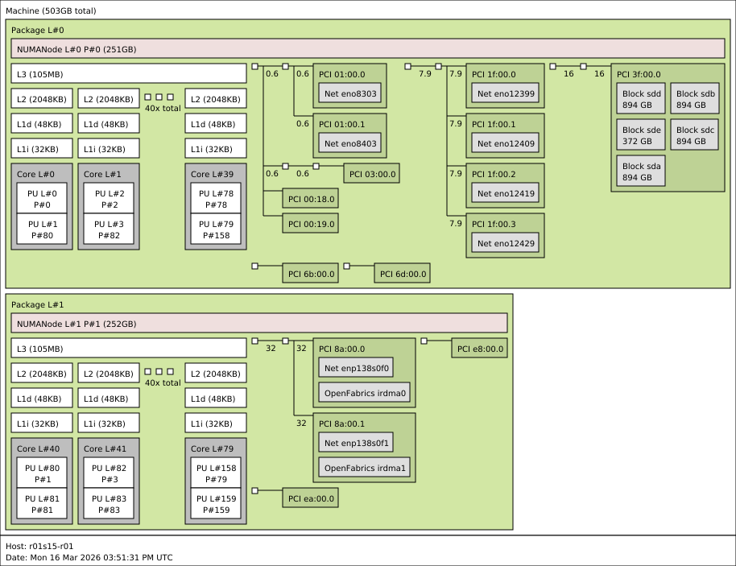
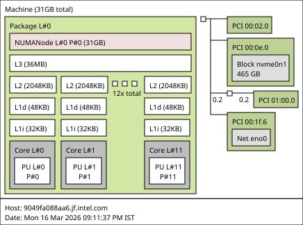
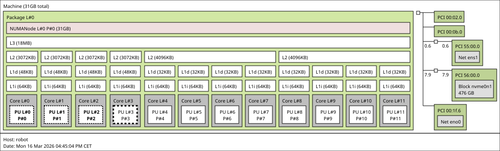

# Specification Update Proposal

## Owner

[\@pperycz](https://github.com/pperycz/)

## Summary

This proposal extends the specification to enable hardware-aware placement of real-time workloads via **Workload Fleet Manager (WFM)** on **Edge Devices** that expose an additional level of device details via **Workload Fleet Management Client (WFM Client)**.

- **Applications API** additions allow application creators to request resources with a higher level of detail via northbound API of **WFM**.
- **Device Capabilities API** extensions expose topology and the hierarchy of compute, cache, memory, and device resources reported via southbound API of **WFM**.

These additions provide the information needed to place workloads using CPU pinning, cache allocation, memory bandwidth allocation, NUMA awareness, and related real-time constraints.

## Reason for proposal

A deeper view of platform characteristics is required to define detailed resource requirements for real-time workloads. Matching extensions of the application manifest are needed to benefit from those additionally exposed details and allow application developers to request specific real-time configurations.

The current capabilities model supports coarse-grained placement, but not deterministic real-time scheduling. To place and isolate critical workloads, the **Workload Fleet Manager** needs visibility into:

- the hardware topology of the device,
- the operating system settings that affect determinism,
- the runtime features that can enforce allocation and isolation policies.

This would help in:

- scheduling real-time workloads only on capable platforms,
- improving deterministic behavior and expected quality of service,
- isolating critical and best-effort workloads.

## Requirements alignment acknowledgement

This SUP primarily addresses:

- [Specify the workload resource requirements](https://github.com/margo/product_management/issues/15), including [Deploy workload per platform BKC requirements](https://github.com/margo/product_management/issues/16), [Dealing with NUMA topology](https://github.com/margo/product_management/issues/20), [Multi-container pod dedicated/shared cpu resources](https://github.com/margo/product_management/issues/21), [Allocate specified number of CPU cores to workload](https://github.com/margo/product_management/issues/28), [Orchestrate to Type and Quantity of Core](https://github.com/margo/product_management/issues/18), [Cache Allocation](https://github.com/margo/product_management/issues/17), [Allocate specified amount of memory to workload](https://github.com/margo/product_management/issues/22), [Set scheduling priority](https://github.com/margo/product_management/issues/19), and [GPU allocation](https://github.com/margo/product_management/issues/23).
- [Define the format for Margo device capabilities descriptions](https://github.com/margo/product_management/issues/14), including [Updates to the application description format to include definitions for the required resources](https://github.com/margo/specification/issues/7).

It also has indirect impact on:

- [Application Package - Define the format for Margo applications to specify device requirements](https://github.com/margo/product_management/issues/4) by extending the set of device requirements applications can express.
- [Define mechanism for edge device to request permission to process device management requests](https://github.com/margo/product_management/issues/73) by helping ensure critical real-time workloads are not interrupted by forced management actions without explicit confirmation.
- [Define mechanism for publishing application state](https://github.com/margo/product_management/issues/65) by enabling future quality of service (QoS) / key performance indicator (KPI) reporting for real-time workloads.
- [Define the device requirements to fulfill initial Margo device roles](https://github.com/margo/product_management/issues/56) by potentially favoring exposed capabilities over strict roles, or by introducing role variants for real-time workload hosting.

Related SUPs that should be tracked:

- [Specification Extensions](https://github.com/margo/specification-enhancements/pull/56/changes), which introduces capability to add customizable API extensions.
- [Move Application Deployment Templating to the WFM](https://github.com/margo/specification-enhancements/pull/40), because it aligns with broader WFM-side resource analysis and workload matching.

## Technical proposal

The proposal is intended to cover the following aspects of the specification:

- **Application Supplier's** scope:

  - Application Description extension to describe real-time related requirements of the application

- **Fleet Management Supplier's** scope:

  - Northbound API extension to comprehend additions to Application Description
  - Orchestration logic extended to match Applications to Devices and track allocation of exclusive and shared Device resources
  - Southbound API extension to comprehend additions to Device Capabilities

- **Device Supplier's** scope:

  - Application Deployment extensions that carry real-time related resources configurations
  - Workload Fleet Management Client extension to expose real-time related Device Capabilities

While some real-time configuration changes could result in **Device Fleet Manager (DFM)** and **Device Fleet Management Client (DFM Client)** changes - those are out of scope for this proposal.

The [Linux Container Configuration](https://specs.opencontainers.org/runtime-spec/config-linux/?v=v1.3.0#linux-container-configuration) section of the OCI Runtime Specification already defines fine-grained controls such as cpusets, cache schema, and memory bandwidth limits. This SUP extends Margo so that the **Workload Fleet Manager** can:

- express workload placement intent in a Margo-level schema,
- discover detailed resource topology and platform characteristics on an **Edge Device**,
- use that information when allocating resources to workloads deployed on that device.

The proposal focuses on following extensions:

- `Application Description` and `Application Deployment` extensions to characterize the workload type and to request fine-grained resources,
- `Device Capabilities` extensions to expose the fine-grained resources that include the hardware topology,

### Extending Applications API (Real-Time)

The configuration of the Edge Device and its Operating System must support hosting `real-time` workloads and the Application needs to identify itself as a real-time application for Workload Fleet Management to properly place workloads on capable devices. To achieve that the following changes are proposed:

1. Declaring the `Component` workload type, scheduling priority and additional configuration options:

    ```yaml
    # ...
    deploymentProfiles:
      - id: com-northstartida-hello-world-helm-a
        type: helm
        components:
          - name: real-time-app
            workload:
              scheduling: real-time
              # for real-time scheduling
              priority: 95
              # for best-effort and background scheduling
              nice: 10
              # for deadline scheduling related configuration
              deadline:
                deadline: 10
                period: 16
                runtime: 5
            properties:
              repository: oci://northstarida.azurecr.io/charts/real-time-app
              revision: 1.0.1
          - name: hello-world
            workload:
              scheduling: best-effort
            properties:
              repository: oci://northstarida.azurecr.io/charts/hello-world
              revision: 1.0.1
    ```

    Related changes:

    - `Component.workload` of type `Workload` added. `Workload` type consists of:

      - `scheduling` of type `string`. Allowed values:

        - `background` - covering `SCHED_BATCH` and `SCHED_IDLE`.
        - `best-effort` - for `SCHED_NORMAL` or `SCHED_OTHER` - default if not explicitly set
        - `deadline` - equivalent of `SCHED_DEADLINE`
        - `real-time` - representing `SCHED_FIFO` or `SCHED_RR` policies

      - `priority` - of type `integer` representing static priority
      - `nice` - of type `integer` representing Nice value
      - `deadline` - of type `object` holding following configuration options:

        - `deadline` - of type `integer` representing task finish time
        - `period` - of type `integer` representing frequency of task activation
        - `runtime` - of type `integer` representing CPU time needed to execute a task

    **NOTE** Applications with scheduling settings different than the default (best-effort) should be placed only on devices that report capabilities to host workloads requiring such scheduling.

    Additional settings are still needed to assure deterministic results for applications that are identified as e.g.: `real-time` or `deadline` workloads.


### Extending Applications API (RequiredResources)

For different components to request different fine-grained resources, the suggested change is to move `RequiredResources` under `Component`. The implication for **Workload Fleet Manager** is a more complex implementation to determine which **Edge Devices** are capable of hosting applications. In addition, the API of **Workload Fleet Management Client (WFM Client)** needs to support this granularity, e.g. by exposing any workload placement issues as per-component `errors`.

### Extending Applications API (CPU)

In order to request an amount of a specific type of CPU, the following changes and additions are proposed:

1. Requesting multiple **named CPU groups** that can be referred to from within the application.

    ```yaml
    # ...
    requiredResources:
      cpu:
        - cores: 2
          name: my-cpu-group-01
        - cores: 1
          name: my-cpu-group-02
    ```

    Related changes:

    - `RequiredResources.cpu` type changed from `CPU` to `[]CPU`
    - `CPU.name` of type `string` added (exact format TBD)

    **NOTE** The **Workload Fleet Management Client (WFM Client)** can assign named groups of resources to the Application, which in turn can distribute them across its own threads.

    Below is an example usage within a `helm` application that refers to CPU group `my-cpu-group-01` in `Pod` spec via custom `resources.orchestration.margo.org/cpu.group.name` annotation. The annotation can be translated on **Edge Device** side to any implementation that supports such association, e.g. via [NRI Balloons Policy Plugin](https://containers.github.io/nri-plugins/stable/docs/resource-policy/policy/balloons.html#pod-annotations-for-container-overrides).

    ```yaml
    apiVersion: v1
    kind: Pod
    metadata:
      annotations:
        resources.orchestration.margo.org/cpu.group.name: my-cpu-group-01
      name: nginx
    spec:
      containers:
        - image: 'nginx:1.30.2'
          name: nginx
    ```


2. Requesting specific CPU group of **specific class** (hybrid architectures):

    ```yaml
    # ...
    requiredResources:
      cpu:
        - class: performance
          cores: 2
    ```

    Related changes:

    - `CPU.class` of type `string` added. Allowed values:

       - `performance` - e.g.: AMD Zen Cores, Apple Performance cores, ARM Prime/Big cores, Intel P-Cores.
       - `efficiency` - e.g.: AMD Zen "c" Cores, Apple Efficiency cores, ARM LITTLE/Efficiency cores, Intel E-Cores.
       - `low-power` - e.g.: ARM Low-Power E-Core, Intel LP-E Cores.

3. Requesting CPU of **specific isolation level** (kernel-scheduling isolation):

    ```yaml
    # ...
    requiredResources:
      cpu:
        - cores: 1
          type: isolated
    ```

    Related changes:

    - `CPU.type` of type `string`. Allowed values:

        - `isolated` - the CPUs in this group are expected to be exclusively available for this workload
        - `shared` - the CPUs in this group can be shared with other workloads

4. Requesting **multiple named groups of different classes and types**. This complex example covers one `performance` core for real-time workload, four `efficiency` cores for AI inference, and 2 `low-power` cores for telemetry processing:

    ```yaml
    # ...
    requiredResources:
      cpu:
        - class: performance
          cores: 1
          name: real-time-performance
          type: isolated
        - class: efficiency
          cores: 4
          name: background-ai-inference
          type: shared
        - class: low-power
          cores: 2
          name: background-telemetry
          type: shared
    ```

    **NOTE** On the **Edge Device** side, the **Workload Fleet Management Client (WFM Client)** needs to pass all group names to the selected runtimes so applications can use this information and match their requested named groups to the effective CPU set associated with the deployment.

### Extending Applications API (CPU Cache)

The following changes and additions are proposed to specify what cache sizes and kinds are requested for the workload:

1. Requesting two isolated `performance` CPUs with `9216Ki` of `L3 Cache` allocated which is allowed to be shared by other workloads (e.g. workloads that execute within the same class of service):

    ```yaml
    # ...
    requiredResources:
      cpu:
        class: performance
        cores: 2
        type: isolated
      caches:
        - allocation: shared
          level: L3
          size: 9216Ki
    ```

    Related changes:

    - `requiredResources.caches` of type `[]Cache` added. `Cache` type consists of:
    - `Cache.allocation` of type `string`. Allowed values:

        - `exclusive`
        - `shared`

    - `Cache.level` of type `string` added. Allowed values:

        - `L3` - Level 3 Cache
        - `L2` - Level 2 Cache
        - `L1d` - Data Cache
        - `L1i` - Instruction Cache

    - `Cache.size` of type `string`. Minimum required cache amount. The value is given in binary units (Ki = Kibibytes, Mi = Mebibytes, Gi = Gibibytes).

### Extending Applications API (Memory Bandwidth)

To specify memory bandwidth allocation for the workload, the following changes and additions are proposed:

1. Requesting one `efficiency` CPU with exclusive access to `2048Ki` of `L2 Cache` and specifying `30%` memory bandwidth allocation.

    ```yaml
    # ...
    requiredResources:
      cpu:
        class: efficiency
        cores: 1
        type: isolated
      caches:
        - allocation: exclusive
          level: L2
          size: 2048Ki
      memory:
        bandwidthAllocation:
          unit: percent
          value: 30
        size: 1Gi
    ```

    Related changes:

    - `memory` type is changed from `string` to `object` (`Memory`)
    - previous `memory` property is now passed via `Memory.size`
    - `Memory.bandwidthAllocation` type is added that consists of

      - `unit` of type `string` with allowed values:

        - `percent` - capping memory usage to `%` value (e.g.: in increments of 10)
        - `MBps` - capping memory at a specific throughput value

      - `value` of type `integer` holding the actual value of the bandwidth.

    **NOTE** Extending `requiredResources.memory` is a breaking change since it changes from `string` to `object`.

### Extending Device Capabilities API (Topology)

The [Portable Hardware Locality (hwloc)](https://www.open-mpi.org/projects/hwloc/) software package provides a portable abstraction of the hierarchical topology of modern systems, including NUMA memory nodes (DRAM, HBM, non-volatile memory, CXL, etc.), processor packages, shared caches, cores, simultaneous multithreading, and I/O locality. This makes it a strong basis for exposing the fine-grained resources and topology information that placement decisions depend on.

A hierarchical topology view of resources can be exposed via `lstopo` or `hwloc-ls`. A verbose `lstopo -v` output can also provide per-CPU-set attributes such as frequency and core types, which are useful on discovering resources of hybrid-core systems.

See [Appendix A: Example Platform Topologies](#appendix-a-example-platform-topologies) for examples of various platform topologies.

### Extending Device Capabilities API (CPU)

1. Exposing `CPU` kinds using topological view from `lstopo -v`

    Available kinds (groups) of CPUs can be determined based on `lstopo -v` output along with the `isolation` parameter determined by the `/proc/cmdline` and `/sys/devices/system/cpu/isolated` values, or from `/sys/fs/cgroup/cpuset` (depending on isolation method used).

    ```text
    CPU kind #0 efficiency 0 cpuset 0x0000f000
      FrequencyMaxMHz = 3300
      FrequencyBaseMHz = 1500
      CoreType = IntelLowPower
    CPU kind #1 efficiency 1 cpuset 0x00000ff0
      FrequencyMaxMHz = 3700
      FrequencyBaseMHz = 1600
      CoreType = IntelAtom
    CPU kind #2 efficiency 2 cpuset 0x0000000f
      FrequencyMaxMHz = 4700
      FrequencyBaseMHz = 1900
      CoreType = IntelCore
    ```

    Proposed representation in `Device Capabilities`

    ```yaml
    apiVersion: device.margo.org/v1alpha1
    kind: DeviceCapabilitiesManifest
    properties:
      resources:
        cpu:
          kinds:
            - class: low-power
              cores: 4
              frequency:
                maxMHz: 3300
                baseMHz: 1500
              type: shared
            - class: efficiency
              cores: 8
              frequency:
                maxMHz: 3700
                baseMHz: 1600
              type: shared
            - class: performance
              cores: 3
              frequency:
                maxMHz: 4700
                baseMHz: 1900
              type: shared
            - class: performance
              cores: 1
              frequency:
                maxMHz: 4700
                baseMHz: 1900
              type: isolated    # Example, where one of the performance cores is isolated
    ```

    Related changes:

    - `CPU.kinds` is added of type `CPUKind` that consists of:

      - `class` matching `CPU.class` in Application's `requiredResources` model
      - `cores` matching `CPU.cores` in Application's `requiredResources` model
      - `type` matching `CPU.type` in Application's `requiredResources` model
      - `frequency` of type `object` providing additional data about the CPU:

        - `maxMHz` of type `integer` holding maximum achievable CPU frequency in `MHz`
        - `baseMHz` of type `integer` holding base CPU frequency in `MHz`

### Extending Device Capabilities API (CPU Cache)

1. Exposing `cache` using topological view from `lstopo`

    Cache layout from `lstopo` needs to be augmented with information about types of cache allocation capabilities (exclusive, shared or both) from e.g. `/sys/fs/resctrl/info/L3`

    ```
    Machine (31GB total)
      Package L#0
        NUMANode L#0 (P#0 31GB)
        L3 L#0 (18MB)
          L2 L#0 (3072KB) + L1d L#0 (48KB) + L1i L#0 (64KB) + Core L#0 + PU L#0 (P#0)
          L2 L#1 (3072KB) + L1d L#1 (48KB) + L1i L#1 (64KB) + Core L#1 + PU L#1 (P#1)
          L2 L#2 (3072KB) + L1d L#2 (48KB) + L1i L#2 (64KB) + Core L#2 + PU L#2 (P#2)
          L2 L#3 (3072KB) + L1d L#3 (48KB) + L1i L#3 (64KB) + Core L#3 + PU L#3 (P#3)
          L2 L#4 (4096KB)
            L1d L#4 (32KB) + L1i L#4 (64KB) + Core L#4 + PU L#4 (P#4)
            L1d L#5 (32KB) + L1i L#5 (64KB) + Core L#5 + PU L#5 (P#5)
            L1d L#6 (32KB) + L1i L#6 (64KB) + Core L#6 + PU L#6 (P#6)
            L1d L#7 (32KB) + L1i L#7 (64KB) + Core L#7 + PU L#7 (P#7)
          L2 L#5 (4096KB)
            L1d L#8 (32KB) + L1i L#8 (64KB) + Core L#8 + PU L#8 (P#8)
            L1d L#9 (32KB) + L1i L#9 (64KB) + Core L#9 + PU L#9 (P#9)
            L1d L#10 (32KB) + L1i L#10 (64KB) + Core L#10 + PU L#10 (P#10)
            L1d L#11 (32KB) + L1i L#11 (64KB) + Core L#11 + PU L#11 (P#11)
          ...
      HostBridge
        PCI 00:02.0 (VGA)
        PCI 00:0b.0 (ProcessingAccelerator)
        PCIBridge
          PCI 55:00.0 (Ethernet)
            Net "ens1"
        PCIBridge
          PCI 56:00.0 (NVMExp)
            Block(Disk) "nvme0n1"
        PCI 00:1f.6 (Ethernet)
          Net "eno0"
    ```

    Proposed representation in `Device Capabilities`:

    ```yaml
    apiVersion: device.margo.org/v1alpha1
    kind: DeviceCapabilitiesManifest
    properties:
      resources:
        # "caches" object is an extension to the existing manifest
        caches:
          - level: L3
            size: "18432KB"
            allocationTypes:
              - exclusive
              - shared
          - level: L2
            size: "3072KB"
            allocationTypes:
              - exclusive
          - level: L2
            size: "3072KB"
            allocationTypes:
              - exclusive
          - level: L2
            size: "3072KB"
            allocationTypes:
              - exclusive
          - level: L2
            size: "3072KB"
            allocationTypes:
              - exclusive
          - level: L2
            size: "4096KB"
            allocationTypes:
              - exclusive
              - shared
          - level: L2
            size: "4096KB"
            allocationTypes:
              - exclusive
              - shared
          # ...
    ```

    Related changes:

    - added top-level `caches` property matching `[]Cache` in Application's `requiredResources` model:
    - `Cache.allocationTypes` of type `[]string`. Allowed values:

        - `exclusive` - if the device supports exclusive cache allocation type
        - `shared` - if the device supports shared cache allocation type

    - `Cache.level` of type `string` added. Allowed values:

        - `L3` - Level 3 Cache
        - `L2` - Level 2 Cache
        - `L1d` - Data Cache
        - `L1i` - Instruction Cache

    - `Cache.size` of type `string`. Minimum required cache amount. The value is given in binary units (Ki = Kibibytes, Mi = Mebibytes, Gi = Gibibytes).

### Extending Device Capabilities API (Memory)

1. Exposing bandwidth allocation capability in `Memory`

    ```yaml
    apiVersion: device.margo.org/v1alpha1
    kind: DeviceCapabilitiesManifest
    properties:
      resources:
        memory:
          size: 16Gi
          bandwidthAllocationTypes:
            - percent-throttling
            - rate-limiting
    ```

    Related changes

    - `memory` type is changed from `string` to `object` (`Memory`)
      - previous `memory` property is now exposed via `Memory.size`
      - `Memory.bandwidthAllocationTypes` of type `[]string` is added. Allowed values:

        - `percent-throttling` -  capping memory usage to `%` value (e.g.: in increments of 10)
        - `rate-limiting` - capping memory at a specific throughput value

### Extending Device Capabilities API (Scheduling)

1. Exposing workload scheduling types available on this device

    ```yaml
    apiVersion: device.margo.org/v1alpha1
    kind: DeviceCapabilitiesManifest
    properties:
      workload:
        schedulingTypes:
          - best-effort
          - real-time
    ```

    Related changes:

    - `properties.workload` of type `Workload` added
    - `Workload.schedulingTypes` of type `[]string` added. Allowable values:

        - `background` - covering `SCHED_BATCH` and `SCHED_IDLE`.
        - `best-effort` - for `SCHED_NORMAL` or `SCHED_OTHER` - default if not explicitly set
        - `deadline` - equivalent of `SCHED_DEADLINE`
        - `real-time` - representing `SCHED_FIFO` or `SCHED_RR` policies


## Appendix A: Example Platform Topologies

Examples of platform topologies that need to be represented:


*<br/>Example of multi-NUMA server machine (Intel CPU code name Sapphire Rapids)*


*<br/>Example of a machine consisting of homogeneous cores (Intel CPU code name Bartlett Lake)*


*<br/>Example of CPU subset in a hybrid-core machine (Intel CPU code name Panther Lake)*
