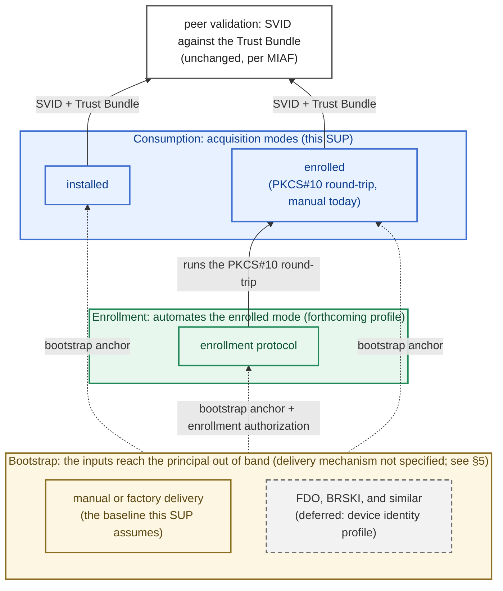

# MIAF Credential Provisioning and Acquisition

- [MIAF Credential Provisioning and Acquisition](#miaf-credential-provisioning-and-acquisition)
  - [Owner](#owner)
  - [Summary](#summary)
  - [Reason for proposal](#reason-for-proposal)
  - [Requirements alignment acknowledgement](#requirements-alignment-acknowledgement)
  - [Technical proposal](#technical-proposal)
    - [1. Scope and Boundary](#1-scope-and-boundary)
    - [2. Terminology](#2-terminology)
    - [3. Acquisition Modes](#3-acquisition-modes)
    - [4. Provisioning Input Contract](#4-provisioning-input-contract)
    - [5. The Initial Bootstrap Anchor](#5-the-initial-bootstrap-anchor)
    - [6. MIS Independence](#6-mis-independence)
    - [7. Rebinding and Re-issuance (Informative)](#7-rebinding-and-re-issuance-informative)
    - [8. Security Considerations](#8-security-considerations)
    - [9. Roadmap and Deferred Items (Informative)](#9-roadmap-and-deferred-items-informative)
  - [Alternatives considered](#alternatives-considered)
  - [Rejection reason](#rejection-reason)

## Owner

[@matlec](https://github.com/matlec)

## Summary

This SUP standardizes **how a Margo principal acquires its X.509-SVID and trust material, and what it must accept as provisioning input**, independently of any enrollment protocol. The principals in this release are the WFM and the WFM Client, the two classes the WFM Identity Profile defines.

It defines two things:

- **Exactly two acquisition modes.** A principal's SVID acquisition is one of two named modes, distinguished by who generates and first holds the private key: **installed** (the operator generates the key and the SVID and places both into the principal) and **enrolled** (the principal generates its own key and is issued a certificate for it). The enrolled round-trip is a PKCS#10 certificate request answered by a certificate chain. It runs by hand today, and later through the forthcoming enrollment protocol, which a sibling SUP on the MIAF roadmap defines ([§9](#9-roadmap-and-deferred-items-informative)). A principal declares which of the two modes it implements, and each mode carries a small conformance floor, a minimum capability every implementation of that mode must have. Naming the modes puts manual provisioning and future automated enrollment on equal footing: each is a conformant way to acquire an SVID. Local SVID delivery over the SPIFFE Workload API is deferred to the device identity profile ([§9](#9-roadmap-and-deferred-items-informative)). The modes are not equal in security assurance, because who generates and first holds the private key differs. The key-handling note in [§4](#4-provisioning-input-contract) prefers the enrolled mode where the hardware allows, and [§8](#8-security-considerations) records the key-custody risk of the installed mode. The floors keep provisioning portable across vendors ([§3](#3-acquisition-modes)).
- **A provisioning input contract.** The named inputs a principal must accept, and the interchange format of each ([§4](#4-provisioning-input-contract)), so that artifacts produced by any operator's PKI toolchain are ingestible by any conformant implementation. Delivery of those inputs remains the job of the operator's existing provisioning channel (device-management tooling, configuration management, or installer media, for example) and stays out of scope.

The SUP also defines the one input that cannot itself be fetched (the **initial bootstrap anchor**, [§5](#5-the-initial-bootstrap-anchor)), and it forbids a principal from requiring a specific Margo Identity Service (MIS) implementation ([§6](#6-mis-independence)), so that trust is anchored in the Trust Domain, not in any single vendor.

Operator pre-provisioning remains fully valid. This SUP does not change the identity model, the SVID profile, the Trust Bundle format, or the mTLS authentication mechanism.

## Reason for proposal

The current specification defines how credentials are *used* on the wire: the SVID profile, validation, Trust Bundle distribution, and mTLS recognition. An SVID validates identically no matter how it was acquired, so conformant components already interoperate at the handshake. The specification does not define the *acquisition* side: what a principal must accept to be provisioned, and where it obtains its SVID and trust material. Two consequences matter for a GA release:

1. **Provisioning is not portable across products.** The late-binding requirement is that a device binds to *any* Margo-compatible WFM. That holds cryptographically, but in practice an operator who wants vendor A's WFM Client managed by vendor B's WFM must still learn, for each product separately, how it ingests its SVID, key, trust anchors, and target identifiers. Both products are wire-conformant, and the artifacts they need are standard formats. Yet what each product accepts, and how, is left to each vendor's manual. Today, "binds to any WFM" therefore means "binds to any WFM after manual integration work for each product."
2. **There is no shared notion of *where* a credential comes from.** The Trust Bundle already has a de facto acquisition choice (static configuration or `trustBundleUri` via the Trust Bundle API), but the SVID does not. The specification does not name the ways an SVID is acquired, so operator installation and a principal's own certificate request look like two unrelated mechanisms instead of two modes of the same contract. Static installation is then the only acquisition path an operator can rely on across products. Renewal means re-provisioning each principal by hand, and a trust-anchor rotation means re-provisioning the whole fleet, because every principal needs an SVID issued under the new CA.

Standardizing the acquisition modes and the input contract closes both gaps with no new wire protocol. It also provides the protocol-independent base a later automated enrollment profile builds on, so the portable provisioning a GA release needs does not wait on the selection of an enrollment protocol.

## Requirements alignment acknowledgement

This SUP contributes to two Margo backlog items and closes a slice of each:

- [margo/specification#146 - *Complete WFM client onboarding strategy following the MIAF SUP finalization*](https://github.com/margo/specification/issues/146): this SUP supplies the contract for provisioning inputs that onboarding depends on, ahead of any decision on the enrollment protocol. The automated enrollment slice is closed by the forthcoming enrollment SUP. Neither MIAF SUP closes the gateway slice of #146 (certificates and chain of trust for devices behind a gateway).
- [margo/specification#127 - *Define Margo strategy for ecosystem identity and authorization*](https://github.com/margo/specification/issues/127): this SUP fixes the acquisition and MIS-independence rules that keep trust at the Trust Domain level rather than fragmenting across vendors. The renewal and revocation slice is closed by the enrollment SUP. The schema for representing a device identity belongs to the device identity profile, which stays deferred on the MIAF roadmap ([§9](#9-roadmap-and-deferred-items-informative)).

Everything else on the MIAF roadmap stays out of scope ([§9](#9-roadmap-and-deferred-items-informative) gives the consolidated view). This SUP defines the acquisition *contract* that the roadmap items build on.

## Technical proposal

### 1. Scope and Boundary

This SUP applies to every MIAF principal that acquires an SVID and trust material. Sections [3](#3-acquisition-modes), [5](#5-the-initial-bootstrap-anchor), and [6](#6-mis-independence) apply to all principals alike. Section [4](#4-provisioning-input-contract) lists the concrete inputs for each *principal class* (the kinds of principal an identity profile defines). The only profile in this release is the WFM Identity Profile, so [§4](#4-provisioning-input-contract) gives the input tables for the **WFM** and the **WFM Client**. The contract does not depend on which kind of Margo component a principal is. A principal class introduced by a later profile (for a future Device Fleet Manager, for example) is provisioned under the same acquisition modes, bootstrap rules, and MIS-independence rules, and adds only its own input tables to [§4](#4-provisioning-input-contract).

**What this SUP does not change.** It builds on, and does not modify, the MIAF identity model, the X.509-SVID profile, the Trust Bundle format, the TLS baseline, the cryptographic requirements, or the WFM Identity Profile's naming and recognition rules. It neither narrows nor widens the SVID algorithm set. Provisioning inputs that carry keys or CSRs follow the specification's cryptographic requirements as they stand. This SUP adds a contract for what a principal accepts, in place of the prose guidance in the operator provisioning playbook, and it names the modes for SVID acquisition.

**Relationship to the integrated specification.** The specification describes SVID acquisition as operator provisioning: the operator mints an SVID and installs it through its existing channel. This SUP generalizes that description: operator provisioning becomes the **installed** mode of [§3](#3-acquisition-modes), and the **enrolled** mode is named as the explicit alternative. The enrolled mode is not an automated enrollment protocol: it is the CSR round-trip however it runs. The automated enrollment *protocol* itself remains future work (see the three layers below and [§9](#9-roadmap-and-deferred-items-informative)).

**The three layers (informative).** A Margo principal acquires and uses its identity across three layers. Different mechanisms can fill each layer, and the layer above does not depend on which one is chosen.

- **Consumption.** How the principal obtains its current SVID and Trust Bundle: the acquisition modes of [§3](#3-acquisition-modes). This SUP defines this layer.
- **Enrollment.** What automates the enrolled mode's PKCS#10 round-trip over the wire, so an SVID is issued and renewed without manual operator steps. This is the forthcoming enrollment profile.
- **Bootstrap.** How the principal receives the two inputs that the upper layers depend on: the initial bootstrap anchor of [§5](#5-the-initial-bootstrap-anchor) and, under the enrollment profile, its enrollment authorization, the credential that proves it is authorized to receive an SVID. Manual or factory delivery is the baseline. Automated mechanisms rooted in a factory identity (FDO, BRSKI, and similar) are deferred to a future device identity profile.

A deployment may pre-provision statically with neither enrollment nor automated bootstrap, add either, or combine all three layers. Only the consumption layer is normative in the present release.

The figure below is informative. Dotted edges are inputs delivered out of band, outside this SUP's scope. The other provisioning inputs of [§4](#4-provisioning-input-contract) arrive through the operator's provisioning channel and are not drawn.

### 2. Terminology

All MIAF and WFM Identity Profile terminology is reused by reference. This SUP introduces:

- **Acquisition mode**: the classification of how a principal's SVID is acquired, keyed on who generates and first holds the private key. Exactly two modes are defined ([§3](#3-acquisition-modes)): **installed** and **enrolled**.
- **Conformance floor**: the minimum capability every implementation of a given acquisition mode must have, whatever else it implements. Each mode's floor is stated in [§3](#3-acquisition-modes).
- **Provisioning input**: a named item a principal must accept to participate in a Trust Domain (its SVID, its private key when the operator supplies one, its trust material, and the configuration identifiers its identity profile defines). Enumerated for each principal class in [§4](#4-provisioning-input-contract).
- **Acceptance surface**: how a principal accepts its provisioning inputs (a file it reads, a mounted secret, an environment variable, or a configuration API, for example). It is the product-side counterpart of the operator's provisioning channel: the channel delivers the inputs, and the acceptance surface takes them in. [§4](#4-provisioning-input-contract) requires at least one acceptance surface that is non-interactive and documented.
- **Initial bootstrap anchor**: the trust material a principal uses to authenticate its first retrieval of MIAF trust material, before it holds anything MIAF-issued. This corresponds to the material the MIAF TLS requirements define for initial trust bootstrap, named here because it is the one provisioning input no acquisition mode can deliver ([§5](#5-the-initial-bootstrap-anchor)).

### 3. Acquisition Modes

A principal acquires two kinds of artifact: its own **SVID** (with private key) and the **Trust Bundle** it validates peers against. For the SVID, MIAF classifies acquisition by one question: who generates and first holds the private key. The answer determines everything else about acquisition: what the operator supplies and how renewal works. The result is the same in every mode: the principal holds its current SVID and its current Trust Bundle, and peer validation consumes both without depending on which mode supplied them (the [§1](#1-scope-and-boundary) figure draws the two modes feeding a single validation path). Exactly two **acquisition modes** are defined:

- **Installed.** The operator generates the key pair, mints the SVID, and places both into the principal through its provisioning channel. The principal does not renew its SVID on its own. Renewal happens by re-provisioning (the Trust Bundle can still refresh from `trustBundleUri`, per the bundle floor below). This mode exists for principals that cannot generate keys safely (for example, without an adequate entropy source). Its cost is key custody concentrated in the operator (see the key-handling note in [§4](#4-provisioning-input-contract)).

- **Enrolled.** The principal generates its own key pair, which never leaves it. Issuance is a CSR round-trip: the principal exports a PKCS#10 CSR, a CA in the Trust Domain signs it, and the principal ingests the returned certificate chain. How the CSR reaches the CA and how the chain comes back are deliberately not fixed. An operator moving files by hand and the forthcoming automated enrollment profile are the same mode at different levels of automation, because PKCS#10 is the interchange object every candidate enrollment protocol also carries natively.

Normative rules:

- **Mode declaration (every principal).** A principal MUST implement at least one acquisition mode and MUST declare (in a product's conformance documentation) which of the two modes it implements. It MAY implement several. The operator chooses among them for each deployment.
- **Bundle floor (installed and enrolled modes).** Every principal in the installed or enrolled mode MUST accept a statically supplied Trust Bundle ([§4](#4-provisioning-input-contract) format), and SHOULD additionally support `trustBundleUri` refresh. To refresh, a principal retrieves the Trust Bundle from its `trustBundleUri` repeatedly while it operates, per the specification's rules for Trust Bundle retrieval. Each accepted retrieval replaces the bundle the principal holds. With a static-only bundle, every trust-anchor rotation requires re-provisioning every principal. With `trustBundleUri` refresh, rotation propagates on its own (see the MIAF trust-anchor rotation playbook).
- **Refresh inputs (where refresh is implemented).** A principal that implements `trustBundleUri` refresh MUST accept a directly supplied `trustBundleUri`, and SHOULD also accept a discovery document URL and resolve `trustBundleUri` from it per the specification's discovery rules.
- **Refresh on reconnection (where refresh is implemented).** A principal that has been offline SHOULD refresh its Trust Bundle from `trustBundleUri` promptly on reconnection, rather than waiting for its next scheduled refresh, so that a trust-anchor rotation completed during its absence takes effect.
- **Enrolled floor (enrolled mode).** A principal that declares the enrolled mode MUST be able to export a PKCS#10 CSR for its generated key, and to ingest the certificate chain issued for it, both through the acceptance surface of [§4](#4-provisioning-input-contract). This floor applies even to a principal that also implements an automated enrollment protocol: the manual round-trip works with any operator's PKI toolchain, because it needs nothing from the product except that acceptance surface.
- **CSR semantics (enrolled mode).** The round-trip's PKCS#10 CSR carries the principal's public key and proof of possession. Any subject or SAN content it carries is advisory. The issuer is authoritative for the SPIFFE ID. The operator mints the SVID for the chosen SPIFFE ID and overrides any name content in the CSR (per the MIAF operator provisioning playbook). A principal is therefore issued its identity rather than requesting it, and never needs to know it in advance (see the identifiers note in [§4](#4-provisioning-input-contract)). A renewal CSR MAY carry the principal's current SPIFFE ID. That content is advisory too.
- **Chain ingestion (enrolled mode).** On ingesting the returned chain, the principal MUST verify that the leaf certifies its own key pair, and that the leaf carries a well-formed SPIFFE ID whose shape matches an identity profile the principal implements. When it holds a Trust Bundle, it MUST additionally perform [RFC 5280](https://datatracker.ietf.org/doc/html/rfc5280) certification path validation of the chain to an anchor in that bundle, per the specification's certificate validation rules. Failures of any of these checks are surfaced as the validation rule in [§4](#4-provisioning-input-contract) requires.
- **Fleet scale (every principal).** Where renewal or rotation at fleet scale is a design goal, a principal SHOULD implement the enrolled mode with the forthcoming enrollment profile. The floors guarantee that provisioning is always possible. They do not make manual issuance scale.

An operator can write "must implement the enrolled mode" in a procurement requirement and know exactly what the product must implement. The same artifacts and steps then provision every product that declares the mode, each through its own documented acceptance surface.

### 4. Provisioning Input Contract

A principal MUST accept the inputs below in the stated interchange formats, and MUST expose at least one **non-interactive, documented** acceptance surface for supplying them. The specific mechanism (file, mounted secret, environment, config API, or installer media) remains the vendor's choice. Requiring only that it be non-interactive and documented lets an operator check the requirement against a product's documentation, without dictating a deployment model.

A principal MUST validate provisioning inputs on ingestion and fail with a clear, distinguishable error on malformed material. The specification tolerates unknown fields in a fetched wire document, for forward compatibility. A *local* provisioning input is different. An unrecognized one SHOULD be surfaced as an error or warning, not silently ignored. A mistyped input can otherwise disable or weaken the principal.

A principal SHOULD support replacing its SVID and trust material without a restart. Renewing by restart is an operability cost, not an interoperability barrier, so it remains conformant. The MIAF rule that a client re-establishes affected connections after renewing its SVID is unchanged.

Each class of artifact has one interchange format:

| Artifact | Interchange format |
| :------- | :----------------- |
| Certificates | PEM ([RFC 7468](https://datatracker.ietf.org/doc/html/rfc7468)) |
| Private keys | unencrypted PKCS#8 ([RFC 5958](https://datatracker.ietf.org/doc/html/rfc5958)), PEM-encoded |
| CSRs | PKCS#10 ([RFC 2986](https://datatracker.ietf.org/doc/html/rfc2986)) |
| Trust material | SPIFFE bundle: a JWK Set per [RFC 7517](https://datatracker.ietf.org/doc/html/rfc7517), the container for the Trust Domain's X.509 trust anchors per the specification's Trust Bundle format (no JWT credentials are involved) |
| Identifiers (`wfm-id`, `wfm-client-id`) | [RFC 3986](https://datatracker.ietf.org/doc/html/rfc3986) unreserved strings, excluding `.` and `..`, per the WFM Identity Profile |
| Endpoints | absolute HTTPS URLs |
| Certificate pins | SPKI SHA-256 pins, in the form fixed by MIAF's rules for initial trust bootstrap: the SPKI Fingerprint construction of [RFC 7469, Section 2.4](https://datatracker.ietf.org/doc/html/rfc7469#section-2.4), the base64-encoded SHA-256 digest of the DER-encoded SubjectPublicKeyInfo |

Which rows of the input tables apply depends on the acquisition modes a principal declares ([§3](#3-acquisition-modes)). The matrix below summarizes applicability and is not normative. The normative statements are the rules in [§3](#3-acquisition-modes), the requirements above, and the input tables with their footnotes.

| Input | Installed | Enrolled |
| :---- | :-------- | :------- |
| X.509-SVID + intermediate chain | ingested with the key | ingested as the certificate chain the CA returns |
| Private key | ingested with the SVID | n/a (the key never leaves the principal) |
| PKCS#10 CSR (the contract's only *output*) | n/a | exported for signing (enrolled floor, [§3](#3-acquisition-modes)) |
| Trust Bundle, static | required (bundle floor, [§3](#3-acquisition-modes)) | required (bundle floor, [§3](#3-acquisition-modes)) |
| `trustBundleUri` refresh | recommended | recommended |
| Initial trust anchors / pins | conditional, see below | conditional, see below |
| WFM endpoint URL (WFM Client) / accepted-client policy (WFM) | required | required |

**Both principals:**

| Input | Notes |
| :---- | :---- |
| X.509-SVID + intermediate chain | the principal's own SVID with its chain (leaf + intermediates), per the X.509-SVID profile; installed mode (with key) or enrolled mode (the certificate chain returned by the CA) |
| Private key (only when operator-supplied) | installed mode only1 |
| Initial trust anchors | one or more certificates; PKI-anchored bootstrap: the principal validates the MIS server chain to these anchors, with [RFC 9525](https://datatracker.ietf.org/doc/html/rfc9525) name checks2 |
| Initial trust pins | a pin set; pinned bootstrap: the pin itself establishes server identity, with no DNS name required, so it also fits MIS endpoints reached by IP address2 |
| Trust Bundle, and its URL where refresh is implemented (a `trustBundleUri`, or a discovery document URL resolving to one) | static acceptance is the bundle floor and the URL forms add refresh, per the [§3](#3-acquisition-modes) rules3 |

**WFM Client only:**

| Input | Notes |
| :---- | :---- |
| WFM endpoint URL | required in every acquisition mode: a WFM Client cannot reach its WFM without it. Routing only; identity is by SVID, and the target `wfm-id` is read from the client's own SVID, not from the URL |

**WFM only:**

| Input | Notes |
| :---- | :---- |
| Accepted-client policy entries | the WFM Client identities this WFM authorizes, as a list of identifiers (`wfm-client-id` or full SPIFFE ID); list serialization is product-specific4 |

1 **Key handling.** In the installed mode the operator-supplied key interchanges as unencrypted PKCS#8 PEM. Encryption of the key file is deliberately outside the contract, since confidentiality on the key path is the provisioning channel's job (the playbook already requires it) and passphrase handling would otherwise become a provisioning input of its own. An operator SHOULD deliver an operator-generated key over a channel that authenticates both ends and encrypts in transit, or wrapped for the receiving principal. This is guidance to the operator and adds no conformance requirement on the principal. A principal SHOULD prefer the enrolled mode over the installed mode where its hardware allows: the key pair is generated on the principal and never leaves it. Where the principal has hardware-backed key storage (TPM, secure element, HSM), the key can be generated inside that storage and marked non-exportable, so it never exists outside the hardware. Both modes are conformant, consistent with the operator provisioning playbook, which allows centrally generated keys as a fallback. Key generation and CSR signatures follow the MIAF cryptographic requirements, including the requirement to generate keys with a cryptographically secure random number generator.

2 **Initial trust anchors and pins.** These are the two interchange forms of the initial bootstrap anchor ([§5](#5-the-initial-bootstrap-anchor)). They are an input only when the principal fetches an MIS-hosted artifact over HTTPS (a `trustBundleUri`, a discovery document, or a future enrollment endpoint). They are not needed when that endpoint already presents a publicly-trusted certificate ([§5](#5-the-initial-bootstrap-anchor)). They are also not needed by a principal provisioned entirely out of band, which makes no such retrieval. A principal that does make such retrievals MUST accept both bootstrap forms, the anchor set and the pin set. The operator chooses between the two forms. The validation rules for each form are fixed by the specification's rules for initial trust bootstrap and noted in each form's table row.

3 **Discovery cross-check.** Where discovery is used, a principal that already holds an SVID SHOULD verify the document's `trustDomain` against its own SPIFFE ID's trust domain, per the specification's discovery rules. This catches a principal pointed at the wrong Trust Domain's document on an origin serving several.

4 **Accepted-client policy.** This row states only that a WFM MUST be configurable with the set of client identities it authorizes. The WFM Identity Profile's authorization section leaves the expression of policy implementation-specific. This row deliberately strengthens that: being configurable with an explicit list becomes a conformance requirement. Accepting a whole namespace by wildcard remains permitted alongside it. Withdrawing a single client still needs an individual entry to remove, as the profile's lifecycle section notes. How an operator *manages* that set at runtime is a management-interface concern between an operator and its WFM, which Margo does not specify, and is out of scope here. No interoperable import payload is defined, and the entries are supplied as a provisioning input through each product's documented acceptance surface.

The tables name no input for the principal's own identity or Trust Domain. That omission is deliberate.

- **Identifiers come from the SVID.** A principal never needs to be told its own SPIFFE ID in advance. It reads it from the URI SAN of its issued SVID. The Trust Domain identifier is part of that SPIFFE ID, so it too is the principal's own and is not a separate provisioning input. A WFM Client reads its target `wfm-id` from the same SVID, since the WFM Identity Profile names the client under its target WFM (`.../wfm/<wfm-id>/client/<wfm-client-id>`) and has the client take the expected `wfm-id` from its own SVID. The only external configuration a WFM Client needs is the WFM endpoint URL, and that is routing information only.
- **Trust Domain and bundle.** A single SPIFFE bundle does not name the domain it anchors, so a principal treats the bundle it holds as its own Trust Domain's authoritative anchors rather than checking it against a configured identifier.

### 5. The Initial Bootstrap Anchor

The installed and enrolled modes depend on one artifact that cannot itself be acquired through the contract, wherever a principal fetches MIAF trust material over HTTPS: the anchor it uses to authenticate that *first* retrieval. A principal cannot fetch the anchor it needs to authenticate its first fetch. This anchor is therefore a static input in every such case except the public-PKI case below, where the principal's built-in trust store fills the role. A principal provisioned entirely out of band makes no such retrieval and needs no anchor (see the initial trust anchors and pins note in [§4](#4-provisioning-input-contract)). The security of every later retrieval, and the effort of every later rotation, depend on the choice of this anchor.

This anchor is server-authentication material: it lets the principal trust the MIS it fetches from. It is distinct from any credential an issuance endpoint may additionally require to prove that the principal is authorized to receive an SVID. The forthcoming enrollment profile adds exactly such a credential, its *enrollment authorization*, as a second static bootstrap input alongside this anchor. The two are delivered over the same out-of-band channel, and the precondition below covers both.

- **Precondition.** This contract assumes the operator has an out-of-band channel that reaches each principal *before its first connection*. Absent such a channel, no provisioning is possible under this SUP. That case is left to the forthcoming work on bootstrap mechanisms (factory certificate, FDO, and similar), described in the out-of-band channel note at the end of this section. This precondition MUST be stated in any deployment guidance derived from this SUP.
- **Public-PKI case.** Where the MIS server certificates validate to the principal's built-in trust store, with a resolvable DNS name for the [RFC 9525](https://datatracker.ietf.org/doc/html/rfc9525) name check, the initial bootstrap anchor is that trust store, so the operator provisions no anchor at all, only the endpoint URL. This SUP does not recommend exposing an MIS on public PKI where it would not otherwise be.
- **Private or pinned mode.** Where the MIS server certificates do not validate to the principal's built-in trust store (a private or enterprise PKI, for example), the operator MUST provision an anchor set or pins out of band, per the specification's rules for initial trust bootstrap. Those rules fix the pin interchange form (formats table, [§4](#4-provisioning-input-contract)), so pins produced by one operator's toolchain are ingestible by any conformant principal. Operators SHOULD pin the SubjectPublicKeyInfo of a CA rather than of a leaf certificate, since leaf pins break on routine MIS certificate renewal. A pin over a CA accepts every endpoint that CA certifies: the pin match alone authenticates the connection, and no name check applies on a connection made by IP address. Any holder of a certificate from the pinned CA can therefore impersonate the MIS toward a bootstrapping principal. A principal SHOULD validate the endpoint identity against the presented certificate per [RFC 9525](https://datatracker.ietf.org/doc/html/rfc9525) even when a pin matches. An operator SHOULD pin a CA that certifies only the MIS endpoints.
- **Decoupling.** The initial bootstrap anchor SHOULD be independent of, and longer-lived than, the SVID-issuing authority, so that routine rotation of the SVID-issuing CA never forces re-provisioning of the bootstrap anchor.
- **Rotation.** A successor anchor or pin SHOULD be pre-distributed through the channel the current anchor still authenticates, before the active anchor expires. Pre-distribution keeps the chain of custody unbroken, so rollover is possible in band. A lapsed or compromised anchor cannot be recovered in band, because it no longer authenticates the channel that would deliver its own replacement. Operators MUST treat that recovery as a planned out-of-band re-provisioning event. The decoupling recommendation keeps this case rare.

**The out-of-band channel as a role (informative).** The precondition above names an out-of-band channel without fixing a procedure for it. In this SUP the operator fills it by hand, installing the anchor (and, under the enrollment profile, the enrollment authorization) through its existing provisioning path. A later device identity profile can fill the same role with an automated mechanism rooted in the supply chain, delivering the same two inputs against a factory identity, typically an [IEEE 802.1AR](https://standards.ieee.org/ieee/802.1AR/6995/) IDevID: FIDO Device Onboard, BRSKI ([RFC 8995](https://datatracker.ietf.org/doc/html/rfc8995)), or a vendor-specific bootstrap protocol ([AOKI](https://trustpoint.readthedocs.io/en/latest/features/aoki/index.html), for example). Each is a *producer* of the bootstrap inputs defined here, and the acquisition and enrollment layers are the *consumer*. Admitting one requires no change to this SUP, provided the inputs stay defined as roles rather than as one specific delivery.

### 6. MIS Independence

The MIS is a role, not a product, and the Trust Domain is the boundary within which identities are issued and recognized. To keep that true in practice:

- A principal MUST NOT require a specific MIS implementation. Concretely: it MUST NOT condition validation on a particular issuer or vendor trust root, and it MUST NOT depend on one vendor's issuance or delivery service to obtain its SVID. It MUST be able to acquire and validate credentials issued by any conformant MIS, through the acquisition modes it declares ([§3](#3-acquisition-modes)). The issuing MIS can be a self-signed root CA, an intermediate under an enterprise PKI, a cloud private CA, or a SPIFFE-conformant service such as SPIRE.
- A principal MUST NOT hardwire its own or its vendor's trust anchor as the sole accepted anchor. Accepted anchors come from the Trust Bundle acquired per [§3](#3-acquisition-modes). The initial bootstrap anchor of [§5](#5-the-initial-bootstrap-anchor) is not such a hardwired anchor: the operator configures it for each deployment, so the same product can work with a different MIS in each Trust Domain.
- A vendor MAY bundle an MIS as a convenience, provided it is an optional, swappable component with a documented path to an operator-supplied issuer. A bundled MIS MUST NOT be a precondition for the principal's operation.

MIS independence does not require implementing more than one acquisition mode. Declaring a single mode ([§3](#3-acquisition-modes)) is permitted, because both modes carry an MIS-neutral path by construction: the installed mode's inputs and the enrolled mode's floor can be used with any operator's PKI toolchain.

### 7. Rebinding and Re-issuance (Informative)

This section applies the acquisition contract to two operational events: moving a WFM Client to a different WFM, and re-issuance to a replacement principal. The MIAF operator playbooks are unchanged.

- **Rebinding.** Moving a WFM Client to a different WFM is a re-enrollment, not a reconfiguration. The client's SPIFFE ID is named under its target WFM's namespace, so binding it to a different WFM produces a *new* WFM-scoped identity:
  - a new SVID naming the client under the new WFM (the new `wfm-id` is in its path),
  - a new WFM endpoint URL,
  - an entry added to the new WFM's accepted-client policy, and
  - the old entry removed from the previous WFM's policy.

  The issuance follows the enrollment steps of the MIAF operator provisioning playbook, applied to the client's new identity. The new endpoint URL is a provisioning input of [§4](#4-provisioning-input-contract), and each policy change re-supplies a WFM's accepted-client policy input. How a WFM exposes such a change at runtime stays out of scope, as the accepted-client policy note records. This SUP standardizes the inputs that make each such enrollment portable across vendors. Only a WFM-independent device identity, deferred to the device identity profile, would make an existing identity movable between WFMs.

- **Identifier reuse.** A WFM Client's access is withdrawn by removing its SPIFFE ID from the WFM's accepted-client policy (see the MIAF operator revocation playbook). This withdraws authorization at the application layer. The credential itself is not revoked and stays valid until it expires or until its trust anchor leaves the Trust Bundle. The removal acts on the ID, so it cuts off every credential that carries it. When a replacement principal reuses the predecessor's `wfm-client-id`, the two credentials can no longer be withdrawn separately. Reusing a `wfm-client-id` is therefore safe only when the predecessor credential can never be presented again (its key is destroyed or unrecoverable). Otherwise the operator assigns a fresh `wfm-client-id`: removing the predecessor's entry then cuts it off without affecting the replacement. The re-issuance workflow of the MIAF operator provisioning playbook leaves the reuse choice to operator policy. The guidance above gives the operator a default.

### 8. Security Considerations

The MIAF identity security considerations continue to apply unchanged. The table below records the threats specific to acquisition, in the same format. Its rows extend the MIAF framework threats table, and each mitigation names the section of this SUP (or of MIAF) that carries the rule it relies on.

| Threat | Description | Mitigation |
| :----- | :---------- | :--------- |
| **Missed trust-anchor rotation on a static-only bundle** | A principal provisioned with a static Trust Bundle and no `trustBundleUri` refresh keeps validating against the anchors it was installed with, so a trust-anchor rotation completed after provisioning never reaches it. Peers presenting SVIDs under the new anchor are rejected, and the principal drops out of the fleet until re-provisioned. | A principal in the installed or enrolled mode SHOULD additionally support `trustBundleUri` refresh per the bundle floor ([§3](#3-acquisition-modes)), which lets rotation propagate on its own. Where a deployment stays static-only, the operator plans each rotation as re-provisioning and sizes the propagation wait of the MIAF trust-anchor rotation playbook to cover it. |
| **Initial bootstrap anchor lapse or compromise** | The initial bootstrap anchor authenticates the channel that would deliver its own replacement. Once it lapses or is compromised, no in-band recovery path remains, and every affected principal has to be re-provisioned out of band. | [§5](#5-the-initial-bootstrap-anchor) recommends pre-distributing a successor anchor or pin over the channel the current anchor still authenticates before expiry, and choosing the anchor long-lived and decoupled from the SVID-issuing authority; and requires treating recovery after a lapse or compromise as a planned out-of-band re-provisioning event. |
| **Pin brittleness and mis-pinning** | A pin on a leaf certificate's key breaks on routine MIS certificate renewal, cutting the principal off from refreshing its trust material. A mis-scoped pin fails in either direction: too narrow, and legitimate MIS endpoints are rejected; too wide, and endpoints the operator never intended to trust are accepted. | Pins interchange in the SPKI SHA-256 form fixed by MIAF's rules for initial trust bootstrap (formats table, [§4](#4-provisioning-input-contract)), and operators SHOULD pin the SubjectPublicKeyInfo of a CA rather than of a leaf certificate ([§5](#5-the-initial-bootstrap-anchor)). A pin on a broadly-issuing authority admits every endpoint it certifies; [§5](#5-the-initial-bootstrap-anchor) narrows this from both sides: the principal validates the endpoint identity even when a pin matches, and the operator pins a CA that certifies only the MIS endpoints. |
| **MIS silo behind a hardwired vendor root** | A principal that validates peers only against its vendor's trust root, or that can obtain its SVID only through its vendor's issuance service, splits the Trust Domain into vendor silos and defeats recognition at the Trust Domain level. | A principal MUST NOT require a specific MIS implementation and MUST NOT hardwire its own or its vendor's trust anchor as the sole accepted anchor. Accepted anchors come from the Trust Bundle ([§6](#6-mis-independence)). |
| **Key custody in the installed mode** | In the installed mode the operator generates the key pair and moves it through the provisioning channel, so custody of many principals' private keys concentrates in the operator's tooling. The mode admits this even for principals that could generate their own key pair (products that predate this contract), which widens the case covered by MIAF's key-custody concentration risk. | A principal SHOULD prefer the enrolled mode over the installed mode where its hardware allows, keeping the key on the principal and hardware-bound where available (key-handling note in [§4](#4-provisioning-input-contract)). Where the installed mode is used, the operator carries the residual key-custody risk MIAF records. |
| **Unauthorized use of the acceptance surface** | The acceptance surface of [§4](#4-provisioning-input-contract) can replace a principal's key, SVID, and trust anchors, so anyone who can use it can replace the principal's identity. | This contract assumes the acceptance surface is reachable only through the operator's provisioning channel, whose integrity the MIAF operator provisioning playbook requires and whose existence the [§5](#5-the-initial-bootstrap-anchor) precondition assumes. Access control on that channel is a deployment responsibility, and product hardening guidance SHOULD cover it. |

### 9. Roadmap and Deferred Items (Informative)

This section gives a consolidated view of the MIAF roadmap.

- **Automated enrollment, renewal, and revocation (forthcoming enrollment profile).** The enrollment profile automates the *enrolled* mode of [§3](#3-acquisition-modes): its protocol runs the same PKCS#10 round-trip over the wire, for first issuance and for renewal, and its enrollment authorization is the second static bootstrap input the [§5](#5-the-initial-bootstrap-anchor) precondition already covers. It also covers revocation, including revocation status that verifiers can check. The installed mode and its operator-supplied keys remain available as the manual fallback, under the conditions that profile defines. That profile is expected to require automated enrollment of every principal that can generate its own key pair. This SUP states no such requirement, because the enrollment protocol is not selected. A vendor that builds against this SUP can prepare for that requirement with the enrolled mode, where the hardware allows.
- **Traffic-inspecting proxies.** Authentication for deployments where exempting Margo endpoints from TLS inspection is not feasible. The candidates are an HTTP message-signature profile keyed to the X.509-SVID and a JWT-SVID exchange.
- **Device identity profile.** A WFM-independent device identity. It may be specified alongside the Device Fleet Manager work, and it touches this SUP at three points:
  - local SVID delivery over the [SPIFFE Workload API](https://github.com/spiffe/spiffe/blob/main/standards/SPIFFE_Workload_API.md) arrives with this profile as a third acquisition mode: the device enrolls through the enrollment profile and serves the Workload API to the workloads it hosts. An earlier draft of this SUP defined that mode (the *delivered* mode). It is deferred here because the Workload Endpoint's own provisioning stays unspecified until this profile exists (see the corresponding entry under [Alternatives considered](#alternatives-considered)),
  - automated bootstrap mechanisms (FDO, BRSKI, and similar) fill the out-of-band channel of the [§5](#5-the-initial-bootstrap-anchor) precondition, as the out-of-band channel note there describes, and the profile is the natural home for the wire format for bootstrap credentials that this SUP leaves out of scope, and
  - the rebind case ([§7](#7-rebinding-and-re-issuance-informative)) turns from re-enrollment into reconfiguration.

  Whether device identity becomes a foundation for WFM Client identity or one bootstrap mechanism among several stays open. This SUP is compatible with either answer.
- **Federation across Trust Domains.** The Trust Bundle endpoint follows the SPIFFE Federation bundle-endpoint model, scoped to the principal's own Trust Domain. The `https_spiffe` endpoint profile and federation across Trust Domains are candidates for future adoption, recorded in the specification's identity framework.

## Alternatives considered

**Do nothing (leave each vendor to document its own acquisition).** The status quo. The [Reason for proposal](#reason-for-proposal) is the case against it.

**Static-only provisioning (no mode structure).** Standardize the input formats but recognize only operator installation. This codifies the renewal and rotation burden the [Reason for proposal](#reason-for-proposal) describes, and it cannot express local SVID delivery or automated enrollment without a later redesign.

**Open mode declaration (no fixed modes, no floors).** Standardize the input formats and let each product declare and document its own acquisition path. Two individually conformant products could then share no provisioning path at all, and the operator would discover the mismatch in the field. That is the failure this SUP exists to remove. The floors adopted instead are deliberately modest. They guarantee that provisioning is always possible with bounded, mechanical integration effort against a documented acceptance surface. They do not remove that effort. They cover initial issuance, and operability at fleet scale remains the enrollment profile's job. They also require a product to declare the modes it implements, without verifying the declaration.

**Jump straight to the enrollment protocol.** Specify automated enrollment now and skip this contract. An enrollment protocol still needs an acquisition contract underneath it, manual provisioning and local delivery would stay unspecified, and the portability work would wait on the unresolved protocol choice.

**Include local SVID delivery (a delivered mode) in this release.** Earlier drafts defined a third mode: SVID, key, and Trust Bundle arrive over a local SPIFFE Workload API, so a principal on a SPIFFE-equipped platform needs no enrollment client and gets transparent rotation. The mode is deferred to the device identity profile ([§9](#9-roadmap-and-deferred-items-informative)) for one reason: it has no provisioning story of its own. How the SPIFFE Workload Endpoint obtains its own credentials is unspecified until that profile exists, so the mode's onboarding is only as interoperable as the platform beneath it, and a vendor-bundled platform tends toward the required component [§6](#6-mis-independence) forbids. Until the profile lands, a principal hosted on a cluster or platform enrolls like any principal, with key storage delegated to the deployment (a secret store the deployment provides, for example); replicas of one principal share its credential. The mode returns with the device identity profile, where the device itself enrolls and serves the Workload API to the workloads it hosts.

**Mandate a specific delivery mechanism.** Fix *how* inputs are delivered (a common config file layout, mount convention, or local config API), rather than only requiring the acceptance surface to be non-interactive and documented ([§4](#4-provisioning-input-contract)). The value would be real: a single operator tool could provision every product, and no product would need integration work of its own. But every candidate mechanism embeds a deployment assumption (a file layout assumes a filesystem, a config API a reachable endpoint), and the principals in scope range from cloud-hosted WFMs to embedded WFM Clients, so each candidate mechanism rules out implementations that are otherwise conformant. If the remaining integration effort proves an adoption barrier, a later SUP can add a common delivery profile as an optional layer without changing this contract; the SPIFFE Workload API delivery deferred to the device identity profile ([§9](#9-roadmap-and-deferred-items-informative)) is the standing candidate.

## Rejection reason

Not applicable.
