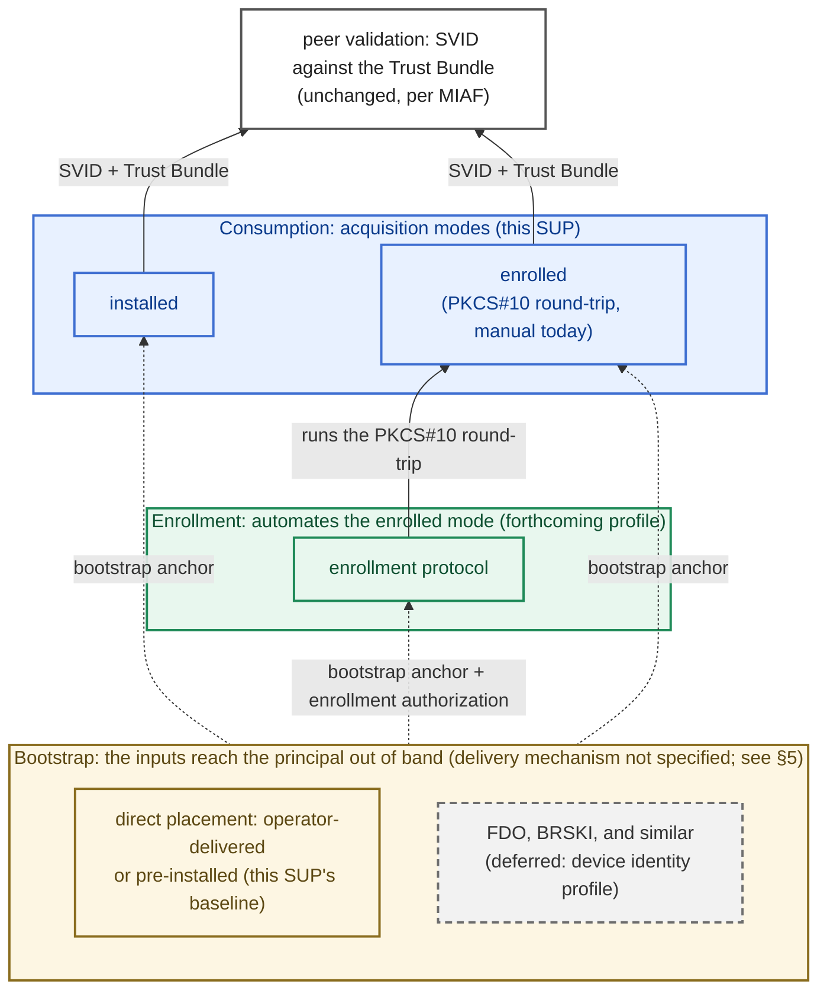

# MIAF Credential Provisioning and Acquisition

- [MIAF Credential Provisioning and Acquisition](#miaf-credential-provisioning-and-acquisition)
  - [Owner](#owner)
  - [Summary](#summary)
  - [Reason for proposal](#reason-for-proposal)
  - [Requirements alignment acknowledgement](#requirements-alignment-acknowledgement)
  - [Technical proposal](#technical-proposal)
    - [1. Scope and Boundary](#1-scope-and-boundary)
    - [2. Terminology](#2-terminology)
    - [3. Acquisition Modes](#3-acquisition-modes)
    - [4. Provisioning Input Contract](#4-provisioning-input-contract)
    - [5. The Initial Bootstrap Anchor](#5-the-initial-bootstrap-anchor)
    - [6. MIS Independence](#6-mis-independence)
    - [7. Rebinding (Informative)](#7-rebinding-informative)
    - [8. Security Considerations](#8-security-considerations)
    - [9. Roadmap and Deferred Items (Informative)](#9-roadmap-and-deferred-items-informative)
  - [Alternatives considered](#alternatives-considered)
  - [Rejection reason](#rejection-reason)

## Owner

[@matlec](https://github.com/matlec)

## Summary

This SUP standardizes how a Margo principal (a WFM or a WFM Client) obtains its X.509-SVID and trust material, and what it must accept as provisioning input. It is independent of any enrollment protocol.

It defines two things:

- **Two acquisition modes** ([§3](#3-acquisition-modes)): **installed** (the operator generates the key and installs key and SVID) and **enrolled** (the principal generates its own key and is issued a certificate through a PKCS#10 round-trip). The round-trip runs by hand today; the forthcoming enrollment profile automates it ([§9](#9-roadmap-and-deferred-items-informative)). Each mode carries a small conformance floor (a minimum every implementation must have), so provisioning stays portable across vendors.
- **A provisioning input contract** ([§4](#4-provisioning-input-contract)): the inputs a principal must accept, with one interchange format for each, so any operator's PKI toolchain can provision any conformant product. How the inputs reach the principal stays out of scope: that is the job of the operator's existing provisioning channel.

Two rules complete the picture: the **initial bootstrap anchor**, the one input that cannot itself be fetched ([§5](#5-the-initial-bootstrap-anchor)), and MIS independence, which forbids a principal from requiring a specific Margo Identity Service (MIS) implementation ([§6](#6-mis-independence)).

Operator pre-provisioning remains fully valid, and this SUP changes neither the identity model, nor the SVID profile, nor the Trust Bundle format, nor the mTLS authentication mechanism. Local SVID delivery over the SPIFFE Workload API is deferred to the device identity profile ([§9](#9-roadmap-and-deferred-items-informative)).

## Reason for proposal

The current specification defines how SVIDs are *used* on the wire. An SVID validates identically no matter how it was acquired, so conformant components already interoperate at the handshake. The specification does not define the *acquisition* side: what a principal must accept to be provisioned, and where it obtains its SVID and trust material. Two gaps matter for a GA release:

1. **Provisioning is not portable across products.** The requirement is that a WFM Client binds to *any* Margo-compatible WFM. That holds cryptographically. In practice, an operator who wants vendor A's WFM Client managed by vendor B's WFM must learn, for each product separately, how it ingests its SVID, key, trust anchors, and identifiers. Both products are wire-conformant, and the artifacts are standard formats; what each product accepts is left to its manual. "Binds to any WFM" therefore means "binds to any WFM after manual integration work for each product."
2. **There is no shared notion of *where* an SVID comes from.** The Trust Bundle already has an acquisition choice (static configuration, or `trustBundleUri` via the Trust Bundle API), but the SVID does not. The specification does not name the ways an SVID is acquired, so operator installation and a principal's own certificate request look like two unrelated mechanisms instead of two modes of one contract. Static installation is then the only path an operator can rely on across products. Renewal means re-provisioning each principal by hand, and a trust-anchor rotation means re-provisioning the whole fleet.

Naming the modes and the input contract closes both gaps with no new wire protocol: an operator can write "must implement the enrolled mode" in a procurement requirement and know what the product must implement, and the same artifacts and steps then provision every product that declares the mode. It also gives the later enrollment profile its protocol-independent base, so portable provisioning does not wait on the choice of an enrollment protocol.

## Requirements alignment acknowledgement

This SUP contributes to two Margo backlog items and closes a slice of each:

- [margo/specification#146](https://github.com/margo/specification/issues/146): this SUP supplies the contract for provisioning inputs that onboarding depends on. The automated enrollment slice is closed by the forthcoming enrollment SUP. Neither SUP closes the gateway slice (certificates for devices behind a gateway).
- [margo/specification#127](https://github.com/margo/specification/issues/127): this SUP fixes the acquisition and MIS-independence rules that keep trust at the Trust Domain level. The renewal and revocation slice is closed by the enrollment SUP. The device identity schema belongs to the device identity profile ([§9](#9-roadmap-and-deferred-items-informative)).

Everything else on the MIAF roadmap stays out of scope ([§9](#9-roadmap-and-deferred-items-informative) gives the consolidated view).

## Technical proposal

### 1. Scope and Boundary

This SUP applies to every MIAF principal that acquires an SVID and trust material. Sections [3](#3-acquisition-modes), [5](#5-the-initial-bootstrap-anchor), and [6](#6-mis-independence) apply to all principals alike. Section [4](#4-provisioning-input-contract) lists the concrete inputs for each *principal class* (the kinds of principal an identity profile defines): today, the **WFM** and the **WFM Client**. The contract does not depend on which kind of Margo component a principal is. A principal class introduced by a later profile (for a future Device Fleet Manager, for example) is provisioned under the same rules and adds only its own input tables to [§4](#4-provisioning-input-contract).

**What this SUP does not change.** It builds on, and does not modify, the MIAF identity model, the X.509-SVID profile, the Trust Bundle format, the TLS baseline, the cryptographic requirements, or the WFM Identity Profile's naming and recognition rules. It neither narrows nor widens the SVID algorithm set. It replaces the operator provisioning playbook's prose guidance with this contract.

**Relationship to the integrated specification.** The specification describes SVID acquisition as operator provisioning: the operator mints an SVID and installs it. This SUP generalizes that description: operator provisioning becomes the **installed** mode, and the **enrolled** mode is named as the explicit alternative. The enrolled mode is not an automated enrollment protocol: it is the CSR round-trip, however it runs.

**The three layers (informative).** A Margo principal acquires and uses its identity across three layers. Different mechanisms can fill each layer, and the layer above does not depend on which one is chosen.

- **Consumption.** How the principal obtains its current SVID and Trust Bundle: the acquisition modes of [§3](#3-acquisition-modes). This SUP defines this layer.
- **Enrollment.** What automates the enrolled mode's round-trip over the wire. This is the forthcoming enrollment profile.
- **Bootstrap.** How the principal receives the two inputs the upper layers depend on: the initial bootstrap anchor of [§5](#5-the-initial-bootstrap-anchor) and, under the enrollment profile, its enrollment authorization. The baseline this SUP assumes is direct placement: the operator delivers the inputs through its provisioning channel, or they are pre-installed when the device or its software image is built. Protocols that produce these inputs at onboarding time from a manufacturer-installed credential (FDO, BRSKI, and similar) are deferred to a future device identity profile.

A deployment can pre-provision statically with neither enrollment nor automated bootstrap, add either, or combine all three layers. Only the consumption layer is normative in this release.

The figure below is informative. Dotted edges are inputs delivered out of band, outside this SUP's scope.

### 2. Terminology

All MIAF and WFM Identity Profile terminology is reused by reference. This SUP introduces:

- **Acquisition mode**: how a principal's SVID is acquired, keyed on who generates and first holds the private key. Two modes are defined ([§3](#3-acquisition-modes)): **installed** and **enrolled**.
- **Conformance floor**: the minimum capability every implementation of an acquisition mode must have, whatever else it implements.
- **Provisioning input**: a named item a principal must accept to participate in a Trust Domain: its SVID, its private key when the operator supplies one, its trust material, and the identifiers its identity profile defines. Enumerated in [§4](#4-provisioning-input-contract).
- **Provisioning channel**: the operator's existing means of placing material onto a principal (device-management tooling, configuration management, or installer media, for example), as the operator provisioning playbook uses the term. The channel is deployment-specific and out of scope: this SUP standardizes what the channel carries (the provisioning inputs) and what takes them in (the provisioning interface), not the channel itself.
- **Provisioning interface**: how a principal accepts its provisioning inputs (a file, a mounted secret, an environment variable, or a configuration API, for example). The operator's provisioning channel delivers the inputs; the provisioning interface takes them in. [§4](#4-provisioning-input-contract) requires at least one provisioning interface that is non-interactive and documented.
- **Initial bootstrap anchor**: the trust material a principal uses to authenticate its *first* retrieval of MIS-hosted material, before it holds anything MIAF-issued. It is the one provisioning input no acquisition mode can deliver ([§5](#5-the-initial-bootstrap-anchor)).

### 3. Acquisition Modes

A principal acquires two kinds of artifact: its own **SVID** (with private key) and the **Trust Bundle** it validates peers against. For the SVID, one question classifies acquisition: who generates and first holds the private key. The answer determines what the operator supplies and how renewal works. The result is the same in both modes: the principal holds its current SVID and Trust Bundle, and peer validation consumes both without depending on which mode supplied them. Two **acquisition modes** are defined:

- **Installed.** The operator generates the key pair, mints the SVID, and places both into the principal through its provisioning channel. The principal does not renew on its own; renewal happens by re-provisioning. This mode exists for principals that cannot generate keys safely (without an adequate entropy source, for example). Its cost is key custody concentrated in the operator ([§4](#4-provisioning-input-contract), key handling).
- **Enrolled.** The principal generates its own key pair, which never leaves it. Issuance is a CSR round-trip: the principal exports a PKCS#10 CSR, a CA in the Trust Domain signs it, and the principal ingests the returned chain. How the CSR travels is deliberately not fixed: an operator moving files by hand and the forthcoming enrollment profile are the same mode at different levels of automation, because PKCS#10 is the interchange object enrollment protocols carry natively.

These are the only conformant modes: a product cannot declare an acquisition path of its own (the formats-only entry under [Alternatives considered](#alternatives-considered) records why). A new mode arrives only through a SUP that defines it, as the device identity profile is expected to do ([§9](#9-roadmap-and-deferred-items-informative)).

The rules below follow the provisioning sequence: a product declares its modes, acquires its trust material, and runs the issuance round-trip.

**Declaring.** A principal MUST implement at least one acquisition mode and MUST declare, in its conformance documentation, which of the two modes it implements. It MAY implement both. This SUP mandates neither mode. A profile that builds on this SUP can mandate one.

**Trust material (the bundle floor).** Every principal MUST accept a statically supplied Trust Bundle ([§4](#4-provisioning-input-contract) format). Every principal SHOULD also refresh it from `trustBundleUri`, over the specification's Trust Bundle API and per its retrieval rules; each accepted retrieval replaces the bundle the principal holds. A principal that implements refresh MUST accept a directly supplied `trustBundleUri`. A principal that fetches MIS-hosted material MUST accept a discovery document URL, and MUST resolve from the retrieved document the fields it needs. The discovery document is this framework's extension point: a later profile can add fields to it, and a principal that already accepts the URL needs no new provisioning input to reach them. After an offline period, a principal SHOULD refresh promptly on reconnection, so a trust-anchor rotation completed during its absence takes effect.

**The round-trip (the enrolled floor).** A principal that declares the enrolled mode MUST be able to export a PKCS#10 CSR for its generated key, and to ingest the certificate chain issued for it, both through the provisioning interface of [§4](#4-provisioning-input-contract). This floor applies even to a principal that also automates enrollment: the manual round-trip works with any operator's PKI toolchain. The CSR carries the principal's public key and proof of possession; any subject or SAN content in it is advisory. The issuer is authoritative for the SPIFFE ID: the operator mints the SVID for the chosen identity and overrides name content in the CSR, so a principal is issued its identity rather than requesting it ([§4](#4-provisioning-input-contract), identifiers). A renewal CSR MAY carry the principal's current SPIFFE ID; that content is advisory too.

**Chain ingestion.** On ingesting the returned chain, the principal MUST verify that the leaf certifies its own key pair, and that the leaf carries a well-formed SPIFFE ID whose shape matches an identity profile the principal implements. When it holds a Trust Bundle, it MUST additionally perform [RFC 5280](https://datatracker.ietf.org/doc/html/rfc5280) certification path validation of the chain to a trust anchor in that bundle. Failures surface as the validation rule in [§4](#4-provisioning-input-contract) requires.

### 4. Provisioning Input Contract

A principal MUST accept the inputs below in the stated interchange formats, and MUST expose at least one **non-interactive, documented** provisioning interface for supplying them. The specific mechanism (file, mounted secret, environment, config API, or installer media) remains the vendor's choice. An operator can then check the requirement against the product's documentation, without this SUP dictating a deployment model.

A principal MUST validate provisioning inputs on ingestion and fail with a clear, distinguishable error on malformed material. An unrecognized local input SHOULD be surfaced as an error or warning, not silently ignored: a mistyped input can otherwise disable or weaken the principal.

A principal SHOULD support replacing its SVID and trust material without a restart. Renewing by restart is an operability cost, not an interoperability barrier, so it remains conformant. The MIAF rule that a client re-establishes affected connections after renewing its SVID is unchanged.

Each class of artifact has one interchange format:

| Artifact | Interchange format |
| :------- | :----------------- |
| Certificates | PEM ([RFC 7468](https://datatracker.ietf.org/doc/html/rfc7468)) |
| Private keys | unencrypted PKCS#8 ([RFC 5958](https://datatracker.ietf.org/doc/html/rfc5958)), PEM-encoded |
| CSRs | PKCS#10 ([RFC 2986](https://datatracker.ietf.org/doc/html/rfc2986)) |
| Trust material | SPIFFE bundle: a JWK Set per [RFC 7517](https://datatracker.ietf.org/doc/html/rfc7517), the container for the Trust Domain's X.509 trust anchors per the specification's Trust Bundle format (no JWTs are involved) |
| Identifiers (`wfm-id`, `wfm-client-id`) | [RFC 3986](https://datatracker.ietf.org/doc/html/rfc3986) unreserved strings, excluding `.` and `..`, per the WFM Identity Profile |
| Endpoints | absolute HTTPS URLs |
| Certificate pins | SPKI SHA-256 pins, in the form the specification's initial-trust-bootstrap rules fix ([RFC 7469, Section 2.4](https://datatracker.ietf.org/doc/html/rfc7469#section-2.4)) |

The tables below state, for each input, when a conformant product must accept it. One artifact flows the other way and has its own table: the output.

**Both principals:**

| Input | Required | Notes |
| :---- | :------- | :---- |
| X.509-SVID + intermediate chain | always | the principal's own SVID with its chain, per the X.509-SVID profile |
| Private key (only when operator-supplied) | installed mode only | see the key-handling note below |
| Initial trust anchors | where the principal fetches MIS-hosted material ([§5](#5-the-initial-bootstrap-anchor)) | one or more certificates; the principal validates the MIS server chain to these anchors, with [RFC 9525](https://datatracker.ietf.org/doc/html/rfc9525) name checks |
| Initial trust pins | where the principal fetches MIS-hosted material ([§5](#5-the-initial-bootstrap-anchor)) | a pin set; the pin itself establishes server identity, with no DNS name required, so it also fits MIS endpoints reached by IP address |
| Trust Bundle, static | always (the bundle floor, [§3](#3-acquisition-modes)) | the principal's own Trust Domain's anchors, as a SPIFFE bundle |
| `trustBundleUri`, direct | where refresh is implemented ([§3](#3-acquisition-modes)) | the URL the principal refreshes the Trust Bundle from |
| Discovery document URL | where the principal fetches MIS-hosted material ([§3](#3-acquisition-modes)) | resolves `trustBundleUri`, and the fields a later profile adds |

| Output | Required | Notes |
| :----- | :------- | :---- |
| PKCS#10 CSR | enrolled mode only (the enrolled floor, [§3](#3-acquisition-modes)) | the principal exports it for signing through the provisioning interface |

**WFM Client only:**

| Input | Required | Notes |
| :---- | :------- | :---- |
| WFM endpoint URL | always | a WFM Client cannot reach its WFM without it. Routing information only (see the identifiers note below) |

**WFM only:**

| Input | Required | Notes |
| :---- | :------- | :---- |
| Accepted-client policy entries | always | a WFM MUST be configurable with the set of WFM Client identities it authorizes, as an explicit list of identifiers (`wfm-client-id` or full SPIFFE ID). Accepting a whole namespace by wildcard remains permitted alongside the list. List serialization is product-specific, and how an operator manages the set at runtime is out of scope here |

**Key handling.** The operator-supplied key interchanges as unencrypted PKCS#8 PEM: confidentiality on the key path is the provisioning channel's job, and passphrase handling would otherwise become a provisioning input of its own. A principal SHOULD prefer the enrolled mode over the installed mode where its hardware allows, for two reasons: the key is generated on the principal and never leaves it, with hardware-backed storage (TPM, secure element, HSM) able to make it non-exportable; and the forthcoming enrollment profile automates only this mode, so renewal at fleet scale depends on it. Key generation and CSR signatures follow the MIAF cryptographic requirements. An operator SHOULD deliver an operator-generated key over a channel that authenticates both ends and encrypts in transit, or wrapped for the receiving principal; this is guidance to the operator and adds no conformance requirement on the principal.

The tables name no input for the principal's own identity or Trust Domain. That is deliberate:

- **Identifiers come from the SVID.** A principal never needs to be told its own SPIFFE ID in advance: it reads it from the URI SAN of its issued SVID. The Trust Domain is part of that SPIFFE ID. A WFM Client reads its target `wfm-id` from the same SVID, because the WFM Identity Profile names the client under its target WFM. The only external configuration a WFM Client needs is the WFM endpoint URL, and that is routing information only.
- **Trust Domain and bundle.** A single SPIFFE bundle does not name the domain it anchors, so a principal treats the bundle it holds as its own Trust Domain's authoritative anchors.

### 5. The Initial Bootstrap Anchor

Wherever a principal fetches MIS-hosted material over HTTPS, one artifact cannot be acquired through the contract: the anchor that authenticates the *first* retrieval. A principal cannot fetch the anchor it needs to authenticate its first fetch. This anchor is therefore a static input, except in the public-PKI case below. A principal provisioned entirely out of band makes no such retrieval and needs no anchor. The specification's rules for initial trust bootstrap define the mechanisms and the client-side validation; this section names their material as a provisioning input and adds its lifecycle.

This bootstrap anchor is server-authentication material: it lets the principal trust the MIS it fetches from. It is distinct from the *enrollment authorization*, which proves the principal is *authorized* to receive an SVID. The forthcoming enrollment profile adds it as a second static bootstrap input beside this anchor. Both are delivered over the same out-of-band channel, and the precondition below covers both.

**Precondition.** This contract assumes the operator has an out-of-band channel that reaches each principal *before its first connection*. Without such a channel, no provisioning is possible under this SUP; that case is left to the future bootstrap mechanisms ([§9](#9-roadmap-and-deferred-items-informative)). This precondition MUST be stated in any deployment guidance derived from this SUP. The channel is a role, not a procedure: this SUP fills it with direct operator delivery, and automated mechanisms can fill it later without any change here ([§9](#9-roadmap-and-deferred-items-informative)).

**Where the anchor comes from.** The anchor interchanges in two forms, and a principal that fetches MIS-hosted material MUST accept both: the anchor set and the pin set ([§4](#4-provisioning-input-contract) formats). The operator chooses between them. Where the MIS server certificates validate to the principal's built-in trust store, with a resolvable DNS name for the [RFC 9525](https://datatracker.ietf.org/doc/html/rfc9525) name check, that trust store is the anchor: the operator provisions only the endpoint URL. This SUP does not recommend exposing an MIS on public PKI where it would not otherwise be. In every other case (a private or enterprise PKI, for example), the operator MUST provision an anchor set or pins out of band. Operators SHOULD pin the SubjectPublicKeyInfo of a CA rather than of a leaf certificate, and SHOULD pin a CA that certifies only the MIS endpoints. A principal SHOULD validate the endpoint identity per [RFC 9525](https://datatracker.ietf.org/doc/html/rfc9525) even when a pin matches. (A leaf pin breaks on routine certificate renewal; a broad CA pin lets any holder of that CA's certificates impersonate the MIS.)

**The anchor over time.** The anchor SHOULD be independent of, and longer-lived than, the SVID-issuing authority, so routine rotation of the issuing CA never forces re-provisioning of the anchor. A successor anchor or pin SHOULD be pre-distributed through the channel the current anchor still authenticates, before the active anchor expires. A lapsed or compromised anchor cannot be recovered in band, because it no longer authenticates the channel that would deliver its own replacement; operators MUST treat that recovery as a planned out-of-band re-provisioning event. The decoupling rule keeps this case rare.

### 6. MIS Independence

The specification defines the MIS as a role, not a specific service, and lists what can fill it. This section keeps that true on the product side:

- A principal MUST NOT require a specific MIS implementation. Concretely: it MUST NOT condition validation on a particular issuer or vendor trust root, and it MUST NOT depend on one vendor's issuance or delivery service to obtain its SVID. It MUST be able to acquire and validate SVIDs issued by any conformant MIS, through the modes it declares.
- A principal MUST NOT hardwire its own or its vendor's trust anchor as the sole accepted anchor. Accepted anchors come from the Trust Bundle. The initial bootstrap anchor of [§5](#5-the-initial-bootstrap-anchor) is not such a hardwired anchor: the operator configures it for each deployment, so the same product works with a different MIS in each Trust Domain.
- A vendor MAY bundle an MIS as a convenience, provided it is an optional, swappable component with a documented path to an operator-supplied issuer. A bundled MIS MUST NOT be a precondition for the principal's operation.

MIS independence does not require implementing more than one acquisition mode. Declaring a single mode is permitted, because both modes carry an MIS-neutral path by construction: the installed mode's inputs and the enrolled mode's floor work with any operator's PKI toolchain.

### 7. Rebinding (Informative)

This section adds no rules. It applies the contract to one operational event: moving a WFM Client to a different WFM.

The move looks like a configuration change, but it is a re-enrollment. The reason is the naming scheme: a client's SPIFFE ID contains its target WFM (`.../wfm/<wfm-id>/client/<wfm-client-id>`), and an identity baked into a certificate cannot be edited. Binding the client to a different WFM therefore produces a new identity, and the move consists of four changes:

1. a new SVID, naming the client under the new WFM;
2. the new WFM endpoint URL;
3. an entry added to the new WFM's accepted-client policy; and
4. the old entry removed from the previous WFM's policy.

Every artifact in the move is a [§4](#4-provisioning-input-contract) input: the SVID, the endpoint URL, and the accepted-client policy on each side. The move therefore needs no vendor-specific steps; the same artifacts and workflow rebind a client between any two conformant products. That keeps the late-binding requirement ([Reason for proposal](#reason-for-proposal)) across the lifecycle, not only at first provisioning.

### 8. Security Considerations

The MIAF identity security considerations continue to apply unchanged. The table below records the threats specific to acquisition, in the same format as the MIAF framework threats table. Each mitigation names the section that carries the rule it relies on.

| Threat | Description | Mitigation |
| :----- | :---------- | :--------- |
| **Missed trust-anchor rotation on a static-only bundle** | A principal without `trustBundleUri` refresh keeps validating against the anchors it was installed with. A rotation completed after provisioning never reaches it: peers under the new anchor are rejected, and the principal drops out of the fleet until re-provisioned. | The bundle floor's refresh recommendation ([§3](#3-acquisition-modes)) lets rotation propagate on its own. Where a deployment stays static-only, the operator plans each rotation as re-provisioning. |
| **Initial bootstrap anchor lapse or compromise** | The anchor authenticates the channel that would deliver its own replacement. Once it lapses or is compromised, no in-band recovery remains, and every affected principal is re-provisioned out of band. | The [§5](#5-the-initial-bootstrap-anchor) rotation and decoupling rules: pre-distribute a successor before expiry, keep the anchor long-lived and decoupled from the issuing CA, and treat recovery as a planned out-of-band event. |
| **Pin brittleness and mis-pinning** | A leaf-certificate pin breaks on routine MIS certificate renewal. A mis-scoped pin fails both ways: too narrow rejects legitimate endpoints; too wide accepts endpoints the operator never intended. | The [§5](#5-the-initial-bootstrap-anchor) pin rules: pin a CA rather than a leaf, validate the endpoint identity even when a pin matches, and pin a CA that certifies only the MIS endpoints. Pins interchange in the SPKI form of the [§4](#4-provisioning-input-contract) formats table. |
| **MIS silo behind a hardwired vendor root** | A principal that validates peers only against its vendor's root, or obtains its SVID only through its vendor's service, splits the Trust Domain into vendor silos. | The [§6](#6-mis-independence) independence rules: no required MIS implementation, no hardwired vendor anchor; accepted anchors come from the Trust Bundle. |
| **Key custody in the installed mode** | The operator generates the key and moves it through the provisioning channel, so custody of many principals' keys concentrates in the operator's tooling. | The [§4](#4-provisioning-input-contract) key-handling rules: prefer the enrolled mode where the hardware allows, and deliver operator-generated keys over an authenticated, encrypted channel. Where the installed mode is used, the operator carries the residual risk MIAF records. |
| **Unauthorized use of the provisioning interface** | The provisioning interface can replace a principal's key, SVID, and trust anchors, so anyone who can use it can replace the principal's identity. | The contract assumes the provisioning interface is reachable only through the operator's provisioning channel, whose integrity the MIAF provisioning playbook requires ([§5](#5-the-initial-bootstrap-anchor) precondition). Access control on that channel is a deployment responsibility, and product hardening guidance SHOULD cover it. |

### 9. Roadmap and Deferred Items (Informative)

This section gives a consolidated view of the MIAF roadmap.

- **Automated enrollment, renewal, and revocation (forthcoming enrollment profile).** The enrollment profile automates the *enrolled* mode: the same PKCS#10 round-trip over the wire, for first issuance and renewal, plus revocation status that verifiers can check. That profile is expected to require automated enrollment of every principal that can generate its own key pair; this SUP states no such requirement, because the enrollment protocol is not selected here. A vendor can prepare with the enrolled mode.
- **Traffic-inspecting proxies.** Authentication for deployments where exempting Margo endpoints from TLS inspection is not feasible. The candidates are an HTTP message-signature profile keyed to the X.509-SVID, and a JWT-SVID exchange.
- **Device identity profile.** A WFM-independent device identity, possibly specified alongside the Device Fleet Manager work. It touches this SUP at two points:
  - Local SVID delivery over the [SPIFFE Workload API](https://github.com/spiffe/spiffe/blob/main/standards/SPIFFE_Workload_API.md) arrives with it as a third acquisition mode: the device enrolls through the enrollment profile and serves the Workload API to the workloads it hosts. An earlier draft of this SUP defined that mode as *delivered*; the entry under [Alternatives considered](#alternatives-considered) records the deferral.
  - Automated bootstrap mechanisms fill the out-of-band channel of the [§5](#5-the-initial-bootstrap-anchor) precondition. Candidates are rooted in the supply chain, typically an [IEEE 802.1AR](https://standards.ieee.org/ieee/802.1AR/6995/) IDevID: FIDO Device Onboard, BRSKI ([RFC 8995](https://datatracker.ietf.org/doc/html/rfc8995)), or a vendor bootstrap protocol ([AOKI](https://trustpoint.readthedocs.io/en/latest/features/aoki/index.html), for example). Each is a *producer* of the bootstrap inputs this SUP defines, and the acquisition and enrollment layers are the *consumer*, so admitting one requires no change to this SUP.

  Whether device identity becomes a foundation for WFM Client identity or one bootstrap mechanism among several stays open. This SUP is compatible with either answer.
- **Federation across Trust Domains.** The Trust Bundle endpoint follows the SPIFFE Federation bundle-endpoint model, scoped to the principal's own Trust Domain. Cross-domain federation is a candidate for future adoption.

## Alternatives considered

**Do nothing (leave each vendor to document its own acquisition).** The status quo. The [Reason for proposal](#reason-for-proposal) is the case against it.

**Static-only provisioning (no mode structure).** Standardize the input formats but recognize only operator installation. This codifies the renewal and rotation burden the [Reason for proposal](#reason-for-proposal) describes, and it cannot express automated enrollment without a later redesign.

**Standardize the input formats only (no fixed modes, no floors).** Keep the [§4](#4-provisioning-input-contract) formats, and let each product document its own acquisition flow. Two individually conformant products could then share no provisioning path at all, and the operator would discover the mismatch in the field. That is the failure this SUP exists to remove. The floors adopted instead are deliberately modest: they guarantee that provisioning is always possible against a documented provisioning interface, they do not remove the integration effort, and operability at fleet scale remains the enrollment profile's job.

**Jump straight to the enrollment protocol.** Specify automated enrollment now and skip this contract. An enrollment protocol still needs an acquisition contract underneath it, manual provisioning would stay unspecified, and the portability work would wait on the unresolved protocol choice.

**Include local SVID delivery (a delivered mode) in this release.** Earlier drafts defined a third mode: SVID, key, and Trust Bundle arrive over a local SPIFFE Workload API, so a principal on a SPIFFE-equipped platform needs no enrollment client and gets transparent rotation. The mode is deferred to the device identity profile ([§9](#9-roadmap-and-deferred-items-informative)) for one reason: it has no provisioning story of its own. How the SPIFFE Workload Endpoint obtains its own SVID is unspecified until that profile exists, so the mode's onboarding is only as interoperable as the platform beneath it, and a vendor-bundled platform tends toward the required component [§6](#6-mis-independence) forbids. Until the profile lands, a principal hosted on a cluster or platform enrolls like any principal, with key storage delegated to the deployment; replicas of one principal share its key and SVID. The mode returns with the device identity profile ([§9](#9-roadmap-and-deferred-items-informative)).

**Mandate a specific delivery mechanism.** Fix *how* inputs are delivered (a common config file layout, mount convention, or local config API) instead of only requiring a documented, non-interactive provisioning interface. The value would be real: one operator tool could provision every product. But every candidate mechanism embeds a deployment assumption (a file layout assumes a filesystem; a config API assumes a reachable endpoint), and the principals in scope range from cloud-hosted WFMs to embedded WFM Clients, so each candidate rules out implementations that are otherwise conformant. If the integration effort proves an adoption barrier, a later SUP can add a common delivery profile as an optional layer without changing this contract.

## Rejection reason

Not applicable.
