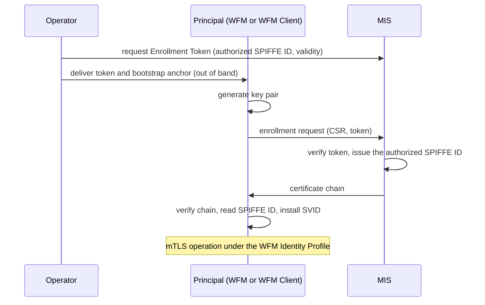

# MIAF Enrollment, Renewal, and Revocation Profile

- [MIAF Enrollment, Renewal, and Revocation Profile](#miaf-enrollment-renewal-and-revocation-profile)
  - [Owner](#owner)
  - [Summary](#summary)
  - [Reason for proposal](#reason-for-proposal)
  - [Requirements alignment acknowledgement](#requirements-alignment-acknowledgement)
  - [Technical proposal](#technical-proposal)
    - [1. Scope and Conformance](#1-scope-and-conformance)
    - [Part A - The Core (protocol-independent)](#part-a---the-core-protocol-independent)
      - [2. The Enrollment Authorization](#2-the-enrollment-authorization)
      - [3. Enrollment Flow and Keys](#3-enrollment-flow-and-keys)
      - [4. Renewal](#4-renewal)
      - [5. Revocation](#5-revocation)
      - [6. Discovery](#6-discovery)
      - [7. Provisioning Inputs](#7-provisioning-inputs)
    - [Part B - The Binding](#part-b---the-binding)
      - [8. Protocol Binding: EST](#8-protocol-binding-est)
    - [9. Security Considerations](#9-security-considerations)
    - [10. Roadmap (Informative)](#10-roadmap-informative)
  - [Alternatives considered](#alternatives-considered)
  - [Rejection reason](#rejection-reason)

## Owner

[@matlec](https://github.com/matlec)

## Summary

This profile adds automatic identity lifecycle management to the [Margo Identity and Authorization Framework (MIAF)](https://docs.margo.org/specification/identity/identity-framework). With it, Margo principals (WFMs and WFM Clients) obtain and renew their X.509-SVIDs without manual operator work. The profile also defines how a verifier checks whether a peer's SVID has been revoked.

The profile has two parts.

- **Part A is the core.** The core is protocol-independent. The MIS (the Margo Identity Service, the issuing side) issues a certificate only when an enrollment authorization permits it. It issues that certificate for the SPIFFE ID the authorization names, and for no other SPIFFE ID. An operator-issued Enrollment Token is the common form of that authorization. The core also specifies key handling, renewal timing, and revocation.
- **Part B is the binding.** The binding carries the core's enrollment and renewal round-trips over EST ([RFC 7030](https://datatracker.ietf.org/doc/html/rfc7030), as updated by [RFC 8951](https://datatracker.ietf.org/doc/html/rfc8951), [RFC 8996](https://datatracker.ietf.org/doc/html/rfc8996), and [RFC 9908](https://datatracker.ietf.org/doc/html/rfc9908)). The choice of EST is recorded under [Alternatives considered](#alternatives-considered).

The [Credential Provisioning and Acquisition SUP](https://github.com/margo/specification-enhancements/blob/feat/miaf-credential-provisioning-and-acquisition/proposals/miaf-credential-provisioning-and-acquisition.md) is the prerequisite, and it has to be approved first. It defines the enrolled mode: the principal generates its own key and completes a certificate request round-trip. This profile defines the protocol exchange, so it runs without an operator. It does not change the identity model, the SVID profile, or the mTLS authentication.

One manual step remains, by design. Before a principal can enroll, the operator delivers the enrollment authorization out of band, usually the Enrollment Token. The operator also supplies the endpoint the principal enrolls against, and, in most deployments, the initial bootstrap anchor that authenticates the MIS ([§7](#7-provisioning-inputs)). Everything after that step is automatic. This profile therefore does not deliver zero-touch onboarding. The first delivery stays manual until a device identity profile automates it against a manufacturer-installed credential ([§10](#10-roadmap-informative)).

## Reason for proposal

MIAF today provides identity formats, trust distribution, and mTLS. Every lifecycle step is manual. Operators install certificates by hand, renew them by hand, and revoke them by removing an entry from the accepted-client policy, by rotating the Trust Bundle, or by waiting for expiry. The specification treats this as a temporary step until automated renewal exists. This profile is that automation.

Manual renewal does not scale. A fleet of 5,000 clients on 90-day SVIDs needs roughly 55 manual installations every day. At the 7-day lifetime this profile recommends ([§4](#4-renewal)), it needs roughly 700. When a key is compromised today, only rotating the Trust Domain's anchors revokes the SVID cryptographically. Expiry is the only other mechanism that reaches every verifier, and it works only at short lifetimes. Only automation makes short lifetimes practical.

## Requirements alignment acknowledgement

This profile contributes to the same two backlog items as the acquisition SUP and covers a distinct part of each.

- [margo/specification#146](https://github.com/margo/specification/issues/146): this profile supplies the automated enrollment deferred at MIAF approval.
- [margo/specification#127](https://github.com/margo/specification/issues/127): this profile specifies revocation and how status reaches verifiers ([§5](#5-revocation)).

Out of scope, unchanged from the MIAF roadmap: the device identity profile, and authentication through traffic-inspecting proxies.

## Technical proposal

### 1. Scope and Conformance

This profile covers enrollment, renewal, and revocation for two principal classes: the WFM and the WFM Client. It builds on the MIAF identity model, the X.509-SVID profile, Trust Bundle distribution, and the WFM Identity Profile. It changes none of their identity rules. It automates lifecycle phases that the WFM Identity Profile describes as operator-driven (below). It also builds on the [acquisition SUP](https://github.com/margo/specification-enhancements/blob/feat/miaf-credential-provisioning-and-acquisition/proposals/miaf-credential-provisioning-and-acquisition.md), sections 3 to 6 (the enrolled and installed modes, provisioned inputs, the initial bootstrap anchor, and MIS independence). A reviewer needs that SUP in hand.

A manufacturer-installed credential such as an IEEE 802.1AR IDevID authenticates the device, not the principal. Device attestation and normative key-protection rules are deferred to the device identity profile, together with local SVID delivery over the SPIFFE Workload API ([§10](#10-roadmap-informative)).

The rules in this profile have three scopes.

- The conformance rules in this section apply to every WFM and WFM Client.
- The enrollment and renewal rules ([§2](#2-the-enrollment-authorization) to [§4](#4-renewal), the provisioning inputs of [§7](#7-provisioning-inputs), and the binding in [§8](#8-protocol-binding-est)) apply to a principal that obtains its SVID in the enrolled mode, and to the MIS that serves it.
- The revocation rules ([§5](#5-revocation)), with the `crlUris` field of [§6](#6-discovery), apply to a WFM or WFM Client that holds a CRL list, and to the MIS that publishes the CRLs. A verifier applies them the same way in the installed and the enrolled mode, because it verifies peers regardless of the mode that supplied its own SVID. Obtaining a CRL list is a separate capability. Only a principal that enrolls over this profile is required to have it (below).

The acquisition SUP defines the acquisition modes but mandates none of them. This profile mandates a common path. Without a mandated common path, two conformant products can still fail to work together.

- A WFM or WFM Client that can generate a key pair safely (with an adequate entropy source, for example) **MUST** implement the enrolled mode, and **MUST** automate its round-trip through this profile. Which round-trip a deployment uses remains the operator's choice: automated through this profile, or the manual round-trip of the [§3 enrolled floor](https://github.com/margo/specification-enhancements/blob/feat/miaf-credential-provisioning-and-acquisition/proposals/miaf-credential-provisioning-and-acquisition.md#3-acquisition-modes). The manual round-trip remains conformant, for testing, and as the fallback when the enrollment infrastructure is unavailable.
- A principal that cannot generate a key pair safely **MUST** use the installed mode instead, and its conformance documentation **MUST** state the reason.
- A principal that implements the enrolled mode **MUST** be able to retrieve a discovery document, to resolve `crlUris` from it, and to apply the consuming rules of [§5](#5-revocation). Whether the operator provisions a discovery document URL remains the operator's choice ([§7](#7-provisioning-inputs)). [§5](#5-revocation) names two ways to go without revocation status, and the Trust Domain or the operator chooses each one. This requirement leaves no product that cannot consume revocation status at all.
- An installed-mode principal **MAY** implement discovery-document retrieval. Where it does, it holds the CRL list and applies the [§5](#5-revocation) rules in full. This profile does not require an installed-mode principal to retrieve a discovery document, so one without that capability stays conformant.
- The binding in [§8](#8-protocol-binding-est) is the automated enrollment this profile requires. Every product that enrolls shares it. A product **MAY** offer further enrollment protocols in addition (CMP, for example). This profile does not define them, so only the [§8](#8-protocol-binding-est) binding carries the interoperability guarantee. An MIS that issues SVIDs over such a protocol still applies every Part A rule. Only the binding's protocol frame differs: transport, the enrollment authorization's interchange format, the discovery field, and deferred-issuance signaling.

These rules leave the acquisition SUP's mode rules otherwise intact. A product **MAY** implement the installed mode in addition.

**Conformant configurations.** A conformant principal takes one of two forms. A principal that can generate a key safely implements the enrolled mode and the [§8](#8-protocol-binding-est) binding, and can consume a CRL list ([§5](#5-revocation)); it enrolls with the Enrollment Token, and may additionally support the certificate-form enrollment authorization and offer enrollment protocols beyond EST. A principal that cannot generate a key safely uses the installed mode, and may consume a CRL list. The conformance documentation that the acquisition SUP requires (the mode a product implements) also records these optional capabilities.

**Changes to the specification.** This profile changes three sections of MIAF's operator playbooks, and automates the lifecycle phases that the WFM Identity Profile describes as operator-driven:

- The provisioning playbook now has three roles: the path for principals in the installed mode, the documented fallback for the automated path, and the procedure for delivering the enrollment authorization (usually the Enrollment Token).
- The revocation playbook now has a fourth mechanism, the CRL, beside accepted-client policy removal, Trust Bundle rotation, and expiry ([§5](#5-revocation)).
- The lifetime guidance is replaced by the values in [§4](#4-renewal).
- The WFM Identity Profile describes the Enrollment, Renewal, and Revocation phases as operator-driven. For a principal in the enrolled mode, this profile automates all three.

### Part A - The Core (protocol-independent)

*The rules in this part hold under any enrollment protocol. A future second binding adds a section to Part B and leaves Part A unchanged.*

#### 2. The Enrollment Authorization

The enrollment authorization permits the MIS to issue the SVID for a single SPIFFE ID. The acquisition SUP names an enrollment authorization as the second static bootstrap input, beside the initial bootstrap anchor, and leaves its definition to this profile. The two inputs serve opposite purposes. The anchor proves the MIS to the principal. The enrollment authorization proves the principal's entitlement to the MIS.

At first enrollment, the enrollment authorization takes one of two forms:

- The token-form (**Enrollment Token**): the operator delivers a short-lived token out of band. After enrollment, the principal renews without further operator-delivered input. A lapse or a lost key needs a fresh token ([§4](#4-renewal)). It is the only form that requires no pre-existing credential.
- The certificate-form: a certificate that the principal proves possession of, and that the MIS is configured to trust. One example is a certificate that the operator's own PKI issued to the principal.

An MIS **MUST** accept the Enrollment Token. It **MAY** also accept the certificate-form enrollment authorization.

The core rules:

- The MIS **MUST** bind every enrollment authorization to exactly one SPIFFE ID. At first enrollment the authorization is a token or a certificate. At renewal it is the current SVID ([§4](#4-renewal)).
- A SPIFFE ID **MAY** have more than one valid (still in force - neither expired nor withdrawn) enrollment authorization, so a fresh authorization (for a lapse, a lost key, or rotation) does not have to wait for the previous one to end.
- The MIS **MUST** set the issued certificate's URI SAN to the SPIFFE ID that the presented enrollment authorization names. This is the **exact-match rule**. The authorization is the sole source of the SPIFFE ID; the MIS never binds a certificate to any other SPIFFE ID. The MIS does not verify control of the SPIFFE ID, the way a Web PKI CA verifies a domain. A SPIFFE ID is assigned, not controlled.
- Namespace-prefix scopes for SPIFFE IDs are not offered. Under a prefix, the SPIFFE ID would come from the principal's request, and the acquisition SUP makes the issuer authoritative for the SPIFFE ID.
- Withdrawing an authorization ends its binding to the one SPIFFE ID it names and stops further enrollments under it. For the token-form, the binding ends when the token expires or when the operator invalidates it, whichever comes first. For the certificate-form, the binding ends when the certificate expires or when the operator removes the MIS-side acceptance, whichever comes first. Withdrawing an authorization does not revoke SVIDs already issued. Withdrawal is not revocation ([§5](#5-revocation)).
- Issuance and admission are separate decisions. The WFM's accepted-client policy stays with the WFM. [§9](#9-security-considerations) records how the two interact when an enrollment authorization is stolen.
- An MIS that accepts the certificate-form **MUST** accept it for repeated enrollments until the operator withdraws the acceptance or the certificate expires. It is reusable, not single-use: a lapsed principal re-enrolls with the same credential ([§4](#4-renewal)). It is typically longer-lived than a token.

Limiting an enrollment authorization to one SPIFFE ID means one authorization per SPIFFE ID: a deployment of 500 WFM Clients needs 500 authorizations. Each authorization reaches its principal over the provisioning channel the deployment already uses, so it adds no new delivery step. Sharing one authorization across a batch of principals is out of scope, because the exact-match rule gives every member the same SPIFFE ID; that case belongs to the device identity profile ([§10](#10-roadmap-informative)).

**Enrollment token properties.** These are the minimums. An MIS can be stricter.

- The MIS **MUST** give every token an operator-set validity period, and **MUST NOT** accept the token afterward.
- The MIS **MUST** allow an operator to invalidate a token before it expires.
- The token secret **MUST** be drawn from a cryptographic random source with at least 128 bits of entropy. This holds whether the MIS or the operator supplies it.
- A token **SHOULD** be single-use. Single use counts the key in the CSR, not requests. A retry that presents the same key does not count as a second use. An MIS that implements single use **MUST** refuse a key other than the first after the token is consumed.
- The MIS **SHOULD** accept a retry that presents the same key and the same token for at least 10 minutes after the first request. Where the MIS holds the enrollment for operator review, it **MUST** accept such a retry until it resolves that enrollment or the token expires ([§3](#3-enrollment-flow-and-keys)). The certificate returned is either the original or a fresh one for the same SPIFFE ID, because [§3](#3-enrollment-flow-and-keys) permits concurrent certificates. Without this window, a principal interrupted by a reboot is locked out, and two MIS products with different windows do not interoperate.
- A reusable token is justified only where the MIS cannot express single use, such as one that stores the token as a password. Such an implementation cannot refuse a different key, so the operator limits the exposure with the shortest validity period the deployment allows and the ability to withdraw it; a stolen token works only within that period. An attacker holding the token then enrolls, and only the issuance record ([§3](#3-enrollment-flow-and-keys)) shows the operator the new key.

**Certificate-form properties.** These are the minimums too. An MIS can be stricter.

- The MIS **MUST** allow an operator to remove the acceptance for a certificate before it expires. That removal is the withdrawal mechanism.
- Revoking the authorization certificate itself does not withdraw it. The MIS is not required to check the revocation status of the authorization certificate.
- The MIS **MUST** validate a presented authorization certificate against its configured trust and **MUST NOT** accept it after expiry. An operator that wants a shorter exposure uses the shortest-lived authorization certificate the operator PKI allows, and otherwise relies on withdrawal.

This profile defines no wire API for token administration or for certificate acceptance, and the core defines no structure for the token secret; the [§8](#8-protocol-binding-est) binding does. It defines the token's interchange format and how the principal sends it for EST.

This profile does not prescribe the MIS realization. An enrollment protocol carries the request and leaves the issuance decision to CA policy. Two MIS realizations are expected to be common in practice:

- A policy front end terminates the enrollment protocol and signs through an existing CSR-signing CA. The policy implementation is then independent of the CA.
- A stock CA product is configured to enforce the policy against its own certificate database.

A stock CA, for example, enforces the token-form by pre-registering each principal with its identity, the token secret, and the token's validity period, and refuses a token past that period. It enforces the certificate-form by pre-registering the accepted certificate mapped to that identity.

#### 3. Enrollment Flow and Keys

The flow is the same for hardware-backed keys (TPM, secure element) and software keys, and for both principal classes, the WFM and the WFM Client. The diagram shows the token-form path. The certificate-form differs only in authentication (TLS client certificate, [§8](#8-protocol-binding-est)).

A principal is not told its SPIFFE ID before it enrolls. As [§7](#7-provisioning-inputs) sets out, no provisioning input carries the SPIFFE ID, and the principal reads it from the URI SAN of its issued SVID. A first-enrollment CSR therefore carries no identity claim. The MIS overrides any name content in the CSR, as the acquisition SUP's [§3 enrolled floor](https://github.com/margo/specification-enhancements/blob/feat/miaf-credential-provisioning-and-acquisition/proposals/miaf-credential-provisioning-and-acquisition.md#3-acquisition-modes) already requires. This profile instead specifies where the MIS obtains the SPIFFE ID: from the enrollment authorization alone. At renewal the principal knows its SPIFFE ID, because enrollment established it.

An MIS that serves several Trust Domains **MUST** keep enrollment separate for each, so that an enrollment endpoint serves exactly one Trust Domain. At renewal, the MIS **MUST** accept only the SVIDs of the Trust Domain that the enrollment endpoint serves. The rule holds under any binding, and [§8](#8-protocol-binding-est) shows how EST satisfies it, with one endpoint URL per Trust Domain. This profile places no check at issuance on the path-shape of the SPIFFE ID the authorization names; the principal enforces that path-shape when it loads its SVID, and a verifier when it verifies a peer's SVID.

**Key rules.**

- The principal **MUST** generate the key pair. It **SHOULD** use hardware-bound generation where available.
- The enrollment request carries a CSR signed by that key. CSR signature algorithms follow the MIAF cryptographic requirements.
- This profile offers no server-side key generation, so the operator never holds a principal's private key.

**Issuance rules for the MIS.**

An enrollment authorization names exactly one SPIFFE ID ([§2](#2-the-enrollment-authorization)), so every certificate the MIS issues under it carries that one SPIFFE ID. Concurrent valid certificates for one SPIFFE ID are permitted. A replacement after a lost key needs a second concurrent certificate ([§4](#4-renewal)), and routine rotation needs an overlap between the two. A predecessor certificate ends at its expiry, unless the operator revokes it ([§5](#5-revocation)). A principal can run as several replicas, for example on a cloud platform (a WFM) or on a Kubernetes cluster (a WFM Client).

- An MIS **MUST NOT** refuse an enrollment or a renewal only because a valid certificate for the same SPIFFE ID already exists.
- An MIS **MUST** rate-limit enrollment and renewal attempts. Rate-limiting blocks brute-force guessing of a token secret, and it protects the signing service from exhaustion.
- The MIS **MUST** keep an operator-accessible **issuance record** of every certificate it issues. The record **MUST** let an operator identify, for each certificate, the SPIFFE ID, the subject public key, the issuance time, and the enrollment authorization that authorized it. The record is how an operator identifies a key it does not recognize.
- The MIS **SHOULD** raise an alert when it issues for a key it has not issued for that SPIFFE ID before. An operator that does not recognize the key revokes the certificate ([§5](#5-revocation)).

Two replica patterns occur in practice. In the first, the replicas share one key and one SVID from a secret store the platform provides; software keys can be shared, and hardware-backed keys cannot. In the second, each replica is its own principal with its own SPIFFE ID under the same rules, and the accepted-client policy admits the set of instance IDs. Under both patterns, replicas present the same SPIFFE ID only where they share a single credential, because the SPIFFE ID names the principal, not the process. The pattern that gives each replica its own key under one shared SPIFFE ID is deferred ([§10](#10-roadmap-informative)).

**Retry rules.**

- An interrupted enrollment is safely retryable. A failed issuance does not consume the token, and a same-key retry is accepted within the [§2](#2-the-enrollment-authorization) retry window.
- An MIS **MAY** hold an enrollment for operator review before it issues. This is deferred issuance. While an enrollment is pending, a single-use token stays tied to the key in the CSR of that enrollment, and the MIS refuses the same token with any other key. [§8](#8-protocol-binding-est) defines how EST signals the wait.

#### 4. Renewal

Renewal repeats the issuance round-trip, authenticated by the current SVID, with no new operator-delivered input. The MIS renews only the SPIFFE ID that the current SVID carries, and overrides any name content in the renewal CSR. Renewal re-issues the certificate over the current key, so the key does not change on renewal. A key change is the exception, whether for a lost-key replacement or an operator-directed rekey, and it is the [§3](#3-enrollment-flow-and-keys) alert that flags it.

**Renewal mechanism.**

- Renewal is unattended. A principal **MUST** be able to renew without operator action. A conformant MIS **MUST** complete the renewal with no operator step between issuance and that renewal.
- Consuming or withdrawing the Enrollment Token does not affect renewal. A key change follows the issuance rules of [§3](#3-enrollment-flow-and-keys). The MIAF rule that a client re-establishes affected connections after renewal applies unchanged.

**Timing and retry.**

- Renewal **SHOULD** occur within a jittered window before expiry. A principal selects its renewal time at random from between 40% and 60% of the SVID's lifetime, with a fresh selection for each SVID. The latest draw still leaves a full offline window before expiry for a principal whose lifetime is sized to its realistic offline window, per the lifetime guidance below.
- Principals **MUST** apply randomized backoff on retry. A failed attempt retries after a random delay. The delay ceiling starts at a base value and doubles with each failure, up to a cap. The delay is drawn from (0, ceiling], that is, (0, min(cap, base * 2^(n-1))] for the n-th failure. Retries continue until expiry.

A 1-minute base and a 1-hour cap are reasonable defaults; a deployment can choose other values. These rules keep a fleet that returns from an outage from renewing all at once.

**Lapse and recovery.**

- An expired or revoked SVID cannot renew. The MIS **MUST NOT** accept an expired or revoked SVID as renewal authorization. Every other valid SVID for a SPIFFE ID authorizes a renewal of that SPIFFE ID, whichever key it certifies.
- A lapse recovers without operator action where the principal holds a certificate the MIS accepts as the certificate-form enrollment authorization ([§2](#2-the-enrollment-authorization)). Otherwise the operator delivers a fresh Enrollment Token, at the cost of one action for each lapsed principal.
- A principal that loses its key cannot renew either, even while its SVID is still valid. It re-enrolls with a fresh enrollment authorization, as after a lapse. Where the Trust Domain offers revocation status, the operator revokes the orphaned predecessor certificate ([§5](#5-revocation)). Concurrent valid certificates for one SPIFFE ID are permitted ([§3](#3-enrollment-flow-and-keys)), so the replacement needs no special MIS policy.

The operator prevents a lapse by sizing the SVID lifetime to the principal's realistic offline window. An SVID that lapses during an outage recovers through re-enrollment ([§2](#2-the-enrollment-authorization)) or through the manual re-issue path of the acquisition SUP's [§3 enrolled floor](https://github.com/margo/specification-enhancements/blob/feat/miaf-credential-provisioning-and-acquisition/proposals/miaf-credential-provisioning-and-acquisition.md#3-acquisition-modes). There the principal exports a PKCS#10 CSR and ingests the returned chain through its provisioning interface. The floor applies to every principal in the enrolled mode, including one that also automates enrollment.

**Lifetime guidance.** This profile replaces the MIAF values.

- A connected principal **SHOULD** use an SVID lifetime of 7 days or less.
- An intermittently connected principal **SHOULD** use at least 2.5 times its realistic offline window, and otherwise as short as possible. With the 40% to 60% draw window above, the latest draw then leaves one full offline window (0.4 * 2.5 = 1).

If a principal's drawn renewal time passed while it was offline, the guidance above assumes that the principal attempts renewal immediately on reconnection. The two values compose for one offline window: an offline period longer than the window the operator sized for still expires the SVID, and the principal lapses. The lifetime choice is also a revocation choice: at short lifetimes, expiry itself is the revocation mechanism. The revocation status of [§5](#5-revocation) matters mainly at the longer lifetimes intermittent principals need.

#### 5. Revocation

MIAF adopts the SPIFFE model, where SVIDs are short-lived and rotated automatically, and no revocation protocol is defined for an individual SVID. That model assumes principals that can renew often, and for Margo's connected principals it holds. It does not hold for the intermittently connected devices Margo also serves. These principals cannot renew on an hourly cadence. Their SVID lifetime is sized to a realistic offline window ([§4](#4-renewal)), so expiry alone is not sufficient. MIAF acknowledged this by deferring revocation. This profile defines that revocation.

**Requesting revocation.** An MIS **MUST** allow an operator to revoke a certificate it issued. The request is an administrative act at the MIS, and this profile defines no wire API for it. A binding **MAY** additionally provide an in-protocol revocation request (the EST binding does not, [§8](#8-protocol-binding-est)). Routine re-issue is not revocation. It adds no CRL entry, and the predecessor stays valid until it expires. This profile provides the MIS no way to withdraw an issued certificate without a CRL entry.

**Distributing revocation status.** This profile uses X.509 CRLs. The Trust Domain maintains a list of CRL URLs, `crlUris`, one URL for each issuing CA. The list reaches a verifier only through the discovery document, which advertises it as a field ([§6](#6-discovery)). The list cannot be provisioned as static input to a principal, because it changes whenever the set of issuing CAs changes. A discovery document does not require a separate service; it can be a static file on the same server that serves the CRL files.

This profile does not support a separate CRL-signing CA. A verifier resolves a CRL's signer from the chain of the certificate under test, per the signature rule in the consuming list below, so a CRL that another CA signed does not verify. A CRL is self-authenticating: its signature establishes its authenticity. A CRL can therefore be served over plain HTTP, a stock CA product's own CRL endpoint included. The signature gives authenticity but not freshness; an on-path attacker can replay an old still-valid CRL over HTTP, which [§9](#9-security-considerations) records, and serving the CRLs over HTTPS closes that replay.

The consuming rules in this section fail open. A CRL endpoint that is unreachable would stop every verifier that depends on it. For an intermittently connected principal, an outage longer than a CRL validity period is a normal condition. The residual risk is the reverse case: a revocation remains unknown to a verifier that cannot fetch. [§9](#9-security-considerations) records it.

Two lists follow. The first applies to the MIS of a Trust Domain that advertises `crlUris`. The second applies to a verifier that holds a CRL list.

**Publishing the CRLs.**

- The MIS **MUST** list a CRL for every CA that issues SVIDs in the Trust Domain. A verifier that finds a presented issuer missing from the list it holds cannot tell a stale or misconfigured list from a stripped one, so the missing entry is a logged signal; [§9](#9-security-considerations) records an attacker stripping an entry.
- The MIS **MUST** publish complete CRLs; delta CRLs are not used.
- The MIS **MUST** publish an updated CRL within 24 hours of a revocation. It **MUST NOT** set a CRL's validity period longer than 7 days.
- The MIS **SHOULD** support `ETag`/`Last-Modified` caching on the CRL endpoint it serves.

**Consuming the CRLs.**

- A verifier that holds a CRL list **MUST** attempt to retrieve and refresh every listed CRL. It retrieves each listed CRL as soon as it obtains the list. It retries a failed attempt under the randomized backoff of [§4](#4-renewal). Unlike a renewal, a verifier keeps retrying past the SVID's expiry, as long as the URL stays listed.
- A verifier **MUST NOT** make CRL retrieval a step of connection establishment. Refresh is a background activity.
- A verifier **SHOULD** poll more often than a held CRL's `nextUpdate`, with HTTP conditional requests (`If-Modified-Since`/`ETag`). Every 12 to 24 hours is a reasonable choice. Polling detects a revocation published early at little bandwidth cost. `nextUpdate` is the refresh deadline for the cached copy, and not the end of enforcement.
- A verifier **MUST** refuse a connection to a peer whose SVID a held CRL lists, whatever the age of that CRL.
- A verifier **MUST** check the peer's leaf certificate against the CRL that the leaf's issuer signed. This profile defines no check of an intermediate in the presented chain. A compromised issuing CA stays a Trust Bundle rotation case.
- A verifier **MUST NOT** refuse a connection because revocation status is unavailable, stale, or absent. A verifier that has not yet retrieved a listed CRL verifies without it until its first successful retrieval.
- A verifier **MUST** verify a CRL's signature before it applies that CRL. It **MUST** verify the signature with the certificate of the leaf's issuer, taken from the chain the peer presented, per [RFC 5280](https://datatracker.ietf.org/doc/html/rfc5280) processing. Where the issuer is a trust anchor the presenter omitted, the issuer's certificate comes from the Trust Bundle instead. Verification happens at the point of use, and not at retrieval, so a verifier needs no intermediates of its own to hold a CRL.
- A verifier **MUST** log each validation it performs without usable revocation status, and **SHOULD** raise an operator-visible signal. Three cases leave a verifier without usable revocation status. The verifier has no copy of a listed CRL yet. A held copy is past its `nextUpdate`. A presented issuer matches no entry in the held list. The third case indicates a stale or misconfigured held list, and the next refresh of the discovery document repairs a stale one.
- A verifier that consults CRLs **SHOULD** refresh the discovery document at least as often as the shortest validity period among the CRLs it holds. The next rule depends on that refresh.
- When a refreshed discovery document no longer carries `crlUris`, the verifier logs the change at once. It keeps applying its held CRLs until their `nextUpdate`, then discards them and verifies without revocation status. This is the only case in which a CRL's validity period changes what a verifier enforces. The log entries show the change to the operator, and after that a revoked SVID is a risk only until the SVID itself expires.
- Verifiers **MUST NOT** fetch revocation status from CRLDP or AIA pointers in certificates. MIAF already prohibits AIA fetching, and this profile extends that to CRLDP. The `crlUris` list carries centrally what the certificates' CRLDP entries would, so the certificates point nowhere for status.

A CRL's validity period and an SVID's lifetime limit different things. The validity period limits how stale revocation status becomes while the CRL endpoint is reachable. The validity period places no limit on the SVID lifetime. A 60-day SVID with a 7-day CRL therefore carries at most 7 days of stale status in normal operation. Where the endpoint is unreachable, the copy a verifier holds keeps applying and its status grows arbitrarily stale. The verifier logs that state, and the SVID's own lifetime is then the only limit ([§9](#9-security-considerations) records the residual risk).

Two ways to go without revocation status exist, at different levels of scope. When a Trust Domain advertises no `crlUris`, it opts out for every verifier. When an operator provisions no discovery document URL to a verifier, that operator opts out for that verifier, because a verifier that never fetches the discovery document never holds the CRL list ([§6](#6-discovery)). An isolated, statically provisioned verifier is the typical case, and a constrained device in the installed mode is another. In both cases the deployment accepts the residual risk.

A Trust Domain that does not advertise `crlUris` offers no revocation status beyond the three mechanisms MIAF's revocation playbook lists. The operator removes the WFM Client from the WFM's accepted-client policy, which remains the fast path for excluding one WFM Client. The operator rotates the Trust Bundle, which remains the response to a compromised issuer. Expiry is the third mechanism. The CRL addresses three cases that the three mechanisms do not: an accepted-client policy admitting a whole namespace, an SVID lifetime longer than expiry can handle alone, and a WFM Client that verifies the SVID its WFM presents. Where a lifetime is short enough that expiry itself is the revocation mechanism, a future identity profile can exempt its own principal classes from this section's revocation-status rules.

#### 6. Discovery

The core adds one field to the discovery document that the identity framework defines. MIAF serves the discovery document and the Trust Bundle as two separate endpoints, and the discovery document is optional at the server. A binding declares its own fields, including the one that advertises its enrollment endpoint ([§8](#8-protocol-binding-est) for EST).

| Field | Type | Required | Description |
| :---- | :--- | :------- | :---------- |
| `crlUris` | array of strings | where the Trust Domain offers revocation status | Absolute URLs of the Trust Domain's CRLs, one for each issuing CA ([§5](#5-revocation)). Plain HTTP is permitted, because a CRL authenticates itself. |

A verifier resolves `crlUris` from the discovery document it retrieves ([§1](#1-scope-and-conformance) requires the capability; [§5](#5-revocation) specifies the use). The acquisition SUP's [§3 bundle floor](https://github.com/margo/specification-enhancements/blob/feat/miaf-credential-provisioning-and-acquisition/proposals/miaf-credential-provisioning-and-acquisition.md#3-acquisition-modes) already requires a principal that fetches MIS-hosted material to accept a discovery document URL, and to resolve the fields it needs. The discovery document is the only source of `crlUris`, so a principal that never retrieves the discovery document has no revocation status ([§5](#5-revocation)). [§7](#7-provisioning-inputs) sets out the provisioning inputs an operator supplies, and what each gives the principal.

A principal that enrolls over this profile **SHOULD** obtain the enrollment endpoint from the discovery document rather than from static configuration. If a later SUP adds a field, a principal provisioned with the discovery document URL and the initial bootstrap anchor then needs no new provisioning input. Retrieval of the discovery document follows the identity framework's own rules for that endpoint, including its initial trust bootstrap rules. [§5](#5-revocation) sets how often a verifier that consults CRLs refreshes it.

#### 7. Provisioning Inputs

This profile adds inputs to the provisioning-input tables of the acquisition SUP's [§4](https://github.com/margo/specification-enhancements/blob/feat/miaf-credential-provisioning-and-acquisition/proposals/miaf-credential-provisioning-and-acquisition.md#4-provisioning-input-contract), for both WFM and WFM Client. As in that SUP, the Required column states when a conformant product must accept the input.

| Input | Required | Notes |
| :---- | :------- | :---- |
| Enrollment Token | where the principal enrolls over this profile | the operator-issued form of the enrollment authorization ([§2](#2-the-enrollment-authorization)). The operator supplies it at each enrollment, unless the certificate-form enrollment authorization takes its place. Renewal needs no token ([§4](#4-renewal)). The binding defines the token's interchange format ([§8](#8-protocol-binding-est)) |
| Certificate-form enrollment authorization | where the principal implements the certificate-form | a certificate and its key ([§2](#2-the-enrollment-authorization)), in the formats the acquisition SUP's [§4](https://github.com/margo/specification-enhancements/blob/feat/miaf-credential-provisioning-and-acquisition/proposals/miaf-credential-provisioning-and-acquisition.md#4-provisioning-input-contract) fixes. The operator supplies it in place of a token, where the MIS accepts it. Optional at the MIS ([§2](#2-the-enrollment-authorization)), so a product cannot rely on it |
| Enrollment endpoint URL, or a discovery document URL that resolves to it | where the principal enrolls over this profile | the operator supplies one form. A product accepts a directly supplied URL (below); a discovery document URL can supply the endpoint as well, which [§6](#6-discovery) prefers. The URL is routing information only. The binding defines the concrete field ([§8](#8-protocol-binding-est)) |

A principal that enrolls over this profile **MUST** accept a directly supplied enrollment endpoint URL, so that a deployment can run without a discovery document. The endpoint form the operator chooses decides whether the principal reaches a CRL list: a discovery document URL brings `crlUris` and revocation status, a directly supplied endpoint URL alone brings none ([§6](#6-discovery), [§5](#5-revocation)). The trust source is a separate provisioned input in the complete input contract below.

No input carries the SPIFFE ID. The acquisition SUP's [§4](https://github.com/margo/specification-enhancements/blob/feat/miaf-credential-provisioning-and-acquisition/proposals/miaf-credential-provisioning-and-acquisition.md#4-provisioning-input-contract) records why, and this profile keeps that rule. The enrollment authorization names the SPIFFE ID at the MIS, and the issued SVID carries it back to the principal, which reads it from the URI SAN ([§3](#3-enrollment-flow-and-keys)).

**The complete input contract (informative).** The table below collects every provisioning input a WFM or a WFM Client accepts, across this profile and the acquisition SUP. The normative statement for each row is in the last column. The table has no row for a WFM Client's target WFM identifier. The operator configures that identifier at the MIS, where it names the client's SPIFFE ID, and it reaches the client inside its own SVID ([§3](#3-enrollment-flow-and-keys)). It is therefore not a separate provisioning input.

| Input | Required | Normative home |
| :---- | :------- | :------------- |
| X.509-SVID with its intermediate chain | always | acquisition SUP [§4](https://github.com/margo/specification-enhancements/blob/feat/miaf-credential-provisioning-and-acquisition/proposals/miaf-credential-provisioning-and-acquisition.md#4-provisioning-input-contract) |
| SVID private key, operator-supplied | installed mode only | acquisition SUP [§4](https://github.com/margo/specification-enhancements/blob/feat/miaf-credential-provisioning-and-acquisition/proposals/miaf-credential-provisioning-and-acquisition.md#4-provisioning-input-contract) |
| Trust Bundle, statically supplied | always | acquisition SUP [§3](https://github.com/margo/specification-enhancements/blob/feat/miaf-credential-provisioning-and-acquisition/proposals/miaf-credential-provisioning-and-acquisition.md#3-acquisition-modes) |
| `trustBundleUri`, directly supplied | where the principal implements Trust Bundle refresh | acquisition SUP [§3](https://github.com/margo/specification-enhancements/blob/feat/miaf-credential-provisioning-and-acquisition/proposals/miaf-credential-provisioning-and-acquisition.md#3-acquisition-modes) |
| Discovery document URL | where the principal fetches MIS-hosted material. The principal resolves from the retrieved document the fields it needs, `crlUris` among them | acquisition SUP [§3](https://github.com/margo/specification-enhancements/blob/feat/miaf-credential-provisioning-and-acquisition/proposals/miaf-credential-provisioning-and-acquisition.md#3-acquisition-modes) |
| Initial bootstrap anchor, as an anchor set | where the principal fetches MIS-hosted material | acquisition SUP [§5](https://github.com/margo/specification-enhancements/blob/feat/miaf-credential-provisioning-and-acquisition/proposals/miaf-credential-provisioning-and-acquisition.md#5-the-initial-bootstrap-anchor) |
| Initial bootstrap anchor, as a pin set | where the principal fetches MIS-hosted material | acquisition SUP [§5](https://github.com/margo/specification-enhancements/blob/feat/miaf-credential-provisioning-and-acquisition/proposals/miaf-credential-provisioning-and-acquisition.md#5-the-initial-bootstrap-anchor) |
| WFM endpoint URL | always, for a WFM Client | acquisition SUP [§4](https://github.com/margo/specification-enhancements/blob/feat/miaf-credential-provisioning-and-acquisition/proposals/miaf-credential-provisioning-and-acquisition.md#4-provisioning-input-contract) |
| accepted-client policy entries | always, for a WFM | acquisition SUP [§4](https://github.com/margo/specification-enhancements/blob/feat/miaf-credential-provisioning-and-acquisition/proposals/miaf-credential-provisioning-and-acquisition.md#4-provisioning-input-contract) |
| PKCS#10 CSR | enrolled mode only, and an output rather than an input | acquisition SUP [§3](https://github.com/margo/specification-enhancements/blob/feat/miaf-credential-provisioning-and-acquisition/proposals/miaf-credential-provisioning-and-acquisition.md#3-acquisition-modes) |
| Enrollment Token | where the principal enrolls over this profile | this section |
| Certificate-form enrollment authorization | where the principal implements the certificate-form | this section |
| Enrollment endpoint URL, directly supplied | where the principal enrolls over this profile | this section |

`crlUris` is never a provisioning input ([§5](#5-revocation) records why). A principal that enrolls over this profile operates in the enrolled mode, so the acquisition SUP's row for an operator-supplied SVID private key never applies to it. The X.509-SVID row is satisfied by the certificate chain the protocol returns ([§8](#8-protocol-binding-est)).

### Part B - The Binding

*The binding for this profile is EST. It carries the enrollment and renewal round-trips the core defines.*

#### 8. Protocol Binding: EST

The binding defined in this profile is EST ([RFC 7030](https://datatracker.ietf.org/doc/html/rfc7030), as updated by RFC 8951, RFC 8996, and RFC 9908). All its exchanges run under the MIAF TLS baseline, and the binding adds no cryptography of its own. The principal authenticates the enrollment endpoint against the initial bootstrap anchor of the acquisition SUP's [§5](https://github.com/margo/specification-enhancements/blob/feat/miaf-credential-provisioning-and-acquisition/proposals/miaf-credential-provisioning-and-acquisition.md#5-the-initial-bootstrap-anchor), in whichever form the operator provisioned, or against its built-in trust store where that section permits it, at enrollment and at renewal alike. Every exchange is HTTPS carrying base64 DER, and the only signatures are CSR signatures under the MIAF rules. This profile does not change the SVID algorithm set.

**Discovery.** The binding's discovery field, per [§6](#6-discovery).

| Field | Type | Required | Description |
| :---- | :--- | :------- | :---------- |
| `estBaseUri` | string | where the Trust Domain serves a principal in the enrolled mode | Absolute HTTPS URL of the enrollment endpoint, complete up to the operation segment. A principal joins the operation segment to `estBaseUri` with exactly one `/`, and appends only `/simpleenroll`, `/simplereenroll`, or `/cacerts`. The URL therefore includes the RFC 7030 path prefix and any additional path segments (for example, `https://mis.example.com/.well-known/est/domain-a`). |

An MIS serving several Trust Domains assigns each one an additional path segment (`domain-a` in the example), and thereby a separate enrollment endpoint URL, as [§3](#3-enrollment-flow-and-keys) requires. A principal treats the whole URL as opaque.

**Provisioning inputs.** The binding specifies the [§7](#7-provisioning-inputs) inputs. The core leaves the interchange format of the enrollment authorization to the binding ([§2](#2-the-enrollment-authorization)).

| Input | Interchange format |
| :---- | :----------------- |
| Enrollment Token | the [RFC 7617](https://datatracker.ietf.org/doc/html/rfc7617) user-pass string: `username:secret`, UTF-8. RFC 7617 forbids a colon in the user-id, so the split is unambiguous. The two parts travel as the HTTP Basic credentials (see Authentication below) |
| Certificate-form enrollment authorization | the certificate and key formats that the acquisition SUP's [§4](https://github.com/margo/specification-enhancements/blob/feat/miaf-credential-provisioning-and-acquisition/proposals/miaf-credential-provisioning-and-acquisition.md#4-provisioning-input-contract) already fixes. The certificate travels as the TLS client certificate (see Authentication below) |
| Enrollment endpoint URL | `estBaseUri`, in the form the discovery table above defines, for a deployment that provisions the endpoint statically |

**Operations.** How each exchange defined by the core runs over EST:

- **Enrollment**: `/simpleenroll` over TLS, server-authenticated, with a client certificate when the certificate-form enrollment authorization is used. The CSR carries no SPIFFE ID at first enrollment, because the principal does not know its SPIFFE ID yet ([§3](#3-enrollment-flow-and-keys)). The MIS takes the SPIFFE ID from the enrollment authorization, and puts it in the URI SAN of the certificate it issues ([§2](#2-the-enrollment-authorization), the exact-match rule).
  - **Authentication**: HTTP Basic, or a TLS client certificate.
    - An MIS **MUST** accept HTTP Basic. The Enrollment Token's secret travels in the password field, and the username's content is MIS-defined.
    - The MIS **SHOULD NOT** record the Enrollment Token's secret (the HTTP Basic password field) in access logs, and **SHOULD NOT** place a TLS-terminating intermediary in front of the enrollment endpoint. [§9](#9-security-considerations) notes the exposure these prevent.
    - A TLS client certificate serves the certificate-form enrollment authorization of [§2](#2-the-enrollment-authorization). This is also how the MIS distinguishes the two forms. A request that presents a client certificate uses the certificate-form enrollment authorization, and a request without one carries the token. A principal **MUST NOT** present a client certificate at `/simpleenroll` unless it is using the certificate-form enrollment authorization. Otherwise a TLS stack that offers a certificate automatically switches the authorization form without the principal intending it.
    - The MIS **SHOULD** return the same generic HTTP rejection for every refused token, whatever the cause. A distinction between an unknown token and a consumed one reveals to an attacker which tokens exist. Internal logs can still distinguish the cause.
    - The MIS **SHOULD** return the same generic rejection for every refused certificate-form authorization, whatever the cause.
    - A principal **MUST NOT** put a `challengePassword` attribute in its CSR. RFC 7030 puts the tls-unique value in that field, and the presence of the attribute signals that the client included channel-binding information. This profile does not use that proof-of-possession linking (see Not used below). The attribute therefore carries no meaning here, and its presence misstates what the CSR contains.
  - **Deferred issuance**: an MIS signals a deferred enrollment ([§3](#3-enrollment-flow-and-keys)) with HTTP 202 and `Retry-After`. A principal **MUST** honor `Retry-After` and repeat the request. RFC 7030 defines the 202 response as an accepted request whose response is not yet available, so a principal does not treat it as an error.
- **Renewal**: `/simplereenroll` over mTLS with the current SVID as client certificate. This is a renewal, because the principal already holds an SVID.
  - The Enrollment Token is not used for renewals. Renewal never changes the SPIFFE ID. A principal that needs a different SPIFFE ID enrolls again at `/simpleenroll` with a fresh enrollment authorization.
  - A renewal under a new key follows the issuance rules of [§3](#3-enrollment-flow-and-keys), including its detection rules.
  - A principal **SHOULD** reproduce the Subject and the SubjectAltName of the certificate under renewal byte for byte, by copying the raw DER of the certificate's subject field and the `extnValue` octets of its subjectAltName extension into the renewal CSR, rather than rebuild equivalent names from a parsed representation; an equivalent name re-encoded from parsed objects can differ in ASN.1 string type, attribute ordering, or element order. RFC 7030 §4.2.2 requires these two fields to be identical to the corresponding fields of the certificate under renewal, but the reproduction itself carries no identity claim: the MIS derives the SPIFFE ID from the current SVID and overrides any name content in the renewal CSR ([§4](#4-renewal)). Byte-exact reproduction matters only against a generic EST server that applies the strict reading of §4.2.2 and refuses such a CSR.
  - The acquisition SUP's [§3 enrolled floor](https://github.com/margo/specification-enhancements/blob/feat/miaf-credential-provisioning-and-acquisition/proposals/miaf-credential-provisioning-and-acquisition.md#3-acquisition-modes) records the renewal CSR's SPIFFE ID as optional and advisory, for the manual round-trip. This binding requires the CSR to carry it as a wire requirement (RFC 7030 §4.2.2); the byte-exact form above is the recommended reproduction.
  - HTTP 202 with `Retry-After` can occur here too, for a processing delay, never for operator review ([§4](#4-renewal)'s unattended-renewal rule). The principal's duty under deferred issuance applies unchanged.
- **Chain delivery**: `/simpleenroll` returns only the issued certificate. An MIS **MUST** serve `/cacerts` with every intermediate a principal needs to chain an SVID this endpoint issues to a Trust Domain anchor. A principal **MUST NOT** take trust anchors from `/cacerts`. Anchors come from the Trust Bundle alone. A principal assembles the intermediates it presents to peers from the `/cacerts` response, per the identity framework's chain presentation rule. It **MUST** refetch `/cacerts` in each enrollment and renewal round-trip, so the intermediates it holds are never older than the leaf they must support.
- **Revocation request**: none in-protocol. Revocation goes through the MIS's administrative interface ([§5](#5-revocation)).
- **Not used**: `/fullcmc`, `/serverkeygen`, `/csrattrs`, and RFC 7030's proof-of-possession linking. `/fullcmc` carries CMC messages, and this binding uses only the PKCS#10 exchanges above. `/serverkeygen` is excluded, because [§3](#3-enrollment-flow-and-keys) requires the principal to generate its own key. `/csrattrs` adds nothing, because the MIS decides the issued name, and RFC 9908 revised the attribute definition after this profile settled on that. Proof-of-possession linking is built on `challengePassword` and on a TLS 1.2 channel binding.

### 9. Security Considerations

This profile's threats extend the MIAF security considerations, and this profile adds no new issuance authority. The table below uses the same format as the identity framework's threats table.

| Threat | Description | Mitigation |
| :----- | :---------- | :--------- |
| **Enrollment Token theft** | A stolen token enrolls a rogue principal. Where the WFM's policy accepts a whole namespace, the token is the only barrier. | The [§2](#2-the-enrollment-authorization) token properties (one SPIFFE ID, expiry, revocability, single use where possible) and the confidentiality of the delivery channel. Single use also makes theft visible, because the intended principal's own enrollment then fails. The signal is weak in a large rollout, where one absent principal is easy to miss. A second valid certificate for one SPIFFE ID is not a theft signal on its own, because [§3](#3-enrollment-flow-and-keys) permits concurrent certificates for one SPIFFE ID. A certificate for a key the MIS has not issued for before is the signal ([§3](#3-enrollment-flow-and-keys)). A reusable token provides the weaker guarantee that [§2](#2-the-enrollment-authorization) records. Where the MIS follows the [§8](#8-protocol-binding-est) rule, each refused token receives the same generic HTTP response, so a prober learns nothing about which tokens exist or which were already used. |
| **Certificate-form enrollment authorization compromise** | A stolen certificate and key that the MIS accepts as enrollment authorization ([§2](#2-the-enrollment-authorization)) enrolls a rogue principal, and re-enrolls it after a revocation. The credential is longer-lived than a token, and it is also the lapse-recovery path ([§4](#4-renewal)). | Withdrawal is the [§2](#2-the-enrollment-authorization) mechanism: the operator removes the MIS-side acceptance for that certificate. Custody of the credential is the operator PKI's concern, and issued SVIDs are revoked through [§5](#5-revocation). The [§3](#3-enrollment-flow-and-keys) detection controls apply here as they do to tokens, and where the MIS follows the [§8](#8-protocol-binding-est) rule, it provides no attacker-visible distinction between an unknown and a withdrawn certificate acceptance. |
| **MIS compromise** | An attacker controlling the MIS issues arbitrary SVIDs. | The framework's existing root-of-trust assumption. This profile does not widen it. Trust Bundle rotation is the response, and the issuance record of [§3](#3-enrollment-flow-and-keys) allows the operator to enumerate what the compromise issued. |
| **Authorization bypass at issuance** | An enrollment authorized for one identity yields a certificate for another. | The exact-match rule ([§2](#2-the-enrollment-authorization)). At renewal, the control is the [§4](#4-renewal) derivation of the SPIFFE ID from the authenticated SVID and its override of any CSR name content, so a divergence in the reproduction cannot substitute a different identity. Implementers are advised to test this path specifically. |
| **Rogue persistence** | An attacker who obtains a valid SVID once keeps a valid credential, because renewal is unattended. | Detection, then revocation. The MIS records every certificate it issues ([§3](#3-enrollment-flow-and-keys)), so the operator can enumerate what exists for a SPIFFE ID. Where the attacker enrolls a key of its own, the issuance record ([§3](#3-enrollment-flow-and-keys)) shows a key the MIS has not issued for before. Where the attacker holds the stolen key, the renewal presents no new key, and the record shows nothing anomalous. Revocation ([§5](#5-revocation)) and the SVID lifetime ([§4](#4-renewal)) are the limits in both cases. For a rogue WFM Client, removal from the accepted-client policy is faster. A rogue WFM has no such path, because the WFM Identity Profile defines no accepted-server policy at the client. |
| **Mass-renewal denial of service** | A fleet whose renewals synchronize overwhelms the MIS. | The [§4](#4-renewal) jittered window and randomized backoff. |
| **CRL staleness window** | A revocation is not yet visible to a verifier. Over plain HTTP, an on-path attacker can extend the window by serving the oldest still-valid CRL. An attacker who blocks the retrieval outright holds the window open for as long as the block lasts, because [§5](#5-revocation) fails open. An attacker who controls the discovery endpoint can strip `crlUris` instead. | The [§5](#5-revocation) issuer limits: publication within 24 hours, and a validity period of 7 days or less. Beyond them the exposure is limited by the SVID's own lifetime ([§4](#4-renewal)), which is the identity framework's primary mechanism. The [§5](#5-revocation) logging rule surfaces the condition to the operator. A stripped `crlUris` field changes nothing until the held CRLs reach their `nextUpdate`, per [§5](#5-revocation). A deployment closes the replay by serving the listed CRLs over HTTPS. Removal from the accepted-client policy is unaffected. |
| **Revocation status as a denial of service** | An attacker who blocks CRL retrieval, or a CRL endpoint that fails, can stop every verifier that depends on it. Every principal class the framework adds later widens the blast radius. | [§5](#5-revocation) keeps revocation status off the connection path. A verifier never refuses a connection because status is missing or stale, so no CRL failure causes an outage. The accepted cost is the reverse risk, recorded in the CRL staleness row above. |
| **Token exposure at the server (EST)** | The token travels as the HTTP Basic password. Access logs and TLS-terminating proxies capture such headers. | The [§8](#8-protocol-binding-est) rule keeps the secret out of the MIS's access logs and out of any TLS-terminating intermediary. Expiry and single use limit what a capture yields. |
| **Lapse social engineering (EST, token-form)** | In a token-form deployment, `this device lapsed, send a fresh token` is a routine request an attacker can imitate. (In certificate-form deployments lapse recovery needs no request.) | The operator verifies the request over the same out-of-band channel as first delivery. |
| **Deferred-issuance window** | While an enrollment is held for operator review, an attacker holding the token tries to have the pending authorization issued for a key of its own. | Where the token is single-use, the [§3](#3-enrollment-flow-and-keys) retry rules tie the outcome to the CSR's key, and a different key presenting the pending token is refused. A reusable token offers no such protection, and the issuance record of [§3](#3-enrollment-flow-and-keys) is then the only signal. |

### 10. Roadmap (Informative)

This section gives the consolidated MIAF roadmap as it stands with this profile in place.

- **Device identity profile.** Its first task is the device identity itself. A device identity is a WFM-independent identity, represented as an SVID under rules of its own: principal class and SPIFFE ID shape. The WFM Identity Profile defines the same things for the WFM and the WFM Client. The other items in this list are candidates, and not commitments.
  - Device attestation and normative key-protection rules, which [§1](#1-scope-and-conformance) defers.
  - Hardware-backed forms of the enrollment authorization. An IDevID-based form, for example, takes the place the certificate-form enrollment authorization holds in [§2](#2-the-enrollment-authorization) and removes the lapse cost in [§4](#4-renewal).
  - Member-set issuance: each replica of one principal holds its own key under one shared SPIFFE ID. The MIS holds the set of keys the operator registers for that SPIFFE ID, and refuses a key outside it. [§3](#3-enrollment-flow-and-keys) leaves this out, because it needs more than a stock CA offers. A future profile that adopts the pattern also amends the [§3](#3-enrollment-flow-and-keys) rule against refusing an enrollment because a certificate already exists.
  - The batch case that [§2](#2-the-enrollment-authorization) leaves out. One authorization then covers a batch of devices, and the device credential supplies the part of the SPIFFE ID that distinguishes one device from another. That profile must define how the MIS composes the SPIFFE ID from the two, because this profile takes it from the authorization alone.
  - Bootstrap protocols adopted as bindings beside a protocol-independent core, as this profile does with EST. FIDO Device Onboard (FDO) and BRSKI ([RFC 8995](https://datatracker.ietf.org/doc/html/rfc8995)) are binding candidates.

  Two constraints carry over. Where used, attestation authenticates the device, never the WFM relationship. Which WFM a client belongs to, and its `wfm-client-id`, is operator registration policy; no manufacturer credential can carry it. BRSKI and FDO make the manufacturer a trust party. Margo has no such relationship, so a profile adopting them needs a position. Whether device identity grounds WFM Client identity, or stays one bootstrap mechanism, is open.
- **Workload API delivery (deferred to the device identity profile).** Once the device identity profile exists, the device itself enrolls over this profile and serves SVIDs to the workloads it hosts over the SPIFFE Workload API. A hosted WFM Client then needs no EST enrollment client and no Enrollment Token of its own. Its SVID and Trust Bundle arrive locally, and rotation reaches it the same way. The same local delivery opens a path to identities for workloads beyond the WFM Client.
- **Traffic-inspecting proxies.** Authentication for deployments where exempting Margo endpoints from TLS inspection is not feasible. The candidates are an HTTP message-signature profile keyed to the X.509-SVID, and a JWT-SVID exchange. Enrollment shares the constraint. [§8](#8-protocol-binding-est) advises against a TLS-terminating intermediary in front of the MIS. The item covers enrollment as well as authentication.
- **Federation across Trust Domains.** The Trust Bundle endpoint follows the SPIFFE Federation bundle-endpoint model, scoped to the principal's own Trust Domain. Cross-domain federation is a candidate for future adoption.
- **Also carried forward.** Research into revocation status for verifiers that cannot fetch CRLs, and a portable operator API for token administration and revocation (required behaviors that this profile leaves without a wire API).

## Alternatives considered

Three standard protocol families were considered as candidate bindings to carry the Part A core: EST, ACME, and CMP. The evaluation assessed all three on their specifications and on surveys of their ecosystems, in August 2026. EST was selected. It is pure RFC. Its client libraries are strong in Go and Java, and thinner in C and Rust. Where an ecosystem lacks a dependable library, an EST client is small to build, because the exchanges are HTTPS that carry base64 DER for a PKCS#10 request. A vendor can therefore implement EST today in every ecosystem this profile needs, which holds for no other candidate. Where a need arises later, the split between core and binding enables a further protocol to be added later as another binding.

**CMP ([RFC 9810](https://www.rfc-editor.org/rfc/rfc9810), which obsoletes RFC 4210 and RFC 9480, with the Lightweight CMP Profile in [RFC 9483](https://datatracker.ietf.org/doc/html/rfc9483)).** The strongest candidate on features. Revocation requests are native protocol messages. CMP can enroll a certificate for a key that cannot sign, and RFC 9810 adds proof-of-possession options for KEM keys. A PKCS#10 request cannot do this, because it is signed by the subject's own key. CMP also has real industrial use. 3GPP specifies it for mobile network functions, and UNISIG specifies it for European rail signalling.

Every other body surveyed specifies EST, alongside SCEP in several cases: IEC 62351-9 for power systems, oneM2M, and ODVA's CIP Security. No normative part of IEC 62443 names an enrollment protocol, so the choice of EST does not obstruct conformance to it.

CMP's native revocation messages add less than they appear to. An in-protocol revocation request needs an authorized requester. The requester is the principal itself, or a registration authority that acts for the operator. A principal that asks to revoke its own SVID is the principal no longer trusted, and Margo defines no registration authority role. The message therefore carries nothing that the MIS administrative interface does not already carry ([§5](#5-revocation)). RFC 9483 only recommends, rather than requires, the revocation message for an end entity. Its §4.2 also notes that the message works only while the end entity still holds its private key. A revocation after key compromise goes through a registration authority or the CA's own interface in any case.

One argument against EST needs a direct answer. [RFC 9733](https://www.rfc-editor.org/rfc/rfc9733) requires a BRSKI-AE registrar to support an enrollment protocol that carries authenticated self-contained objects, and it specifies CMP as that protocol. EST does not qualify, because EST binds the requester's identity to the CSR only inside the TLS session. An authorization point behind the registrar cannot verify that binding. This profile has no such second point. The MIS holds the authorization decision where the TLS session lives; where a realization signs through an existing CA ([§2](#2-the-enrollment-authorization)), it forwards only a decision the MIS already made. The MIS therefore occupies the registration authority's role within the operator's own trust domain, and no separate trust party ever has to verify a detached request. The objection applies to a registration authority **chain**, which this profile does not define.

CMP was not selected for one reason. [§1](#1-scope-and-conformance) makes automated enrollment mandatory for most products, so it must be implementable in every ecosystem vendors plausibly build in. In Margo's Docker and Kubernetes environments, that spans at least Go, Rust, C, and Java. CMP has a dependable client in two of the four. C has OpenSSL, which has carried CMP since 3.0, and Siemens genCMPClient. Java has the Bouncy Castle message layer, with clients from Siemens and XiPKI. Rust has an ASN.1 message layer and no client at all. Go has only single-author repositories, and a vendor can depend on none of them. cert-manager declined to carry a CMP issuer in-tree, and directs such requests to the external-issuer path.

Building a client from scratch is not a fallback. A CMP client is a protocol implementation project, with an ASN.1 message layer, message protection, and a transaction state machine. An EST client delegates protection to TLS, holds no transaction state, and parses no ASN.1 beyond CMS. RFC 7030 defines three mandatory endpoints, and a deferred response is an HTTP 202 the client need not remember. The Lightweight CMP Profile does not close that gap. It recommends HTTP rather than requiring it, and states that it requires no specific transfer protocol at all. Two products conformant to it therefore need not share a wire.

Two conditions reopen this decision. The first is a CMP client in Go and in Rust that a vendor can depend on. The second is a new requirement to enroll a certificate for a key that cannot sign, which EST cannot carry and RFC 9810 can.

**ACME ([RFC 8555](https://datatracker.ietf.org/doc/html/rfc8555)).** ACME links the names it issues to the identifier types it can verify, and no registered identifier type carries a SPIFFE URI. Registering one needs a stable specification and expert review, rather than an IETF standards action, so this is a gap Margo would have to close itself rather than a permanent barrier. It is still work this profile cannot wait for. ACME is otherwise strong. It has a published formal security analysis, and its persistent account survives a certificate lapse, which EST does not match. The [§2](#2-the-enrollment-authorization) certificate-form enrollment authorization recovers the same case, at the same kind of cost: a standing credential to manage.

**A Margo-specific JSON enrollment API.** A bespoke protocol means owning replay protection, proof-of-possession, and the full security argument without formal analysis or field history. No existing product or library would speak it. The standard protocols already satisfy the requirement.

**SPIRE-native attestation.** SPIRE's agent protocol is project-internal, not a standard. Specifying it would tie conformance to a single implementation, which the acquisition SUP's [§6 MIS-independence rules](https://github.com/margo/specification-enhancements/blob/feat/miaf-credential-provisioning-and-acquisition/proposals/miaf-credential-provisioning-and-acquisition.md#6-mis-independence) forbid. SPIRE remains a valid MIS realization as the signing backend behind a policy front end ([§2](#2-the-enrollment-authorization)). The SPIRE server's SVID API issues an X.509-SVID from a caller-supplied CSR (`MintX509SVID`, restricted to local or admin callers).

## Rejection reason

Not applicable.
