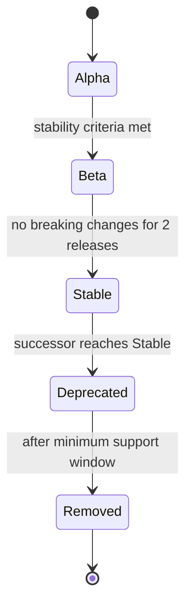

# WG-PROPOSAL-04: API Version Evolution Strategy

| Field | Value |
|---|---|
| Date | 2026-05-05 |
| Category | Cat 2 -- normative enhancement |
| Affects | `src/specification/applications/application-description.linkml.yaml`, `src/specification/margo-management-interface/desired-state.linkml.yaml`, `system-design/specification/applications/application-description.md` |
| Status | Rev 2 -- ready for public review |
| Depends on | None (independent of WG-PROPOSAL-00 through WG-PROPOSAL-03) |

---

## Motivation

The `apiVersion` field is required in both `ApplicationDescription` and `DesiredState` documents. Current examples use `margo.org/v1-alpha1` and `application.margo.org/v1alpha1` respectively. However, the specification provides:

1. **No version catalogue** -- there is no normative list of valid `apiVersion` values or their lifecycle state (alpha, beta, GA, deprecated).
2. **No schema constraint** -- the LinkML schema declares `apiVersion` as `range: string` with no pattern or enum. Any arbitrary string validates.
3. **No migration path** -- no defined WFM behaviour when encountering an unknown or deprecated `apiVersion`.
4. **No deprecation policy** -- no contract for how long old versions remain supported or how consumers are notified of upcoming removal.
5. **No backward/forward compatibility contract** -- no guarantee that a minor version bump preserves existing fields.

Without these, WFM implementations cannot determine whether they support a given document, breaking changes have no signalling mechanism, and the ecosystem cannot evolve safely.

---

## Proposed Changes

### Change 1: Add `pattern` constraint to `apiVersion` in `application-description.linkml.yaml`

#### Affected file

`src/specification/applications/application-description.linkml.yaml` -- class `ApplicationDescription`, attribute `apiVersion`

#### Before

```yaml
  ApplicationDescription:
    description: Root class for an application description.
    attributes:
      apiVersion:
        description: Identifier of the version of the API the object definition follows.
        required: true
        range: string
        rank: 10
```

#### After

```yaml
  ApplicationDescription:
    description: Root class for an application description.
    attributes:
      apiVersion:
        description: >-
          Identifier of the version of the API the object definition follows.
          The value MUST match the pattern `margo.org/v<major>-<lifecycle><revision>`
          where `<major>` is a positive integer, `<lifecycle>` is one of `alpha`
          or `beta`, and `<revision>` is a positive integer. The lifecycle
          qualifier and revision MAY be omitted for stable GA releases, yielding the
          short form `margo.org/v<major>`. Examples: `margo.org/v1-alpha1`,
          `margo.org/v1-beta2`, `margo.org/v1`, `margo.org/v2-alpha1`.
          See the API Version Lifecycle section in the specification for the
          normative version catalogue and compatibility guarantees.
        required: true
        range: string
        pattern: "^margo\\.org/v[1-9][0-9]*(-(alpha|beta)[1-9][0-9]*)?$"
        rank: 10
```

#### Diff

```diff
   ApplicationDescription:
     description: Root class for an application description.
     attributes:
       apiVersion:
-        description: Identifier of the version of the API the object definition follows.
+        description: >-
+          Identifier of the version of the API the object definition follows.
+          The value MUST match the pattern `margo.org/v<major>-<lifecycle><revision>`
+          where `<major>` is a positive integer, `<lifecycle>` is one of `alpha`
+          or `beta`, and `<revision>` is a positive integer. The lifecycle
+          qualifier and revision MAY be omitted for stable GA releases, yielding the
+          short form `margo.org/v<major>`. Examples: `margo.org/v1-alpha1`,
+          `margo.org/v1-beta2`, `margo.org/v1`, `margo.org/v2-alpha1`.
+          See the API Version Lifecycle section in the specification for the
+          normative version catalogue and compatibility guarantees.
         required: true
         range: string
+        pattern: "^margo\\.org/v[1-9][0-9]*(-(alpha|beta)[1-9][0-9]*)?$"
         rank: 10
```

---

### Change 2: Add `pattern` constraint to `apiVersion` in `desired-state.linkml.yaml`

#### Affected file

`src/specification/margo-management-interface/desired-state.linkml.yaml` -- class `DesiredState`, attribute `apiVersion`

#### Before

```yaml
  DesiredState:
    description: A class representing the desired state of an entity.
    attributes:
      apiVersion:
        description: Identifier of the version of the API the object definition follows.
        required: true
        range: string
        rank: 10
```

#### After

```yaml
  DesiredState:
    description: A class representing the desired state of an entity.
    attributes:
      apiVersion:
        description: >-
          Identifier of the version of the API the object definition follows.
          The value MUST match the pattern
          `application.margo.org/v<major><lifecycle><revision>` where `<major>`
          is a positive integer, `<lifecycle>` is one of `alpha` or `beta`,
          and `<revision>` is a positive integer. The lifecycle
          qualifier and revision MAY be omitted for stable GA releases.
          Examples: `application.margo.org/v1alpha1`,
          `application.margo.org/v1beta2`, `application.margo.org/v1`.
        required: true
        range: string
        pattern: "^application\\.margo\\.org/v[1-9][0-9]*((alpha|beta)[1-9][0-9]*)?$"
        rank: 10
```

#### Diff

```diff
   DesiredState:
     description: A class representing the desired state of an entity.
     attributes:
       apiVersion:
-        description: Identifier of the version of the API the object definition follows.
+        description: >-
+          Identifier of the version of the API the object definition follows.
+          The value MUST match the pattern
+          `application.margo.org/v<major><lifecycle><revision>` where `<major>`
+          is a positive integer, `<lifecycle>` is one of `alpha` or `beta`,
+          and `<revision>` is a positive integer. The lifecycle
+          qualifier and revision MAY be omitted for stable GA releases.
+          Examples: `application.margo.org/v1alpha1`,
+          `application.margo.org/v1beta2`, `application.margo.org/v1`.
         required: true
         range: string
+        pattern: "^application\\.margo\\.org/v[1-9][0-9]*((alpha|beta)[1-9][0-9]*)?$"
         rank: 10
```

---

### Change 3: Add API Version Lifecycle section to `application-description.md`

#### Affected file

`system-design/specification/applications/application-description.md` -- new section appended before the existing "Examples" section (or at end of normative text)

#### Before

No API version lifecycle section exists in the specification.

#### After

New normative section:

````markdown
## API Version Lifecycle

### Version Catalogue

The following table defines all valid `apiVersion` values for `ApplicationDescription` documents and their lifecycle state:

| `apiVersion` value | Lifecycle | Status | Introduced | Deprecated | Removed |
|---|---|---|---|---|---|
| `margo.org/v1-alpha1` | Alpha | **Current** | 2024-Q4 | — | — |

> **Note**
> This table is the normative registry. New versions MUST be added here before implementations may produce or consume them.

The following table defines all valid `apiVersion` values for `DesiredState` documents and their lifecycle state:

| `apiVersion` value | Lifecycle | Status | Introduced | Deprecated | Removed |
|---|---|---|---|---|---|
| `application.margo.org/v1alpha1` | Alpha | **Current** | 2024-Q4 | — | — |

> **Note**
> This table is the normative registry for DesiredState documents. New versions MUST be added here before implementations may produce or consume them.

### Lifecycle States



| State | Guarantees | Minimum support window |
|---|---|---|
| Alpha | No backward compatibility guaranteed. Fields MAY be added, changed, or removed between alpha revisions. | None -- MAY be removed without notice. |
| Beta | Backward compatible within the same major version. Fields MUST NOT be removed; new required fields MUST have defaults. | 6 months after successor reaches Beta or Stable. |
| Stable (GA) | Full backward compatibility within the major version. Only additive changes permitted. | 12 months after successor major version reaches Stable. |
| Deprecated | Functionally equivalent to Stable. Implementations SHOULD emit a warning when processing deprecated versions. | Remainder of the minimum support window. |
| Removed | Implementations MUST reject documents with a removed `apiVersion`. | N/A |

### WFM Behaviour Requirements

1. A WFM receiving an `ApplicationDescription` with an `apiVersion` it does not support MUST reject the document with a clear error indicating the unsupported version and listing the versions it supports.
2. When rejecting a document per requirement #1, the WFM MUST include in its error response a machine-readable error code (e.g., `UNSUPPORTED_API_VERSION`) and a human-readable message listing the `apiVersion` values it supports. The exact serialisation format of the error response is defined by the Management Interface specification.
3. A WFM MUST NOT silently ignore an unrecognised `apiVersion`.
4. A WFM processing a deprecated `apiVersion` MUST accept the document but SHOULD emit a warning to the operator indicating the deprecation and the recommended migration target.
5. A WFM MAY support multiple `apiVersion` values simultaneously to enable rolling upgrades. A WFM supporting multiple versions per this requirement MUST still reject any version not in its supported set per requirement #1.

### Compatibility Rules

1. **Within a major version (stable)**: Only additive, non-breaking changes are permitted. New optional fields MAY be added. Existing fields MUST NOT be removed or have their semantics changed.
2. **Major version bump**: Breaking changes (field removal, semantic changes, structural reorganisation) MUST increment the major version number.
3. **Alpha/Beta**: Pre-stable versions carry no cross-revision compatibility guarantee. Implementors SHOULD treat alpha/beta versions as experimental.

### Migration Guidance

When a new major version is released:

1. The previous stable version enters Deprecated state.
2. Application vendors SHOULD publish ApplicationDescription documents targeting both the deprecated and new versions during the transition window.
3. WFM implementations MUST support the deprecated version for the minimum support window defined above.
4. After the support window expires, the deprecated version enters Removed state and implementations MAY drop support.

````

---

## Backward Compatibility

### Breaking Changes

This proposal introduces a `pattern` constraint on `apiVersion` that existing valid documents already satisfy:

- `margo.org/v1-alpha1` matches `^margo\.org/v[1-9][0-9]*(-(alpha|beta)[1-9][0-9]*)?$`
- `application.margo.org/v1alpha1` matches `^application\.margo\.org/v[1-9][0-9]*((alpha|beta)[1-9][0-9]*)?$`

> The format difference between the two patterns — hyphen-separated lifecycle in `margo.org/v1-alpha1` and concatenated lifecycle in `application.margo.org/v1alpha1` — is a pre-existing divergence that this proposal preserves for backward compatibility. Harmonisation of these formats is tracked in OQ-1.

Documents using arbitrary strings that do not match the pattern will fail validation. This is intentional -- such documents were never interoperable.

**Breaking change: NO** for conforming implementations. **YES** for non-conforming documents using arbitrary `apiVersion` strings.

### Migration Path

- Existing `ApplicationDescription` documents using `apiVersion: margo.org/v1-alpha1` require no changes.
- Existing `DesiredState` documents using `apiVersion: application.margo.org/v1alpha1` require no changes.
- WFM implementations MUST be updated to validate the `apiVersion` pattern and implement the reject/warn behaviour defined in Change 3.

---

## Conformance Impact

| Requirement | Level | Who | Condition |
|-------------|-------|-----|-----------|
| `apiVersion` MUST match the defined pattern | MUST | ApplicationDescription producers | Always |
| `apiVersion` MUST match the defined pattern | MUST | DesiredState producers | Always |
| WFM MUST reject unsupported `apiVersion` | MUST | WFM implementations | On receiving unrecognised version |
| WFM MUST NOT silently ignore unrecognised `apiVersion` | MUST | WFM implementations | Always |
| WFM processing deprecated `apiVersion` MUST accept but SHOULD warn | MUST/SHOULD | WFM implementations | On receiving deprecated version |
| WFM MAY support multiple `apiVersion` values simultaneously | MAY | WFM implementations | Optional |
| New `apiVersion` values MUST be added to the Version Catalogue before use | MUST | Margo WG | Before publishing new version |

---

## References

- **Gap: No apiVersion evolution strategy** -- prior to this proposal, the Margo specification provided no normative version catalogue, no schema pattern constraint, no WFM rejection/warning behaviour, and no deprecation policy for `apiVersion` values in `ApplicationDescription` and `DesiredState` documents.
- [Kubernetes API Versioning](https://kubernetes.io/docs/reference/using-api/#api-versioning) -- prior art for alpha/beta/stable lifecycle
- [RFC 2119 -- Key words for use in RFCs to Indicate Requirement Levels](https://www.rfc-editor.org/rfc/rfc2119)
- [LinkML Pattern Constraint](https://linkml.io/linkml-model/latest/docs/pattern/) -- schema enforcement mechanism
- [Semantic Versioning 2.0.0](https://semver.org/) -- general versioning prior art

---

*This document is part of the Margo WG proposal package. Prepared by Andrii Melashchenko, 2026-05-05. Subject to the Open Web Foundation Contributor License Agreement governing the Margo specification.*
